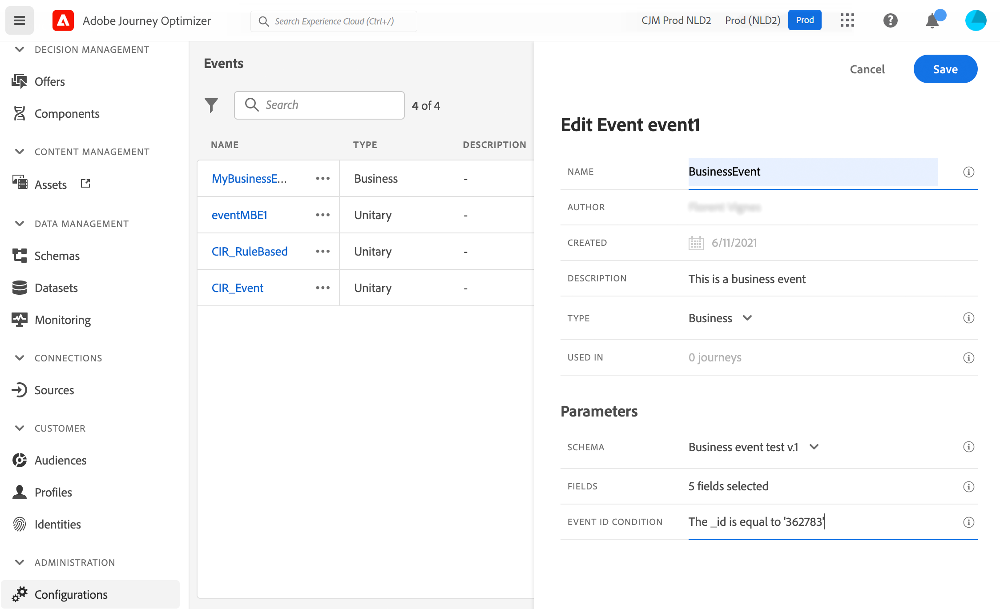

# 配置业务事件 {#configure-a-business-event}

>[!CONTEXTUALHELP]
>id="ajo_journey_event_business"
>title="业务事件"
>abstract="事件配置让您可以定义 Journey Optimizer 将作为事件接收的信息。您可以使用多个事件（在历程的不同步骤中），而多个历程可以使用相同的事件。与单一事件不同，业务事件不链接到特定的配置文件。事件 ID 类型始终基于规则。"

与单一事件不同，业务事件不链接到特定的配置文件。事件 ID 类型始终基于规则。阅读更多有关业务活动的信息，请参见 [本节](../event/about-events.md).

基于读取区段的历程可以由调度程序定期触发，也可以在事件发生时由业务事件触发。

业务事件可以是“产品重新上架”、“公司股价达到一定价值”等。

>[!NOTE]
>
>您还可以观看业务事件用例 [教程](https://experienceleague.adobe.com/docs/journey-optimizer-learn/tutorials/create-journeys/use-case-business-event.html). 请注意，不需要为配置文件启用架构。

## 重要说明 {#important-notes}

* 只有时间序列架构可用。 体验事件、决策事件和历程步骤事件架构不可用。
* 事件架构必须包含不基于人员的主要身份。 定义事件时必须选择以下字段： `_id` 和 `timestamp`
* 业务事件只能作为历程的第一步删除。
* 将业务事件删除为历程的第一步时，历程的调度程序类型将为“业务事件”。
* 在业务事件之后，只能删除读取区段活动。 它作为下一步自动添加。
* 要允许多个业务事件执行，请在 **[!UICONTROL 执行]** 旅程属性的部分。
* 触发业务事件后，区段导出操作将延迟15分钟到1小时。
* 测试业务事件时，您必须传递事件参数和将进入测试历程的测试用户档案的标识符。 此外，在测试基于业务事件的历程时，您只能触发单个用户档案进入。 请参阅[此小节](../building-journeys/testing-the-journey.md#test-business)。在测试模式下，没有“代码视图”模式可用。
* 如果新的业务事件到达，当前正在历程中的个人会发生什么情况？ 它的行为与当发生新重复时个人仍处于重复历程中的情况相同。 他们的路径结束了。 因此，营销人员必须注意避免构建太长的历程，如果他们预计频繁的业务事件。
* 业务事件无法与单一事件或区段资格活动结合使用。

## 多个业务事件 {#multiple-business-events}

下面是一些重要说明，适用于连续接收多个业务事件时。

**处理历程时接收业务事件时的行为是什么？**

商业活动遵循的重新进入规则与单一活动相同。 如果历程允许重新进入，则将处理下一个业务事件。

**避免重载实体化区段的护栏是什么？**

对于非点击业务事件，对于给定历程，由第一个事件作业推送的数据会在1小时时段内重复使用。 对于计划的旅程，没有护栏。 要了解有关区段的更多信息，请参阅 [Adobe Experience Platform分段服务文档](https://experienceleague.adobe.com/docs/experience-platform/segmentation/home.html).

## 商业活动入门 {#gs-business-events}

以下是配置业务事件的首要步骤：

1. 在“管理”菜单部分中，选择 **[!UICONTROL 配置]**. 在  **[!UICONTROL 事件]** 部分，单击 **[!UICONTROL 管理]**. 将显示事件列表。

   

1. 单击 **[!UICONTROL 创建事件]** 以创建新事件。 事件配置窗格将在屏幕右侧打开。

   

1. 输入事件的名称。 您还可以添加描述。

   

   >[!NOTE]
   >
   >请勿使用空格或特殊字符。请勿使用超过 30 个字符。

1. 在 **[!UICONTROL 类型]** 字段，选择 **商业**.

   

1. 使用此事件的历程数显示在 **[!UICONTROL 使用位置]** 字段。 您可以单击 **[!UICONTROL 查看历程]** 图标，以显示使用此事件的历程列表。

1. 定义架构和有效负载字段：在这里，您可以选择历程预期接收的事件信息（或有效负载）。 您稍后将在旅程中使用此信息。 请参阅[此小节](../event/about-creating-business.md#define-the-payload-fields)。

   

   只有时间序列架构可用。 `Experience Events`， `Decision Events` 和 `Journey Step Events` 架构不可用。 事件架构必须包含不基于人员的主要身份。 定义事件时必须选择以下字段： `_id` 和 `timestamp`

   

1. 在 **[!UICONTROL 事件ID条件]** 字段。 使用简单表达式编辑器定义条件，系统使用它来标识触发历程的事件。

   

   在我们的示例中，我们根据产品ID编写了一个条件。 这意味着每当系统收到与此条件匹配的事件时，它都会将其传递给历程。

   >[!NOTE]
   >
   >在简单表达式编辑器中，并非所有运算符都可用，它们取决于数据类型。 例如，对于字符串类型的字段，您可以使用“包含”或“等于”。

1. 单击&#x200B;**[!UICONTROL 保存]**。

   

   事件现已配置完毕，可随时投入旅程。还需要其他配置步骤以接收事件。请参阅[此页面](../event/additional-steps-to-send-events-to-journey.md)以了解详情。

## 定义有效负载字段 {#define-the-payload-fields}

有效负载定义允许您选择系统预期从历程中的事件接收的信息，以及用于识别哪个人员与事件关联的键。 有效负载基于Experience CloudXDM字段定义。 有关XDM的更多信息，请参阅 [Adobe Experience Platform文档](https://experienceleague.adobe.com/docs/experience-platform/xdm/home.html?lang=zh-Hans){target="_blank"}.

1. 从列表中选择一个XDM架构，然后单击 **[!UICONTROL 字段]** 字段或 **[!UICONTROL 编辑]** 图标。

   

   将显示架构中定义的所有字段。 字段列表因架构而异。 您可以搜索特定字段，或使用过滤器显示所有节点和字段或仅显示选定的字段。 根据架构定义，某些字段可能是必填字段，并且已预先选定。 不能取消选择它们。 默认情况下，选择历程正确接收事件所必需的所有字段。

   

   >[!NOTE]
   >
   > 确保选择以下字段： `_id` 和 `timestamp`

1. 选择您希望从事件接收的字段。 这些是商业用户将在历程中利用的字段。

1. 选择完所需的字段后，单击 **[!UICONTROL 保存]** 或按 **[!UICONTROL 输入]**.

   所选字段的数目显示在 **[!UICONTROL 字段]**.

   

## 预览有效负载 {#preview-the-payload}

使用有效负载预览来验证有效负载定义。

1. 单击 **[!UICONTROL 查看有效负荷]** 图标以预览系统预期的有效负载。

   

   您可以注意到已选择的字段已显示。

   

1. 检查预览以验证有效负载定义。

1. 然后，您可以将有效负载预览与共享给负责事件发送的人员。 此有效负载可以帮助他们设计推送到的事件设置 [!DNL Journey Optimizer]. 请参阅[此页](../event/additional-steps-to-send-events-to-journey.md)。
