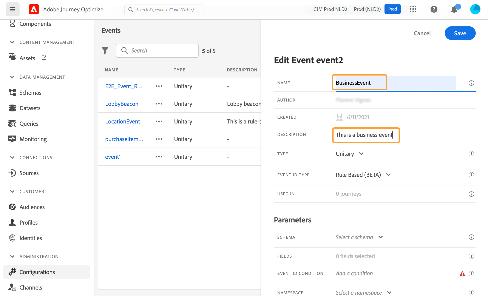

# 配置业务事件 {#configure-a-business-event}

>[!CONTEXTUALHELP]
>id="ajo_journey_event_business"
>title="业务事件"
>abstract="事件配置允许您定义Journey Optimizer将作为事件接收的信息。 您可以使用多个事件（在历程的不同步骤中），而多个历程可以使用相同的事件。 与单一事件不同，业务事件与特定用户档案不相关。 事件ID类型始终基于规则。"

与单一事件不同，业务事件与特定用户档案不相关。 事件ID类型始终基于规则。 请阅读 [此部分](../event/about-events.md).

基于读取区段的历程可以由调度程序在事件发生时通过一次性、定期或由业务事件触发。

业务事件可以是“产品重新存货”、“公司股价达到一定价值”等。

>[!NOTE]
>
>您还可以观看业务事件用例 [教程](https://experienceleague.adobe.com/docs/journey-optimizer-learn/tutorials/create-journeys/use-case-business-event.html). 请注意，无需为用户档案启用架构。

## 重要说明 {#important-notes}

* 只有时间系列架构可用。 体验事件、决策事件和历程步骤事件架构不可用。
* 事件架构必须包含基于人员的主标识。 定义事件时必须选择以下字段： `_id` 和 `timestamp`
* 只能将业务事件作为历程的第一步进行删除。
* 将业务事件作为历程的第一步删除时，历程的计划程序类型将为“业务事件”。
* 在业务事件后，只能删除读取区段活动。 它将自动添加为下一步。
* 要允许执行多个业务事件，请在 **[!UICONTROL 执行]** 历程属性的部分。
* 触发业务事件后，将区段从15分钟导出到最多1小时会出现延迟。
* 测试业务事件时，必须传递事件参数以及将进入测试旅程的测试用户档案的标识符。 此外，在测试基于业务事件的历程时，您只能触发单个用户档案进入。 请参阅[此小节](../building-journeys/testing-the-journey.md#test-business)。在测试模式下，没有可用的“代码视图”模式。
* 如果新的业务事件到来，当前处于历程中的个人会发生什么情况？ 其行为与当新的重复发生时个人仍处于循环历程中的情况相同。 他们的路结束了。 因此，如果营销人员预计会发生频繁的业务事件，则必须注意避免构建过长的历程。
* 业务事件不能与单一事件或区段鉴别活动结合使用。

## 多个业务事件 {#multiple-business-events}

以下是在连续收到多个业务事件时应用的一些重要说明。

**在历程处理期间接收业务事件时的行为是什么？**

商务活动遵循与单一活动相同的重新进入规则。 如果历程允许重新进入，则将处理下一个业务事件。

**要避免过载实体化视图区段，有哪些防护？**

对于即时业务事件，对于给定历程，由第一个事件作业推送的数据将在1小时的时间范围内重复使用。 对于计划历程，没有护栏。 了解有关 [Adobe Experience Platform Segmentation Service文档](https://experienceleague.adobe.com/docs/experience-platform/segmentation/home.html).

## 业务事件入门 {#gs-business-events}

以下是配置业务事件的首要步骤：

1. 在“管理”菜单部分，选择 **[!UICONTROL 配置]**. 在  **[!UICONTROL 事件]** ，单击 **[!UICONTROL 管理]**. 将显示事件列表。

   

1. 单击 **[!UICONTROL 创建事件]** 创建新事件。 事件配置窗格将在屏幕右侧打开。

   

1. 输入事件的名称。 您还可以添加描述。

   

   >[!NOTE]
   >
   >请勿使用空格或特殊字符。请勿使用超过 30 个字符。

1. 在 **[!UICONTROL 类型]** 字段，选择 **商业**.

   

1. 使用此事件的旅程数显示在 **[!UICONTROL 在]** 字段。 您可以单击 **[!UICONTROL 查看历程]** 图标以显示使用此事件的历程列表。

1. 定义架构和有效负载字段：在这里，您可以选择历程预期接收的事件信息（或有效负载）。 您稍后将在历程中使用此信息。 请参阅[此小节](../event/about-creating-business.md#define-the-payload-fields)。

   

   只有时间系列架构可用。 `Experience Events`, `Decision Events` 和 `Journey Step Events` 架构不可用。 事件架构必须包含基于人员的主标识。 定义事件时必须选择以下字段： `_id` 和 `timestamp`

   

1. 在 **[!UICONTROL 事件ID条件]** 字段。 使用简单表达式编辑器定义条件，系统使用该条件来识别触发历程的事件。

   

   在本例中，我们根据产品的ID编写了一个条件。 这意味着，每当系统收到与此条件匹配的事件时，都会将其传递到历程。

   >[!NOTE]
   >
   >在简单的表达式编辑器中，并非所有运算符都可用，它们取决于数据类型。 例如，对于字段的字符串类型，可以使用“包含”或“等于”。

1. 单击&#x200B;**[!UICONTROL 保存]**。

   

   事件现已配置完毕，可随时投入旅程。还需要其他配置步骤以接收事件。请参阅[此页面](../event/additional-steps-to-send-events-to-journey.md)以了解详情。

## 定义有效负载字段 {#define-the-payload-fields}

有效负载定义允许您选择系统希望从历程中的事件接收的信息，以及用于标识与事件关联的人员的键。 负载基于Experience CloudXDM字段定义。 有关XDM的更多信息，请参阅 [Adobe Experience Platform文档](https://experienceleague.adobe.com/docs/experience-platform/xdm/home.html?lang=zh-Hans){target=&quot;_blank&quot;}。

1. 从列表中选择XDM架构，然后单击 **[!UICONTROL 字段]** 字段或 **[!UICONTROL 编辑]** 图标。

   

   将显示架构中定义的所有字段。 字段列表因架构而异。 您可以搜索特定字段，或使用过滤器显示所有节点和字段，或仅显示选定的字段。 根据架构定义，某些字段可能是必填的，并且是预选的。 您无法取消选择它们。 默认情况下，将选择所有对于历程要正确接收事件而言必须填写的字段。

   

   >[!NOTE]
   >
   > 确保选择以下字段： `_id` 和 `timestamp`

1. 选择要从事件接收的字段。 业务用户将在历程中利用这些字段。

1. 选择完所需字段后，单击 **[!UICONTROL 保存]** 或按 **[!UICONTROL 输入]**.

   所选字段的数量显示在 **[!UICONTROL 字段]**.

   

## 预览有效负载 {#preview-the-payload}

使用有效负载预览验证有效负载定义。

1. 单击 **[!UICONTROL 查看有效负载]** 图标以预览系统预期的有效负荷。

   

   您可以注意到已显示选定的字段。

   

1. 检查预览以验证有效负载定义。

1. 然后，您可以将有效负载预览共享给负责事件发送的人员。 此有效负载可帮助他们设计推送到的事件的设置 [!DNL Journey Optimizer]. 请参阅[此页](../event/additional-steps-to-send-events-to-journey.md)。
