# 关于[!DNL Journey Optimizer]事件的experienceevent架构 {#about-experienceevent-schemas}

>[!BEGINSHADEBOX]

**在此页面上：**&#x200B;构建符合所需结构的XDM Experience Event架构，以便将您的流式事件摄取到Adobe Experience Platform中并用于触发历程。

>[!ENDSHADEBOX]

[!DNL Journey Optimizer]事件是通过流式摄取发送到Adobe Experience Platform的XDM Experience事件。

因此，为[!DNL Journey Optimizer]设置事件的一项重要先决条件是，您熟悉Adobe Experience Platform的体验数据模型（或XDM）、如何构建XDM体验事件架构以及如何将XDM格式的数据流式传输到Adobe Experience Platform。

>[!CAUTION]
>
>从2025年7月8日开始，新客户组织无法在历程条件中使用体验事件属性创建表达式。 从2026年4月1日开始，过去90天内未通过历程表达式访问体验事件的组织将无法再访问此功能。 [历程中的体验事件查找](../building-journeys/exp-event-lookup.md)中列出了替代方法和最佳实践。
>
>从历程的开始事件访问上下文不受影响。

## [!DNL Journey Optimizer]事件的架构要求  {#schema-requirements}

为[!DNL Journey Optimizer]设置事件的第一步是确保您定义了用于表示该事件的XDM架构，并创建了数据集以在Adobe Experience Platform上记录该事件的实例。 严格来说，为事件创建数据集并不是必需的，但将事件发送到特定数据集将允许您维护用户的事件历史记录，以供将来参考和分析，因此始终是一个不错的主意。 如果您还没有适合事件的架构和数据集，则可以在Adobe Experience Platform Web界面中完成这两项任务。

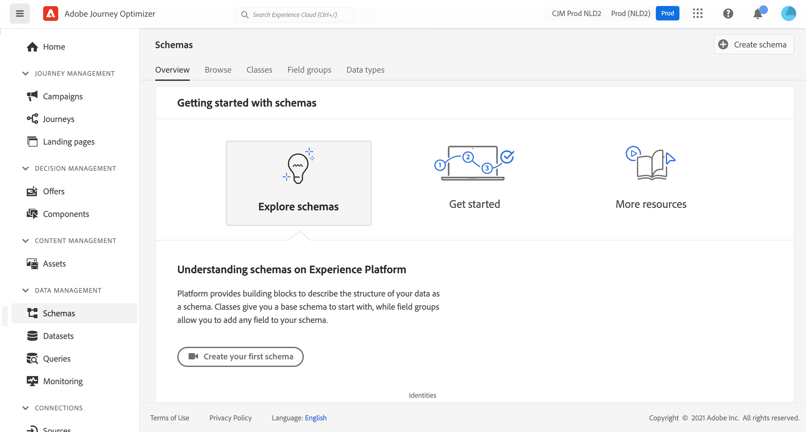

将用于[!DNL Journey Optimizer]事件的任何XDM架构都应满足以下要求：

* 架构必须为XDM ExperienceEvent类。

  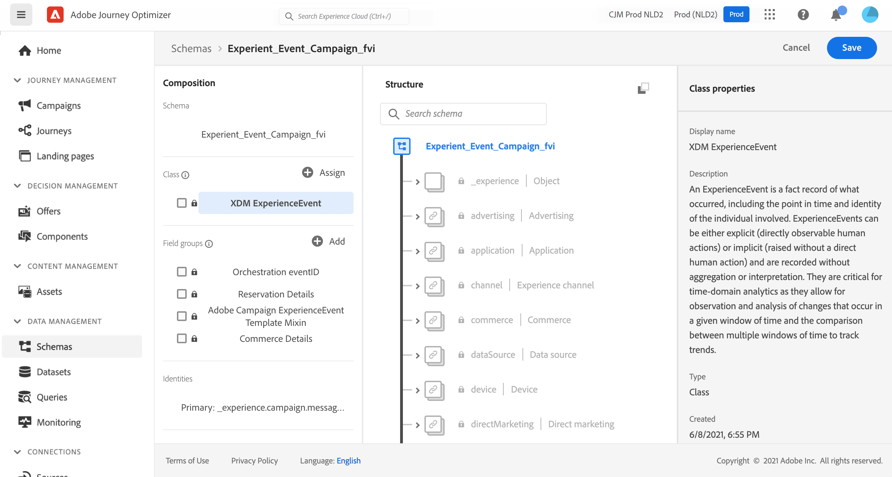

* 对于系统生成的事件，架构必须包括编排eventID字段组。 [!DNL Journey Optimizer]使用此字段识别历程中使用的事件。

  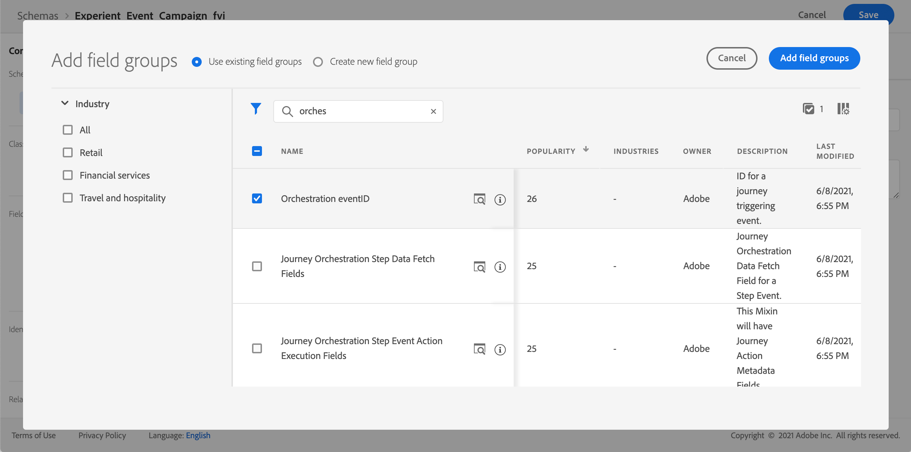

* 声明一个标识字段，用于标识事件中的各个用户档案。 如果未指定标识，则可以使用标识映射。 不建议采取此做法。

  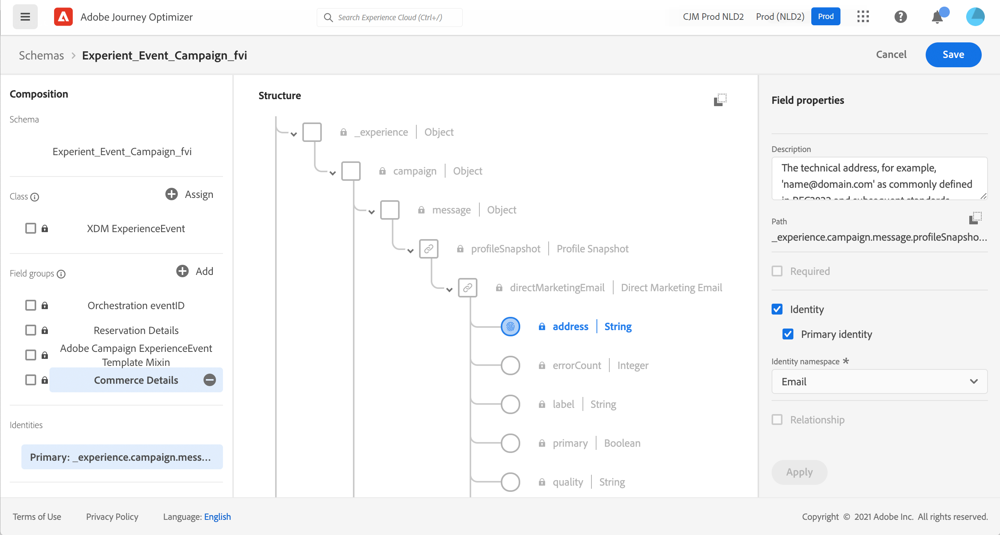

* 如果您希望此数据可用于配置文件，请将架构和数据集标记为配置文件。 [了解详情](../data/lookup-aep-data.md)

  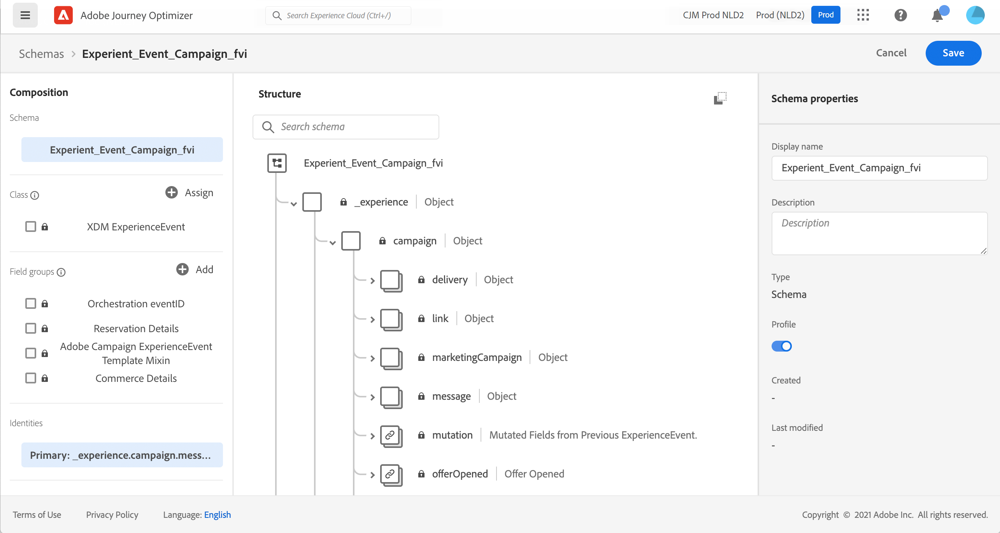

  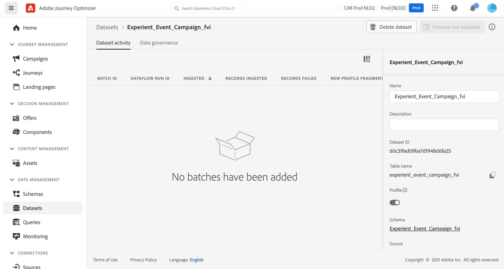

* 您可以随意包含数据字段，以捕获要与事件一起包含的任何其他上下文数据，例如有关用户的信息、生成事件的设备、位置或与事件相关的任何其他有意义的情况。

  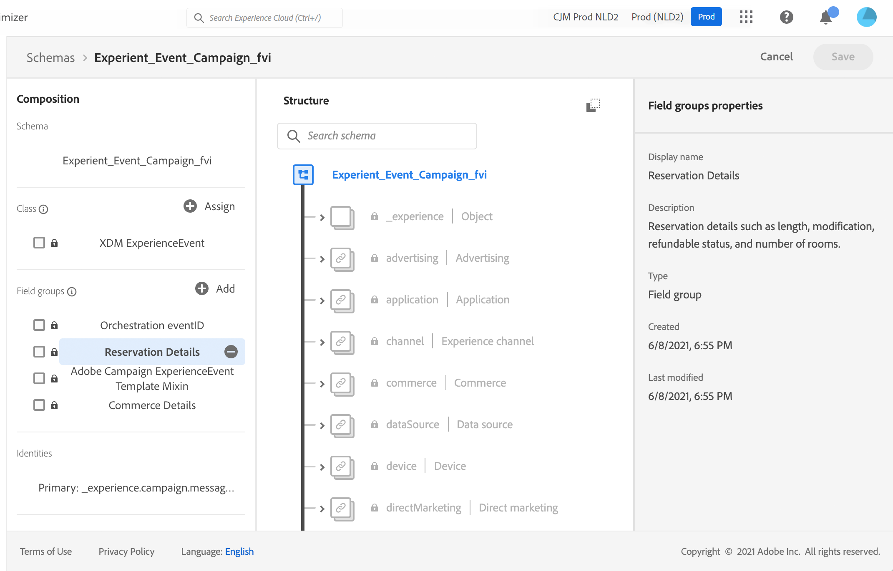

  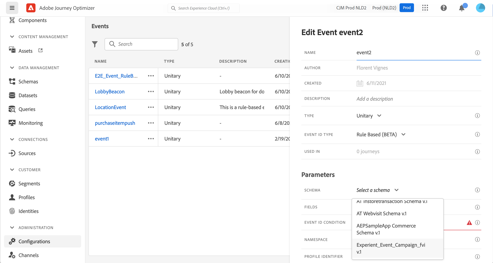

<!--
## Leverage schema relationships{#leverage_schema_relationships}

Adobe Experience Platform allows you to define relationships between schemas in order to use one dataset as a lookup table for another. 

Let's say your brand data model has a schema capturing purchases. You also have a schema for the product catalog. You can capture the product ID in the purchase schema and use a relationship to look up more complete product details from the product catalog. This allows you to create an audience for all customers who bought a laptop, for example, without having to explicitly list out all laptop IDs or capture every single product details in transactional systems.

To define a relationship, you need to have a dedicated field in the source schema, in this case the product ID field in the purchase schema. This field needs to reference the product ID field in the destination schema. The source and destination tables must be enabled for profiles and the destination schema must have that common field defined as its primary identity. 

Here is the product catalog schema enabled for profile with the product ID defined as the primary identity. 

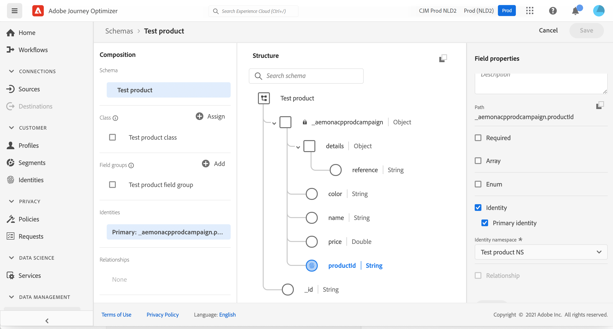

Here is the purchase schema with the relationship defined on the product ID field.

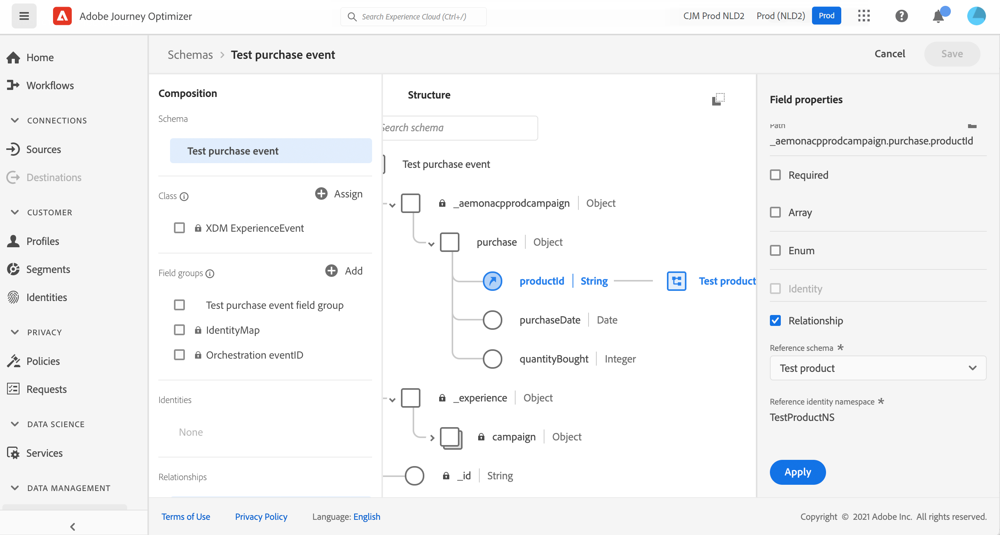

>[!NOTE]
>
>Learn more about schema relationships in the [Experience Platform documentation](https://experienceleague.adobe.com/docs/platform-learn/tutorials/schemas/configure-relationships-between-schemas.html?lang=zh-Hans).

In Journey Optimizer, you can then leverage all the fields from the linked tables:

* when configuring a business or unitary event, [Read more](../event/experience-event-schema.md#unitary_event_configuration) 
* when using conditions in a journey, [Read more](../event/experience-event-schema.md#journey_conditions_using_event_context) 
* in message personalization, [Read more](../event/experience-event-schema.md#message_personalization) 
* in custom action personalization, [Read more](../event/experience-event-schema.md#custom_action_personalization_with_journey_event_context) 

### Arrays{#relationships_limitations}

You can define a schema relationship on an array of strings, for example, a list of product IDs.

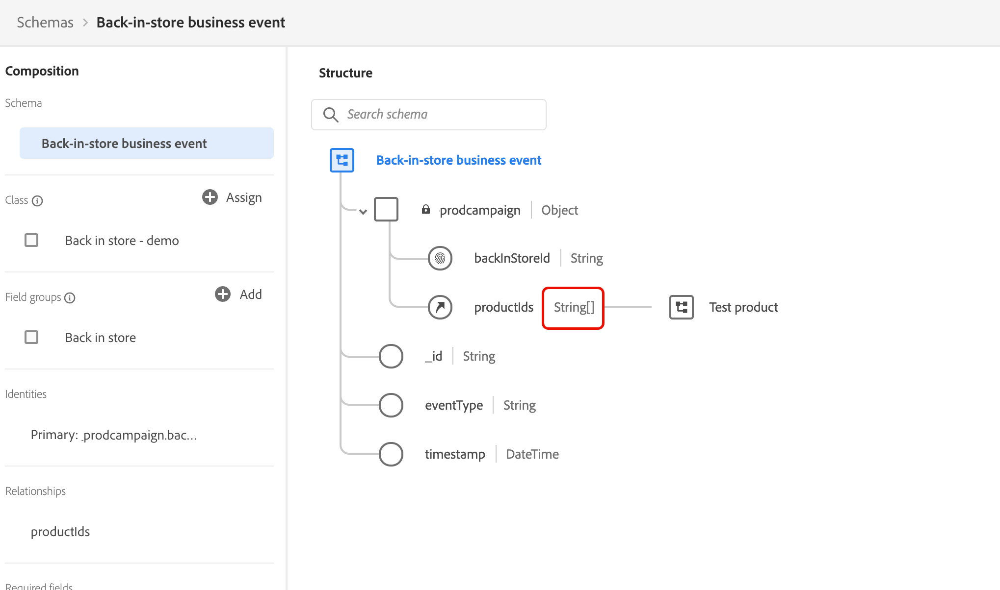

You can also define a schema relationship with an attribute inside of an array of objects, for example a list of purchase information (product ID, product name, price, discount). The lookup values will be available in journeys (conditions, custom actions, etc.) and message personalization. 

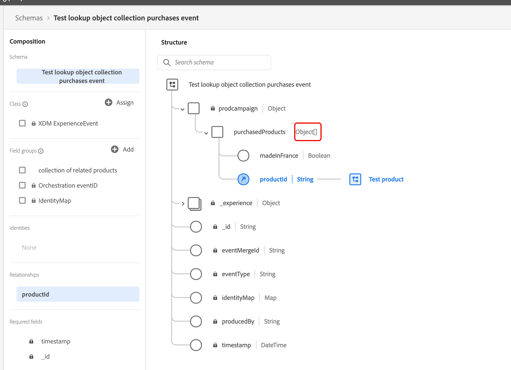

### Event configuration{#unitary_event_configuration}

The linked schema fields are available in unitary and business event configuration:

* when browsing through the event schema fields in the event configuration screen.
* when defining a condition for system-generated events.

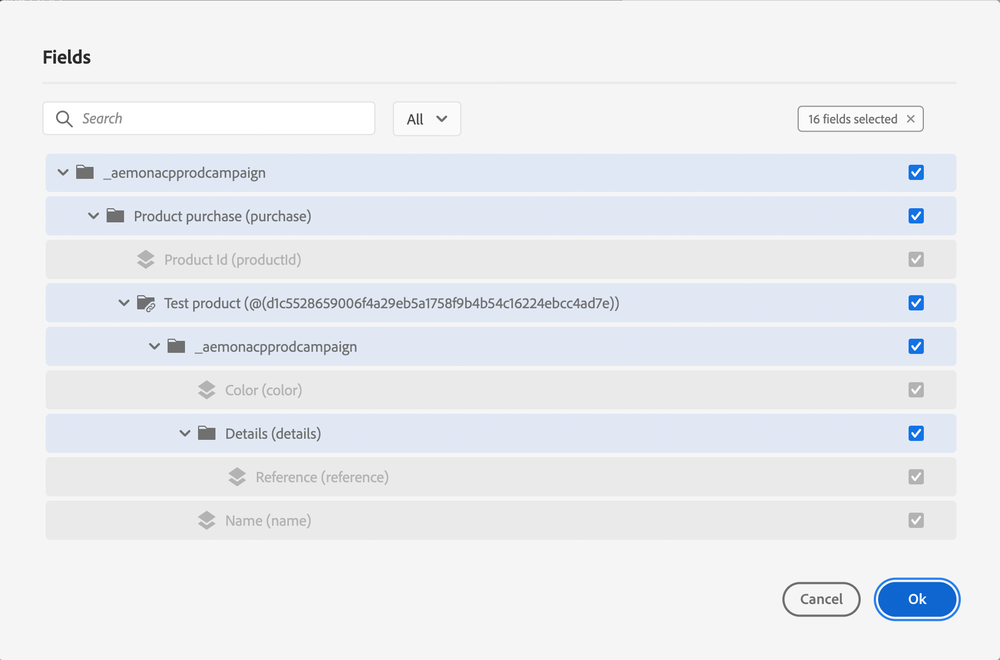

The linked fields are not available:

* in the event key formula
* in event id condition (rule-based events)

To learn how to configure a unitary event, refer to this [page](../event/about-creating.md).

### Journey conditions using event context{#journey_conditions_using_event_context}

You can use data from a lookup table linked to an event used in a journey for condition building (expression editor).

Add a condition in a journey, edit the expression and unfold the event node in the expression editor. 

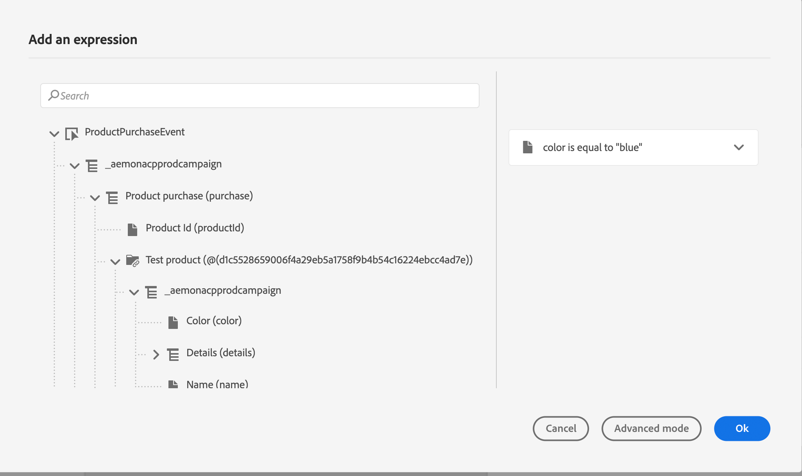

To learn how to define journey conditions, refer to this [page](../building-journeys/conditions.md).

### Message personalization{#message_personalization}

The linked fields are available when personalizing a message. The related fields are displayed in the context passed from the journey to the message.

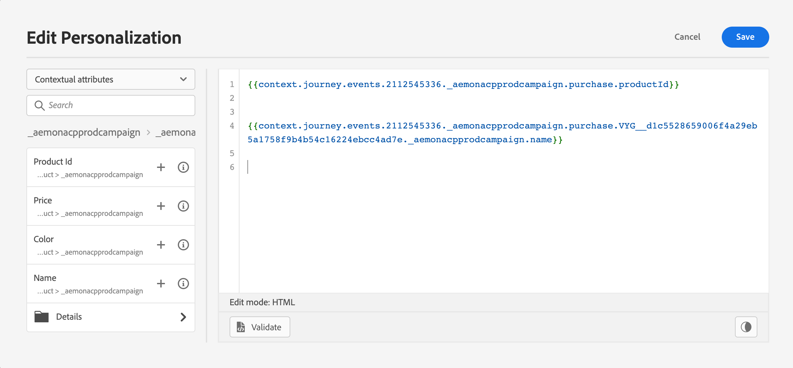

To learn how to personalize a message with contextual journey information, refer to this [page](../personalization/personalization-use-case.md).

### Custom action personalization with journey event context{#custom_action_personalization_with_journey_event_context}

The linked fields are available when configuring the action parameters of a journey custom action activity. 

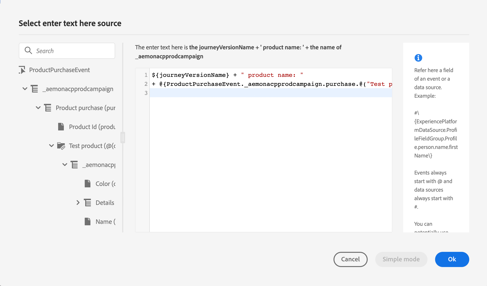

To learn how to use custom actions, refer to this [page](../building-journeys/using-custom-actions.md).
-->
