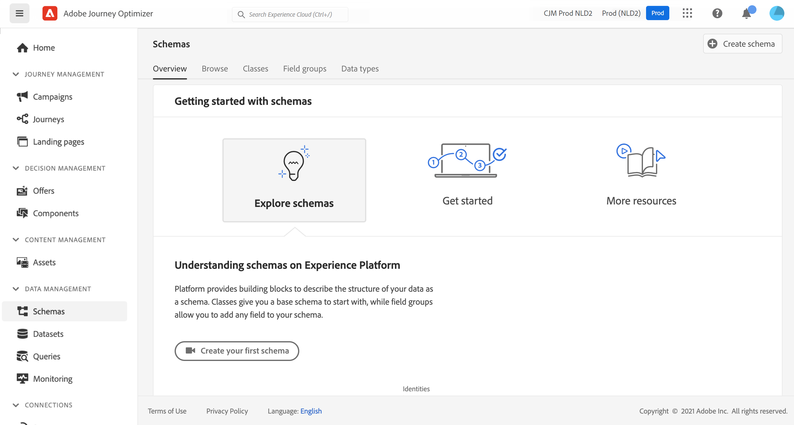

# 关于的ExperienceEvent架构 [!DNL Journey Optimizer] 活动 {#about-experienceevent-schemas}

[!DNL Journey Optimizer] 事件是通过流式摄取发送到Adobe Experience Platform的XDM体验事件。

因此，设置事件的重要先决条件 [!DNL Journey Optimizer] 您熟悉Adobe Experience Platform的体验数据模型（或XDM）、如何构建XDM体验事件架构，以及如何将XDM格式的数据流式传输到Adobe Experience Platform。

## 架构要求 [!DNL Journey Optimizer] 活动  {#schema-requirements}

设置事件的第一步 [!DNL Journey Optimizer] 是确保您定义了用于表示事件的XDM架构，并创建了数据集以在Adobe Experience Platform上记录事件的实例。 严格来说，为事件创建数据集并不是必需的，但将事件发送到特定数据集将允许您维护用户的事件历史记录，以供将来参考和分析，因此始终是一个不错的主意。 如果您还没有适合事件的架构和数据集，则可以在Adobe Experience Platform Web界面中完成这两项任务。

任何将用于以下项目的XDM架构： [!DNL Journey Optimizer] 事件应满足以下要求：

* 架构必须为XDM ExperienceEvent类。

  

* 对于系统生成的事件，架构必须包括编排eventID字段组。 [!DNL Journey Optimizer] 使用此字段标识历程中使用的事件。

  

* 声明一个标识字段，用于标识事件中的各个用户档案。 如果未指定标识，则可以使用标识映射。 不建议采取此做法。

  

* 如果您希望此数据稍后可在历程中查找，请标记架构和数据集的配置文件。

  

  

* 您可以随意包含数据字段，以捕获要与事件一起包含的任何其他上下文数据，例如有关用户的信息、生成事件的设备、位置或与事件相关的任何其他有意义的情况。

  

  

## 利用架构关系{#leverage_schema_relationships}

Adobe Experience Platform允许您定义架构之间的关系，以便将一个数据集用作另一个数据集的查询表。

假设您的品牌数据模型具有一个用于捕获购买的架构。 此外，您还有一个产品目录架构。 您可以捕获购买架构中的产品ID，并使用关系从产品目录中查找更完整的产品详细信息。 例如，这样，您就可以为购买笔记本电脑的所有客户创建一个受众，而无需明确列出所有笔记本电脑ID或在事务性系统中捕获每个产品详细信息。

要定义关系，源架构中需要有一个专用字段，在此例中是购买架构中的产品ID字段。 此字段需要引用目标架构中的产品ID字段。 必须为配置文件启用源表和目标表，并且目标架构必须将公共字段定义为其主要标识。

以下是为将产品ID定义为主标识的配置文件启用的产品目录架构。

以下是“产品ID”字段中定义关系的购买架构。

>[!NOTE]
>
>在中了解有关架构关系的更多信息 [Experience Platform文档](https://experienceleague.adobe.com/docs/platform-learn/tutorials/schemas/configure-relationships-between-schemas.html?lang=zh-CN).

在Journey Optimizer中，您可以利用链接表中的所有字段：

* 配置商业或单一事件时， [了解更多](../event/experience-event-schema.md#unitary_event_configuration)
* 在历程中使用条件时， [了解更多](../event/experience-event-schema.md#journey_conditions_using_event_context)
* 在消息个性化中， [了解更多](../event/experience-event-schema.md#message_personalization)
* 在自定义操作个性化中， [了解更多](../event/experience-event-schema.md#custom_action_personalization_with_journey_event_context)

### 数组{#relationships_limitations}

您可以对字符串数组定义架构关系，例如，产品ID列表。

您还可以定义与对象数组内部属性的架构关系，例如购买信息列表（产品ID、产品名称、价格、折扣）。 查找值将在历程（条件、自定义操作等）中可用 和消息个性化。

### 事件配置{#unitary_event_configuration}

链接的架构字段在单一和业务事件配置中可用：

* 浏览事件配置屏幕中的事件架构字段时。
* 在为系统生成的事件定义条件时。

链接的字段不可用：

* 在事件键公式中
* 在事件id条件中（基于规则的事件）

要了解如何配置单一事件，请参阅此 [页面](../event/about-creating.md).

### 使用事件上下文的历程条件{#journey_conditions_using_event_context}

您可以使用查询表中的数据，该表链接到条件构建（表达式编辑器）的历程中使用的事件。

在历程中添加条件、编辑表达式并在表达式编辑器中展开事件节点。

要了解如何定义历程条件，请参阅此 [页面](../building-journeys/condition-activity.md).

### 消息个性化{#message_personalization}

对消息进行个性化设置时，可以使用链接的字段。 相关字段显示在从历程传递到消息的上下文中。

要了解如何使用上下文历程信息个性化消息，请参阅此 [页面](../personalization/personalization-use-case.md).

### 具有历程事件上下文的自定义操作个性化{#custom_action_personalization_with_journey_event_context}

配置历程自定义操作活动的操作参数时，可以使用链接的字段。

要了解如何使用自定义操作，请参阅此 [页面](../building-journeys/using-custom-actions.md).
