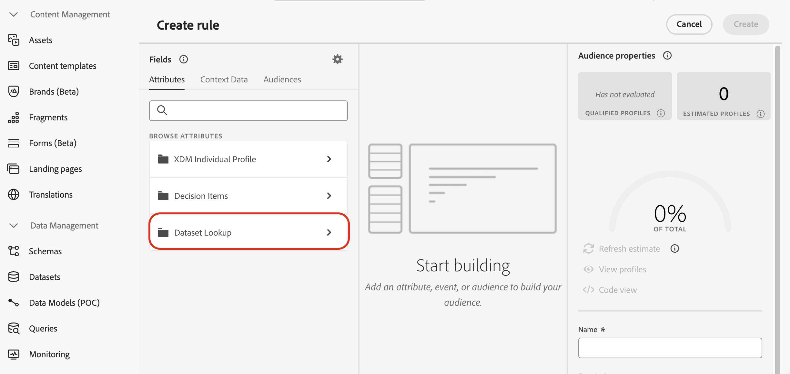

# 使用Adobe Experience Platform数据做出决策{#aep-data}

>[!CONTEXTUALHELP]
>id="ajo_exd_rules_dataset_lookup"
>title="数据集查找"
>abstract="在决策规则中使用Adobe Experience Platform数据允许您根据动态的外部属性定义资格标准，确保仅在相关时显示决策项目。 创建映射以定义Adobe Experience Platform数据集如何与[!DNL Journey Optimizer]中的数据联接。 选择具有所需属性的数据集，然后选择同时存在于决策项属性和数据集中的联接键。"

>[!CONTEXTUALHELP]
>id="ajo_exd_formula_dataset_lookup"
>title="数据集查找"
>abstract="排名公式定义决策项的优先级。 通过使用[!DNL Adobe Experience Platform]数据集属性，您可以动态调整排名逻辑以反映真实情况。 创建映射以定义Adobe Experience Platform数据集如何与[!DNL Journey Optimizer]中的数据联接。 选择具有所需属性的数据集，然后选择同时存在于决策项属性和数据集中的联接键"

>[!AVAILABILITY]
>
>此功能目前作为公共测试版向所有客户提供。 如果您希望访问此功能，请联系您的客户代表

[!DNL Journey Optimizer]允许您利用来自[!DNL Adobe Experience Platform]的数据进行决策。 这样，您可以将决策属性的定义扩展到数据集中的其他数据，以便进行定期更改的批量更新，而无需一次手动更新一个属性。 例如，可用性、等待时间等。

## Beta限制和准则 {#guidelines}

开始之前，请注意以下限制和准则：

* 一个决策策略最多可以引用3个数据集，涵盖其所有决策规则和排名公式的总和。 例如，如果规则使用2个数据集，则公式只能使用1个其他数据集。
* 决策规则可以使用3个数据集。
* 排名公式可以使用3个数据集。
* 在评估决策策略时，系统将总共执行多达1000个数据集查询（查找）。 决策项目使用的每个数据集映射都计为一个查询。 示例：如果决策项目使用2个数据集，则评估该优惠将计为2个查询，以达到1000个查询的限制。

## 启用数据集进行数据查找 {#enable}

要将来自[!DNL Adobe Experience Platform]数据集的数据用于决策，必须首先通过API调用启用它以进行查找。 有关详细说明，请参阅以下部分：[在Journey Optimizer中利用Adobe Experience Platform数据集](../data/lookup-aep-data.md)。

## 使用Adobe Experience Platform数据做出决策

为数据集启用查找后，您可以使用其属性通过外部数据扩充决策逻辑。 这对于经常更改的属性（如产品可用性或实时定价）特别有用。

Adobe Experience Platform数据集中的属性可用于决策逻辑的两个部分：

* **决策规则**：定义决策项是否符合显示条件。
* **排名公式**：根据外部数据排列决策项的优先级。

以下部分将说明如何在两个上下文中使用Adobe Experience Platform数据。

### 决策规则 {#rules}

在决策规则中使用Adobe Experience Platform数据允许您根据动态的外部属性定义资格标准，确保仅在相关时显示决策项目。

例如，假设某个在线retailer想要根据本地商店库存来促销产品推荐。 只有在最近位置有现货时，产品才有资格获得推荐。 将包含每日清单更新的数据集上传到Adobe Experience Platform。 规则逻辑检查给定产品的`inventory_count`对于客户的首选存储是否大于0。 如果是，则决策项目符合条件。

要将Adobe Experience Platform数据用于决策规则，请执行以下步骤：

1. 转到&#x200B;**[!UICONTROL 策略设置]** / **[!UICONTROL 决策规则]**&#x200B;菜单并选择&#x200B;**[!UICONTROL 使用数据集]**&#x200B;创建规则。

   

1. 单击&#x200B;**[!UICONTROL 创建映射]**&#x200B;以定义Adobe Experience Platform数据集如何与[!DNL Journey Optimizer]中的数据联接。

   * 选择具有所需属性的数据集。
   * 选择同时存在于决策项属性和数据集中的联接键（例如，产品ID或商店ID）。

   

   >[!NOTE]
   >
   >每个规则最多可创建3个映射。

1. 单击&#x200B;**[!UICONTROL 继续]**。 您现在可以在&#x200B;**[!UICONTROL 数据集查找]**&#x200B;菜单中访问数据集属性，并在规则条件中使用它们。 [了解如何创建决策规则](../experience-decisioning/rules.md#create)

   

### 排名公式

排名公式定义决策项的优先级。 通过使用[!DNL Adobe Experience Platform]数据集属性，您可以动态调整排名逻辑以反映真实情况。

例如，假设一家航空公司使用排名公式来排列升级优惠的优先级。 如果客户具有较高的忠诚度等级并且当前名额可用性较低（基于每小时更新一次的数据集），则会为他们分配较高的优先级。 数据集包含`flight_number`、`available_seats`和`loyalty_score`等字段。

要将Adobe Experience Platform数据用于排名公式，请执行以下步骤：

1. 创建或编辑排名公式。 在&#x200B;**[!UICONTROL 数据集查找]**&#x200B;部分中，单击&#x200B;**[!UICONTROL 创建映射]**。

1. 定义数据集映射：

   * 选择适当的数据集（例如，按航班显示座位可用性）。
   * 选择同时存在于决策项目属性和数据集中的联接键（例如，航班号或客户ID）。

   

   >[!NOTE]
   >
   >每个排名公式最多可创建3个映射。

1. 照常使用数据集字段构建排名公式。 [了解如何创建排名公式](../experience-decisioning/exd-ranking-formulas.md#create-ranking-formula)

   
