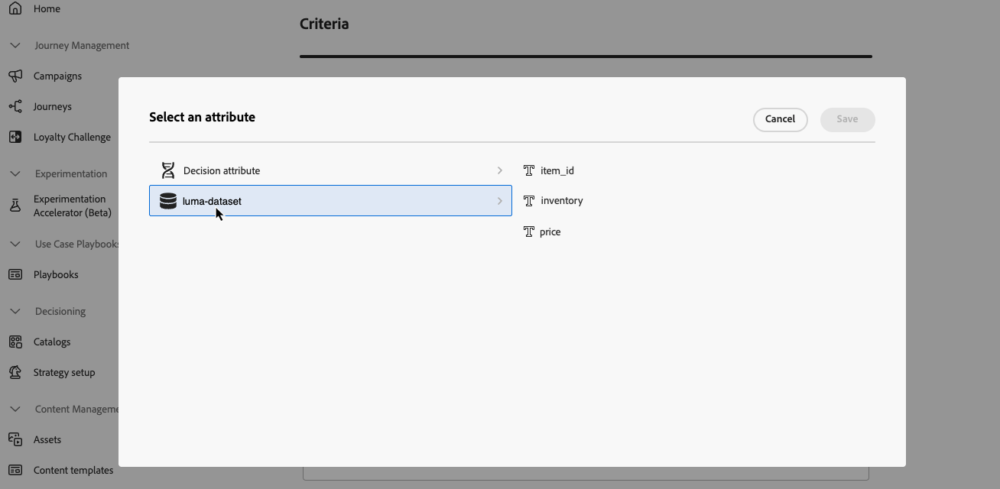

# 使用 Adobe Experience Platform 数据进行决策制定 {#aep-data}

>[!CONTEXTUALHELP]
>id="ajo_exd_catalogs_dataset"
>title="数据集查找"
>abstract=In order to use attributes from Adobe Experience Platform for decisioning, you need to create a mapping to define how the Adobe Experience Platform dataset joins with data in [!DNL Journey Optimizer].”

>[!CONTEXTUALHELP]
>id="ajo_exd_catalogs_dataset_create"
>title="数据集查找"
>abstract="在所有已启用查找的Adobe Experience Platform数据集中选择具有所需属性的数据集，然后选择同时存在于决策项目属性和数据集中的映射键（例如航班号或客户ID）。”"

>[!CONTEXTUALHELP]
>id="ajo_exd_rules_dataset_lookup"
>title="数据集查找"
>abstract="选择具有所需属性的Adobe Experience Platform数据集。 如果该数据集未显示在列表中，请确保已为其启用查找功能，并且已创建数据集查找映射。"

>[!CONTEXTUALHELP]
>id="ajo_exd_formula_dataset_lookup"
>title="数据集查找"
>abstract="使用[!DNL Adobe Experience Platform]数据集属性动态调整排名逻辑以反映真实情况。 单击&#x200B;**[!UICONTROL 添加数据集]**&#x200B;以选择具有所需属性的Adobe Experience Platform数据集。 如果该数据集未显示在列表中，请确保已为其启用查找功能，并且已创建数据集查找映射。"

>[!CONTEXTUALHELP]
>id="ajo_exd_item_capping_dataset"
>title="添加数据集”"
>abstract="使用[!DNL Adobe Experience Platform]数据集属性根据动态外部属性定义上限条件。 单击&#x200B;**[!UICONTROL 添加数据集]**&#x200B;以选择具有所需属性的Adobe Experience Platform数据集。 如果该数据集未显示在列表中，请确保已为其启用查找功能，并且已创建数据集查找映射。”"

>[!AVAILABILITY]
>
>此功能目前以有限可用版本的形式提供给所有客户。

[!DNL Journey Optimizer]允许您将[!DNL Adobe Experience Platform]中的数据用于决策。 通过该功能，您可以将决策属性的定义扩展到数据集中的其他数据，以便进行定期更改的批量更新，而无需手动更新每个属性。例如，可用性、等待时间等。

>[!IMPORTANT]
>
>[!DNL Journey Optimizer]支持对单个决策策略进行最多1000个查找。

## 先决条件

### 为查找启用数据集

在开始之前，必须先为查找启用决策所需的数据集。 按照本节中详述的步骤操作：[使用Adobe Experience Platform数据](../data/lookup-aep-data.md)。

### 创建映射

为了将Adobe Experience Platform中的属性用于决策，您需要创建一个映射来定义Adobe Experience Platform数据集如何与[!DNL Journey Optimizer]中的数据联接。 为此，请执行以下步骤：

1. 导航到&#x200B;**[!UICONTROL 目录]** / **[!UICONTROL 数据集查找]**，然后单击&#x200B;**[!UICONTROL 创建]**。

   

1. 配置映射：

   1. 单击&#x200B;**[!UICONTROL 选择数据集]**&#x200B;以显示所有已启用查找的Adobe Experience Platform数据集。 选择具有所需属性的数据集。

   1. 单击&#x200B;**[!UICONTROL 选择]**&#x200B;可选择决策项属性和数据集中同时存在的加入键（例如，航班号或客户ID）。

   

1. 单击&#x200B;**[!UICONTROL 保存]**。

## 利用Adobe Experience Platform数据 {#leverage-aep-data}

为查找启用数据集并创建映射后，您可以使用该数据通过外部数据扩充您的决策逻辑。 这对于经常更改的属性（如产品可用性或实时定价）特别有用。

Adobe Experience Platform数据集中的属性可用于决策逻辑的两个部分：

* **决策规则**：定义决策项是否符合显示条件。
* **排名公式**：根据外部数据排列决策项的优先级。
* **上限规则**：使用外部数据计算上限规则的阈值。

以下部分将说明如何在这些上下文中使用Adobe Experience Platform数据。

### 决策规则 {#rules}

在决策规则中使用Adobe Experience Platform数据允许您根据动态的外部属性定义资格标准，确保仅在相关时显示决策项目。

例如，假设某个在线retailer想要根据本地商店库存来促销产品推荐。 只有在最近位置有现货时，产品才有资格获得推荐。 将包含每日清单更新的数据集上传到Adobe Experience Platform。 规则逻辑检查给定产品的`inventory_count`对于客户的首选存储是否大于0。 如果是，则决策项目符合条件。

要将Adobe Experience Platform数据用于决策规则，请执行以下步骤：

1. 转到&#x200B;**[!UICONTROL 策略设置]** / **[!UICONTROL 决策规则]**&#x200B;菜单并选择&#x200B;**[!UICONTROL 使用数据集]**&#x200B;创建规则。

   

1. 单击&#x200B;**[!UICONTROL 添加数据集]**，然后选择具有所需属性的数据集。

   

1. 单击&#x200B;**[!UICONTROL 继续]**。 您现在可以在&#x200B;**[!UICONTROL 数据集查找]**&#x200B;菜单中访问数据集属性，并在规则条件中使用它们。 [了解如何创建决策规则](../experience-decisioning/rules.md#create)

   

### 排名公式 {#ranking-formulas}

排序公式用于定义决策项的优先级。通过使用[!DNL Adobe Experience Platform]数据集属性，您可以动态调整排名逻辑以反映真实情况。

例如，假设一家航空公司使用排名公式来排列升级优惠的优先级。 如果客户具有较高的忠诚度等级并且当前名额可用性较低（基于每小时更新一次的数据集），则会为他们分配较高的优先级。 数据集包含`flight_number`、`available_seats`和`loyalty_score`等字段。

要将Adobe Experience Platform数据用于排名公式，请执行以下步骤：

1. 创建或编辑排名公式。

1. 在&#x200B;**[!UICONTROL 数据集查找]**&#x200B;部分中，单击&#x200B;**[!UICONTROL 添加数据集]**。

1. 选择适当的数据集。

   

   >[!NOTE]
   >
   >如果您要查找的数据集未显示在列表中，请确保已为其启用查找功能，并且已创建数据集查找映射。 有关更多详细信息，请参阅[先决条件](#prerequisites)部分。

1. 照常使用数据集字段构建排名公式。 [了解如何创建排名公式](ranking/ranking-formulas.md#create-ranking-formula)

   

### 上限规则 {#capping-rules}

上限规则用作约束，以定义决策项可显示的最大次数。 在上限规则中使用Adobe Experience Platform数据允许您根据动态的外部属性定义上限标准。 通过使用上限规则中的表达式计算所需上限阈值来完成此操作。

例如，retailer可能希望根据实时产品库存来限制选件。 他们使用引用Adobe Experience Platform数据集中的`inventory_count`字段的表达式，而不是将固定阈值设置为500。 如果数据集显示有275个项目保留库存，则选件最多只能交付该数字。

>[!NOTE]
>
>上限规则&#x200B;**表达式**&#x200B;当前可作为有限可用性功能提供给所有用户，并且仅支持&#x200B;**[!UICONTROL 总共]**&#x200B;个上限类型。

要将Adobe Experience Platform数据用于设置规则表达式的上限，请执行以下步骤：

1. 创建或编辑决策项。

1. 定义项资格时，单击&#x200B;**[!UICONTROL 添加数据集]**&#x200B;并选择适当的数据集。

   

   >[!NOTE]
   >
   >如果您要查找的数据集未显示在列表中，请确保已为其启用查找功能，并且已创建数据集查找映射。 有关更多详细信息，请参阅[先决条件](#prerequisites)部分。

1. 选择&#x200B;**[!UICONTROL In total]**&#x200B;上限类型，然后启用&#x200B;**[!UICONTROL 表达式]**&#x200B;选项。

   

   >[!NOTE]
   >
   >如果您要查找的数据集未显示在列表中，请确保已为其启用查找功能，并且已创建数据集查找映射。 有关更多详细信息，请参阅[先决条件](#prerequisites)部分。

1. 编辑表达式并使用数据集字段构建表达式。

   

1. 照常完成上限和规则决策项的配置。 [了解如何设置上限规则](../experience-decisioning/items.md#capping)
