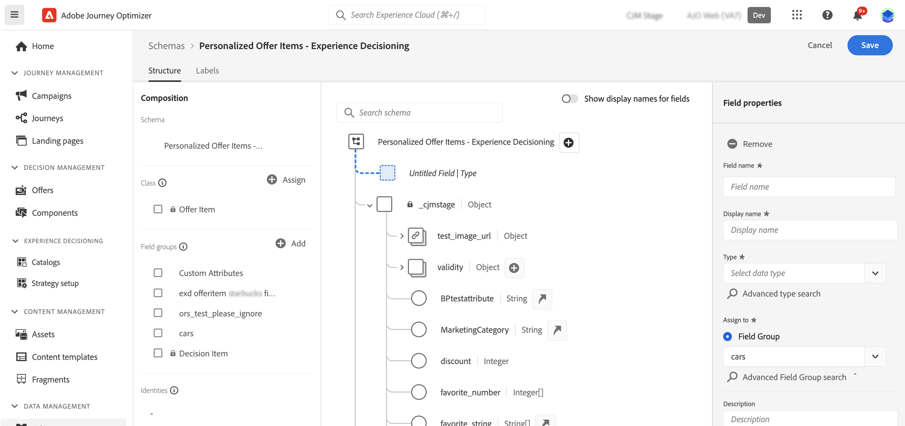

# 项目目录 {#catalog}

在Decisioning中，目录用作组织决策项目的中央容器。 每个目录都链接到Adobe Experience Platform架构，其中包含可分配给决策项目的所有属性。

目前，所有创建的决策项都整合到单个“优惠”目录中，该目录可通过&#x200B;**[!UICONTROL 目录]**&#x200B;菜单访问。

## 保护和限制

为了确保最佳性能和一致性，Decisioning强制实施以下护栏和限制：

* **支持的数据类型**

  目前，Decisioning专门支持以下数据类型：String、Integer、Boolean、Date、DateTime、Decisioning Asset和Object。 在创作决策项或目录时，任何不属于这些数据类型的字段将不可用。

* **自定义属性限制**

  每个决策项最多可包含100个自定义属性。

* **嵌套限制**

  最多支持四个级别的嵌套。 最后一个级别不支持图像。

## 访问和编辑目录的架构 {#access-catalog-schema}

要访问存储决策项目属性的目录架构，请执行以下步骤：

1. 从项列表中，单击位于&#x200B;**[!UICONTROL 创建项]**&#x200B;按钮旁边的&#x200B;**[!UICONTROL 编辑架构]**&#x200B;按钮。

1. 目录的架构将在新选项卡中打开，遵循以下结构：

   * **`_experience`**&#x200B;节点包括标准决策项属性，如名称、开始和结束日期以及描述。
   * **`_<imsOrg>`**&#x200B;节点包含自定义决策项属性。 默认情况下，不会配置自定义属性，但您可以根据需要添加任意数量的属性以满足您的要求。 完成后，自定义属性会与标准属性一起显示在决策项创建屏幕中。

   

1. 要向架构添加自定义属性，请展开&#x200B;**`_<imsOrg>`**&#x200B;节点，然后单击结构中所需位置的“+”按钮。

   

1. 填写所添加属性的必需字段，然后单击&#x200B;**[!UICONTROL 应用]**。

   为具有决策资产属性的属性输入的值是公共url。 大多数情况下，这会指向图像。

   有关如何使用Adobe Experience Platform架构的详细信息，请参阅[XDM System文档](https://experienceleague.adobe.com/docs/experience-platform/xdm/ui/overview.html?lang=zh-Hans)。

1. 添加所需的自定义属性后，保存架构。 现在，新字段在决策项创建屏幕的&#x200B;**[!UICONTROL 自定义属性]**&#x200B;部分中可用。

   下面的示例显示了一个项目创建屏幕，该屏幕具有自定义属性，如在架构中定义的对象。

   

