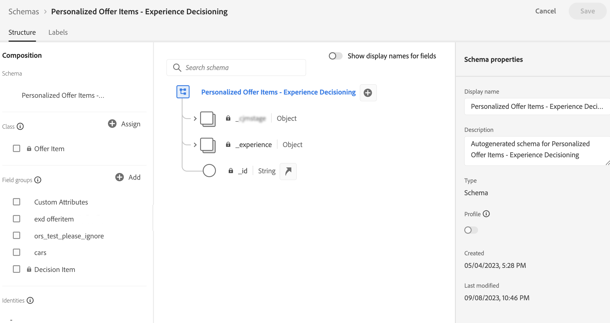

# 项目目录 {#catalog}

在Experience Decisioning中，目录用作组织决策项目的中央容器。 每个目录都链接到Adobe Experience Platform架构，其中包含可分配给决策项目的所有属性。

目前，所有创建的决策项目都整合到单个“优惠”目录中，该目录可通过访问 **[!UICONTROL 目录]** 菜单。

要访问存储决策项目属性的目录架构，请执行以下步骤：

1. 在项目列表中，单击 **[!UICONTROL 编辑架构]** 按钮的位置 **[!UICONTROL 创建项目]** 按钮。

1. 目录的架构将在新选项卡中打开，遵循以下结构：

   * 此 **`_experience`** 节点包括标准决策项目属性，如名称、开始和结束日期以及描述。
   * 此 **`_<imsOrg>`** 节点存放自定义决策项属性。 默认情况下，不会配置自定义属性，但您可以根据需要添加任意数量的属性以满足您的要求。 完成后，自定义属性会与标准属性一起显示在决策项创建屏幕中。

   

1. 要向架构添加自定义属性，请展开 **`_<imsOrg>`** 节点，然后单击结构中所需位置的“+”按钮。

   

1. 为添加的属性填写必要的字段，然后单击 **[!UICONTROL 应用]**.

   >[!CAUTION]
   >
   >目前，Experience Decisioning专门支持以下数据类型：String、Integer、Boolean、Date、DateTime和Decisioning资产。 在创作决策项或目录时，任何不属于这些数据类型的字段将不可用。

   为具有决策资产属性的属性输入的值是公共url。 大多数情况下，这会指向图像。

   有关如何使用Adobe Experience Platform架构的详细信息，请参阅 [XDM系统文档](https://experienceleague.adobe.com/docs/experience-platform/xdm/ui/overview.html?lang=zh-Hans).

1. 添加所需的自定义属性后，保存架构。 现在，项目决策创建屏幕中的新字段可用，位于 **[!UICONTROL 自定义属性]** 部分。
