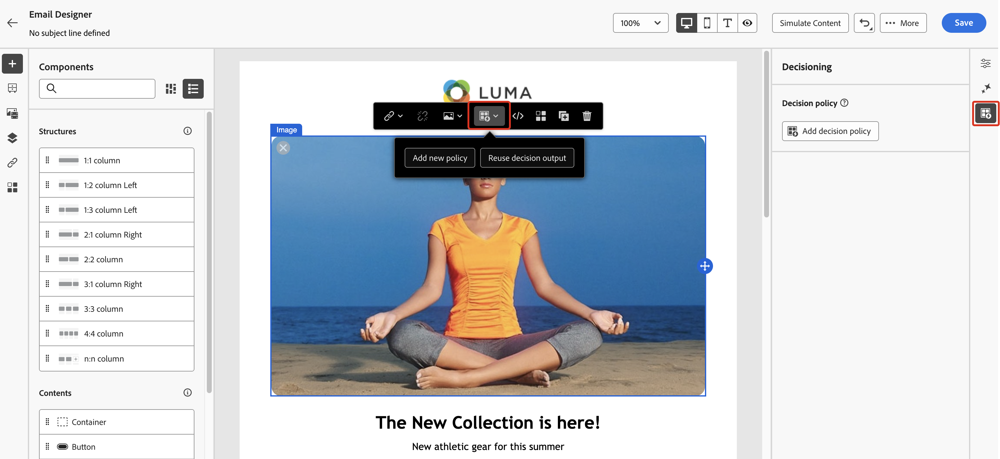
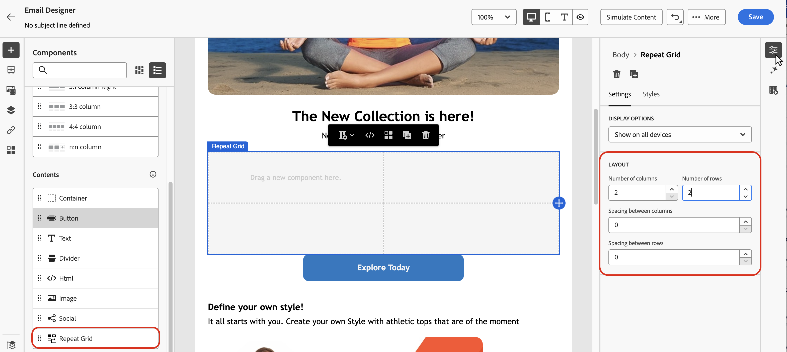
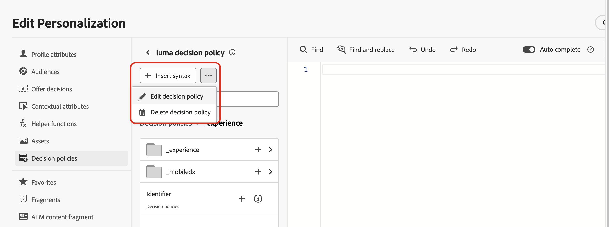

# 创建决策策略 {#create-decision}

>[!CONTEXTUALHELP]
>id="ajo_code_based_item_number"
>title="定义要返回的项数"
>abstract="选择要返回的决策项数。例如，如果选择 2，则将为当前配置显示最佳的 2 个合格优惠。"

>[!CONTEXTUALHELP]
>id="ajo_code_based_fallback"
>title="选择回退"
>abstract="在为该决策策略定义的所有选择策略均不合格时，向用户显示回退项。"

>[!CONTEXTUALHELP]
>id="ajo_code_based_strategy"
>title="策略是什么？"
>abstract="选择策略的序列决定首先评估哪个策略。至少需要一个策略。将一同评估组合策略中的决策项。"
>additional-url="https://experienceleague.adobe.com/zh-hans/docs/journey-optimizer/using/decisioning/offer-decisioning/get-started-decision/starting-offer-decisioning" text="创建策略"

要向客户提供最佳的动态优惠和体验，请将决策策略添加到营销活动或历程中的内容，然后配置要返回的项目和要使用的选择策略。 要实现此目的，请执行以下步骤：

1. [添加决策策略](#add) — 来自Personalization编辑器或电子邮件Designer。
1. [配置决策策略](#configurre) — 添加名称并指定要返回的项目数。
1. [设置策略序列](#strategy) — 选择要随决策策略一起返回的项目。
1. [选择后备优惠](#fallback)（可选） — 选择无限定项或选择策略时要显示的项。
1. [查看并保存](#review)选择策略

>[!AVAILABILITY]
>
>目前，决策策略适用于&#x200B;**基于代码的体验**&#x200B;渠道的所有客户。 它们对&#x200B;**电子邮件**&#x200B;渠道的可用性有限。 请联系 Adobe 代表以获取访问权限。

## 添加决策策略 {#add}

1. 打开历程或营销活动，选择[渠道操作](../building-journeys/journeys-message.md)，然后编辑消息的内容。

1. 对于电子邮件，请切换&#x200B;**[!UICONTROL 启用决策]**&#x200B;选项。

   

   >[!IMPORTANT]
   >
   >启用决策可清除现有电子邮件内容。 如果您已经设计了电子邮件，请务必预先将内容另存为模板。
   >
   >请注意，在电子邮件中配置的任何决策策略都不会保存在模板中。 如果将模板应用于另一封电子邮件，则需要重新配置策略。

1. 打开&#x200B;**个性化编辑器**&#x200B;以创建决策策略。 对于电子邮件，您还可以使用&#x200B;**电子邮件设计器**&#x200B;中的专用菜单来创建决策策略。 展开以下部分以探索这两种方法。

   +++从Personalization编辑器创建决策策略

   1. 打开个性化编辑器并选择&#x200B;**[!UICONTROL 决策策略]**。
   1. 单击&#x200B;**[!UICONTROL 添加决策策略]**&#x200B;按钮以创建新策略。

      

   +++

   +++从Email Designer创建决定策略

   在电子邮件内容中选择组件，单击工具栏或属性窗格中的&#x200B;**[!UICONTROL 决策]**&#x200B;图标，然后选择&#x200B;**[!UICONTROL 添加新策略]**。

   **[!UICONTROL 重复使用决策输出]**&#x200B;允许您重复使用已在此电子邮件中创建的决策策略。

   

   +++

## 配置决策策略 {#configure}

在内容中添加新的决策策略后，将打开决策策略配置屏幕。

1. 提供决策策略的名称，然后选择目录（当前仅限于默认的&#x200B;**[!UICONTROL 优惠]**&#x200B;目录）。

1. 选择要返回的项目数。 例如，如果选择 2，则将为当前配置显示最佳的 2 个合格优惠。

   

   对于电子邮件渠道，**[!UICONTROL 项目数]**&#x200B;字段默认设置为1，除非从&#x200B;**[!UICONTROL 重复网格]**&#x200B;组件中添加决策策略，否则无法修改该字段。 有关更多详细信息，请展开以下部分：

   +++使用&#x200B;**[!UICONTROL 重复网格]**&#x200B;组件在电子邮件中返回多个决策项

   1. 拖动电子邮件中的&#x200B;**[!UICONTROL 重复网格]**&#x200B;组件，然后使用&#x200B;**[!UICONTROL 设置]**&#x200B;窗格根据需要对其进行配置。

      

   1. 单击画布工具栏中的&#x200B;**[!UICONTROL 决策]**&#x200B;图标或打开&#x200B;**[!UICONTROL 决策]**&#x200B;窗格并选择&#x200B;**[!UICONTROL 添加决策策略]**。

   1. 在&#x200B;**[!UICONTROL 项数]**&#x200B;字段中指定要返回的项数，然后按照以下记录配置决策策略。 您可以选择的最大项数受&#x200B;**[!UICONTROL 重复网格]**&#x200B;组件中定义的拼贴数量的限制。

   

   +++

1. 单击&#x200B;**[!UICONTROL 下一步]**。

## 设置策略序列 {#strategy}

**[!UICONTROL 策略序列]**&#x200B;部分允许您选择决策项并设置要与决策策略一起显示的选择策略。

1. 单击&#x200B;**[!UICONTROL 添加]**&#x200B;并选择要包含在策略中的对象类型：

   

   * **[!UICONTROL 选择策略]** — 决策策略利用与资格约束和排名方法关联的集合来确定要显示的项目。 您可以选择一个或多个现有的选择策略，或使用&#x200B;**[!UICONTROL 创建选择策略]**&#x200B;按钮创建新选择策略。 [了解如何创建选择策略](selection-strategies.md)

   * **[!UICONTROL 决策项]** — 选择单个决策项，而无需运行选择策略。 一次只能选择一个决策项目。 将应用为物料设置的任何资格约束。

   >[!NOTE]
   >
   >决策策略支持最多10个选择策略和决策项目组合。 [了解有关Decisioning护栏和限制的更多信息](gs-experience-decisioning.md#guardrails)

1. 添加多个决策项目和/或策略时，将按特定顺序评估它们。 将首先评估添加到序列中的第一个对象，依此类推。 要更改默认顺序，请拖放对象和/或组以根据需要重新排序。 展开下面的部分以了解更多详细信息。

   +++在决策策略中管理评估顺序

   将决策项和选择策略添加到策略中后，您可以安排它们的顺序以确定它们的评估顺序，并将选择策略组合在一起以一起评估它们。

   每个对象或对象组左侧的数字表示用于计算项和策略的&#x200B;**顺序顺序**。 要在序列中移动选择策略（或一组策略）的位置，请将其拖放到另一个位置。

   

   >[!NOTE]
   >
   >在序列中只能拖放选择策略。 要更改决策项的位置，您需要删除决策项，并在添加之前要评估的其他项后使用&#x200B;**[!UICONTROL 添加]**&#x200B;按钮重新添加它。

   您还可以&#x200B;**将**&#x200B;多个选择策略组合到组中，以便一起评估而不是分别评估。 为此，请单击选择策略下的&#x200B;**`+`**&#x200B;按钮以将其与另一个策略组合。 您还可以将选择策略拖放到另一个策略上，以将这两个策略分组到一个组中。

   >[!NOTE]
   >
   >决策项目不能与其他项目或选择策略一起分组。

   多个策略及其分组决定了策略的优先级和合格优惠的排名。 第一种策略具有最高优先级，同一组内组合策略具有相同的优先级。

   例如，您有两个集合，一个在策略A中，另一个在策略B中。该请求用于发送回两个决策项目。 假设策略A中有两个符合条件的优惠，而策略B中有三个符合条件的优惠。

   * 如果两个策略不是&#x200B;**组合**&#x200B;或按顺序（1和2）组合，则第一个策略中的前两个符合条件的优惠将返回第一行。 如果第一个策略中没有两个符合条件的优惠，则决策引擎将依次转到下一个策略以查找仍然需要的任意数量的优惠，并且最终将在需要时返回回退。

     

   * 如果同时&#x200B;**评估这两个集合**，则由于策略A中有两个符合条件的优惠和策略B中有三个符合条件的优惠，因此这五个优惠都将根据各自的排名方法确定的值栈叠在一起。 由于请求了两个选件，因此将返回这五个选件中符合条件的前两个选件。

     

   **具有多个策略的示例**

   现在，我们来看一个示例，其中您将多个策略划分为不同的组。 你定义了三种策略。 策略1和策略2被归入组1，策略3独立（组2）。 每个策略的合格优惠及其优先级（用于排名功能评估）如下所示：

   * 第1组：
      * 策略1 — （选件1、选件2、选件3） — 优先级1
      * 策略2 — （选件3、选件4、选件5） — 优先级1

   * 第2组：
      * 策略3 — （选件5，选件6） — 优先级0

   首先评估最高优先级的策略选件，并将其添加到排名选件列表。

   * **迭代1：**

     将同时评估策略1和策略2选件（选件1、选件2、选件3、选件4、选件5）。 假设结果为：

     选件1 - 10
选件2 - 20
战略1中的报价3 - 30，战略2中的报价45。 两者中的最高值将被考虑在内，因此会考虑45。
选件4 - 40
选件5 - 50

     排名后的选件现在如下所示：选件5、选件3、选件4、选件2、选件1。

   * **迭代2：**

     已评估策略3选件（选件5、选件6）。 假设结果为：

      * 选件5 — 将不进行评估，因为上述结果中已存在该选件。
      * 选件6 - 60

     排名后的选件现在如下所示：选件5 、选件3、选件4、选件2、选件1、选件6。

   +++

1. 选择策略就绪后，单击&#x200B;**[!UICONTROL 下一步]**。

## 添加后备优惠 {#fallback}

选择决策项目和/或选择策略后，您可以添加备用优惠以在以上任何项目或选择策略都不符合条件时显示。

您可以从列表中选择任何项目，这将显示在当前沙盒中创建的所有决策项目。 如果没有符合条件的选择策略，则无论应用于所选项目<!--nor frequency capping when available - TO CLARIFY-->的日期和资格限制如何，都会向用户显示回退。

>[!NOTE]
> 回退是可选的。 最多可以选择请求的项目数。 如果没有符合条件且未设置任何回退，则不会显示任何内容。

## 查看并保存决策策略 {#review}

配置选择策略并添加后备优惠后，单击&#x200B;**[!UICONTROL 下一步]**&#x200B;以查看并保存决策策略，然后单击&#x200B;**[!UICONTROL 创建]**&#x200B;以确认创建策略。

>[!IMPORTANT]
>
>创建决策策略后，对其所做的任何更改最多可能需要15分钟才能传播到所有数据区域，而加拿大最多需要30分钟。 这包括更改，例如向收藏集添加新决策项、更改项中的规则、更改项内容或更新公式。

您可以随时使用个性化编辑器中的省略号按钮或组件属性窗格中的&#x200B;**[!UICONTROL 决策]**&#x200B;菜单来编辑或删除决策策略。

>[!BEGINTABS]

>[!TAB 从个性化编辑器中编辑或删除策略]

>[!TAB 编辑或删除组件属性中的策略]

>[!ENDTABS]

## 分配投放位置（电子邮件） {#placement}

对于电子邮件，您需要定义与决策策略关联的组件的版面。 为此，请单击组件属性窗格中的&#x200B;**[!UICONTROL 决策]**&#x200B;按钮，然后选择&#x200B;**[!UICONTROL 分配位置]**。 [了解如何使用版面](../experience-decisioning/placements.md)

## 后续步骤 {#next-steps}

现在您已经了解如何创建决策策略，可以将其用于[!DNL Journey Optimizer]渠道来投放优惠了。

➡️ [了解如何在邮件中使用决策策略](../experience-decisioning/use-decision-policy.md)

