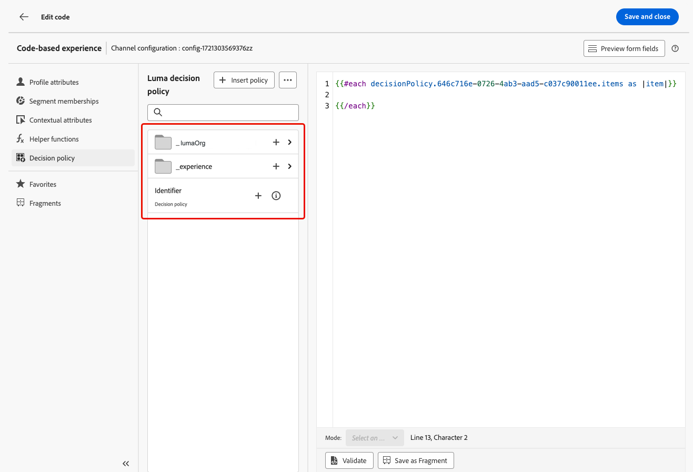

# 创建决策策略 {#create-decision}

>[!CONTEXTUALHELP]
>id="ajo_code_based_decision"
>title="决策是什么？"
>abstract="决策策略包含决策引擎挑选最佳内容的所有选择逻辑。决策政策是针对特定活动的。他们的目标是为每个配置文件选择最佳的报价，而活动创作允许您指示如何呈现所选的决策项目，包括应在消息中包含哪些项目属性。"
>additional-url="https://experienceleague.adobe.com/zh-hans/docs/journey-optimizer/using/decisioning/offer-decisioning/get-started-decision/starting-offer-decisioning" text="关于体验决策"

决策策略是优惠的容器，它们利用Experience Decisioning引擎根据受众选择要投放的最佳内容。

决策策略包含决策引擎挑选最佳内容的所有选择逻辑。决策政策是针对特定活动的。他们的目标是为每个配置文件选择最佳的报价，而活动创作允许您指示如何呈现所选的决策项目，包括应在消息中包含哪些项目属性。

>[!NOTE]
>
>在[!DNL Journey Optimizer]用户界面中，决策策略标记为决策<!--but they are decision policies. TBC if this note is needed-->。

## 将决策策略添加到基于代码的营销活动 {#add-decision}

>[!CONTEXTUALHELP]
>id="ajo_code_based_item_number"
>title="定义要返回的项数"
>abstract="选择要返回的决策项数。例如，如果选择2，则会为当前配置显示最佳的2个符合条件的优惠。"

>[!CONTEXTUALHELP]
>id="ajo_code_based_fallback"
>title="选择回退"
>abstract="在为该决策策略定义的所有选择策略均不合格时，向用户显示回退项。"

>[!CONTEXTUALHELP]
>id="ajo_code_based_strategy"
>title="策略是什么？"
>abstract="选择策略的顺序决定首先评估哪个策略。至少需要一个策略。将一同评估组合策略中的决策项。"
>additional-url="https://experienceleague.adobe.com/zh-hans/docs/journey-optimizer/using/decisioning/offer-decisioning/get-started-decision/starting-offer-decisioning" text="创建策略"
>additional-url="https://experienceleague.adobe.com/zh-hans/docs/journey-optimizer/using/decisioning/offer-decisioning/get-started-decision/starting-offer-decisioning" text="评估顺序"

要在您的网站或移动应用程序上向访客展示最佳的动态选件和体验，请向基于代码的营销活动添加决策策略。 要实现此目的，请执行以下步骤。

1. 创建营销活动并选择&#x200B;**[!UICONTROL 基于代码的体验]**&#x200B;操作。 [了解详情](../code-based/create-code-based.md)

1. 从[代码编辑器](../code-based/create-code-based.md#edit-code)中，选择&#x200B;**[!UICONTROL 决策策略]**&#x200B;图标，然后单击&#x200B;**[!UICONTROL 添加决策策略]**。

   

1. 填写决策策略的详细信息：添加名称并选择目录。

   >[!NOTE]
   >
   >当前只有默认的&#x200B;**[!UICONTROL 选件]**&#x200B;目录可用。

   

1. 选择要返回的项目数。 例如，如果选择2，则会为当前配置显示最佳的2个符合条件的优惠。 单击&#x200B;**[!UICONTROL 下一步]**

1. 使用&#x200B;**[!UICONTROL 添加策略]**&#x200B;按钮定义决策策略的选择策略。 每个策略包括与资格限制关联的优惠收藏集以及确定要显示的优惠的排名方法。 [了解详情](selection-strategies.md)

   

   >[!NOTE]
   >
   >至少需要一个策略。不能添加超过10个策略。

1. 在&#x200B;**[!UICONTROL 添加策略]**&#x200B;屏幕中，您还可以创建策略。 **[!UICONTROL 创建选择策略]**&#x200B;按钮会将您重定向到&#x200B;**[!UICONTROL Experience Decisioning]** > **[!UICONTROL 策略设置]**&#x200B;菜单。 [了解详情](selection-strategies.md)

   

1. 添加多个策略时，将按特定顺序评估它们。 将首先评估添加到序列中的第一个策略，以此类推。 [了解详情](#evaluation-order)

   要更改默认顺序，您可以拖放策略和/或组以根据需要重新排序。

   

1. 添加后备。 如果上述选择策略均不合格，则会向用户显示回退项目。

   

   您可以从列表中选择任何项目，这将显示在当前沙盒中创建的所有决策项目。 如果没有符合条件的选择策略，则无论应用于所选项目<!--nor frequency capping when available - TO CLARIFY-->的日期和资格限制如何，都会向用户显示回退。

   >[!NOTE]
   >
   >回退是可选的。 如果未选择任何回退，并且没有限定策略，则[!DNL Journey Optimizer]将不显示任何内容。

1. 保存您的选择，然后单击&#x200B;**[!UICONTROL 创建]**。 现在，决策策略已创建，您可以在基于代码的体验内容中使用决策属性。 [了解详情](#use-decision-policy)

   

## 评估顺序 {#evaluation-order}

如上所述，策略包括集合、排名方法和资格约束。

您可以：

* 设置要评估的策略的顺序顺序，
* 合并多个策略，以便一起评估而不是分别评估。

多个策略及其分组决定了策略的优先级和合格优惠的排名。 第一种策略具有最高优先级，同一组内组合策略具有相同的优先级。

例如，您有两个集合，一个在策略A中，另一个在策略B中。该请求用于发送回两个决策项目。 假设策略A中有两个符合条件的优惠，而策略B中有三个符合条件的优惠。

* 如果两个策略不是&#x200B;**组合**&#x200B;或按顺序（1和2）组合，则第一个策略中的前两个符合条件的优惠将返回第一行。 如果第一个策略中没有两个符合条件的优惠，则决策引擎将依次转到下一个策略以查找仍然需要的任意数量的优惠，并且最终将在需要时返回回退。

  

* 如果同时&#x200B;**评估这两个集合**，则由于策略A中有两个符合条件的优惠和策略B中有三个符合条件的优惠，因此这五个优惠都将根据各自的排名方法确定的值栈叠在一起。 由于请求了两个选件，因此将返回这五个选件中符合条件的前两个选件。

  

+++ **具有多个策略的示例**

现在，我们来看一个示例，其中您将多个策略划分为不同的组。

你定义了三种策略。 策略1和策略2被归入组1，策略3独立（组2）。

每个策略的合格优惠及其优先级（用于排名功能评估）如下所示：

* 第1组：
   * 策略1 — （选件1、选件2、选件3） — 优先级1
   * 策略2 — （选件3、选件4、选件5） — 优先级1

* 第2组：
   * 策略3 — （选件5，选件6） — 优先级0

首先评估最高优先级的策略选件，并将其添加到排名选件列表。

**迭代1：**

将同时评估策略1和策略2选件（选件1、选件2、选件3、选件4、选件5）。 假设结果为：

选件1 - 10
选件2 - 20
战略1中的报价3 - 30，战略2中的报价45。 两者中的最高值将被考虑在内，因此会考虑45。
选件4 - 40
选件5 - 50

排名后的选件现在如下所示：选件5、选件3、选件4、选件2、选件1。

**迭代2：**

已评估策略3选件（选件5、选件6）。 假设结果为：

* 选件5 — 将不进行评估，因为上述结果中已存在该选件。
* 选件6 - 60

排名后的选件现在如下所示：选件5 、选件3、选件4、选件2、选件1、选件6。

+++

## 在代码编辑器中使用决策策略 {#use-decision-policy}

创建决策策略后，即可在[个性化编辑器](../code-based/create-code-based.md#edit-code)中使用。 要实现此目的，请执行以下步骤。

>[!NOTE]
>
>基于代码的体验利用[!DNL Journey Optimizer]个性化编辑器及其所有个性化和创作功能。 [了解详情](../personalization/personalization-build-expressions.md)

1. 单击&#x200B;**[!UICONTROL 插入策略]**&#x200B;按钮。 将添加与决策策略对应的代码。

   

   >[!NOTE]
   >
   >此序列将按您希望返回决策策略的次数重复。 例如，如果您选择在[创建决策](#add-decision)时返回2个项目，则相同的序列将重复两次。

1. 现在，您可以在该代码中添加所需的所有决策属性。 可用的属性存储在&#x200B;**[!UICONTROL 优惠]**&#x200B;目录的架构中。 自定义属性存储在&#x200B;**`_<imsOrg`>**&#x200B;文件夹中，标准属性存储在&#x200B;**`_experience`**&#x200B;文件夹中。 [了解有关优惠目录架构的更多信息](catalogs.md)

   

   >[!NOTE]
   >
   >对于决策策略项目跟踪，决策策略内容需要按如下方式添加`trackingToken`属性：
   >`trackingToken: {{item._experience.decisioning.decisionitem.trackingToken}}`

1. 单击每个文件夹以将其展开。 将鼠标光标置于所需位置，然后单击要添加属性旁边的+图标。 您可以向代码添加任意数量的属性。

   

1. 您还可以添加个性化编辑器中可用的任何其他属性，例如配置文件属性。

   

## 客户历程分析中的报告 {#cja}

如果您正在使用Customer Journey Analytics，则可以利用Experience Decisioning为您的基于代码的营销活动创建自定义报告仪表板。

下面列出了主要步骤。 有关如何使用Customer Journey Analytics的详细信息，请参阅[Customer Journey Analytics文档](https://experienceleague.adobe.com/en/docs/analytics-platform/using/cja-landing){target="_blank"}。

1. 在Customer Journey Analytics中创建并配置&#x200B;**连接**。 这允许您连接到需要报表的数据集。 [了解如何创建连接](https://experienceleague.adobe.com/en/docs/analytics-platform/using/cja-connections/create-connection){target="_blank"}

1. 创建&#x200B;**数据视图**&#x200B;并将其关联到之前创建的连接。 在&#x200B;**[!UICONTROL 组件]**&#x200B;选项卡中，选择要显示在报告中的相关架构字段。 对于Experience Decisioning，请确保包含&#x200B;**propositioninteract**&#x200B;和&#x200B;**propositiondisplay**&#x200B;字段。 [了解如何创建和配置数据视图](https://experienceleague.adobe.com/en/docs/analytics-platform/using/cja-dataviews/create-dataview){target="_blank"}

1. 在&#x200B;**工作区项目**&#x200B;中组合数据组件、表和可视化图表，为基于代码的营销活动创建和共享报告。[了解如何创建工作区项目](https://experienceleague.adobe.com/en/docs/analytics-platform/using/cja-workspace/build-workspace-project/create-projects){target="_blank"}
