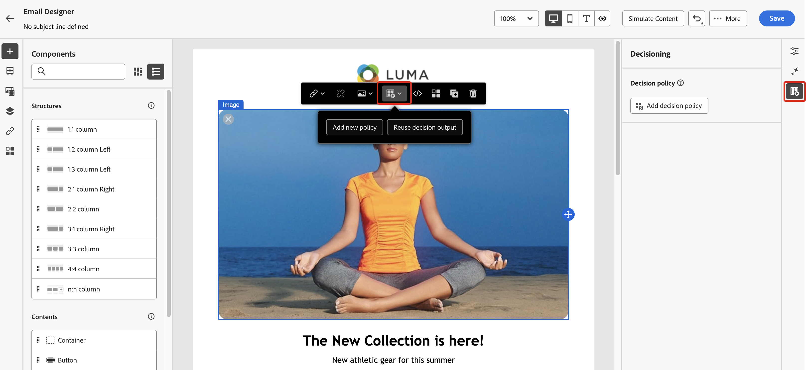

# 创建决策策略 {#create-decision}

>[!CONTEXTUALHELP]
>id="ajo_code_based_decision"
>title="决策是什么？"
>abstract="决策策略包含决策引擎挑选最佳内容的所有选择逻辑。决策政策是针对特定活动的。他们的目标是为每个轮廓选择最佳的报价，而活动创作允许您指示如何呈现所选的决策项目，包括应在消息中包含哪些项目属性。"
>additional-url="https://experienceleague.adobe.com/zh-hans/docs/journey-optimizer/using/decisioning/offer-decisioning/get-started-decision/starting-offer-decisioning" text="关于决策"

>[!CONTEXTUALHELP]
>id="ajo_journey_decision_policy"
>title="定义决策策略"
>abstract="决策策略允许您从决策引擎中挑选最佳项目，并将其推送给合适的受众。"
>additional-url="https://experienceleague.adobe.com/zh-hans/docs/journey-optimizer/using/decisioning/offer-decisioning/get-started-decision/starting-offer-decisioning" text="关于决策"

>[!CONTEXTUALHELP]
>id="ajo_exd_decision_policy"
>title="决策策略"
>abstract="决策策略允许您从决策引擎中挑选最合适的项目并交付给每个受众。"

>[!CONTEXTUALHELP]
>id="ajo_exd_placements"
>title="投放"
>abstract="放置环境决定了决策引擎返回的项目在消息中出现的位置。您可以在报告中跟踪其在不同放置环境的性能。"

>[!CONTEXTUALHELP]
>id="ajo_exd_decision_attribute"
>title="从目录中选择决策属性"
>abstract="决策属性存储在目录的架构中。从所选目录中选择要在此使用的属性。"

决策策略是优惠的容器，它们利用决策引擎动态返回为每个受众成员提供的最佳内容。 其目标是为每个用户档案选择最佳优惠，而营销活动/历程创作允许您指示应如何显示选定的决策项目，包括要包含在消息中的项目属性。

## 关键步骤 {#key}

将决策策略用于消息的主要步骤如下：

1. [在电子邮件或基于代码的体验中创建决策策略](#add-decision)

   通过选择要返回的项目数、配置选择策略、回退选项和评估顺序，在电子邮件或基于代码的体验中设置决策策略。

1. [在内容中使用决策策略](#use-decision-policy)

   使用决策策略输出以及要显示在消息中的决策项中的属性，个性化您的内容。

1. [创建报告仪表板](cja-reporting.md)

   构建自定义Customer Journey Analytics功能板以衡量性能并深入了解决策策略和优惠的交付方式和参与方式。

## 保护和限制

* **有限可用性 — 电子邮件中的决策策略** — 目前，电子邮件中的决策策略创建以有限可用性提供。 请联系您的Adobe代表以获取访问权限。
* **镜像页面** — 目前，决策项不在电子邮件镜像页面中呈现。
* **跟踪和链接类型** — 要跟踪通过决策生成的链接，请在架构中将其定义为“决策Assets”。 基于属性的链接不可跟踪。
* **在电子邮件中嵌套决策策略** — 无法在已具有关联决策策略的父电子邮件组件中嵌套多个决策策略。
* **包含决策的重复历程/营销活动** — 如果您重复了包含决策策略的历程或营销活动，则复制的版本会引用原始电子邮件或基于代码的体验，从而导致出现错误。 复制后，请始终重新配置决策策略。
* **同意政策** — 对同意政策的更新最多可能需要24小时才能生效。 如果决策策略引用与最近更新的同意策略关联的属性，则不会立即应用更改。

  同样，如果将受同意策略约束的新配置文件属性添加到决策策略，则这些属性将可用，但只有在延迟过去后，才会实施与其关联的同意策略。

  同意策略仅适用于具有Adobe Healthcare Shield或Privacy and Security Shield加载项的组织。

* **AI排名** — 目前，使用决策的历程中的电子邮件渠道不支持AI排名。

## 在电子邮件或基于代码的体验中创建决策策略 {#add-decision}

>[!CONTEXTUALHELP]
>id="ajo_code_based_item_number"
>title="定义要返回的项数"
>abstract="选择要返回的决策项数。例如，如果选择 2，则将为当前配置显示最佳的 2 个合格优惠。"

>[!CONTEXTUALHELP]
>id="ajo_code_based_fallback"
>title="选择回退"
>abstract="在为该决策策略定义的所有选择策略均不合格时，向用户显示回退项。"

>[!CONTEXTUALHELP]
>id="ajo_code_based_strategy"
>title="策略是什么？"
>abstract="选择策略的序列决定首先评估哪个策略。至少需要一个策略。将一同评估组合策略中的决策项。"
>additional-url="https://experienceleague.adobe.com/zh-hans/docs/journey-optimizer/using/decisioning/offer-decisioning/get-started-decision/starting-offer-decisioning" text="创建策略"

要在您的网站或移动应用程序上向电子邮件的收件人和访客展示最佳的动态优惠和体验，请将决策策略添加到电子邮件或基于代码的营销活动或历程。 要实现此目的，请执行以下步骤。

### 创建决策策略 {#add}

1. 在历程或营销活动中，添加&#x200B;**[!UICONTROL 电子邮件]**&#x200B;或&#x200B;**[!UICONTROL 基于代码的体验]**&#x200B;操作。

1. 对于电子邮件，在配置屏幕中切换&#x200B;**[!UICONTROL 启用决策]**。

   

   >[!IMPORTANT]
   >
   >启用决策可清除现有电子邮件内容。 如果您已经设计了电子邮件，请务必预先将内容另存为模板。
   >
   >请注意，在电子邮件中配置的任何决策策略都不会保存在模板中。 如果将模板应用于另一封电子邮件，则需要重新配置策略。

1. 可以使用个性化编辑器在电子邮件和基于代码的体验中创建策略。 还可通过电子邮件Designer中的专用菜单在电子邮件中创建它们。 展开以下部分，了解更多详细信息。

   +++Personalization编辑器

   1. 打开个性化编辑器并选择&#x200B;**[!UICONTROL 决策策略]**。
   1. 单击&#x200B;**[!UICONTROL 添加决策策略]**&#x200B;按钮以创建新策略。

      

   +++

   +++向Designer **[!UICONTROL Decisioning]**&#x200B;菜单发送电子邮件

   1. 选择一个组件，单击工具栏或属性窗格中的&#x200B;**[!UICONTROL 决策]**&#x200B;图标，然后选择&#x200B;**[!UICONTROL 添加新策略]**。

   1. 选择&#x200B;**[!UICONTROL 重用决策输出]**&#x200B;以重用已在此电子邮件中创建的决策策略。

      

   +++

1. 提供名称并选择目录（当前仅限于默认的&#x200B;**[!UICONTROL 选件]**&#x200B;目录）。

1. 选择要返回的项目数。 例如，如果选择 2，则将为当前配置显示最佳的 2 个合格优惠。

   

   对于电子邮件，只能在&#x200B;**[!UICONTROL 重复网格]**&#x200B;内容组件中返回多个项目。 有关更多详细信息，请展开以下部分：

+++ 在电子邮件中返回多个决策项目

   1. 将&#x200B;**[!UICONTROL 重复网格]**&#x200B;组件拖动到画布上，然后根据需要使用&#x200B;**[!UICONTROL 设置]**&#x200B;窗格对其进行配置。

      

   1. 单击画布工具栏中的&#x200B;**[!UICONTROL 决策]**&#x200B;图标或打开&#x200B;**[!UICONTROL 决策]**&#x200B;窗格并选择&#x200B;**[!UICONTROL 添加决策策略]**。

   1. 在&#x200B;**[!UICONTROL 项数]**&#x200B;字段中指定要返回的项数，然后按照以下记录配置决策策略。 您可以选择的最大项数受&#x200B;**[!UICONTROL 重复网格]**&#x200B;组件中定义的拼贴数量的限制。

   

+++

1. 单击&#x200B;**[!UICONTROL 下一步]**。

### 选择项目和选择策略 {#select}

**[!UICONTROL 策略序列]**&#x200B;部分允许您选择要与决策策略一起呈现的决策项和选择策略。

1. 单击&#x200B;**[!UICONTROL 添加]**&#x200B;并选择要包含在策略中的对象类型：

   * **[!UICONTROL 选择策略]**：添加一个或多个选择策略。 决策策略利用与资格约束和排名方法关联的集合来确定要显示的项目。 您可以选择现有的选择策略，也可以使用&#x200B;**[!UICONTROL 创建选择策略]**&#x200B;按钮创建新选择策略。 [了解如何创建选择策略](selection-strategies.md)

   * **[!UICONTROL 决策项]**：添加单个决策项以呈现，而无需通过选择策略运行。 一次只能选择一个决策项目。 将应用为物料设置的任何资格约束。

   

   >[!NOTE]
   >
   >决策策略支持最多10个选择策略和决策项目组合。 [了解有关Decisioning护栏和限制的更多信息](gs-experience-decisioning.md#guardrails)

1. 添加多个决策项目和/或策略时，将按特定顺序评估它们。 将首先评估添加到序列中的第一个对象，依此类推。 要更改默认顺序，请拖放对象和/或组以根据需要重新排序。 展开以下部分以获取更多信息。

   +++管理决策策略中的评估顺序

   将决策项和选择策略添加到策略中后，您可以安排它们的顺序以确定它们的评估顺序，并将选择策略组合在一起以一起评估它们。

   每个对象或对象组左侧的数字表示用于计算项和策略的&#x200B;**顺序顺序**。 要在序列中移动选择策略（或一组策略）的位置，请将其拖放到另一个位置。

   

   >[!NOTE]
   >
   >在序列中只能拖放选择策略。 要更改决策项的位置，您需要删除决策项，并在添加之前要评估的其他项后使用&#x200B;**[!UICONTROL 添加]**&#x200B;按钮重新添加它。

   您还可以&#x200B;**将**&#x200B;多个选择策略组合到组中，以便一起评估而不是分别评估。 为此，请单击选择策略下的&#x200B;**`+`**&#x200B;按钮以将其与另一个策略组合。 您还可以将选择策略拖放到另一个策略上，以将这两个策略分组到一个组中。

   >[!NOTE]
   >
   >决策项目不能与其他项目或选择策略一起分组。

   多个策略及其分组决定了策略的优先级和合格优惠的排名。 第一种策略具有最高优先级，同一组内组合策略具有相同的优先级。

   例如，您有两个集合，一个在策略A中，另一个在策略B中。该请求用于发送回两个决策项目。 假设策略A中有两个符合条件的优惠，而策略B中有三个符合条件的优惠。

   * 如果两个策略不是&#x200B;**组合**&#x200B;或按顺序（1和2）组合，则第一个策略中的前两个符合条件的优惠将返回第一行。 如果第一个策略中没有两个符合条件的优惠，则决策引擎将依次转到下一个策略以查找仍然需要的任意数量的优惠，并且最终将在需要时返回回退。

     

   * 如果同时&#x200B;**评估这两个集合**，则由于策略A中有两个符合条件的优惠和策略B中有三个符合条件的优惠，因此这五个优惠都将根据各自的排名方法确定的值栈叠在一起。 由于请求了两个选件，因此将返回这五个选件中符合条件的前两个选件。

     

   **具有多个策略的示例**

   现在，我们来看一个示例，其中您将多个策略划分为不同的组。 你定义了三种策略。 策略1和策略2被归入组1，策略3独立（组2）。 每个策略的合格优惠及其优先级（用于排名功能评估）如下所示：

   * 第1组：
      * 策略1 — （选件1、选件2、选件3） — 优先级1
      * 策略2 — （选件3、选件4、选件5） — 优先级1

   * 第2组：
      * 策略3 — （选件5，选件6） — 优先级0

   首先评估最高优先级的策略选件，并将其添加到排名选件列表。

   * **迭代1：**

     将同时评估策略1和策略2选件（选件1、选件2、选件3、选件4、选件5）。 假设结果为：

     选件1 - 10
选件2 - 20
战略1中的报价3 - 30，战略2中的报价45。 两者中的最高值将被考虑在内，因此会考虑45。
选件4 - 40
选件5 - 50

     排名后的选件现在如下所示：选件5、选件3、选件4、选件2、选件1。

   * **迭代2：**

     已评估策略3选件（选件5、选件6）。 假设结果为：

      * 选件5 — 将不进行评估，因为上述结果中已存在该选件。
      * 选件6 - 60

     排名后的选件现在如下所示：选件5 、选件3、选件4、选件2、选件1、选件6。

   +++

1. 单击&#x200B;**[!UICONTROL 下一步]**

### 添加后备优惠 {#fallback}

选择决策项目和/或选择策略后，您可以添加备用优惠以在以上任何项目或选择策略都不符合条件时显示。

您可以从列表中选择任何项目，这将显示在当前沙盒中创建的所有决策项目。 如果没有符合条件的选择策略，则无论应用于所选项目<!--nor frequency capping when available - TO CLARIFY-->的日期和资格限制如何，都会向用户显示回退。

>[!NOTE]
> 回退是可选的。 最多可以选择请求的项目数。 如果没有符合条件且未设置任何回退，则不会显示任何内容。

### 保存和管理决策策略 {#save}

决策策略就绪后，保存该策略并单击&#x200B;**[!UICONTROL 创建]**。

对于电子邮件，您需要定义与决策策略关联的组件的版面。 为此，请单击组件属性窗格中的&#x200B;**[!UICONTROL 决策]**&#x200B;按钮，然后选择&#x200B;**[!UICONTROL 分配位置]**。 [了解如何使用版面](../experience-decisioning/placements.md)

您可以随时使用个性化编辑器中的省略号按钮或组件属性窗格中的&#x200B;**[!UICONTROL 决策]**&#x200B;菜单来编辑或删除决策策略。

>[!BEGINTABS]

>[!TAB 从个性化编辑器中编辑或删除策略]

>[!TAB 编辑或删除组件属性中的策略]

>[!ENDTABS]

## 在内容中使用决策策略 {#use-decision-policy}

创建后，可以在内容中使用决策策略以及与返回的决策项目关联的属性来个性化您的内容。 要实现此目的，请执行以下步骤。

### 插入决策策略代码 {#insert-code}

1. 打开个性化编辑器并访问&#x200B;**[!UICONTROL 决策策略]**&#x200B;菜单。

1. 对于电子邮件，单击&#x200B;**[!UICONTROL 插入语法]**&#x200B;以添加与决策策略对应的代码。 对于基于代码的体验，请单击&#x200B;**[!UICONTROL 插入策略]**。

   +++在电子邮件中插入决策策略代码

   

   对于电子邮件，如果尚未将版面与组件关联，请从列表中选择一个版面，然后单击&#x200B;**[!UICONTROL 分配]**。

   

   +++

   +++在基于代码的体验中插入决策策略代码

   

   +++

   >[!NOTE]
   >
   >如果未显示代码插入按钮，则可能已为父组件配置了决策策略。

1. 将添加决策策略的代码。 此序列将按您希望返回决策策略的次数重复。 例如，如果您选择在[创建决策](#add-decision)时返回2个项目，则相同的序列将重复两次。

### 利用决策项目属性 {#attributes}

现在，您可以在该代码中添加所需的所有决策属性。 可用的属性存储在&#x200B;**[!UICONTROL 优惠]**&#x200B;目录的架构中。 自定义属性存储在&#x200B;**`_<imsOrg`>**&#x200B;文件夹中，标准属性存储在&#x200B;**`_experience`**&#x200B;文件夹中。 [了解有关优惠目录架构的更多信息](catalogs.md)

>[!NOTE]
>
>对于决策策略项目跟踪，决策策略内容需要按如下方式添加`trackingToken`属性：
>&#x200B;>`trackingToken: {{item._experience.decisioning.decisionitem.trackingToken}}`

1. 单击每个文件夹以将其展开。 将鼠标光标置于所需位置，然后单击要添加属性旁边的+图标。 您可以向代码添加任意数量的属性。

   

1. 确保将`#each`循环包裹在一对方括号`[ ]`内，并在结束`/each`前添加一个逗号。

   

1. 您还可以添加个性化编辑器中可用的任何其他属性，例如配置文件属性。

   

## 最后步骤 {#final-steps}

内容准备就绪后，查看并发布活动或历程：

* [发布历程](../building-journeys/publishing-the-journey.md)
* [查看激活营销活动](../campaigns/review-activate-campaign.md)
* [发布和激活基于代码的体验](../code-based/publish-code-based.md)

对于基于代码的体验，只要开发人员进行API或SDK调用以获取渠道配置中定义的界面的内容，所做的更改就会应用于您的网页或应用程序。

>[!NOTE]
>
>目前，在使用决策的基于[代码的体验](../code-based/create-code-based.md)营销活动或历程中，您无法从用户界面模拟内容。 [此部分](../code-based/code-based-decisioning-implementations.md)中提供了解决方法。

要查看决策的执行情况，您可以创建自定义[Customer Journey Analytics报告仪表板](cja-reporting.md)。
