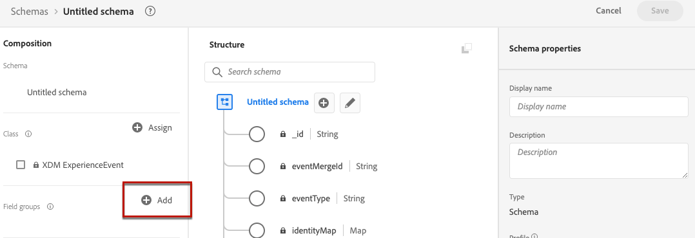

# 创建数据集以收集事件 {#create-dataset}

要收集体验事件，您首先需要创建一个将发送这些事件的数据集。

首先，创建将在您的数据集中使用的架构：

1. 从&#x200B;**[!UICONTROL 数据管理]**&#x200B;菜单中，选择&#x200B;**[!UICONTROL 架构]**。

1. 单击&#x200B;**[!UICONTROL 创建架构]**，在右上角选择&#x200B;**[!UICONTROL 体验事件]**，然后单击&#x200B;**下一步**。

   

   >[!NOTE]
   >
   >在[XDM系统概述文档](https://experienceleague.adobe.com/docs/experience-platform/xdm/home.html){target="_blank"}中了解有关XDM架构和字段组的更多信息。

1. 输入架构的名称和描述，然后单击&#x200B;**完成**。
   

1. 从左侧的&#x200B;**[!UICONTROL 字段组]**&#x200B;部分中，选择&#x200B;**[!UICONTROL 添加]**。

   

1. 在&#x200B;**[!UICONTROL 搜索]**&#x200B;字段中，键入“建议交互”。

1. 选择&#x200B;**[!UICONTROL 体验事件 — 建议交互]**&#x200B;字段组，然后单击&#x200B;**[!UICONTROL 添加字段组]**。

   

   >[!CAUTION]
   >
   >将在您的数据集中使用的架构必须具有与其关联的&#x200B;**[!UICONTROL 体验事件 — 建议交互]**&#x200B;字段组。 否则，您将无法在AI模型中使用它。

1. 保存架构。

>[!NOTE]
>
>了解有关在[架构组合基础知识](https://experienceleague.adobe.com/docs/experience-platform/xdm/schema/composition.html#understanding-schemas){target="_blank"}中构建架构的更多信息。

现在，您可以使用此架构创建数据集了。 为此，请执行以下步骤：

1. 从&#x200B;**[!UICONTROL 数据管理]**&#x200B;菜单中，选择&#x200B;**[!UICONTROL 数据集]**，然后转到&#x200B;**[!UICONTROL 浏览]**&#x200B;选项卡。

1. 单击&#x200B;**[!UICONTROL 创建数据集]**&#x200B;并选择&#x200B;**[!UICONTROL 从架构创建数据集]**。

   

1. 从列表中选择您刚创建的架构，然后单击&#x200B;**[!UICONTROL 下一步]**。

1. 在&#x200B;**[!UICONTROL 名称]**&#x200B;字段中提供数据集的唯一名称，然后单击&#x200B;**[!UICONTROL 完成]**。

   

>[!NOTE]
>
>现在可以选择此数据集在创建AI模型<!--add link to Creat AI models section-->时收集事件数据。
