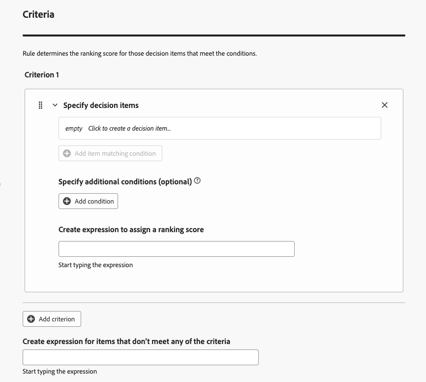
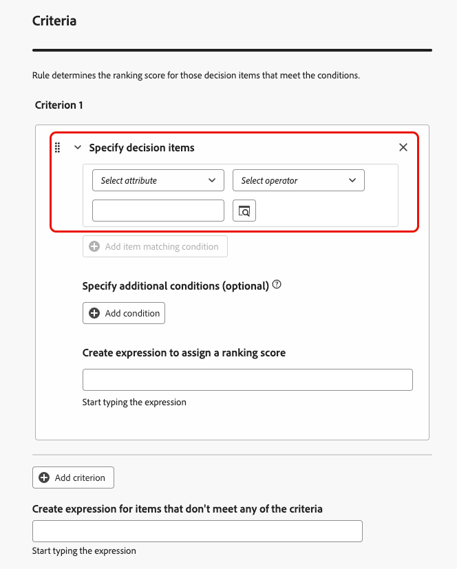
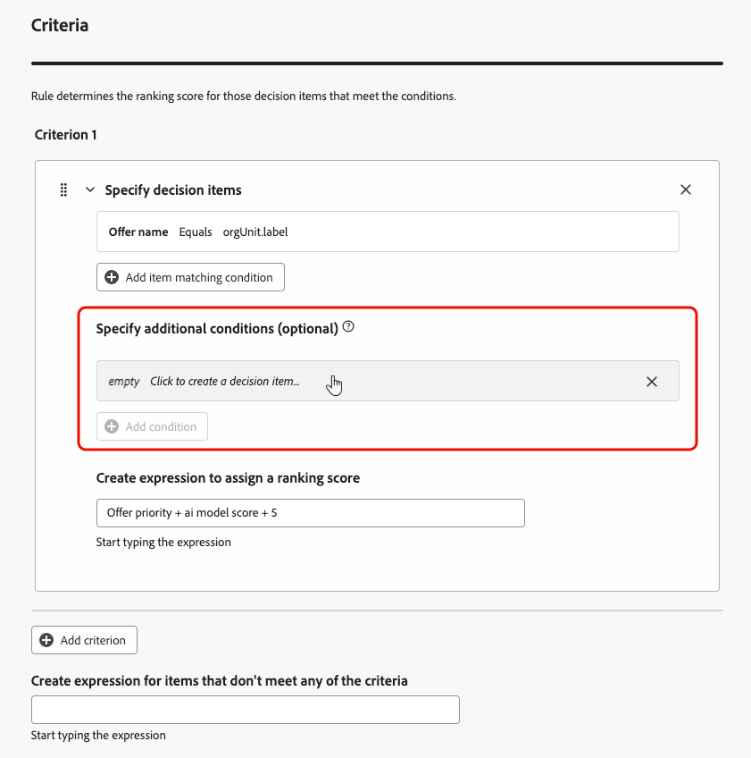

# 使用AI公式生成器 {#create-ranking-formulas}

**排名公式**&#x200B;允许您定义规则，这些规则将确定应首先显示哪个选件，而不是考虑优先级分数。

<!--In today's world, relevance demands more than static priorities.The new formula builder in **[!UICONTROL Adobe Journey Optimizer]** empowers marketers to dynamically rank offers by blending AI-driven model scores with business priorities, offer attributes, and contextual signals — no coding required.-->

要创建这些规则，**[!UICONTROL Adobe Journey Optimizer]**&#x200B;中的AI公式生成器在优惠的排名方面提供了更大的灵活性和控制力。 您现在可以定义自定义排名公式，这些公式通过引导式界面将AI模型分数、优惠优先级、配置文件属性、优惠属性和上下文信号组合在一起，而不是仅依赖静态优惠优先级。

此方法允许您根据AI驱动的倾向、业务价值和实时上下文的任意组合动态调整优惠排名，从而更轻松地使决策与营销目标和客户需求保持一致。 AI公式生成器支持简单公式或高级公式，具体取决于您要应用的控制量。

创建排名公式后，可将其分配给[选择策略](selection-strategies.md)。 使用此选择策略时，如果多个优惠都有资格显示，则决策引擎将使用所选的公式来计算首先交付哪个优惠。

## 创建排名公式 {#create-ranking-formula}

>[!CONTEXTUALHELP]
>id="ajo_exd_config_formulas"
>title="创建排名公式"
>abstract="利用公式，可定义规则以确定应首先显示哪个决策项，而不是考虑这些项目的优先级分数。 创建排名公式后，您可以将其分配给选择策略。"

要创建排名公式，请执行以下步骤。

1. 访问&#x200B;**[!UICONTROL 策略设置]**&#x200B;菜单，然后选择&#x200B;**[!UICONTROL 排名公式]**&#x200B;选项卡。 此时将显示之前创建的公式列表。

   

1. 单击&#x200B;**[!UICONTROL 创建公式]**。

1. 指定公式名称，并根据需要添加说明。

   {width="80%"}

1. （可选）单击&#x200B;**[!UICONTROL 选择AI模型]**&#x200B;以设置将用作构建排名公式的引用的模型。 每次在定义下面的公式时引用模型分数时，都将使用您选择的AI模型。

   >[!CAUTION]
   >
   >使用合并到排名公式中的AI模型时，数据未反映在保持和模型驱动流量的[转化率](../reports/campaign-global-report-cja-code.md#conversion-rate)报表中。

1. 定义条件以确定匹配决策项的排名分数。 您可以

   * 从[用户界面](#ranking-select-criteria)中填写&#x200B;**[!UICONTROL 标准]**&#x200B;部分，
   * 或切换到[代码编辑器](#ranking-code-editor)。

<!--## Select an ELS dataset {#els-dataset}

To leverage data from an AEP dataset, you can select it in the **[!UICONTROL ELS settings]** section.

1. Select an ELS dataset from the list.

1. Select a decision attribute. This action is mandatory.

{width="80%"}

-->

## 使用公式生成器定义标准 {#ranking-select-criteria}

借助直观的界面，您可以通过单独或合并调整AI分数（倾向）、选件价值（优先级）、上下文杠杆和外部配置文件倾向来优化决策，以优化每次交互。<!--Whether you're maximizing revenue, promoting strategic offers, or balancing business goals with real-time context, the formula builder gives you total control in defining ranking strategies.-->

要直接从界面定义标准，请执行以下步骤。

<!--{width="80%"}-->

1. 在&#x200B;**[!UICONTROL 标准1]**&#x200B;部分中，通过执行以下操作指定要对其应用排名分数的决策项：
   * 选择[决策项属性](items.md#attributes)，
   * 选择逻辑运算符，
   * 添加匹配条件 — 您可以键入值、选择配置文件属性或[上下文数据](context-data.md)。

   {width="70%"}

   <!--You can refer to [offer attributes](items.md#attributes), profile attributes, or [context data](context-data.md).-->

1. （可选）您可以指定其他元素以将标准的匹配条件细化为true。

   {width="80%"}

   例如，您定义了条件1，例如&#x200B;*天气*&#x200B;自定义属性&#x200B;*等于*&#x200B;温暖&#x200B;*条件。*&#x200B;此外，您可以添加其他条件，例如，如果满足第一个条件，并且在发出请求时温度超过75度，则标准1为true。<!--Add a screenshot with the example-->

1. 创建表达式，将排名得分分配给满足上述定义条件的决策项。 您可以引用以下任意一项：

   * 来自您在&#x200B;**[!UICONTROL 详细信息]** [以上](#create-ranking-formula)部分中选择的AI模型的得分；
   * 决策项的优先级，该优先级是在[创建决策项](items.md#attributes)时手动分配的值；<!--If a profile qualifies for multiple decision items, a higher priority grants the item precedence over others.-->
   * 个人资料上可能存在的任何属性，如任何外部派生的倾向分数；
   * 可以自由格式分配的静态值；
   * 以上任意组合。

   {width="70%"}

   >[!NOTE]
   >
   >单击字段旁边的图标以添加预定义变量。

1. 单击&#x200B;**[!UICONTROL 添加条件]**&#x200B;可根据需要多次添加一个或多个条件。 其逻辑如下：
   * 如果第一个标准对于给定的决策项为true，则它优先于下一个标准。
   * 如果不为true，则决策引擎将转到第二个标准，依此类推。

1. 在最后一个字段中，您可以构建一个表达式，该表达式将分配给不符合上述条件的所有决策项。

   {width="70%"}

1. 单击&#x200B;**[!UICONTROL 创建]**&#x200B;以完成排名公式。 您现在可以从列表中选择该列表以查看其详细信息，然后对其进行编辑或删除。 它可用于[选择策略](selection-strategies.md)中，为符合条件的决策项排名。

### 排名公式示例

请参考下面的示例：<!--To be checked by PM-->

{width="80%"}

如果决策项目的区域（自定义属性）等于用户档案的地理标签（用户档案属性），则此处表示的排名分数（决策项目优先级、AI模型分数和静态值的组合）将应用于满足该条件的所有决策项目。

## 使用代码编辑器 {#ranking-code-editor}

若要以&#x200B;**PQL语法**&#x200B;表达排名公式，请使用屏幕右上角的专用按钮切换到代码编辑器。 有关如何使用PQL语法的更多信息，请参阅[专用文档](https://experienceleague.adobe.com/docs/experience-platform/segmentation/pql/overview.html?lang=zh-Hans)。

>[!CAUTION]
>
>此操作将阻止您返回此公式的默认生成器视图。

然后，您可以利用配置文件属性、[上下文数据](context-data.md)和[决策项属性](items.md#attributes)。

例如，如果实际天气炎热，您希望使用“hot”属性提高所有选件的优先级。 为此，在决策调用中传递了&#x200B;**contextData.weather=hot**。<!--[Learn how to work with context data](context-data.md)-->

{width="80%"}

>[!IMPORTANT]
>
>创建排名公式时，不支持回顾以前的时间段，例如将上个月内发生的体验事件添加为公式的组件。 在公式创建期间任何包含回顾期间的尝试将在保存公式时触发错误。

### 排名公式PQL示例 {#ranking-formula-examples}

您可以根据需要创建许多不同的排名公式。 以下是一些示例。

+++根据配置文件属性，提升具有特定选件属性的选件

如果配置文件住在选件对应的城市，则将该城市中所有选件的优先级加倍。

**排名公式：**

```
if( offer.characteristics.get("city") = homeAddress.city, offer.rank.priority * 2, offer.rank.priority)
```

+++

+++结束日期距现在不到24小时的Boost优惠

**排名公式：**

```
if( offer.selectionConstraint.endDate occurs <= 24 hours after now, offer.rank.priority * 3, offer.rank.priority)
```

+++

+++根据客户购买所提供产品的倾向提升优惠内容

您可以根据客户倾向得分提高选件的得分。

在此示例中，实例租户是&#x200B;*_salesvelocity*，并且配置文件架构包含存储在数组中的分数范围：


因此，对于用户档案，例如：

```
{"_salesvelocity": {"individualScoring": [
                    {"core": {
                            "category":"insurance",
                            "propensityScore": 96.9
                        }},
                    {"core": {
                            "category":"personalLoan",
                            "propensityScore": 45.3
                        }},
                    {"core": {
                            "category":"creditCard",
                            "propensityScore": 78.1
                        }}
                    ]}
}
```

+++

+++根据上下文数据提升优惠{#context-data}

[!DNL Journey Optimizer]允许您根据调用中传递的上下文数据提升某些选件。 例如，如果传递了`contextData.weather=hot`，则必须提升所有带`attribute=hot`的选件的优先级。 有关如何使用&#x200B;**Edge Decisioning**&#x200B;和&#x200B;**Decisioning** API传递上下文数据的详细信息，请参阅[此部分](context-data.md)

请注意，在使用&#x200B;**Decisioning** API时，上下文数据将添加到请求正文中的配置文件元素，如下面的示例所示。

```
"xdm:profiles": [
{
    "xdm:identityMap": {
        "crmid": [
            {
            "xdm:id": "CRMID1"
            }
        ]
    },
    "xdm:contextData": [
        {
            "@type":"_xdm.context.additionalParameters;version=1",
            "xdm:data":{
                "xdm:weather":"hot"
            }
        }
    ]
    
}],
```

+++

