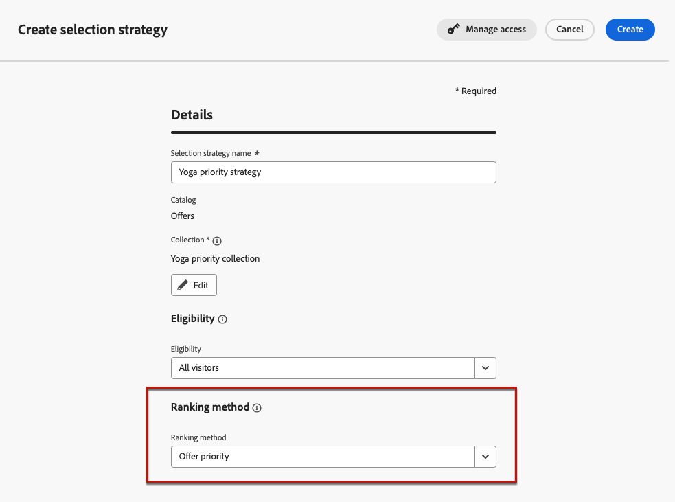
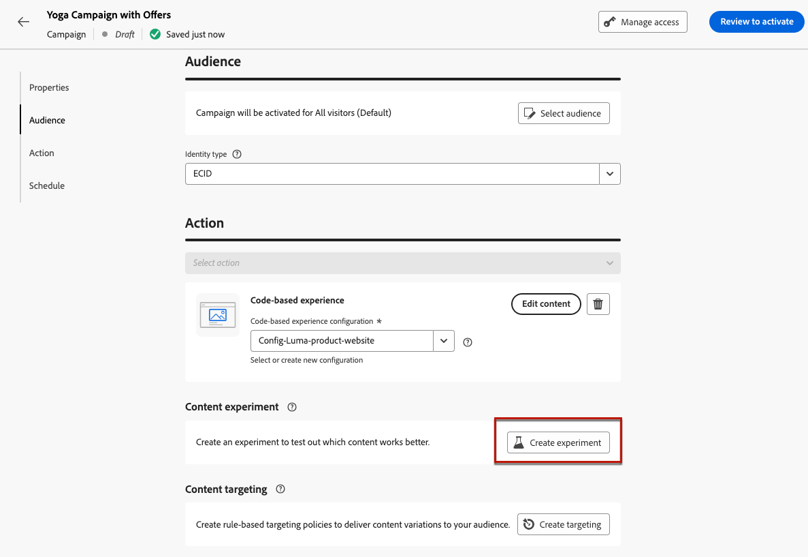

# 决策用例 {#experience-decisioning-uc}

此用例展示了将Decisioning用于基于[!DNL Journey Optimizer]代码的渠道所需的所有步骤。

<!--In this use case, you create a campaign where you define two delivery treatments - each containing a different decision policy in order to measure which one performs best for your target audience.-->

在此使用案例中，您不确定特定排名公式的性能是否优于预先分配的选件优先级。

要测量哪个对象对目标受众的效果最佳，请使用[内容实验](../content-management/content-experiment.md)创建一个营销活动，其中定义了两种投放处理：

<!--Set up the experiment such that:-->

* 第一种处理包含一种优先选择策略作为排名方法。
* 第二种处理包含不同的选择策略，其公式为排名方法。

## 创建选择策略

首先，需要构建两种选择策略：一种使用优先级作为排名方法，另一种使用公式作为排名方法。

### 创建第一个选择策略

在第一个选择策略中，选择优先级作为排名方法。 请按照以下步骤操作。

1. 创建决策项。 [了解如何操作](items.md)

1. 将决策项的&#x200B;**[!UICONTROL Priority]**&#x200B;设置为与其他项相比。 如果配置文件符合多个项目的条件，则较高的优先级会授予该项目优先于其他项目的权限。

   

   >[!NOTE]
   >
   >优先级是integer数据类型。 整数数据类型的所有属性都应包含整数值（无小数）。

1. 设置决策项目的资格：

   * 定义受众或规则，将项目限制为仅访问特定用户档案。 [了解详情](items.md#eligibility)

   * 设置上限规则以定义可显示优惠的最大次数。 [了解详情](items.md#capping)

1. 如果需要，请重复上述步骤以创建其他决策项目。

1. 创建包含决策项的&#x200B;**收藏集**。 [了解详情](collections.md)

1. 创建[选择策略](selection-strategies.md#create-selection-strategy)并选择包含要考虑的选件的[收藏集](collections.md)。

1. [选择排名方法](#select-ranking-method)，用于为每个配置文件选择最佳选件。

   在这种情况下，选择&#x200B;**[!UICONTROL 优惠优先级]**：如果多个优惠符合此策略的条件，则决策引擎将在优惠中使用设置为&#x200B;**[!UICONTROL 优先级]**&#x200B;的值。 [了解详情](selection-strategies.md#offer-priority)

   

### 创建第二个选择策略

在第二个选择策略中，选择一个公式作为排名方法。 请按照以下步骤操作。

1. 创建决策项。 [了解如何操作](items.md)

<!--1. Set the same **[!UICONTROL Priority]** as for the first decision item. TBC?-->

1. 设置决策项目的资格：

   * 定义受众或规则，将项目限制为仅访问特定用户档案。 [了解详情](items.md#eligibility)

   * 设置上限规则以定义可显示优惠的最大次数。 [了解详情](items.md#capping)

1. 如果需要，请重复上述步骤以创建其他决策项目。

1. 创建包含决策项的&#x200B;**收藏集**。 [了解详情](collections.md)

1. 创建[选择策略](selection-strategies.md#create-selection-strategy)并选择包含要考虑的选件的[收藏集](collections.md)。

1. [选择要用于为每个配置文件选择最佳选件的排名方法](#select-ranking-method)。

   在这种情况下，选择&#x200B;**[!UICONTROL 公式]**&#x200B;以使用特定的计算得分来选择要投放的合格优惠。 [了解详情](selection-strategies.md#ranking-formula)

   

## 构建基于代码的体验营销活动

<!--To present the best dynamic offer and experience to your visitors on your website or mobile app, add a decision policy to a code-based campaign.

Define two delivery treatments each containing a different decision policy.-->

配置这两个选择策略后，请创建一个基于代码的体验营销活动，您可以在其中为每个策略定义不同的处理方式，以比较哪个策略的表现最佳。

1. 创建营销活动，然后选择&#x200B;**[!UICONTROL 基于代码的体验]**&#x200B;操作。 [了解详情](../code-based/create-code-based.md)

1. 在营销活动摘要页面中，单击&#x200B;**[!UICONTROL 创建试验]**&#x200B;以开始配置内容试验。 [了解详情](../content-management/content-experiment.md)

   

1. 单击&#x200B;**[!UICONTROL 编辑内容]**。

<!--1. Sart personalizing **Treatment A** by clicking **[!UICONTROL Create]**.

    -->

1. 从内容编辑窗口中，通过单击&#x200B;**[!UICONTROL 编辑代码]**&#x200B;开始个性化&#x200B;**处理A**。

   

1. 选择&#x200B;**[!UICONTROL 决策策略]**，单击&#x200B;**[!UICONTROL 添加决策策略]**&#x200B;并填写决策详细信息。 [了解详情](create-decision.md)

   

1. 选择您创建的第一个策略。 单击&#x200B;**[!UICONTROL 添加策略]**。

1. 单击&#x200B;**[!UICONTROL 创建]**。新决策已添加到&#x200B;**[!UICONTROL 决策]**&#x200B;下。

   

1. 单击“更多操作”图标（三个圆点）并选择&#x200B;**[!UICONTROL 添加]**。 现在，您可以向其中添加所需的所有决策属性。

   

1. 您还可以添加个性化编辑器中可用的任何其他属性，例如配置文件属性。

   

1. 从内容版本窗口中，选择&#x200B;**处理B**，然后重复上述步骤以创建另一个决策策略并选择您创建的第二个选择策略。

   

1. 保存您的内容。
