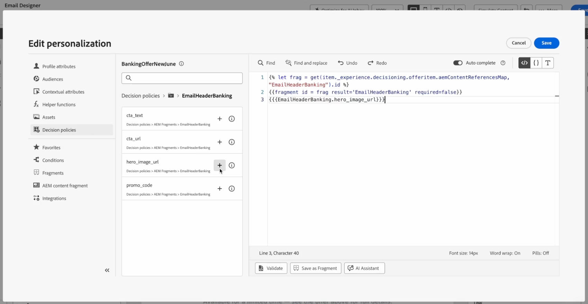

# 在决策策略中利用片段 {#fragments}

>[!BEGINSHADEBOX]

**在此页面上：**&#x200B;在决策策略中利用Journey Optimizer内容片段和AEM内容片段，以便您能够个性化和优化跨渠道的内容决策。

>[!ENDSHADEBOX]

决策项目支持两种类型的片段内容，在决策策略中创作消息时可以利用这些内容：

* **Journey Optimizer内容片段** — 在Journey Optimizer中创建的可重用表达式片段，并已添加到决策项的&#x200B;**[!UICONTROL 片段]**&#x200B;部分。 [了解有关AJO内容片段的更多信息](../content-management/fragments.md)
* **AEM内容片段** — 在Adobe Experience Manager中创作、映射到决策项的属性并在个性化编辑器中按键名选择的内容。 [了解如何将AEM内容片段关联到决策项](items.md#aem-fragments)

## Journey Optimizer内容片段 {#ajo-fragments}

如果您的决策策略包含决策项目，包括AJO内容片段，则在决策策略内跨所有可用决策渠道（基于代码的体验、电子邮件、推送、短信和历程）创作消息时，您可以利用这些片段。

例如，假设您要为多个移动设备型号显示不同的内容。 将指定的片段（每个片段属于不同的电话型号）添加到您在决策策略中使用的决策项目中。 [了解如何将片段添加到决策项](items.md#attributes)。

决策项的{width=70%}

完成后，您可以使用以下任一方法：

>[!BEGINTABS]

>[!TAB 直接插入代码]

只需将下面的代码块复制并粘贴到决策策略代码中。 将`variable`替换为片段ID，将`placement`替换为片段引用键：

```handlebars

{{fragment id = variable required=false}}
```

>[!TAB 按照详细步骤操作]

1. 导航到&#x200B;**[!UICONTROL 帮助程序函数]**&#x200B;并将&#x200B;**Let**&#x200B;函数` {{variable}}`添加到代码窗格，您可以在代码窗格中声明片段的变量。

   

1. 使用&#x200B;**Map** > **Get**&#x200B;函数``构建表达式。 映射是决策项中引用的片段。 该字符串可以是您在决策项中输入的设备模型，作为&#x200B;**[!UICONTROL 片段引用键]**。

   

1. 您还可以使用上下文属性，该属性将包含此设备型号ID。

   

1. 添加您为片段选择的变量作为片段ID。

   从决策策略代码中的决策项设置的

>[!ENDTABS]

将从决策项的&#x200B;**[!UICONTROL 片段]**&#x200B;部分中选择片段ID和引用键。

>[!WARNING]
>
>如果片段键不正确或片段内容无效，渲染可能会失败并在Edge调用中导致错误。
>
>为了避免在片段暂时不可用时失败，使用了`required=false`标志，因此跳过了片段。 [了解有关暂时不可用片段的更多信息](#temporary-unavailable-fragments)

### 使用和护栏 {#fragments-guardrails}

以下护栏专门应用于决策项中使用的&#x200B;**AJO内容片段**。

+++在电子邮件中模拟内容和表达式片段

对于&#x200B;**电子邮件**&#x200B;渠道，当您&#x200B;**[!UICONTROL 发送验证]**&#x200B;或激活营销活动时，与决策项关联的表达式片段正确显示。 但是，**[!UICONTROL 模拟内容]**&#x200B;不显示决策项中的表达式片段。

+++

+++电子邮件中的可视化片段和决策项

您无法将&#x200B;**[!UICONTROL 可视化片段]**&#x200B;分配给决策项，此上下文中仅支持&#x200B;**表达式片段**。

+++

+++决策项和上下文属性

默认情况下，[!DNL Journey Optimizer]片段不支持决策项属性和上下文属性。 但是，您可以改用全局变量，如下所述。

假设您要在片段中使用&#x200B;*sport*&#x200B;变量。

1. 在片段中引用此变量，例如：

   ```text
   Elevate your practice with new {{sport}} gear!
   ```

1. 在决策策略块中使用&#x200B;**Let**&#x200B;函数定义变量。 在以下示例中，*sport*&#x200B;是使用决策项属性定义的：

   ```handlebars
   {#each decisionPolicy.13e1d23d-b8a7-4f71-a32e-d833c51361e0.items as |item|}}
   
   {{fragment id = get(item._experience.decisioning.offeritem.contentReferencesMap, "placement1").id }}
   {{/each}}
   ```

+++

+++决策项片段内容验证

* 由于这些片段的动态性质，在营销活动中使用时，会为决策项目中引用的片段跳过在营销活动内容创建期间的消息验证。

* 片段内容的验证仅在片段创建和发布期间进行。

* 对于JSON类型的表达式片段，在保存片段时会语法验证内容。 验证错误显示为警报。

在运行时，将验证营销活动内容（包括决策项中的片段内容）。 如果验证失败，则不会呈现营销活动。

+++

+++已跳过暂时不可用的片段{#temporary-unavailable-fragments}

当历程或营销活动引用附加到决策项的片段时，在更新的片段在Edge上可用之前可能会有短暂的同步延迟。

为避免在片段暂时不可用时失败，片段现在默认将`required`标志设置为`false`，以便跳过这些片段，而不是导致历程或营销活动失败。

这意味着如果片段在Edge上暂时不可用，则忽略该片段即可。 如果片段可用，它将正常呈现。

**示例**

如果您的决策策略符合两个优惠的条件，并且每个优惠都有片段，例如“20%优惠”和“30%优惠”，但第二个片段暂时不可用，因为`required=false`，系统将呈现可用优惠（20%优惠）并跳过另一个片段（30%优惠），而不是导致历程或营销活动失败。 这提高了内容仍在同步时的可靠性。

+++

>[!NOTE]
>
>您仍然可以通过将`required`标志设置为`true`来将片段标记为必需。 但是，如果片段暂时缺失，可能会导致历程或营销活动渲染失败。

## AEM内容片段 {#aem-fragments-decisioning}

>[!AVAILABILITY]
>
>此功能适用于支持Decisioning的出站渠道。

在决策策略中使用AEM内容片段之前，请确保您具有：

* 您在Adobe Experience Manager中创建了您的内容片段并使用`ajo-enabled:{OrgId}/{SandboxName}`进行了标记，以便它可由Journey Optimizer发现。 [了解如何创建和分配标记](../integrations/aem-fragments.md#create-tag)
* 通过为片段分配唯一的引用名称，将其绑定到选件项的&#x200B;**[!UICONTROL AEM片段]**&#x200B;部分。 [了解如何将AEM内容片段关联到决策项](items.md#attributes)

在个性化编辑器中，与策略选择的决策项目关联的所有AEM内容片段均可用。 每个片段密钥名称显示一个文件夹。

➡️ [了解如何在视频中将AEM内容片段与Journey Optimizer决策结合使用](#video)

在此示例中，决策策略包含两个决策项，这些决策项的AEM片段通过其引用名称关联到它们。


1. 单击+按钮以将所需片段添加到表达式中。

   由于单个引用名称可能具有多个跨不同选件项目捆绑的片段，因此Decisioning会根据决策策略的排名标准确定要交付给每个客户的最佳片段。

1. 选择片段后，您可以利用其属性（如图像URL、文本字段或其他内容），并使用Decisioning在正确的时间向正确的客户呈现正确的内容。

   

1. 在激活营销活动或历程之前，请使用任一模拟方法预览AEM内容片段字段值的呈现方式。 [了解有关模拟内容的更多信息](../content-management/preview-test.md)

### 跨渠道使用AEM内容片段 {#aem-fragments-channels}

从决策策略插入AEM内容片段属性的方式取决于您使用的渠道。

>[!BEGINTABS]

>[!TAB 电子邮件]

要使用决策策略将AEM内容片段属性插入电子邮件，请执行以下操作：

1. 在Email Designer中打开电子邮件草稿，然后单击右边栏中的&#x200B;**[!UICONTROL 决策]**&#x200B;图标以打开决策策略面板。
1. 选择您组装的选择策略并指定&#x200B;**投放位置**&#x200B;以定义将填充选件的电子邮件区域。
1. 单击&#x200B;**+**&#x200B;图标并从应呈现在该区域的AEM内容片段中选择特定字段 — 例如，主页图像URL字段。

   

1. 发布之前，请单击&#x200B;**[!UICONTROL 模拟内容]**&#x200B;以预览结果，并验证最高优先级的选件及其内容片段是否按预期呈现测试配置文件。

>[!TAB 基于代码的体验(JSON)]

构建基于JSON的代码型体验时，使用以下结构从决策策略中呈现AEM内容片段属性。

```handlebars
[
{{#each decisionPolicy.YOUR_POLICY_ID.items as |item|}}

{{fragment id = frag result='YOUR_REFERENCE_KEY' required=false}}
{
  "fieldName": "{{{YOUR_REFERENCE_KEY.fieldName}}}"
},
{{/each}}
]
```

>[!NOTE]
>
>AEM内容片段使用`aemContentReferencesMap`按引用键查找片段。 这与用于Journey Optimizer内容片段的`contentReferencesMap`不同。

构建JSON有效负载时，请牢记以下几点：

* 将JSON数组括号`[`和`]`放在`#each`循环的&#x200B;**外部**&#x200B;处。
* 对JSON字符串中的字段值使用&#x200B;**三括号** `{{{ }}}`可防止HTML转义特殊字符并确保有效的JSON输出。
* `result='YOUR_REFERENCE_KEY'`参数捕获该名称下的已解析片段内容，以便您可以使用`YOUR_REFERENCE_KEY.fieldName`引用其字段。


>[!TAB 基于代码的体验(HTML)]

对于基于HTML的代码体验，请使用标准双大括号进行字段渲染：

```handlebars
{{#each decisionPolicy.YOUR_POLICY_ID.items as |item|}}

{{fragment id = frag result='YOUR_REFERENCE_KEY' required=false}}
<div>{{YOUR_REFERENCE_KEY.fieldName}}</div>
{{/each}}
```

>[!ENDTABS]

### 使用AEM内容片段中的资源 {#aem-cf-assets}

AEM内容片段可能包含引用存储在AEM中的资源的图像字段。 由于Journey Optimizer仅接收这些资源的&#x200B;**相对路径**，因此除非在前端追加完整发布URL，否则无法加载图像。

>[!NOTE]
>
>尚不支持对内容片段中的AEM资源引用进行本机解析。 在添加该支持之前，可以使用以下方法。

>[!BEGINTABS]

>[!TAB 在AEM发布域之前添加]

1. 从您的AEM实例URL中，识别作者域，例如`author-p12345-e67890.adobeaemcloud.com`。

   

1. 将`author`替换为`publish`以获取发布域： `publish-p12345-e67890.adobeaemcloud.com`。

1. 在Journey Optimizer个性化编辑器中，将该发布域附加到内容片段中的资源引用字段之前。

   

现在，图像将在投放时解析为完整发布URL。

>[!TAB 将发布URL存储在文本字段中]

1. 在AEM中打开内容片段。
1. 转到JSON预览并检查&#x200B;**引用**&#x200B;部分以查找已发布的资源URL。

   

1. 复制发布URL并将其粘贴到内容片段内的专用文本字段中。

   

1. 在Journey Optimizer中，直接引用文本字段作为个性化表达式中的图像源。

   

此方法可避免手动URL构建，并将发布URL保留在内容片段本身中。

>[!ENDTABS]

## 操作方法视频 {#video}

了解如何将Adobe Experience Manager内容片段与Journey Optimizer Decisioning结合使用来个性化和优化内容。

>[!VIDEO](https://video.tv.adobe.com/v/3492223/?captions=chi_hans&learn=on&enablevpops)
