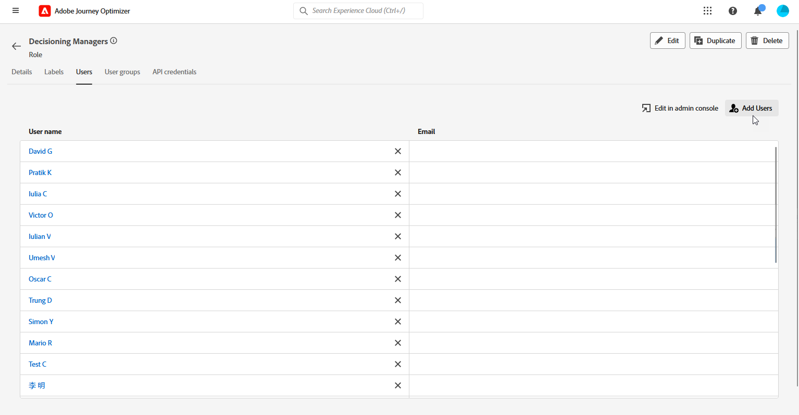

# 决策快速入门 {#get-started-experience-decisioning}

>[!CONTEXTUALHELP]
>id="ajo_email_enable_experience_decisioning"
>title="决策是什么？"
>abstract="决策是除了决策管理以外的一个新工具，它从决策引擎中挑选出最好的一项并传递给每个人。需要额外进行设置才能使用它。"

## 什么是决策 {#about}

通过提供称为“决策项”的集中式营销产品建议目录和复杂的决策引擎，决策简化了个性化流程。此引擎利用规则和排名标准来选择最相关的决策项并将其呈现给每个人。

这些决策项目通过[新的基于代码的体验渠道](../code-based/get-started-code-based.md)无缝集成到各种集客界面中，可在Journey Optimizer营销活动中访问。

>[!IMPORTANT]
>
>决策决策策略仅在基于代码的体验营销活动中可用。

➡️本节[中介绍了一个端到端用例，其中说明了如何通过基于代码的体验渠道创建决策并将其用于内容试验。](experience-decisioning-uc.md)

## 决策关键步骤 {#steps}

使用Decisioning的主要步骤如下：

1. **分配适当的权限**。 决策仅适用于具有决策相关&#x200B;**[!UICONTROL 角色]**&#x200B;访问权限的用户，例如决策管理员。 如果您无法访问Decisioning，则必须扩展您的权限。

   +++了解如何分配决策管理者角色

   1. 要向[!DNL Permissions]产品中的用户分配角色，请导航到&#x200B;**[!UICONTROL 角色]**&#x200B;选项卡，然后选择决策管理器。

      

   1. 在&#x200B;**[!UICONTROL 用户]**&#x200B;选项卡中，单击&#x200B;**[!UICONTROL 添加用户]**。

      

   1. 输入您的用户名或电子邮件地址，或从列表中选择用户并单击&#x200B;**[!UICONTROL 保存]**。

      如果之前没有创建用户，请参阅[有关添加用户的文档](https://experienceleague.adobe.com/zh-hans/docs/experience-platform/access-control/ui/users)。

      

   随后，您的用户将收到一封重定向到您的实例的电子邮件。

   +++

1. **配置自定义属性**：通过在目录架构中设置自定义属性，根据特定要求定制项目目录。

   ➡️ [了解如何配置项目目录](catalogs.md)

1. **创建决策项**&#x200B;以向您的目标受众显示。

   ➡️ [&#128279;](items.md)了解如何在用户界面（以及[API文档](api-reference/decisions-items/create.md)）中创建决策项

1. **使用收藏集组织**：使用收藏集根据基于属性的规则对决策项进行分类。 将集合纳入您的选择策略，以确定应考虑的决策项目集合。

   ➡️ [&#128279;](collections.md)了解如何在用户界面（以及[API文档](api-reference/items-collections/create.md)）中管理项目集合

1. **创建决策规则**：决策项和/或选择策略中使用决策规则来确定可以将决策项显示给谁。

   ➡️ [了解如何创建决策规则](rules.md)

1. **实施排名方法**：创建排名方法并在选择策略中应用它们以确定选择决策项的优先级顺序。

   ➡️ [了解如何创建排名方法](ranking.md)

1. **创建选择策略**：构建选择策略，该策略利用收藏集、决策规则和排名方法来识别适合显示到用户档案的决策项目。

   ➡️ [了解如何在用户界面的用户界面](selection-strategies.md)中创建选择策略（以及在[API文档](api-reference/selection-strategies/create.md)中）

1. **创建决策策略并将其嵌入基于代码的营销活动**：决策策略将多个选择策略相结合，以确定要向目标受众显示的合格决策项。

   ➡️ [了解如何使用决策策略](create-decision.md)
➡️要通过基于代码的体验渠道成功投放选件，请按照[此部分](../code-based/code-based-implementation-samples.md)中的实施步骤操作。

