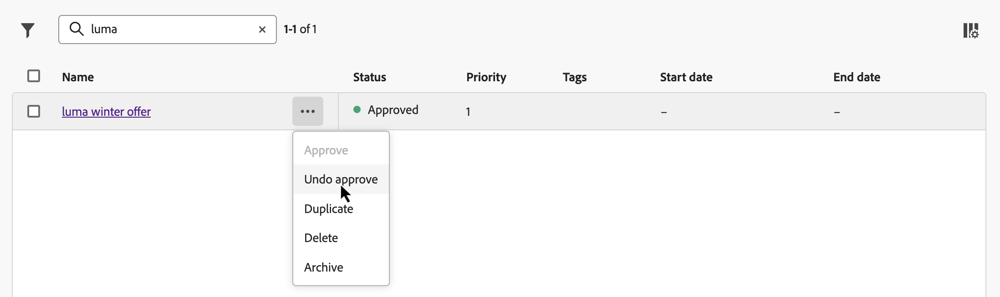

# 创建您的第一个决策项 {#items}

>[!CONTEXTUALHELP]
>id="ajo_exd_items"
>title="管理决策项"
>abstract="通过 Journey Optimizer，可创建营销产品建议（称为决策项）并将其整理到集中目录和收藏集中。目前，所有创建的决策项都会被合并到一个“产品建议”目录中。在此屏幕中，您还可以使用&#x200B;**编辑架构**&#x200B;按钮访问该目录的架构，并为您的决策项创建自定义属性。"

通过 Journey Optimizer，可创建营销产品建议（称为决策项）并将其整理到集中目录和收藏集中。它们由旨在精确满足您需求的标准和自定义属性组成。 此外，它们包含配置文件约束，允许您定义决策项目可以显示给谁。

在创建决策项之前，如果要设置条件以确定决策项可以显示给谁，请确保已创建了&#x200B;**决策规则**。 [了解如何创建决策规则](rules.md)。

要创建决策项，请导航到&#x200B;**[!UICONTROL 决策]** > **[!UICONTROL 目录]**，单击&#x200B;**[!UICONTROL 创建项]**，然后按照以下部分中详述的步骤操作。

## 定义决策项的属性 {#attributes}

>[!CONTEXTUALHELP]
>id="ajo_exd_item_priority"
>title="定义决策项的优先级"
>abstract="如果一个轮廓符合多项的条件，则可通过优先级比较此决策项与其他决策项。较高的优先级使该项优先于其他项。"

首先定义决策项的标准和自定义属性：

1. 提供名称和描述。
1. 指定开始日期和结束日期。 在此类日期内，项目仅由决策引擎考虑。
1. 设置决策项的&#x200B;**[!UICONTROL 优先级]**（如果配置文件符合多个项的条件）。 较高的优先级使该项优先于其他项。

   >[!NOTE]
   >
   >优先级是integer数据类型。 整数数据类型的所有属性都应包含整数值（无小数）。

1. **标记**&#x200B;字段允许您将Adobe Experience Platform统一标记分配给决策项目。 这使您能够轻松分类这些分类并改进搜索。 [了解如何使用标记](../start/search-filter-categorize.md#tags)

1. 使用片段向决策项目添加多个内容 — 例如，如果您想为多个移动设备型号显示不同的内容。 [了解有关片段的更多信息](../content-management/fragments.md)

   >[!AVAILABILITY]
   >
   >决策项中的片段当前仅适用于一组组织（限量发布）。 有关更多信息，请与您的 Adobe 代表联系。

   在&#x200B;**[!UICONTROL 片段]**&#x200B;部分中，选择要使用的已发布片段并为其分配参考键。 然后，您可以在决策策略中利用这些片段。 [了解如何操作](create-decision.md#fragments)

   {width=70%}

   您只能选择已发布的片段，并在决策项中最多添加六个片段。

   >[!WARNING]
   >
   >当前仅支持[表达式片段](../personalization/use-expression-fragments.md)。
   >
   >无法使用嵌套片段（引用其他片段的片段）。 如果添加此类片段，决策项的[审批](#approve)将失败。

1. 指定自定义属性（可选）。 自定义属性是根据您的需求定制的特定属性，您可以将其分配给决策项。它们在决策项的目录架构中定义。 [了解如何使用目录](catalogs.md)

1. 定义决策项的属性后，单击&#x200B;**[!UICONTROL 下一步]**。

## 配置决策项的资格 {#eligibility}

>[!CONTEXTUALHELP]
>id="ajo_exd_item_constraints"
>title="添加受众或决策规则"
>abstract="默认情况下，所有轮廓都有资格接收决策项，但您可使用受众或规则仅限特定轮廓可接收该项。"

<!--
>"additional-url="https://experienceleague.adobe.com/en/docs/journey-optimizer/using/audiences-profiles-identities/audiences/about-audiences" text="Use audiences"
>additional-url="https://experienceleague.adobe.com/en/docs/journey-optimizer/using/decisioning/experience-decisioning/rules" text="Use decision rules"
-->

默认情况下，所有用户档案都有资格接收决策项目，但您可以使用受众或规则将项目限制为仅特定用户档案，这两个解决方案都对应于不同的使用情况。 有关详细信息，请展开以下部分：

+++使用受众与决策规则

基本上，受众的输出是一个用户档案列表，而决策规则是在决策过程中根据请求对单个用户档案执行的函数。

* **受众**：一方面，受众是一组Adobe Experience Platform配置文件，它们根据配置文件属性和体验事件与特定逻辑匹配。 但是，选件管理不会重新计算受众，它在呈现选件时可能不是最新的。

* **决策规则**：另一方面，决策规则基于Adobe Experience Platform中的可用数据，并确定可向谁显示优惠。 在给定投放位置的优惠或决策中选择优惠后，每次做出决策时都会执行规则，从而确保每个用户档案都获得最新和最佳优惠。

+++

* 要将决策项的呈现方式限制为一个或多个Adobe Experience Platform受众的成员，请选择&#x200B;**[!UICONTROL 属于一个或多个受众的访客]**&#x200B;选项，然后从左窗格中添加一个或多个受众，并使用&#x200B;**[!UICONTROL And]** / **[!UICONTROL Or]**&#x200B;逻辑运算符组合这些受众。 [了解有关受众](../audience/about-audiences.md)的更多信息

* 要将特定决策规则关联到决策项，请选择&#x200B;**[!UICONTROL 按规则]**，然后将所需规则从左侧窗格拖到中心区域。 [了解有关决策规则的更多信息](rules.md)

在选择受众或决策规则时，您可以看到有关预计的合格用户档案的信息。 单击&#x200B;**[!UICONTROL 刷新]**&#x200B;以更新数据。

>[!NOTE]
>
>当规则参数包含不在配置文件中的数据（如上下文数据）时，配置文件估计不可用。 例如，资格规则要求当前天气为≥80度。

## 设置上限规则 {#capping}

>[!CONTEXTUALHELP]
>id="ajo_exd_item_capping_expression"
>title="表达式"
>abstract="您可以定义自己的表达式，而不是使用一个静态值作为上限阈值。这样您就可以使用决策属性和/或 Adobe Experience Platform 数据集中的外部属性动态计算阈值。  上限规则&#x200B;**表达式**&#x200B;目前仅向所有用户有限提供。它们仅支持&#x200B;**[!UICONTROL 总计]**&#x200B;上限类型。"

上限用作约束，以定义优惠项可以呈现的最大次数。 通过限制用户获得特定优惠的次数，您可以避免过度向客户提供报价，从而使用最佳优惠优化每个接触点。 您最多可以为给定决策项创建10个上限。

>[!NOTE]
>
>
>更新上限计数器值最多可能需要3秒。 例如，假设您正在网站上显示一个展示选件的Web横幅。 如果给定用户在不到3秒内浏览到您网站的下一个页面，则该用户的计数器值将不会递增。

配置上限规则时，您可以引用存储在Adobe Experience Platform数据集中的属性来定义阈值。 要使用数据集，请在&#x200B;**[!UICONTROL 数据集]**&#x200B;节中选择它。

>[!NOTE]
>
>此功能当前以受限可用性提供给所有用户。 有关如何使用该数据的详细信息，请参阅此部分：[将Adobe Experience Platform数据用于决策](../experience-decisioning/aep-data-exd.md)

要为决策项设置上限规则，请单击&#x200B;**[!UICONTROL 创建上限]**&#x200B;按钮，然后执行下面详述的步骤。

1. 定义将考虑哪个&#x200B;**[!UICONTROL 上限事件]**&#x200B;以增加计数器。

   * **[!UICONTROL 决策事件]**（默认值）：可显示优惠的最大次数。
   * **[!UICONTROL 展示]** （仅限入站渠道）：可以向用户显示优惠的最大次数。
   * **[!UICONTROL 点击次数]**：用户可以点击决策项的最大次数。
   * **[!UICONTROL 自定义事件]**：您可以定义一个自定义事件，用于限制发送该项的次数。 例如，您可以限制赎回次数，直到它们等于10,000，或者直到给定用户档案赎回了1次。 为此，请使用[Adobe Experience Platform XDM](https://experienceleague.adobe.com/docs/experience-platform/xdm/home.html){target="_blank"}架构构建自定义事件规则。

   >[!NOTE]
   >
   >对于除决策事件之外的所有上限事件，决策管理反馈可能无法自动收集，这可能导致上限计数器无法正确递增。 要确保在上限计数器中跟踪并说明了每个上限事件，请确保用于收集体验事件的架构包含该事件的正确字段组。 有关数据收集的详细信息，请参阅Journey Optimizer决策管理文档：
   >* [决策管理数据收集](data-collection/data-collection.md)
   >* [配置数据收集](data-collection/schema-requirement.md)

1. 选择上限类型：

   * 选择总计&#x200B;**[!UICONTROL 个]**&#x200B;以定义可在组合目标受众中建议多少次该项目，即在所有用户中。 例如，如果您是具有“TV doorbuster deal”的电子产品retailer，则希望在所有配置文件中仅返回200次选件。

   * 选择&#x200B;**[!UICONTROL 每个配置文件]**&#x200B;以定义可以向同一用户建议选件的次数。 例如，如果您是一家提供“白金信用卡”优惠的银行，您不希望每个用户档案显示此优惠超过5次。 实际上，您相信，如果用户查看了5次选件且没有对其执行操作，则他们更有可能对下一个最佳选件执行操作。

1. 定义上限阈值。 为此，您可以输入静态值，或使用表达式计算阈值。 展开以下部分，了解更多详细信息。

   +++静态阈值

   在&#x200B;**[!UICONTROL 上限计数限制]**&#x200B;字段中，根据所选上限类型，指定可为所有用户或每个用户档案显示选件的次数。 数字必须是大于0的整数。

   例如，您定义了一个自定义上限事件，例如将结账数量考虑在内。 如果您在&#x200B;**[!UICONTROL 上限计数限制]**&#x200B;字段中输入10，则结账10次后将不再发送任何选件。

   +++

   +++表达式阈值

   您可以定义自己的表达式，而不是使用一个静态值作为上限阈值。这样您就可以使用决策属性和/或 Adobe Experience Platform 数据集中的外部属性动态计算阈值。

   例如，营销人员可能决定添加乘数来调整曝光。 例如，它们可以将可用库存乘以二，从而使选件显示的客户数量是可用数量的两倍。 这种方法预计并非所有客户都会转化，从而确保在不过度销售的情况下实现更好的覆盖率。

   >[!NOTE]
   >
   >上限规则&#x200B;**表达式**&#x200B;当前对所有用户都可用作有限可用性。 它们仅支持&#x200B;**[!UICONTROL 总计]**&#x200B;上限类型。

   要使用表达式，请启用&#x200B;**[!UICONTROL 表达式]**&#x200B;选项，然后根据需要编辑表达式。

   

   +++

1. 在&#x200B;**[!UICONTROL 重置上限频率]**&#x200B;下拉列表中，设置重置上限计数器的频率。 为此，请为盘点定义时间期（每天、每周或每月），并输入您选择的天数/周数/月数。 例如，如果希望每2周重置一次上限计数，请从相应的下拉列表中选择&#x200B;**[!UICONTROL 每周]**，并在其他字段中键入&#x200B;**2**。

   * 频率上限计数器重置发生在您定义的日期的&#x200B;**12 UTC**&#x200B;上午，或者在一周/月的第一天（如果适用）。 一周的开始日期是&#x200B;**星期日**。 您选择的任何持续时间不能超过&#x200B;**2年**（即相应的月数、周数或天数）。

   * 发布决策项目后，您将无法更改为该频率选择的时间段（每月、每周或每日）。 如果项目具有&#x200B;**[!UICONTROL 草稿]**&#x200B;状态并且之前从未发布并启用了频率封顶，您仍可以编辑频率封顶。

   * 无论是在批准决策项目还是创建上限（以最后发生者为准），事件计入频率上限约束之前最多可能有15分钟的缓冲时间。

1. 单击&#x200B;**[!UICONTROL 创建]**&#x200B;以确认创建上限规则。 您最多可以为单个决策项目创建10个规则。 为此，请单击&#x200B;**[!UICONTROL 创建上限]**&#x200B;按钮并重复上述步骤。

   

<!--* Identifying how many times a given customer has been shown a decision item. 
If a marketer wants to determine how many times a specific customer has been shown an offer, they can do that. Go to Profiles menu, Attributes tab. You'll see all counter values. The alphanumeric string is associated to the offer. To make the map, go to an item, in the URL check the last alphanumeric strings. D stands for day, w stands for week, m for month. "Ce" custom event-->

## 审阅并批准决策项目 {#approve}

1. 定义决策项的资格和上限规则后，单击&#x200B;**[!UICONTROL 下一步]**&#x200B;以查看并保存该项。

1. 决策项目现在显示在列表中，状态为&#x200B;**[!UICONTROL 草稿]**。 当它准备好呈现给配置文件时，单击省略号按钮并选择&#x200B;**[!UICONTROL 批准]**。

   

## 管理决策项 {#manage}

从决策项列表中，您可以编辑决策项、更改其状态（**草稿**、**已批准**、**已存档**）、复制或删除它。

要修改决策项，请打开该决策项，进行修改并保存它。

选择决策项目或单击省略号按钮可启用下面所述的操作。

* **[!UICONTROL 批准]**：将决策项的状态设置为“已批准”。
* **[!UICONTROL 撤消批准]**：将决策项的状态设置回&#x200B;**[!UICONTROL 草稿]**。
* **[!UICONTROL 重复]**：创建具有相同属性和约束的决策项。 默认情况下，新项目具有&#x200B;**[!UICONTROL 草稿]**&#x200B;状态。
* **[!UICONTROL 删除]**：从列表中删除决策项。

  >[!IMPORTANT]
  >
  >删除后，无法再访问决策项目及其内容。 无法撤消此操作。

  如果批准的选件项目用在收藏集或决策中，则无法删除这些项目。 要删除它们，请将它们的状态更改为“草稿”。 为此，请单击省略号按钮，然后选择&#x200B;**[!UICONTROL 撤消批准]**。

  

* **[!UICONTROL 存档]**：将决策项状态设置为&#x200B;**[!UICONTROL 已存档]**。 该决策项仍然可以从列表中获得，但您不能将其状态设置回&#x200B;**[!UICONTROL 草稿]**&#x200B;或&#x200B;**[!UICONTROL 已批准]**。 您只能复制或删除它。

