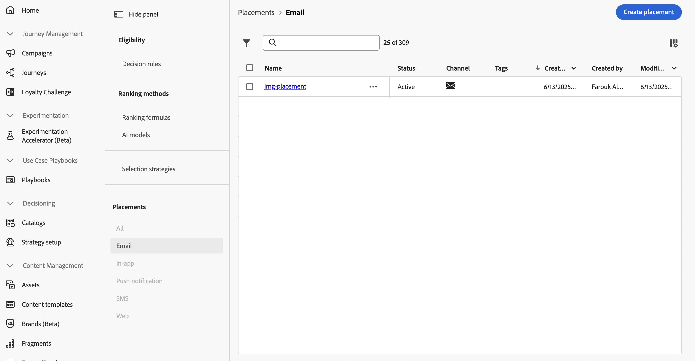
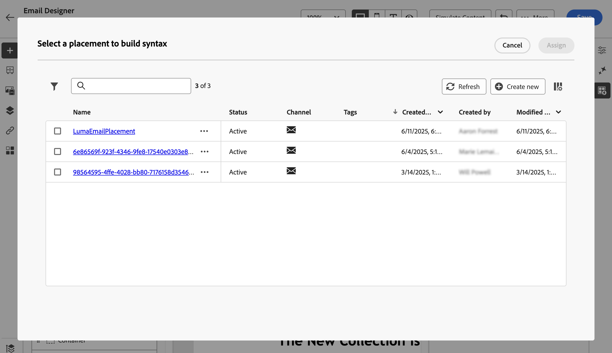

# 使用投放位置 {#create-decision}

>[!BEGINSHADEBOX]

**在此页面上：**&#x200B;创建投放位置，并将其与电子邮件中的决策策略相关联，以便正确的决策项目显示在正确的位置，并且您可以跟踪其性能。

>[!ENDSHADEBOX]

## 关于版面 {#about}

投放位置是用于展示决策项的容器。 它有助于确保正确的产品建议内容显示在消息中的正确位置。

向电子邮件添加决策策略时，需要将版面与将展示返回决策项的组件关联。 例如，这可让您在报告中跨不同投放位置跟踪决策项目表现。

可在&#x200B;**[!UICONTROL 策略设置]**&#x200B;菜单中访问投放位置列表。 过滤器可用于帮助您根据特定渠道表面或标记检索版面。

>[!NOTE]
>
>目前，投放位置仅适用于电子邮件渠道。

## 创建放置环境 {#create}

要创建投放位置，请执行以下步骤：

1. 浏览到&#x200B;**[!UICONTROL 策略设置]**&#x200B;菜单，选择&#x200B;**[!UICONTROL 电子邮件]**，然后单击&#x200B;**[!UICONTROL 创建投放位置]**&#x200B;按钮。

   在添加决策策略时，您还可以直接从Email Designer创建版面。 [了解如何将版面关联到电子邮件组件](../experience-decisioning/create-decision.md#save)

1. 定义投放位置的属性：

   

   * **[!UICONTROL 名称]**：投放位置的名称。 确保定义有意义的名称，以便更轻松地检索它。
   * **[!UICONTROL 描述]**：投放位置的描述。
   * **[!UICONTROL 标记]**：将Adobe Experience Platform统一标记分配给投放位置。 这使您能够轻松分类这些分类并改进搜索。 [了解如何使用标记](../start/search-filter-categorize.md#tags)
   * **[!UICONTROL 渠道]**：将使用投放位置的渠道。 目前，投放位置仅适用于电子邮件。
   * **[!UICONTROL 渠道配置]**：将渠道配置关联到投放位置。 [了解如何设置渠道配置](../configuration/channel-surfaces.md)。

1. 单击&#x200B;**[!UICONTROL 创建]**。

创建投放位置后，在将决策策略添加到电子邮件时，它会显示在投放位置列表中。 您可以选择它以显示其属性并对其进行编辑。 [了解如何创建决策策略](../experience-decisioning/create-decision.md)

