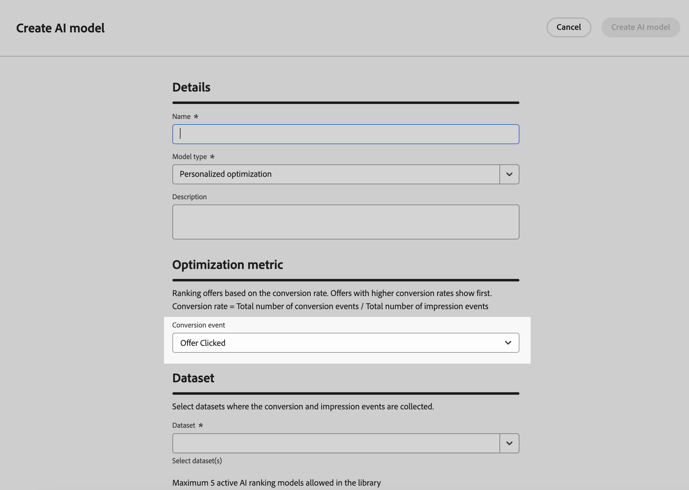

# 排名方法 {#rankings}

>[!CONTEXTUALHELP]
>id="ajo_exd_config_formulas"
>title="创建排名公式"
>abstract="通过公式可定义规则，这些规则将确定应首先显示哪项，而非考虑该项的优先级分数。创建排名方法后，即可将它分配给选择策略以定义应首先选择哪些项。"

排名方法允许您为要针对给定配置文件显示的项目排名。 创建排名方法后，即可将它分配给选择策略以定义应首先选择哪些项。

提供了两种类型的排名方法：

* **公式**&#x200B;允许您定义规则，这些规则将确定应首先显示哪个项目，而不是考虑项目的优先级分数。

* **AI模型**&#x200B;允许您使用经过训练的模型系统，这些系统将利用多个数据点来确定应该首先显示哪些项目。

## 创建排名方法 {#create}

要创建排名方法，请执行以下步骤：

1. 导航到&#x200B;**[!UICONTROL 策略设置]**&#x200B;菜单，然后根据要使用的排名类型选择&#x200B;**[!UICONTROL 公式]**&#x200B;或&#x200B;**[!UICONTROL AI模型]**&#x200B;菜单。

1. 单击屏幕右上角的&#x200B;**[!UICONTROL 创建公式]**&#x200B;或&#x200B;**[!UICONTROL 创建AI模型]**&#x200B;按钮。

   

1. 根据您的需要配置公式或AI模型，然后保存。

   有关如何创建排名公式和AI模型的详细信息，请参阅决策管理文档：

   * [排名公式](../offers/ranking/create-ranking-formulas.md)
   * [AI 模型](../offers/ranking/ai-models.md)

   >[!NOTE]
   >
   >排名公式中的嵌套深度限制为30级。 这是通过计数PQL字符串中的`)`个右括号来测量的。 规则字符串的大小最多可达8KB，适用于UTF-8编码字符。 这相当于8,000个ASCII字符（每个1字节），或2,000-4,000个非ASCII字符（每个2-4字节）。 [了解有关Decisioning护栏和限制的更多信息](gs-experience-decisioning.md#guardrails)

决策策略支持最多10个选择策略和决策项目组合。 [了解有关Decisioning护栏和限制的更多信息](gs-experience-decisioning.md#guardrails)

+++ 正在自定义[!DNL Customer Journey Analytics]量度上优化模型

>[!NOTE]
>
>此功能仅适用于具有管理员权限的[!DNL Customer Journey Analytics]客户。
>
>在开始之前，请确保已将Journey Optimizer与Customer Journey Analytics集成，以便将Journey Optimizer数据集导出到默认数据视图中。 [了解如何在 [!DNL Customer Journey Analytics]](../reports/cja-ajo.md)中利用 [!DNL Journey Optmizer] 数据

个性化优化模型是一种AI模型，可让您定义业务目标，并利用客户数据训练面向业务的模型以提供个性化优惠并最大化KPI。 有关如何创建个性化AI模型的详细信息，请参阅[决策管理文档](../offers/ranking/personalized-optimization-model.md)。

默认情况下，个性化优化模型使用&#x200B;**优惠点击次数**&#x200B;作为优化量度。 如果您正在使用[!DNL Customer Journey Analytics]，[!DNL Decisioning]允许您利用自己的自定义量度来优化您的模型。

为此，请访问个性化AI模型创建屏幕并展开&#x200B;**[!UICONTROL 转化事件]**&#x200B;下拉列表。 默认[!DNL Customer Journey Analytics] [数据视图](https://experienceleague.adobe.com/en/docs/analytics-platform/using/cja-dataviews/data-views){target="_blank"}中的所有量度都会显示在列表中。 选择要优化模型的量度，然后照常完成AI模型创建。

>[!NOTE]
>
>默认情况下，[!DNL Customer Journey Analytics]中的量度使用“最后接触”归因模型，该模型将100%的点数分配给转化前最近发生的接触点。
>
>虽然可以修改归因模型，但并非所有的归因模型都适合用于人工智能模型优化。 我们建议仔细选择与您的优化目标一致的归因模型，以确保模型准确性和性能。
>
>有关可用归因模型及其使用指南的更多详细信息，请参阅[[!DNL Customer Journey Analytics] 文档](https://experienceleague.adobe.com/en/docs/analytics-platform/using/cja-dataviews/component-settings/attribution){target="_blank"}

+++

## 在公式中利用决策项目属性 {#items}

排名公式以&#x200B;**PQL语法**&#x200B;表示，并且可以利用各种属性，例如配置文件属性、[上下文数据](context-data.md)以及与决策项目相关的属性。

要在公式中利用与决策项目相关的属性，请确保遵循排名公式代码中的以下语法。 展开每个部分以了解更多信息：

+++利用决策项目标准属性

+++

+++利用决策项目自定义属性

+++
