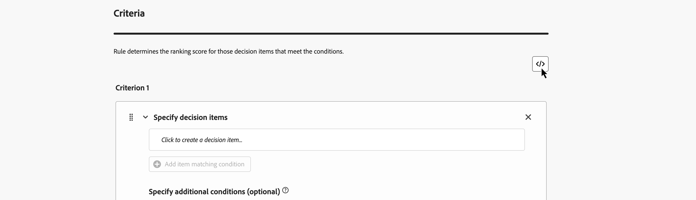
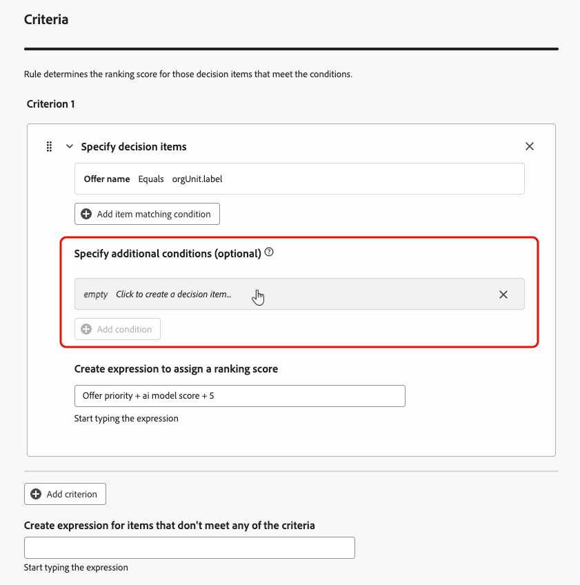
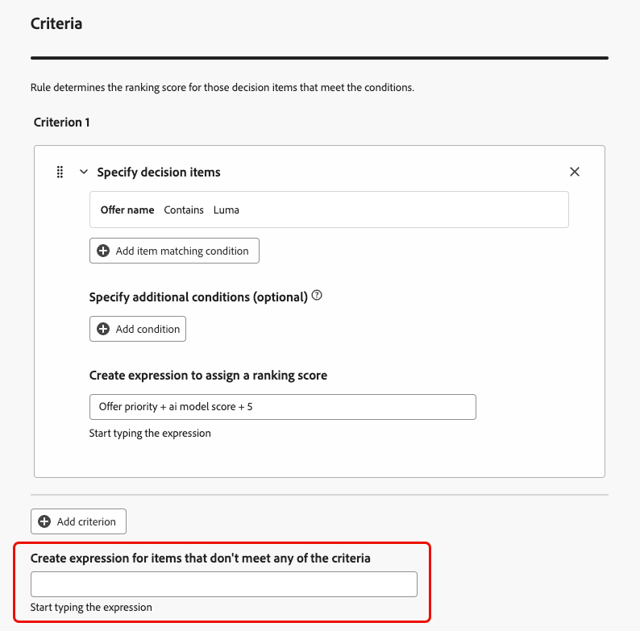
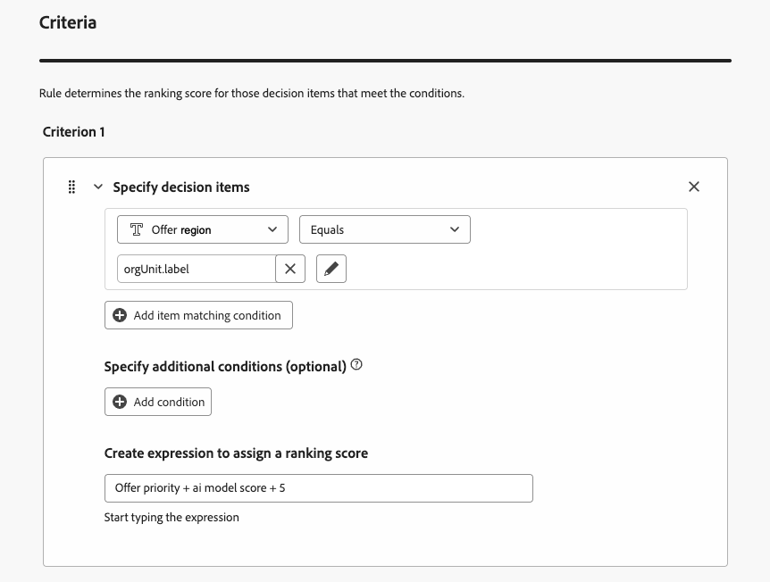
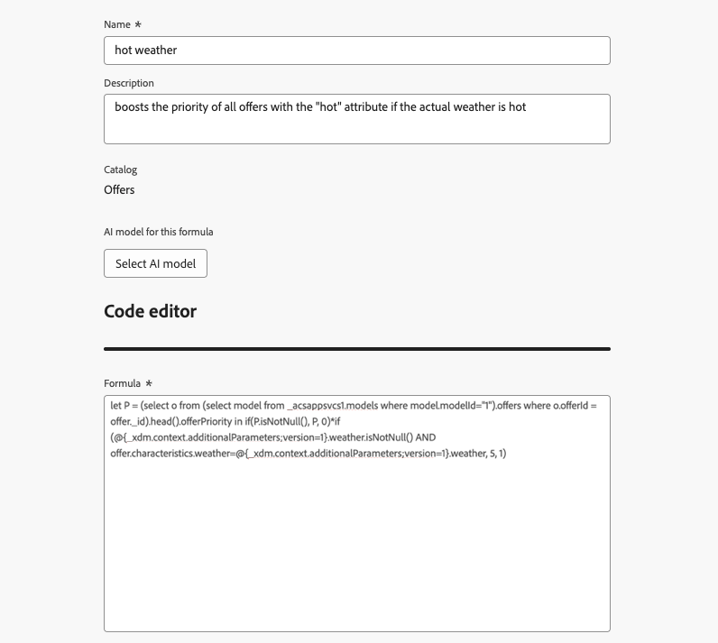
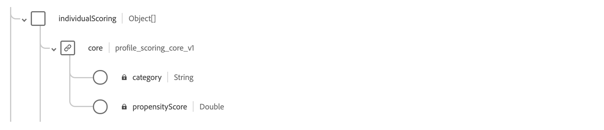

# 创建排名公式 {#create-ranking-formulas}

>[!BEGINSHADEBOX]

**在此页面上：**&#x200B;使用AI公式生成器创建排名公式，这些公式将AI模型分数、优惠优先级、配置文件属性和上下文信号组合在一起，以便您能够控制首先显示哪一个优惠，并将决策与您的业务目标和客户的需求保持一致。

>[!ENDSHADEBOX]

**排名公式**&#x200B;允许您定义规则，以确定应首先显示哪个选件，而不是考虑优先级分数。

要创建这些规则，**[!UICONTROL Adobe Journey Optimizer]**&#x200B;中的AI公式生成器在优惠的排名方面提供了更大的灵活性和控制力。 您现在可以定义自定义排名公式，这些公式通过引导式界面将AI模型分数、优惠优先级、配置文件属性、优惠属性和上下文信号组合在一起，而不是仅依赖静态优惠优先级。

此方法允许您根据AI驱动的倾向、业务价值和实时上下文的任意组合动态调整优惠排名，从而更轻松地使决策与营销目标和客户需求保持一致。 AI公式生成器支持简单公式或高级公式，具体取决于您要应用的控制量。

创建排名公式后，可将其分配给[选择策略](../selection-strategies.md)。 使用此选择策略时，如果多个优惠都有资格显示，则决策引擎将使用所选的公式来计算首先交付哪个优惠。

➡️ [通过观看视频了解此功能](#video)

## 护栏和限制 {#ranking-guardrails}

在创建排名公式之前，请牢记以下限制：

* AI公式生成器不支持[使用连续量度的个性化优化模型](personalized-optimization-model.md)。
* 在排名公式中使用AI模型时，数据未反映在保持和模型驱动流量的[转化率](../../reports/campaign-global-report-cja-code.md#conversion-rate)报表中。
* 排名公式中的嵌套深度限制为30个级别，测量方法是计算PQL字符串中的`)`。
* 对于UTF-8编码字符（8,000个ASCII字符或2,000-4,000个非ASCII字符），排名公式字符串最长可达8KB。
* 排名公式（例如，上个月开始的体验事件）不支持回顾时段。 尝试保存此类公式会触发错误。
* [AI支持的公式优化](#optimize)仅适用于代码型PQL表达式在UTF-8编码大小中大于&#x200B;**2 KB**&#x200B;的排名公式；不会分析较小的公式。

## 创建排名公式，设置属性 {#create-ranking-formula}

>[!CONTEXTUALHELP]
>id="ajo_exd_config_formulas"
>title="创建排名公式"
>abstract="使用公式，您可以定义规则来确定应首先显示哪个决策项，而不是考虑决策项的优先级分数。 创建了排名公式后，您就可以将其分配给选择策略。"

要创建排名公式，请执行以下步骤。

1. 访问&#x200B;**[!UICONTROL 策略设置]**&#x200B;菜单，然后选择&#x200B;**[!UICONTROL 排名公式]**&#x200B;选项卡。 此时将显示之前创建的公式列表。

   

1. 单击&#x200B;**[!UICONTROL 创建公式]**。

1. 指定公式名称，并根据需要添加说明。

   {width="80%"}

1. （可选）单击&#x200B;**[!UICONTROL 选择AI模型]**&#x200B;以设置将用作构建排名公式的引用的模型。

   每次在定义下面的公式时引用模型分数时，都将使用您选择的AI模型。

1. 定义条件以确定匹配决策项的排名分数。 您可以：

   * 使用[公式生成器](#ranking-select-criteria)填写&#x200B;**[!UICONTROL 标准]**&#x200B;部分，和/或
   * 单击&#x200B;**[!UICONTROL 切换到代码编辑器]**&#x200B;以在代码编辑器](#ranking-code-editor)中使用[PQL定义或优化排名逻辑。

## 使用 Adobe Experience Platform 数据 {#aep-data}

在&#x200B;**[!UICONTROL 数据集查找]**&#x200B;部分中，您可以使用Adobe Experience Platform中的数据动态调整排名逻辑以反映真实情况。

这对于经常更改的属性（如产品可用性或实时定价）特别有用。 [了解如何将Adobe Experience Platform数据用于决策](../aep-data-exd.md)


## 使用公式生成器定义标准 {#ranking-select-criteria}

定义将确定匹配决策项的排名分数的&#x200B;**标准**。

借助直观的界面，您可以通过单独或合并调整AI分数（倾向）、选件价值（优先级）、上下文杠杆和外部配置文件倾向来优化决策，以优化每次交互。<!--Whether you are maximizing revenue, promoting strategic offers, or balancing business goals with real-time context, the formula builder gives you total control in defining ranking strategies.-->

<!--{width="80%"}-->

1. 如果需要，请单击&#x200B;**[!UICONTROL 切换到代码编辑器]**&#x200B;以在公式生成器旁添加使用&#x200B;**PQL语法**&#x200B;的表达式。 此选项补充了以下步骤中的用户界面字段，因此您可以在同一个排名公式中组合这两种方法。 有关如何使用PQL语法的更多信息，请参阅[专用文档](https://experienceleague.adobe.com/docs/experience-platform/segmentation/pql/overview.html?lang=zh-Hans)。 [使用代码编辑器](#ranking-code-editor)部分提供了决策项属性和复制粘贴示例的语法。

   

   >[!NOTE]
   >
   >切换到代码编辑器会将基于表达式的输入添加到您的标准，而不会删除其他用户界面字段。

1. 在&#x200B;**[!UICONTROL 标准1]**&#x200B;部分中，通过执行以下操作指定要对其应用排名分数的决策项：
   * 选择[决策项属性](../items.md#attributes)
   * 选择逻辑运算符
   * 添加匹配条件 — 您可以键入值、选择配置文件属性或[上下文数据](../context-data.md)

   {width="70%"}

1. （可选）您可以指定其他元素以将标准的匹配条件细化为true。

   {width="80%"}

   例如，您定义了条件1，例如&#x200B;*天气*&#x200B;自定义属性&#x200B;*等于*&#x200B;温暖&#x200B;*条件。*&#x200B;此外，您可以添加其他条件，例如，如果满足第一个条件，并且在发出请求时温度超过75度，则标准1为true。<!--Add a screenshot with the example-->

1. 创建表达式，将排名得分分配给满足上述定义条件的决策项。 您可以引用以下任意一项：

   * 来自您在&#x200B;**[!UICONTROL 详细信息]** [以上](#create-ranking-formula)部分中选择的AI模型的得分；
   * 决策项的优先级，该优先级是在[创建决策项](../items.md#attributes)时手动分配的值；<!--If a profile qualifies for multiple decision items, a higher priority grants the item precedence over others.-->
   * 个人资料上可能存在的任何属性，如任何外部派生的倾向分数；
   * 可以自由格式分配的静态值；
   * 以上任意组合。

   {width="70%"}

   >[!NOTE]
   >
   >单击字段旁边的图标以添加预定义变量。

1. 单击&#x200B;**[!UICONTROL 添加条件]**&#x200B;可根据需要多次添加一个或多个条件。 其逻辑如下：
   * 如果第一个标准对于给定的决策项为true，则它优先于下一个标准。
   * 如果不为true，则决策引擎将转到第二个标准，依此类推。

1. 在最后一个字段中，您可以构建一个表达式，该表达式将分配给不符合上述条件的所有决策项。

   {width="70%"}

   +++排名公式示例

   {width="80%"}

   如果决策项目的区域（自定义属性）等于用户档案的地理标签（用户档案属性），则此处表示的排名分数（决策项目优先级、AI模型分数和静态值的组合）将应用于满足该条件的所有决策项目。

   +++

1. 公式就绪后，单击&#x200B;**[!UICONTROL 创建]**。

您现在可以从列表中访问排名公式以查看其详细信息，并对其进行编辑或删除。 它可用于[选择策略](../selection-strategies.md)中，为符合条件的决策项排名。

## 使用代码编辑器定义标准 {#ranking-code-editor}

当您要作为&#x200B;**PQL**&#x200B;表达式写入或编辑排名逻辑时，请使用&#x200B;**[!UICONTROL 切换到代码编辑器]**。


>[!NOTE]
>
>此操作将阻止您返回此公式的默认生成器视图。

您可以利用配置文件属性、[上下文数据](../context-data.md)和[决策项属性](../items.md#attributes)。

例如，如果实际天气炎热，您希望使用“hot”属性提高所有选件的优先级。 为此，在决策调用中传递了&#x200B;**contextData.weather=hot**。

{width="80%"}

要在公式中利用与决策项目相关的属性，请确保在排名公式的代码中遵循正确的语法。 展开每个部分以了解更多信息：

+++利用决策项目标准属性


+++

+++利用决策项目自定义属性


+++

您可以根据需要创建许多不同的基于代码的排名公式。 以下是一些示例。

+++根据配置文件属性，提升具有特定优惠属性的优惠

如果配置文件住在选件对应的城市，则将该城市中所有选件的优先级加倍。

**排名公式：**

```
if( offer.characteristics.get("city") = homeAddress.city, offer.rank.priority * 2, offer.rank.priority)
```

+++

+++结束日期距现在不到24小时的Boost优惠

**排名公式：**

```
if( offer.selectionConstraint.endDate occurs <= 24 hours after now, offer.rank.priority * 3, offer.rank.priority)
```

+++

+++根据客户购买所提供产品的倾向提升优惠内容

您可以根据客户倾向得分提高选件的得分。

在此示例中，实例租户是&#x200B;*_salesvelocity*，并且配置文件架构包含存储在数组中的分数范围：



因此，对于用户档案，例如：

```
{"_salesvelocity": {"individualScoring": [
                    {"core": {
                            "category":"insurance",
                            "propensityScore": 96.9
                        }},
                    {"core": {
                            "category":"personalLoan",
                            "propensityScore": 45.3
                        }},
                    {"core": {
                            "category":"creditCard",
                            "propensityScore": 78.1
                        }}
                    ]}
}
```

+++

+++根据用户档案的邮政编码和年收入提升优惠

在此示例中，系统始终先尝试显示邮政编码匹配选件，如果未找到匹配选件，则回退为常规选件，从而避免显示专用于其他邮政编码的选件。

```pql
if( offer._luma.offerDetails.zipCode = _luma.zipCode,luma.annualIncome / 1000 + 10000, if( not offer.luma.offerDetails.zipCode,_luma.annualIncome / 1000, -9999) )
```

公式的作用：

* 如果选件与用户具有相同的邮政编码，则将其分值设置为非常高，以便最先选择它。
* 如果选件根本没有邮政编码（它属于常规选件），请根据用户的收入为其提供正常分数。
* 如果选件的邮政编码与用户不同，请将其分值设得很低，这样就不会选中该选件。

+++

+++根据上下文数据提升优惠

[!DNL Journey Optimizer]允许您根据调用中传递的上下文数据提升某些选件。 例如，如果传递了`contextData.weather=hot`，则必须提升所有带`attribute=hot`的选件的优先级。

>[!NOTE]
>
>有关如何传递上下文数据<!-- using the **Edge Decisioning** and **Decisioning** APIs-->的详细信息，请参阅[此部分](../context-data.md)。

请注意，在使用&#x200B;**Decisioning** API时，上下文数据将添加到请求正文中的配置文件元素，如下面的示例所示：

```
"xdm:profiles": [
{
    "xdm:identityMap": {
        "crmid": [
            {
            "xdm:id": "CRMID1"
            }
        ]
    },
    "xdm:contextData": [
        {
            "@type":"_xdm.context.additionalParameters;version=1",
            "xdm:data":{
                "xdm:weather":"hot"
            }
        }
    ]
    
}],
```

+++

## AI支持的公式优化 {#optimize}

[!DNL Journey Optimizer]可以自动分析排名公式并建议简化以保留原始逻辑。 只有PQL表达式大于&#x200B;**2 KB** （UTF-8编码）的公式才合格，不会分析较小的表达式。 找到简化后，列表中公式名称旁会出现一个红色指示符。


>[!NOTE]
>
>AI支持的公式优化依赖与&#x200B;**AI Assistant**&#x200B;相同的生成AI功能，并使用相同的访问控制。 必须向用户授予对&#x200B;**[!UICONTROL AI助手]**&#x200B;资源的&#x200B;**[!UICONTROL 生成内容]**&#x200B;权限。 有关详细信息，请参阅[访问AI助手](../../content-management/gs-generative.md#generative-access)。

要优化排名公式，请执行以下操作：

1. 在排名公式列表中，单击公式名称旁边的红色指示符图标。

1. 将打开&#x200B;**[!UICONTROL 优化]**&#x200B;窗口，在AI建议的版本旁显示原始PQL表达式。

   

1. 要验证这两个表达式是否生成相同的排名结果，请单击&#x200B;**[!UICONTROL 下载优化分析(TSV)]**&#x200B;以下载一个文件，其中显示模拟配置文件如何针对每个版本进行评估。

1. 满足要求后，单击&#x200B;**[!UICONTROL 应用]**&#x200B;将原始表达式替换为优化表达式。

## 操作方法视频 {#video}

了解如何在 Adobe Journey Optimizer 中使用 AI 公式构建器，创建自定义的产品建议排序策略。

>[!VIDEO](https://video.tv.adobe.com/v/3464446/?learn=on&enablevpops)
