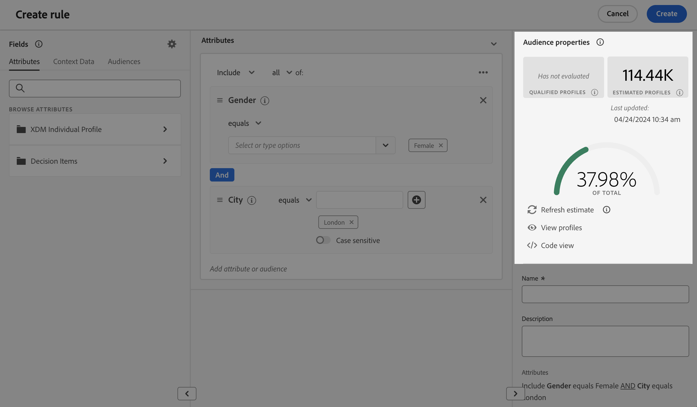
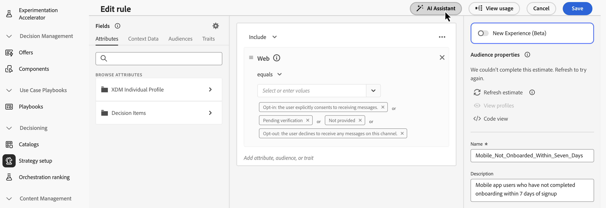
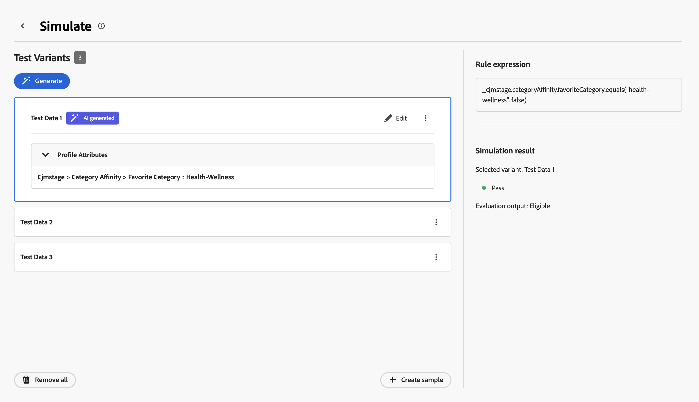

# 构建规则 {#rules}

>[!BEGINSHADEBOX]

**在此页面上：**&#x200B;生成可重复使用的决策规则和定位规则，以便您能够在营销活动和历程中控制向哪些受众显示哪些决策项和个性化内容。

>[!ENDSHADEBOX]

>[!CONTEXTUALHELP]
>id="ajo_exd_config_rules"
>title="创建规则"
>abstract="您可以创建两种类型的规则：**决策规则**，用于决策项或选择策略，以控制向哪些受众展示哪些项目；或&#x200B;**目标选择规则**，用于确定有资格接收个性化内容或进入特定历程路径的受众区段。  创建决策规则时，您可以选择&#x200B;**[!UICONTROL 启用数据集查找]**，以使用 Adobe Experience Platform 数据。 这允许您根据动态外部属性定义资格标准，确保只有相关的决策项才显示。"

## 关于规则 {#about}

在[!DNL Journey Optimizer]中，您可以创建两种类型的可重用规则：

* [决策规则](#decision-rules)
* [定位规则](#targeting-rules)

### 决策规则 {#decision-rules}

决策规则允许您通过直接在决策项目级别或在特定选择策略内应用约束来定义决策项目的受众。 这样可精确地控制应向谁显示哪些项。

例如，我们考虑一个方案，其中您的决策项包含为女性设计的瑜伽相关产品。 通过决策规则，您可以指定只向性别为“女性”并在“瑜伽”中指定了“兴趣点”的用户档案显示这些项目。

>[!NOTE]
>
>除了项目和选择策略级别决策规则之外，您还可以在营销活动级别定义预期受众。 [了解详情](../campaigns/create-campaign.md#audience)

### 定位规则 {#targeting-rules}

>[!AVAILABILITY]
>
>目标选择规则当前处于有限发布状态。 请联系 Adobe 代表以获取访问权限。
>
>请注意，此功能仅适用于已购买&#x200B;**Decisioning**&#x200B;附加产品的组织。 将逐步向所有客户推广此功能。

利用定位规则，可根据特定受众区段确定客户必须符合的特定条件，以便有资格接收个性化内容或进入特定历程路径，从而使您可以在历程和营销活动中定位子受众。

很多时候，维度是多个属性的组合，以及客户行为事件和上下文数据。 为了节省时间和精力，您可以创建一次定位规则，并在历程和营销策划中重复使用它们，并且能够在创作时内联快速修改它们。

您可以使用以下任一规则：

* 在历程或营销活动中创建[内容优化定位](../building-journeys/path-targeting.md)时；
* 生成[历程路径优化](../building-journeys/path-targeting.md)时。

➡️ [通过观看视频了解此功能](#video)

## 访问规则 {#access}

可在&#x200B;**[!UICONTROL 决策]** > **[!UICONTROL 策略设置]**&#x200B;菜单中访问规则列表。

以下操作可用：

* 您可以筛选规则实体（**[!UICONTROL 决策项]**&#x200B;或&#x200B;**[!UICONTROL 定位]** - [了解更多](#about)）。

* 单击规则名称以将其选中，然后使用规则生成器对其进行编辑。 [了解如何操作](#create)

* 通过每个项目旁边的&#x200B;**[!UICONTROL 更多操作]**&#x200B;按钮，您可以：

  * 如果您选择了&#x200B;**[!UICONTROL 决策项]**&#x200B;实体，请将该规则添加到包以将其导出到另一个沙盒。 了解如何[将对象导出到另一个沙盒](../configuration/copy-objects-to-sandbox.md)。
  * 复制规则。
  * 删除规则。

{width=100%}

* 单击&#x200B;**[!UICONTROL 更多信息]**&#x200B;图标以显示组成规则的公式。

{width=60%}

## 创建规则 {#create}

要创建规则，请执行以下步骤：

1. 导航到&#x200B;**[!UICONTROL 决策]** > **[!UICONTROL 策略设置]** > **[!UICONTROL 规则]**，然后单击&#x200B;**[!UICONTROL 创建规则]**&#x200B;按钮。

1. 在&#x200B;**[!UICONTROL 创建规则]**&#x200B;对话框中，选择以下选项卡之一：

   * **[!UICONTROL 从头开始创建]**&#x200B;以在规则创建流程中继续。
   * **[!UICONTROL 使用AI创建]**&#x200B;以使用AI辅助创作。 描述要创建的规则，然后进行确认。 您将被重定向到规则生成器，并且AI Assistant会在右侧窗格中生成规则建议。 有关如何使用AI生成规则的更多信息，请参阅[使用AI生成规则](#build-rule-with-ai)部分。

     >[!NOTE]
     >
     >此功能适用于有权访问Adobe AI功能的组织。

1. 如果您选择&#x200B;**[!UICONTROL 从头开始创建]**，请选择规则实体以指定要为其创建规则的对象类型。

   {width=90%}

   * **[!UICONTROL 决策项]** — 该规则可应用于决策上下文中的[决策项](#decision-rules)；
   * **[!UICONTROL 定位]** — 在生成[定位](#targeting-rules)规则时可使用该规则，该规则可作为营销活动中[内容优化](../building-journeys/path-targeting.md)的一部分或历程（在[优化历程活动](../building-journeys/path-targeting.md)中）使用。

   如果创建&#x200B;**[!UICONTROL 决策项]**&#x200B;规则，则可以选择&#x200B;**[!UICONTROL 启用数据集查找]**&#x200B;以使用Adobe Experience Platform中的数据使用外部数据扩充决策逻辑。 这对于经常更改的属性（如产品可用性或实时定价）特别有用。 [了解如何将Adobe Experience Platform数据用于决策](../experience-decisioning/aep-data-exd.md)

1. 此时将打开规则创建屏幕。 命名规则并提供描述。

1. 使用Adobe Experience Platform区段生成器构建规则以满足您的需求。 为此，您可以利用各种数据源，例如：
   * 用户档案属性；
   * 决策项属性 — 仅在创建&#x200B;**[!UICONTROL 决策项]**&#x200B;规则时可用；
   * 受众；
   * 上下文数据来自Adobe Experience Platform。 [了解如何利用上下文数据](context-data.md)

   {width=85%}

   >[!NOTE]
   >
   >与Adobe Experience Platform Segmentation服务中使用的区段生成器相比，为创建规则而提供的区段生成器具有一些特性。 但是，文档中描述的全局进程对于在[!DNL Journey Optimizer]中构建规则有效。 [了解如何生成区段定义](../audience/creating-a-segment-definition.md)

1. 在工作区中添加和配置新字段时，**[!UICONTROL 受众属性]**&#x200B;窗格显示有关属于受众的估计配置文件的信息。 单击&#x200B;**[!UICONTROL 刷新估算]**&#x200B;以更新数据。

   {width=85%}

   >[!NOTE]
   >
   >当规则参数包含未存储在配置文件中的数据（如上下文数据）时，配置文件估计不可用。

1. 规则准备就绪后，单击&#x200B;**[!UICONTROL 创建]**。 创建的规则将显示在列表中，并且根据您创建的实体，可以使用以下规则：

   * 在&#x200B;**决策项**&#x200B;和&#x200B;**选择策略**&#x200B;中，用于管理将决策项呈现给用户档案；
   * 或在内容优化或路径优化中构建&#x200B;**定位**&#x200B;时进行更改。

>[!NOTE]
>
>规则中的嵌套深度限制为30级。 这是通过计数PQL字符串中的右括号`)`来测量的。
>
>对于UTF-8编码字符，规则字符串的大小最多可达15KB。 这相当于15,000个ASCII字符（每个1字节），或3,750-7,500个非ASCII字符（每个2-4字节）。
>
>[了解有关资格规则护栏和限制的更多信息](decisioning-guardrails.md#eligibility-rules)

## 使用人工智能构建规则 {#build-rule-with-ai}

>[!NOTE]
>
>此功能适用于有权访问Adobe AI功能的组织。 它仅适用于一组组织（限量发布）。 要获得访问权限，请与 Adobe 代表联系。
>
>目前，AI辅助的规则生成方法不支持基于历程上下文数据的表达式生成。

您可以从两个位置启动AI辅助规则创作：

* 在“创建规则”对话框的&#x200B;**[!UICONTROL 使用AI创建]**&#x200B;选项卡中：

  {width=85%}

* 在规则生成器中，使用&#x200B;**[!UICONTROL AI助手]**&#x200B;按钮。

  {width=85%}

在AI Assistant窗格中，以纯语言描述要构建的规则。 AI助手会生成一个规则建议，您可以将其应用于生成器或放弃。

>[!CAUTION]
>
>单击&#x200B;**[!UICONTROL 应用于生成器]**&#x200B;后，AI生成的规则将替换生成器画布中当前生成的任何现有规则逻辑。

## 模拟您的规则 {#simulate-rules}

在决策策略或营销策划中使用规则之前，您可以使用示例或生成的数据对其进行测试，以验证规则逻辑并确保其按预期运行。

1. 打开现有规则或[创建一个新规则](#create)，然后单击&#x200B;**[!UICONTROL 模拟规则]**&#x200B;按钮。

   

1. 此时将打开模拟屏幕，其中包含多个部分：

   

   * **测试变体**：生成或创建手动测试变体的位置
   * **规则表达式**：显示要引用的规则定义
   * **模拟结果**：显示配置文件是否符合此规则的条件

1. 使用以下两种方法之一，使用规则所需的属性添加测试变体：
   * 要创建手动样本，请选择&#x200B;**[!UICONTROL 创建样本]**&#x200B;按钮。
   * 要使用AI生成测试变体，请单击&#x200B;**[!UICONTROL 生成]**&#x200B;按钮。

>[!NOTE]
>
>具有访问Adobe AI功能的组织可以使用基于人工智能的测试变体生成。

“测试变体”部分自动填充了创建或生成的示例。 每个变体都包含规则中使用的属性。 您可以直接编辑字段值以模拟不同的场景。

要查看规则评估结果，请从列表中选择测试变体。 Simulation result（模拟结果）区域显示Profile是否符合此规则的条件。

在以下示例中，第一个测试变体显示&#x200B;**[!UICONTROL 通过]**&#x200B;模拟结果，而第二个测试变体显示&#x200B;**[!UICONTROL 失败]**&#x200B;结果。

| 通过示例 | 失败示例 |
| --- | --- |
|  |  |
| 变量数据满足所有规则条件，因此用户档案符合规则。 | 一个或多个条件未满足，因此用户档案不符合规则条件。 |

## AI支持的规则优化 {#optimize}

[!DNL Journey Optimizer]可以自动分析规则并提出简化建议，以保留原始逻辑。 只有PQL表达式大于&#x200B;**2 KB** （UTF-8编码）的规则才合格，不会分析较小的表达式。 发现简化后，库存中的规则旁边会显示一个红色的&#x200B;**[!UICONTROL Optimize]**&#x200B;指示符。

>[!NOTE]
>
>AI支持的规则优化依赖与&#x200B;**生成内容**&#x200B;相同的生成AI功能，并使用相同的访问控制。 必须向用户授予对&#x200B;**[!UICONTROL AI助手]**&#x200B;资源的&#x200B;**[!UICONTROL 生成内容]**&#x200B;权限。 有关详细信息，请参阅[访问生成内容](../content-management/gs-generative.md#generative-access)。

要优化规则：

1. 在规则清单中，单击规则名称旁边的红色指示器图标。

1. 将打开&#x200B;**[!UICONTROL 优化]**&#x200B;窗口，在AI建议的版本旁显示原始PQL表达式。

   

1. 要验证两个表达式的行为是否相同，请单击&#x200B;**[!UICONTROL 下载优化分析(TSV)]**&#x200B;以下载一个文件，其中显示模拟配置文件如何针对每个版本进行评估。

1. 满足要求后，单击&#x200B;**[!UICONTROL 应用]**&#x200B;将原始表达式替换为优化表达式。

## 操作方法视频 {#video}

了解如何在Adobe Journey Optimizer中创建、复制和应用可重复使用的&#x200B;**定位规则**，以根据客户属性（如地区、语言和行为）高效地个性化营销活动 — 在提高受众精度的同时节省时间。

>[!VIDEO](https://video.tv.adobe.com/v/3476127/?quality=12)
