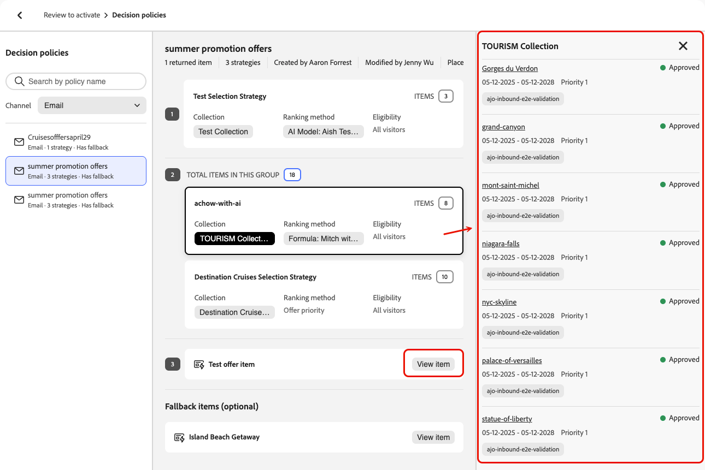

# 在消息中使用决策策略 {#create-decision}

将决策策略添加到内容后，您可以使用返回决策项中的属性进行个性化。 为此，请先在内容中插入决策策略代码。

>[!CAUTION]
>
>决策策略适用于&#x200B;**基于代码的体验**、**短信**、**推送通知**&#x200B;和&#x200B;**电子邮件**&#x200B;渠道的所有客户。

## 插入决策策略代码 {#insert}

>[!BEGINTABS]

>[!TAB 基于代码的体验]

1. 编辑您的基于代码的体验，并导航到&#x200B;**[!UICONTROL 决策策略]**。

2. 选择&#x200B;**[!UICONTROL 插入策略]**&#x200B;以添加决策策略代码。

   

>[!NOTE]
>
>对于基于代码的体验，如果您的决策策略包含决策项（包括片段），则可以在决策策略代码中利用这些片段。 [了解如何利用片段](fragments-decision-policies.md)

>[!TAB 电子邮件]

1. 打开&#x200B;**Personalization编辑器**&#x200B;并导航到&#x200B;**[!UICONTROL 决策策略]**。

2. 选择&#x200B;**[!UICONTROL 插入语法]**&#x200B;以添加决策策略的代码。

   

   >[!NOTE]
   >
   >如果未显示插入选项，则可能已为父组件配置了决策策略。

3. 如果尚未为组件分配位置，请从列表中选择一个位置，然后单击&#x200B;**[!UICONTROL 分配]**。

   

   >[!NOTE]
   >
   >如果您在同一电子邮件中使用多个决策策略（例如，一个用于页眉，一个用于页脚），则会在各个投放位置之间为同一优惠进行重复数据删除：不会呈现两次。 第二个决策策略将不会返回任何内容，并且将显示一个空格，除非您已配置后备优惠，在这种情况下，将显示后备优惠。

在电子邮件Designer中使用&#x200B;**[!UICONTROL 编码您自己的]**&#x200B;模式时，您还可以插入决策策略代码。 导航到&#x200B;**[!UICONTROL 决策策略]**&#x200B;并选择&#x200B;**[!UICONTROL 插入语法]** — 将显示版面选择UI，以便您可以直接分配版面。 [了解如何为自己的电子邮件内容编码](../email/code-content.md)。

>[!AVAILABILITY]
>
>在&#x200B;**[!UICONTROL 代码模式下插入决策策略您自己的]**&#x200B;模式是有限可用的。

>[!NOTE]
>
>在&#x200B;**[!UICONTROL 编码您自己的]**&#x200B;模式中，每个策略只能返回一个决策项，因为&#x200B;**[!UICONTROL 重复网格]**&#x200B;组件不可用。

>[!TAB 短信]

1. 打开&#x200B;**Personalization编辑器**&#x200B;并导航到&#x200B;**[!UICONTROL 决策策略]**。

2. 选择&#x200B;**[!UICONTROL 插入语法]**&#x200B;以添加决策策略的代码。

   

>[!TAB 推送]

1. 打开&#x200B;**Personalization编辑器**&#x200B;并导航到&#x200B;**[!UICONTROL 决策策略]**。

2. 选择&#x200B;**[!UICONTROL 插入语法]**&#x200B;以添加决策策略的代码。

   

>[!IMPORTANT]
>
>包含推送通知的Experience Decisioning需要特定版本的Mobile SDK。 在实施此功能之前，请查看[发行说明](https://developer.adobe.com/client-sdks/home/release-notes){target="_blank"}以确定所需的版本，并确保您已相应地升级。 您还可以在[此部分](https://developer.adobe.com/client-sdks/home/current-sdk-versions){target="_blank"}中查看您的平台的所有可用SDK版本。

>[!ENDTABS]

将添加决策策略代码。 您现在可以使用返回决策项中的属性来个性化您的内容。

>[!NOTE]
>
>对于基于代码的体验和电子邮件渠道，请为每个要返回的决策项目重复此序列一次。 例如，如果您选择在[创建决策](create-decision-policy.md)时返回2个项目，请重复该序列两次。 对于短信和推送渠道，只能返回一个决策项。

## 使用决策项目属性进行个性化 {#attributes}

在内容中添加决策策略的代码后，返回决策项中的所有属性都可用于个性化。 [了解如何使用个性化](../personalization/personalize.md)。

属性存储在“选件”[目录架构](catalogs.md)中。 它们显示在个性化编辑器的以下文件夹中：
* **自定义属性**： `_\<imsOrg\>`文件夹
* **标准属性**： `_experience`文件夹

默认情况下，[!DNL Journey Optimizer]片段不支持决策项属性和上下文属性。 但是，您可以改用全局变量，如下所述。

要添加属性，请单击该属性旁边的&#x200B;**`+`**&#x200B;图标。 您可以根据需要添加任意数量的属性。 您还可以包括其他个性化属性，例如配置文件数据。

* 对于&#x200B;**电子邮件**&#x200B;和&#x200B;**基于代码的**&#x200B;渠道，使用方括号`[ ]`将`#each`循环中的属性换行，并在结束`/each`标记之前添加逗号。

  +++查看示例

  

  +++

* 对于&#x200B;**短信**&#x200B;和&#x200B;**推送**&#x200B;渠道，请确保在决策策略的语法代码后插入属性。 此语法应始终保留在第1行。

  +++查看示例

  

  +++

  >[!NOTE]
  >如果在SMS或推送内容中插入图像资产属性（例如，在标题或正文中），则属性值将显示为URL。 图像本身不会呈现在这些字段中。

* 要启用决策项跟踪，请添加`trackingToken`属性： `trackingToken: {{item._experience.decisioning.decisionitem.trackingToken}}`

## 预览和测试内容

构建内容后，在激活历程或营销活动之前预览和测试内容。 决策项目根据模拟界面中选择的用户档案呈现。 [了解如何预览和测试内容](../content-management/preview-test.md)。

## 后续步骤 {#final-steps}

内容准备就绪后，查看并发布活动或历程：

* [发布历程](../building-journeys/publish-journey.md)
* [查看和激活营销活动](../campaigns/review-activate-campaign.md)

对于基于代码的体验，只要开发人员进行API或SDK调用以获取渠道配置中定义的界面的内容，所做的更改就会应用于您的网页或应用程序。

## 从营销活动摘要查看决策策略详细信息 {#decision-policy-summary}

当操作或API触发的[营销活动](../campaigns/get-started-with-campaigns.md)在其内容中使用决策策略时，营销活动摘要页面显示&#x200B;**[!UICONTROL 决策策略]**&#x200B;部分，其中列出了营销活动中使用的所有策略。

您还可以访问每个决策策略的技术详细信息，并将它们复制到剪贴板，这对于排查Adobe支持或您的工程团队的问题很有用。

+++ 要访问决策策略详细信息和技术信息，请执行以下步骤。

1. 在[配置](../campaigns/review-activate-campaign.md#action-campaign-review)期间单击&#x200B;**[!UICONTROL 审阅以激活]**，或者从&#x200B;**[!UICONTROL 营销活动]**&#x200B;列表中打开营销活动以打开营销活动摘要。

1. 在&#x200B;**[!UICONTROL 决策策略]**&#x200B;部分中，列出了营销活动中使用的所有策略。

   

1. 选择决策策略或单击&#x200B;**[!UICONTROL 查看全部]**。 您可以查看每个策略的详细信息，包括：

   * 决策策略中使用的策略
   * 要返回的项目数
   * 用于每个选择策略的集合、排名方法和资格规则
   * 没有符合条件的决策项目时使用的后备优惠

   

1. 单击某个收藏集以显示其中包含的所有决策项。

1. 单击决策项以访问其详细信息并根据需要进行编辑 — 它将在一个新的浏览器选项卡中打开。 或者，单击&#x200B;**[!UICONTROL 查看项]**&#x200B;以显示不在集合中的决策项。

   

1. 您还可以查看有关用于每个选择策略的排名方法和资格规则的信息。

   {width="80%"}

1. 返回促销活动摘要，您还可以从&#x200B;**[!UICONTROL 操作]**&#x200B;部分中选择决策策略，然后单击&#x200B;**信息**&#x200B;图标以访问决策策略的技术详细信息。

   

1. 单击&#x200B;**复制到剪贴板**&#x200B;图标以将决策策略的JSON表示形式复制到剪贴板。

   复制的JSON包括您的组织名称和ID、沙盒名称、决策策略ID以及完整的决策策略结构。 您可以与Adobe支持或工程团队共享此信息，以便更快地排除决策策略问题。

+++

## 使用报告仪表板

要查看决策的执行情况，您可在营销活动或历程报告中查看现成的决策指标，或构建自定义Customer Journey Analytics功能板以测量绩效并深入了解决策政策和优惠的交付方式和参与方式。 [了解有关Decisioning报告的更多信息](cja-reporting.md)。

