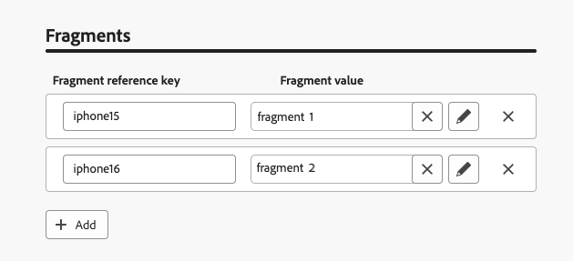

# 在消息中使用决策策略 {#create-decision}

创建决策策略后，可以在内容中使用策略以及与返回的决策项目关联的属性进行个性化。 为此，必须首先将与决策策略关联的代码插入到内容中。 完成后，您可以利用其属性进行个性化。

## 插入决策策略代码 {#insert-code}

>[!BEGINTABS]

>[!TAB 基于代码的体验]

1. 打开个性化编辑器并访问&#x200B;**[!UICONTROL 决策策略]**&#x200B;菜单。

1. 选择&#x200B;**[!UICONTROL 插入策略]**&#x200B;以添加与决策策略对应的代码。

   

   >[!NOTE]
   >
   >如果未显示代码插入按钮，则可能已为父组件配置了决策策略。

1. 将添加决策策略的代码。 此序列将按您希望返回决策策略的次数重复。 例如，如果您选择在[创建决策](#add-decision)时返回2个项目，则相同的序列将重复两次。

>[!TAB 电子邮件]

1. 打开个性化编辑器并访问&#x200B;**[!UICONTROL 决策策略]**&#x200B;菜单。

1. 选择&#x200B;**[!UICONTROL 插入语法]**&#x200B;以添加与决策策略对应的代码。

   

   >[!NOTE]
   >
   >如果未显示代码插入按钮，则可能已为父组件配置了决策策略。

1. 如果尚未将任何位置与组件关联，请从列表中选择一个位置，然后单击&#x200B;**[!UICONTROL 分配]**。

   

>[!ENDTABS]

添加决策策略的代码后，此序列将按照您希望返回决策策略的次数重复。 例如，如果您选择在[创建决策](#add-decision)时返回2个项目，则相同的序列将重复两次。

## 利用决策项目属性 {#attributes}

现在，您可以在该代码中添加所需的所有决策属性。 可用的属性存储在&#x200B;**[!UICONTROL 优惠]**&#x200B;目录的架构中。 自定义属性存储在&#x200B;**`_<imsOrg`>**&#x200B;文件夹中，标准属性存储在&#x200B;**`_experience`**&#x200B;文件夹中。 [了解有关优惠目录架构的更多信息](catalogs.md)


>[!NOTE]
>
>对于决策策略项跟踪，决策策略内容需要将`trackingToken`属性添加如下：
>>`trackingToken: {{item._experience.decisioning.decisionitem.trackingToken}}`

要添加属性，请单击其旁边的“+”图标。 您可以向代码添加任意数量的属性。


确保将`#each`循环包裹在一对方括号`[ ]`内，并在结束`/each`前添加一个逗号。


您还可以添加个性化编辑器中可用的任何其他属性，例如配置文件属性。


## 利用片段（基于代码的体验） {#fragments}

如果您的决策策略包含决策项目，包括片段，则可以在决策策略代码中利用这些片段。 [了解有关片段的更多信息](../content-management/fragments.md)

>[!AVAILABILITY]
>
>此功能当前仅适用于基于代码的体验渠道和一组组织（限量发布）。 有关更多信息，请与您的 Adobe 代表联系。

例如，假设您要为多个移动设备型号显示不同的内容。 确保将与这些设备对应的片段添加到您在决策策略中使用的决策项目中。 [了解如何操作](items.md#attributes)。

{width=70%}

完成后，您可以使用以下任一方法：

>[!BEGINTABS]

>[!TAB 直接插入代码]

只需将下面的代码块复制并粘贴到决策策略代码中。 将`variable`替换为片段ID，将`placement`替换为片段引用键：

```

{{fragment id = variable}}
```

>[!TAB 按照详细步骤操作]

1. 导航到&#x200B;**[!UICONTROL 帮助程序函数]**&#x200B;并将&#x200B;**Let**&#x200B;函数` {{variable}}`添加到代码窗格，您可以在代码窗格中声明片段的变量。

   

1. 使用&#x200B;**Map** > **Get**&#x200B;函数``构建表达式。 映射是决策项中引用的片段，字符串可以是您在决策项中作为&#x200B;**[!UICONTROL 片段引用键]**&#x200B;输入的设备模型。

   

1. 您还可以使用上下文属性，该属性将包含此设备型号ID。

   

1. 添加您为片段选择的变量作为片段ID。

   

>[!ENDTABS]

将从决策项的&#x200B;**[!UICONTROL 片段]**&#x200B;部分中选择片段ID和引用键。

>[!WARNING]
>
>如果片段键不正确或片段内容无效，渲染将失败，从而导致Edge调用中出现错误。

### 使用片段时的护栏 {#fragments-guardrails}

**决策项和上下文属性**

默认情况下，[!DNL Journey Optimizer]片段不支持决策项属性和上下文属性。 但是，您可以改用全局变量，如下所述。

假设您要在片段中使用&#x200B;*sport*&#x200B;变量。

1. 在片段中引用此变量，例如：

   ```
   Elevate your practice with new {{sport}} gear!
   ```

1. 在决策策略块中使用&#x200B;**Let**&#x200B;函数定义变量。 在以下示例中，*sport*&#x200B;是使用决策项属性定义的：

   ```
   {#each decisionPolicy.13e1d23d-b8a7-4f71-a32e-d833c51361e0.items as |item|}}
   
   {{fragment id = get(item._experience.decisioning.offeritem.contentReferencesMap, "placement1").id }}
   {{/each}}
   ```

**决策项片段内容验证**

* 由于这些片段的动态性质，在营销策划中使用时，将跳过在营销策划内容创建期间对决策项中引用的片段进行消息验证。

* 片段内容的验证仅在片段创建和发布期间进行。

* 对于JSON片段，无法确保JSON对象的有效性。 确保表达式片段内容是有效的JSON，以便在决策项中可以使用。

在运行时，将验证营销活动内容（包括决策项中的片段内容）。 如果验证失败，则不会呈现营销活动。

## 后续步骤 {#final-steps}

内容准备就绪后，查看并发布活动或历程：

* [发布历程](../building-journeys/publishing-the-journey.md)
* [查看激活营销活动](../campaigns/review-activate-campaign.md)
* [发布和激活基于代码的体验](../code-based/publish-code-based.md)

对于基于代码的体验，只要开发人员进行API或SDK调用以获取渠道配置中定义的界面的内容，所做的更改就会应用于您的网页或应用程序。

>[!NOTE]
>
>目前，在使用决策的基于[代码的体验](../code-based/create-code-based.md)营销活动或历程中，您无法从用户界面模拟内容。 [此部分](../code-based/code-based-decisioning-implementations.md)中提供了解决方法。

要查看决策的执行情况，您可以创建自定义[Customer Journey Analytics报告仪表板](cja-reporting.md)。

