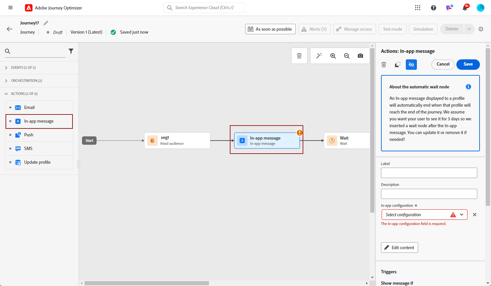

# 在历程中创建应用程序内消息 {#create-in-app-journey}

1. 打开您的历程，然后拖放 **[!UICONTROL 应用程序内]** 中的活动 **[!UICONTROL 操作]** 面板的部分。

   当用户档案到达其历程终点时，显示给用户档案的任何应用程序内消息都将自动过期。 因此，等待活动会自动添加到应用程序内活动之后，以确保正确计时。

   

1. 输入 **[!UICONTROL 标签]** 和 **[!UICONTROL 描述]** 你的留言。

1. 选择 [应用程序内表面](inapp-configuration.md) 以使用。

   

1. 您现在可以使用开始设计内容 **[!UICONTROL 编辑内容]** 按钮。 [了解详情](design-in-app.md)

1. 单击 **[!UICONTROL 编辑触发器]** 以配置触发器。

   

1. 从 **[!UICONTROL 应用程序内消息触发器]** 窗口中，选择将触发消息的事件和条件：

   1. 单击 **[!UICONTROL 添加条件]** 您希望触发器考虑多个事件或标准。
   1. 从 **[!UICONTROL 选择事件]** 下拉列表中，选择触发器的事件类型。
   1. 选择事件的链接方式，例如，选择 **[!UICONTROL 和]** 如果您愿意 **两者** 触发器为true，以便显示或选择消息 **[!UICONTROL 或]** 如果您希望显示消息，如果 **任一** 的触发条件为真。
   1. 单击 **[!UICONTROL 创建组]** 将触发器组合在一起。

   

1. 选择应用程序内消息处于活动状态时触发的频率：

   * **[!UICONTROL 每次]**：当在中选择了事件时，始终显示消息 **[!UICONTROL 移动应用程序触发器]** 出现下拉列表。
   * **[!UICONTROL 一次]**：仅在第一次在中选择事件时显示此消息 **[!UICONTROL 移动应用程序触发器]** 出现下拉列表。
   * **[!UICONTROL 点进之前]**：当在中选择事件时显示此消息 **[!UICONTROL 移动应用程序触发器]** 在SDK通过“已单击”操作发送交互事件之前，将会出现下拉列表。
   * **[!UICONTROL X次数]**：仅显示消息的特定次数，具体次数由中设置的值决定。 **[!UICONTROL 显示时间]** 字段。

1. 选择一周中的哪一天以及您希望触发应用程序内消息的特定时间，然后单击 **[!UICONTROL 保存]**.

1. 如有必要，请通过拖放其他操作或事件来完成旅程流。 [了解详情](../building-journeys/about-journey-activities.md)

1. 应用程序内消息准备就绪后，完成配置并发布历程以激活它。

有关如何配置旅程的更多信息，请参阅 [此页面](../building-journeys/journey-gs.md).

## 应用程序内活动限制 {#in-app-activity-limitations}

* 此功能目前不适用于医疗保健客户。

* 个性化只能包含配置文件属性。

* 应用程序内显示绑定到历程生命周期，这意味着当历程针对某个用户档案结束时，该历程中的所有应用程序内消息将不再显示该用户档案。  因此，无法直接从历程活动中停止应用程序内消息。 相反，您需要结束整个历程，以停止将应用程序内消息显示给用户档案。

* 在测试模式下，应用程序内显示取决于历程的有效期。 要防止历程在测试期间过早结束，请调整 **[!UICONTROL 等待时间]** 值 **[!UICONTROL 等待]** 活动。

* **[!UICONTROL 反应]** 活动无法用于对应用程序内打开或单击作出反应。

* 从用户配置文件到达画布中的应用程序内活动到开始看到应用程序内消息时，可能会发生激活延迟。

## 应用程序内报告 {#inapp-report}

从您的历程 **[!UICONTROL 全局报告]**，则 **[!UICONTROL 应用程序内]** 选项卡详细列出了与历程中发送的应用程序内投放相关的主要信息。

详细了解 [历程全局报告](../reports/journey-global-report.md).

+++了解有关可用于应用程序内报表的不同量度和小部件的更多信息。

此 **[!UICONTROL 应用程序内性能]** KPI详细列出与访客对应用程序内消息的参与度相关的主要信息，例如：

* **[!UICONTROL 独特展示次数]**：向其传递应用程序内消息的独特用户数。

* **[!UICONTROL 展示次数]**：交付给所有用户的应用程序内消息总数。

* **[!UICONTROL 点击率]**：与查看了消息的用户相比，与应用程序内消息中包含的按钮进行交互的用户百分比。

* **[!UICONTROL 解除率]**：收件人已解除的应用程序内消息的百分比。

此 **[!UICONTROL 应用程序内摘要]** 图形可显示相关时段内应用程序内展示的演变。

此 **[!UICONTROL 按按钮显示的点击次数]** 图表和表包含每个按钮的收件人行为的可用数据：

* **[!UICONTROL 点击次数]**：与应用程序内消息中包含的按钮进行交互的收件人总数。

* **[!UICONTROL 点击率]**：与查看了消息的用户相比，与应用程序内消息中包含的按钮进行交互的用户百分比。
+++

**相关主题：**

* [设计应用程序内消息](design-in-app.md)
* [测试并发送应用程序内消息](send-in-app.md)
* [应用程序内报告](../reports/campaign-global-report.md#inapp-report)
* [应用程序内配置](inapp-configuration.md)
