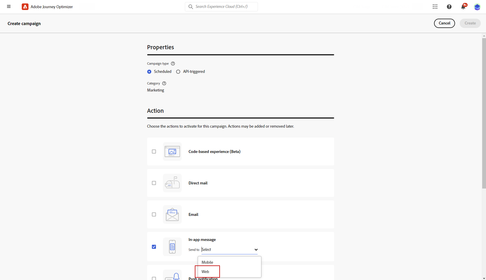
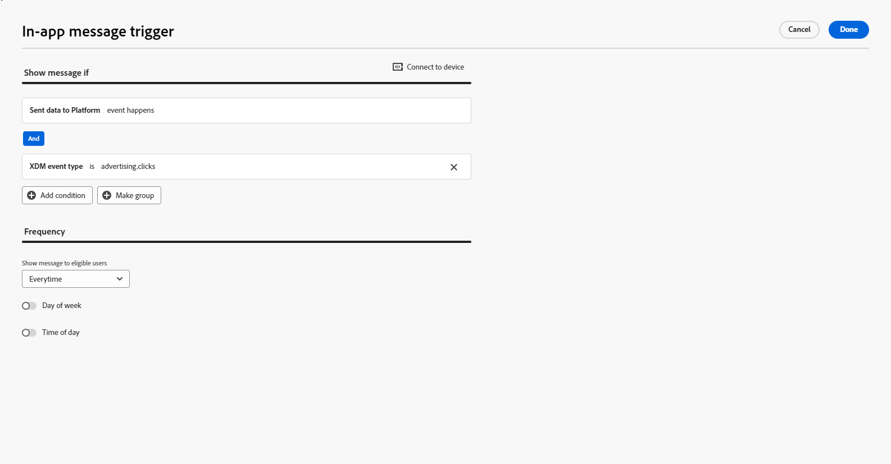

# 创建 Web 应用程序内消息 {#create-in-app-web}

## 配置Web应用程序内渠道 {#configure-web-inapp}

要设置Web应用程序内渠道，请执行以下步骤：

* 安装Web SDK标记扩展以支持Web应用程序内消息传递。 [了解详情](https://experienceleague.adobe.com/docs/experience-platform/tags/extensions/client/web-sdk/web-sdk-extension-configuration.html?lang=en)

* 自定义触发器。 Web应用程序内消息传送支持两种类型的触发器：将数据发送到平台和手动触发器。 [了解详情](https://experienceleague.adobe.com/docs/experience-platform/edge/personalization/ajo/web-in-app-messaging.html)

* 创建您的Web应用程序内配置。 [了解详情](inapp-configuration.md)

## 创建您的Web应用程序内消息促销活动 {#create-inapp-web-campaign}

1. 访问&#x200B;**[!UICONTROL 营销活动]**&#x200B;菜单，然后单击&#x200B;**[!UICONTROL 创建营销活动]**。

1. 选择您的活动执行类型：已计划或API触发。 在[此页面](../campaigns/create-campaign.md#campaigntype)上了解有关营销活动类型的更多信息。

1. 从&#x200B;**[!UICONTROL 操作]**&#x200B;下拉列表中选择&#x200B;**[!UICONTROL 应用程序内消息]**。

   

1. 选择或创建您的应用程序配置。 [了解详情](inapp-configuration.md#channel-prerequisites)

## 定义您的Web应用程序内消息促销活动 {#configure-inapp}

1. 从&#x200B;**[!UICONTROL 属性]**&#x200B;部分，输入&#x200B;**[!UICONTROL 标题]**&#x200B;和&#x200B;**[!UICONTROL 描述]**&#x200B;描述。

1. 要将自定义或核心数据使用标签分配给应用程序内消息，请选择&#x200B;**[!UICONTROL 管理访问权限]**。 [了解详情](../administration/object-based-access.md)。

1. 单击&#x200B;**[!UICONTROL 选择受众]**&#x200B;按钮，从可用Adobe Experience Platform受众列表中定义要定位的受众。 [了解详情](../audience/about-audiences.md)。

   

1. 在&#x200B;**[!UICONTROL 身份命名空间]**&#x200B;字段中，选择要使用的命名空间，以便识别所选受众中的个人。 [了解详情](../event/about-creating.md#select-the-namespace)。

1. 在&#x200B;**[!UICONTROL 操作]**&#x200B;菜单中，您可以找到以前配置为&#x200B;**[!UICONTROL 应用程序配置]**&#x200B;的设置。 您可以在此处进行必要更改，或单击&#x200B;**[!UICONTROL 编辑规则]**&#x200B;来更新规则。

1. 单击&#x200B;**[!UICONTROL 创建试验]**&#x200B;开始配置内容试验并创建处理以测量其性能并为目标受众确定最佳选项。 [了解详情](../content-management/content-experiment.md)

1. 单击&#x200B;**[!UICONTROL 编辑触发器]**&#x200B;以选择将触发消息的事件和条件。 规则构建器使用户能够指定标准和值，这些标准和值在满足时触发一组操作，如发送应用程序内消息。

   1. 如果需要，单击事件下拉列表以更改触发器。

      +++请参阅可用的触发器。

      | 包 | 触发器 | 定义 |
      |---|---|---|
      | 平台 | 将数据发送到Platform | 在移动设备应用程序发出边缘体验事件以将数据发送到Adobe Experience Platform时触发。 API通常会从AEP Edge扩展调用[sendEvent](https://developer.adobe.com/client-sdks/documentation/edge-network/api-reference/#sendevent)。 |
      | 手动 | 手动触发器 | 两个关联的数据元素：键，是定义数据集的常量（例如，性别、颜色、价格）；值，是属于数据集的变量（例如，男性/女性、绿色、100）。 |

+++

   1. 如果希望触发器考虑多个事件或条件，请单击&#x200B;**[!UICONTROL 添加条件]**。

   1. 如果要添加更多&#x200B;**[!UICONTROL 触发器]**，请选择&#x200B;**[!UICONTROL 或]**&#x200B;条件以进一步扩展规则。

      

   1. 如果要添加自定义&#x200B;**[!UICONTROL 特征]**&#x200B;并更好地优化规则，请选择&#x200B;**[!UICONTROL 和]**&#x200B;条件。

      +++查看可用的特征。

      | 包 | 特征 | 定义 |
      |---|---|---|
      | 平台 | XDM事件类型 | 当满足指定的事件类型时触发。 |
      | 平台 | XDM值 | 当满足指定的XDM值时触发。 |

+++

      

   1. 单击“**[!UICONTROL 创建组]**”将触发器组合在一起。

1. 选择应用程序内消息处于活动状态时触发的频率。 可以使用以下选项：

   * **[!UICONTROL Everytime]**：当在&#x200B;**[!UICONTROL 移动设备应用程序触发器]**&#x200B;下拉列表中选定的事件发生时，始终显示消息。
   * **[!UICONTROL 一次]**：仅在首次在&#x200B;**[!UICONTROL 移动设备应用程序触发器]**&#x200B;下拉列表中发生选定的事件时显示此消息。
   * **[!UICONTROL 点进之前]**：当在&#x200B;**[!UICONTROL 移动设备应用程序触发器]**&#x200B;下拉列表中选择的事件发生时，显示此消息，直到SDK发送了一个交互事件，并且执行了“已点击”操作。
   * **[!UICONTROL X次]**：显示此消息X次。

1. 如果需要，请选择在一周中哪一天&#x200B;]**或哪一天**[!UICONTROL &#x200B;时间&#x200B;]**显示应用程序内消息。**[!UICONTROL 

1. 营销活动旨在按特定日期或循环频率执行。 在[本节](../campaigns/create-campaign.md#schedule)中了解如何配置促销活动的&#x200B;**[!UICONTROL 计划]**。

   

1. 您现在可以使用&#x200B;**[!UICONTROL 编辑内容]**&#x200B;按钮开始设计内容。 [了解详情](design-in-app.md)

   

**相关主题：**

* [测试并发送应用程序内消息](send-in-app.md)
* [应用程序内报告](../reports/campaign-global-report-cja-inapp.md)
* [应用程序内配置](inapp-configuration.md)
