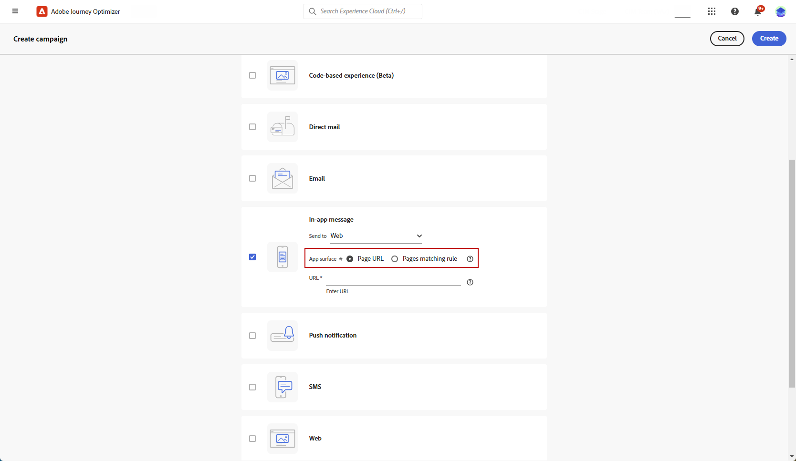

# 创建 Web 应用程序内消息 {#create-in-app-web}

## 配置Web应用程序内渠道 {#configure-web-inapp}

要设置Web应用程序内渠道，请执行以下步骤：

* 安装Web SDK标记扩展以支持Web应用程序内消息传递。 [了解详情](https://experienceleague.adobe.com/docs/experience-platform/tags/extensions/client/web-sdk/web-sdk-extension-configuration.html?lang=en)

* 自定义触发器。 Web应用程序内消息传送支持两种类型的触发器：将数据发送到平台和手动触发器。 [了解详情](https://experienceleague.adobe.com/docs/experience-platform/edge/personalization/ajo/web-in-app-messaging.html)

## 创建您的Web应用程序内消息促销活动 {#create-inapp-web-campaign}

1. 访问 **[!UICONTROL 营销活动]** 菜单，然后单击 **[!UICONTROL 创建营销活动]**.

1. 在 **[!UICONTROL 属性]** 部分，选择何时执行营销活动：计划或API触发。 了解中促销活动类型的更多信息 [此页面](../campaigns/create-campaign.md#campaigntype).

1. 在 **[!UICONTROL 操作]** 部分，选择 **[!UICONTROL 应用程序内消息]**. 从 **[!UICONTROL 发送至]** 下拉列表，选择Web。

   

1. 定义应用程序表面。 进行更改有两个选项：

   * 您可以输入 **[!UICONTROL 页面URL]** 将更改应用到特定页面。

   * 您可以创建一个规则来定位遵循相同模式的多个URL。

+++ 如何构建页面匹配规则。

      1. 选择 **[!UICONTROL 页面匹配规则]** 作为应用程序表面。
      1. 单击 **[!UICONTROL 创建规则]**.

         

      1. 在 **[!UICONTROL 编辑表面规则]** 窗口，定义您的标准 **[!UICONTROL 域]** 和 **[!UICONTROL 页面]** 字段。
      1. 从“条件”下拉列表中，进一步将您的条件个性化。

         例如，在本例中，要编辑显示在Luma网站所有销售产品页面上的元素，请选择域>开头为> Luma和页面>包含>销售。

         

      1. 保存您的更改。该规则显示在 **[!UICONTROL 创建营销活动]** 屏幕。

+++

   

1. 选择并配置应用程序表面后，单击 **[!UICONTROL 创建]**.

## 定义您的Web应用程序内消息促销活动 {#configure-inapp}

1. 从 **[!UICONTROL 属性]** 部分，输入 **[!UICONTROL 标题]** 和 **[!UICONTROL 描述]** 描述。

1. 要将自定义或核心数据使用标签分配给应用程序内消息，请选择 **[!UICONTROL 管理访问权限]**. [了解详情](../administration/object-based-access.md)。

1. 单击 **[!UICONTROL 选择受众]** 按钮，从可用的Adobe Experience Platform受众列表中定义要定位的受众。 [了解详情](../audience/about-audiences.md)。

   

1. 在 **[!UICONTROL 身份命名空间]** 字段中，选择要使用的命名空间，以便识别所选受众中的个人。 [了解详情](../event/about-creating.md#select-the-namespace)。

1. 在 **[!UICONTROL 操作]** 菜单下，您可以找到之前配置为 **[!UICONTROL 应用程序表面]**. 您可以在此处进行必要更改，或通过单击以更新规则 **[!UICONTROL 编辑规则]**.

1. 单击 **[!UICONTROL 创建试验]** 开始配置内容实验并创建处理方式以测量其性能并为目标受众确定最佳选项。 [了解详情](../content-management/content-experiment.md)

1. 单击 **[!UICONTROL 编辑触发器]** 以选择触发消息的事件和条件。 规则构建器使用户能够指定标准和值，这些标准和值在满足时触发一组操作，如发送应用程序内消息。

   1. 如果需要，单击事件下拉列表以更改触发器。

      +++请参阅可用的触发器。

      | 包 | 触发器 | 定义 |
      |---|---|---|
      | 平台 | 将数据发送到Platform | 在移动设备应用程序发出边缘体验事件以将数据发送到Adobe Experience Platform时触发。 通常是API调用 [sendEvent](https://developer.adobe.com/client-sdks/documentation/edge-network/api-reference/#sendevent) AEP Edge扩展中的。 |
      | 手动 | 手动触发器 | 两个关联的数据元素：键，是定义数据集的常量（例如，性别、颜色、价格）；值，是属于数据集的变量（例如，男性/女性、绿色、100）。 |

+++

   1. 单击 **[!UICONTROL 添加条件]** 如果希望触发器考虑多个事件或标准。

   1. 选择 **[!UICONTROL 或]** 条件（如果要添加更多） **[!UICONTROL 触发器]** 以进一步扩展您的规则。

      

   1. 选择 **[!UICONTROL 和]** 条件（如果要添加自定义） **[!UICONTROL 特征]** 并且更好地调整你的规则。

      +++查看可用的特征。

      | 包 | 特征 | 定义 |
      |---|---|---|
      | 平台 | XDM事件类型 | 当满足指定的事件类型时触发。 |
      | 平台 | XDM值 | 当满足指定的XDM值时触发。 |
+++

      

   1. 单击 **[!UICONTROL 创建组]** 将触发器组合在一起。

1. 选择应用程序内消息处于活动状态时触发的频率。 可以使用以下选项：

   * **[!UICONTROL Everytime]**：始终显示所选事件时的消息 **[!UICONTROL 移动应用程序触发器]** 出现下拉列表。
   * **[!UICONTROL 一次]**：仅在中首次选择事件时显示此消息 **[!UICONTROL 移动应用程序触发器]** 出现下拉列表。
   * **[!UICONTROL 点进之前]**：当在中选择事件时显示此消息 **[!UICONTROL 移动应用程序触发器]** 在SDK通过“已单击”操作发送交互事件之前，将会出现下拉列表。
   * **[!UICONTROL X次数]**：此消息显示X次。

1. 如果需要，请选择所需的 **[!UICONTROL 星期几]** 或 **[!UICONTROL 时间]** 此时将显示应用程序内消息。

1. 营销活动旨在按特定日期或循环频率执行。 了解如何配置 **[!UICONTROL 计划]** 中的促销活动 [本节](../campaigns/create-campaign.md#schedule).

   

1. 您现在可以使用开始设计内容 **[!UICONTROL 编辑内容]** 按钮。 [了解详情](design-in-app.md)

   

**相关主题：**

* [测试并发送应用程序内消息](send-in-app.md)
* [应用程序内报告](../reports/campaign-global-report.md#inapp-report)
* [应用程序内配置](inapp-configuration.md)
