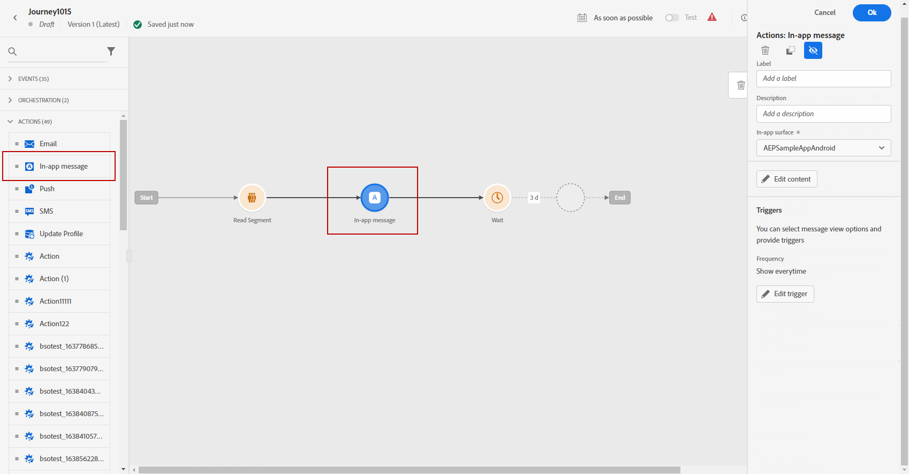
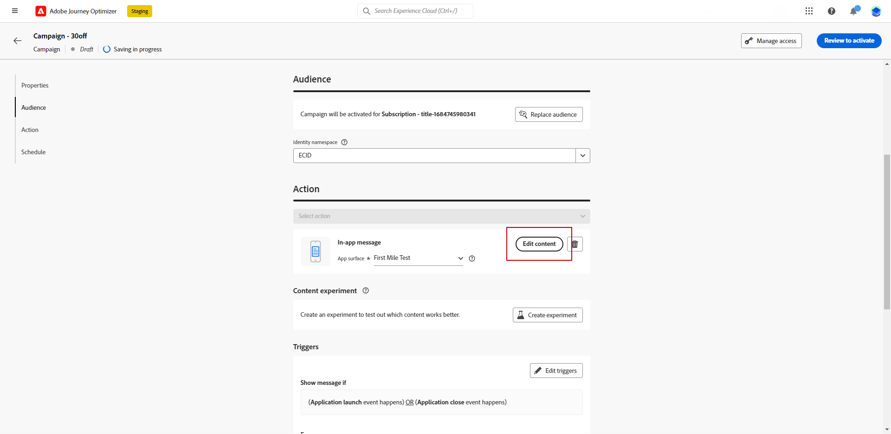

# 创建应用程序内消息 {#create-in-app}

>[!CONTEXTUALHELP]
>id="ajo_campaigns_inapp_triggers"
>title="管理应用程序内触发器"
>abstract="通过选择将激活消息的特定事件和标准，有效地控制触发器。利用规则生成器，用户可以定义精确的条件和值。当满足这些条件时，他们将启动一系列操作，包括投放应用程序内消息。"

您可以在营销活动或历程中添加应用程序内消息。 请按照下面详述的步骤在两个上下文中创建应用程序内消息。

>[!BEGINTABS]

>[!TAB 向历程添加应用程序内消息]

要在历程中添加应用程序内消息，请执行以下步骤：

1. 打开您的历程，然后拖放 **[!UICONTROL 应用程序内]** 中的活动 **[!UICONTROL 操作]** 面板的部分。

   当用户档案到达其历程结尾时，显示给他们的任何应用程序内消息都将自动过期。 因此，会在应用程序内活动后自动添加等待活动，以确保计时正确。

   

1. 输入 **[!UICONTROL 标签]** 和 **[!UICONTROL 描述]** 您的消息。

1. 选择 [应用程序内表面](inapp-configuration.md) 以使用。

   

1. 您现在可以使用开始设计内容 **[!UICONTROL 编辑内容]** 按钮。 [了解详情](design-in-app.md)

1. 单击 **[!UICONTROL 编辑触发器]** 以选择触发消息的事件和条件。 规则构建器使用户能够指定标准和值，这些标准和值在满足时触发一组操作，如发送应用程序内消息。

   

   1. 如果需要，单击事件下拉列表以更改触发器。

      +++请参阅可用的触发器。

      | 包 | 触发器 | 定义 |
      |---|---|---|
      | 将数据发送到Platform | 将数据发送到Platform | 在移动设备应用程序发出边缘体验事件以将数据发送到Adobe Experience Platform时触发。 通常是API调用 [sendEvent](https://developer.adobe.com/client-sdks/documentation/edge-network/api-reference/#sendevent) AEP Edge扩展中的。 |
      | 核心跟踪 | 跟踪操作 | 当移动代码API中提供旧版功能时触发 [trackAction](https://developer.adobe.com/client-sdks/documentation/mobile-core/api-reference/#trackaction) 称为。 |
      | 核心跟踪 | 跟踪状态 | 当移动代码API中提供旧版功能时触发 [trackState](https://developer.adobe.com/client-sdks/documentation/mobile-core/api-reference/#trackstate) 称为。 |
      | 核心跟踪 | 收集PII | 当移动代码API中提供旧版功能时触发 [collectPII](https://developer.adobe.com/client-sdks/documentation/mobile-core/api-reference/#collectpii) 称为。 |
      | 应用程序生命周期 | 应用程序启动 | 在每次运行时触发，包括崩溃次数和安装次数。在超出生命周期会话超时后，当从后台恢复应用程序时也会触发。 |
      | 应用程序生命周期 | 应用程序安装 | 安装或重新安装后，在首次运行时触发。 |
      | 应用程序生命周期 | 应用程序更新 | 升级后或版本号变更后，在首次运行时触发。 |
      | 应用程序生命周期 | 应用程序关闭 | 在应用程序关闭时触发。 |
      | 应用程序生命周期 | 应用程序崩溃 | 当应用程序在关闭前未转入后台时触发。当应用程序在崩溃后启动时会发送该事件。 Adobe Mobile 崩溃报告不实施全局未捕获异常处理程序。 |
      | Places | 输入POI | 在您的客户进入您配置的目标点(POI)时，由Places SDK触发。 |
      | Places | 退出POI | 在您的客户退出您配置的目标点(POI)时，由Places SDK触发。 |

+++

   1. 单击 **[!UICONTROL 添加条件]** 如果希望触发器考虑多个事件或标准。

   1. 选择 **[!UICONTROL 或]** 条件（如果要添加更多） **[!UICONTROL 触发器]** 以进一步扩展您的规则。

      

   1. 选择 **[!UICONTROL 和]** 条件（如果要添加） **[!UICONTROL 特征]** 并且更好地调整你的规则。

      +++查看可用的特征。

      | 包 | 特征 | 定义 |
      |---|---|---|
      | 设备信息 | 运营商名称 | 当满足列表中的运营商名称之一时触发。 |
      | 设备信息 | 设备名称 | 当满足设备名称之一时触发。 |
      | 设备信息 | 区域设置 | 当满足列表中的一种语言时触发。 |
      | 设备信息 | 操作系统版本 | 当满足指定的操作系统版本之一时触发。 |
      | 设备信息 | 以前的操作系统版本 | 当满足指定的先前操作系统版本之一时触发。 |
      | 设备信息 | 运行模式 | 如果运行模式为应用程序或扩展，则会触发。 |
      | 应用程序生命周期 | 应用程序ID | 当满足指定的应用程序ID时触发。 |
      | 应用程序生命周期 | 每周的某一日 | 当满足一周中的指定日期时触发。 |
      | 应用程序生命周期 | 首次使用后间隔天数 | 当满足自首次使用以来的指定天数时触发。 |
      | 应用程序生命周期 | 上次使用后间隔天数 | 当满足自上次使用后指定的天数时触发。 |
      | 应用程序生命周期 | 升级后间隔天数 | 当满足自上次升级以来的指定天数时触发。 |
      | 应用程序生命周期 | 安装日期 | 当满足指定的安装日期时触发。 |
      | 应用程序生命周期 | 启动次数 | 当满足指定的启动次数时触发。 |
      | 应用程序生命周期 | 一天中的时间 | 当满足指定的时间时触发。 |
      | Places | 当前POI | 在您的客户进入指定的目标点(POI)时，由Places SDK触发。 |
      | Places | 上次进入的POI | 由Places SDK触发，具体取决于客户上次输入的目标点(POI)。 |
      | Places | 上次退出的POI | 由Places SDK触发，具体取决于您的客户上次退出兴趣点(POI)。 |

+++

      

   1. 单击 **[!UICONTROL 创建组]** 将触发器组合在一起。

      

   1. 选择应用程序内消息处于活动状态时触发的频率：

      * **[!UICONTROL 每次都显示]**：始终显示所选事件时的消息 **[!UICONTROL 移动应用程序触发器]** 出现下拉列表。
      * **[!UICONTROL 显示一次]**：仅在中首次选择事件时显示此消息 **[!UICONTROL 移动应用程序触发器]** 出现下拉列表。
      * **[!UICONTROL 显示直至点进]**：当在中选择事件时显示此消息 **[!UICONTROL 移动应用程序触发器]** 在SDK通过“已单击”操作发送交互事件之前，将会出现下拉列表。

1. 如有必要，请通过拖放其他操作或事件来完成旅程流程。 [了解详情](../building-journeys/about-journey-activities.md)

1. 应用程序内消息就绪后，完成配置并发布历程以激活它。

有关如何配置旅程的更多信息，请参阅 [此页面](../building-journeys/journey-gs.md).

>[!TAB 向营销活动添加应用程序内消息]

要在营销策划中添加应用程序内消息，请执行以下步骤：

1. 访问 **[!UICONTROL 营销活动]** 菜单，然后单击 **[!UICONTROL 创建营销活动]**.

1. 在 **[!UICONTROL 属性]** 部分，选择何时执行营销活动：计划或API触发。 了解中促销活动类型的更多信息 [此页面](../campaigns/create-campaign.md#campaigntype).

1. 在 **[!UICONTROL 操作]** 部分，选择 **[!UICONTROL 应用程序内消息]** 和 **[!UICONTROL 应用程序表面]** 之前已为您的应用程序内消息配置此功能。 然后，单击 **[!UICONTROL 创建]**.

   在中了解有关应用程序内配置的更多信息 [此页面](inapp-configuration.md).

   

1. 从 **[!UICONTROL 属性]** 部分，输入 **[!UICONTROL 标题]** 和 **[!UICONTROL 描述]** 描述。

1. 要将自定义或核心数据使用标签分配给应用程序内消息，请选择 **[!UICONTROL 管理访问权限]**. [了解详情](../administration/object-based-access.md)。

1. 单击 **[!UICONTROL 选择受众]** 按钮，从可用的Adobe Experience Platform受众列表中定义要定位的受众。 [了解详情](../audience/about-audiences.md)。

   

1. 在 **[!UICONTROL 身份命名空间]** 字段中，选择要使用的命名空间，以便识别所选受众中的个人。 [了解详情](../event/about-creating.md#select-the-namespace)。

1. 单击 **[!UICONTROL 创建试验]** 开始配置内容实验并创建处理方式以测量其性能并为目标受众确定最佳选项。 [了解详情](../campaigns/content-experiment.md)

1. 单击 **[!UICONTROL 编辑触发器]** 以选择触发消息的事件和条件。 规则构建器使用户能够指定标准和值，这些标准和值在满足时触发一组操作，如发送应用程序内消息。

   1. 如果需要，单击事件下拉列表以更改触发器。

      +++请参阅可用的触发器。

      | 包 | 触发器 | 定义 |
      |---|---|---|
      | 将数据发送到Platform | 将数据发送到Platform | 在移动设备应用程序发出边缘体验事件以将数据发送到Adobe Experience Platform时触发。 通常是API调用 [sendEvent](https://developer.adobe.com/client-sdks/documentation/edge-network/api-reference/#sendevent) AEP Edge扩展中的。 |
      | 核心跟踪 | 跟踪操作 | 当移动代码API中提供旧版功能时触发 [trackAction](https://developer.adobe.com/client-sdks/documentation/mobile-core/api-reference/#trackaction) 称为。 |
      | 核心跟踪 | 跟踪状态 | 当移动代码API中提供旧版功能时触发 [trackState](https://developer.adobe.com/client-sdks/documentation/mobile-core/api-reference/#trackstate) 称为。 |
      | 核心跟踪 | 收集PII | 当移动代码API中提供旧版功能时触发 [collectPII](https://developer.adobe.com/client-sdks/documentation/mobile-core/api-reference/#collectpii) 称为。 |
      | 应用程序生命周期 | 应用程序启动 | 在每次运行时触发，包括崩溃次数和安装次数。在超出生命周期会话超时后，当从后台恢复应用程序时也会触发。 |
      | 应用程序生命周期 | 应用程序安装 | 安装或重新安装后，在首次运行时触发。 |
      | 应用程序生命周期 | 应用程序更新 | 升级后或版本号变更后，在首次运行时触发。 |
      | 应用程序生命周期 | 应用程序关闭 | 在应用程序关闭时触发。 |
      | 应用程序生命周期 | 应用程序崩溃 | 当应用程序在关闭前未转入后台时触发。当应用程序在崩溃后启动时会发送该事件。 Adobe Mobile 崩溃报告不实施全局未捕获异常处理程序。 |
      | Places | 输入POI | 在您的客户进入您配置的目标点(POI)时，由Places SDK触发。 |
      | Places | 退出POI | 在您的客户退出您配置的目标点(POI)时，由Places SDK触发。 |

+++

   1. 单击 **[!UICONTROL 添加条件]** 如果希望触发器考虑多个事件或标准。

   1. 选择 **[!UICONTROL 或]** 条件（如果要添加更多） **[!UICONTROL 触发器]** 以进一步扩展您的规则。

      

   1. 选择 **[!UICONTROL 和]** 条件（如果要添加） **[!UICONTROL 特征]** 并且更好地调整你的规则。

      +++查看可用的特征。

      | 包 | 特征 | 定义 |
      |---|---|---|
      | 设备信息 | 运营商名称 | 当满足列表中的运营商名称之一时触发。 |
      | 设备信息 | 设备名称 | 当满足设备名称之一时触发。 |
      | 设备信息 | 区域设置 | 当满足列表中的一种语言时触发。 |
      | 设备信息 | 操作系统版本 | 当满足指定的操作系统版本之一时触发。 |
      | 设备信息 | 以前的操作系统版本 | 当满足指定的先前操作系统版本之一时触发。 |
      | 设备信息 | 运行模式 | 如果运行模式为应用程序或扩展，则会触发。 |
      | 应用程序生命周期 | 应用程序ID | 当满足指定的应用程序ID时触发。 |
      | 应用程序生命周期 | 每周的某一日 | 当满足一周中的指定日期时触发。 |
      | 应用程序生命周期 | 首次使用后间隔天数 | 当满足自首次使用以来的指定天数时触发。 |
      | 应用程序生命周期 | 上次使用后间隔天数 | 当满足自上次使用后指定的天数时触发。 |
      | 应用程序生命周期 | 升级后间隔天数 | 当满足自上次升级以来的指定天数时触发。 |
      | 应用程序生命周期 | 安装日期 | 当满足指定的安装日期时触发。 |
      | 应用程序生命周期 | 启动次数 | 当满足指定的启动次数时触发。 |
      | 应用程序生命周期 | 一天中的时间 | 当满足指定的时间时触发。 |
      | Places | 当前POI | 在您的客户进入指定的目标点(POI)时，由Places SDK触发。 |
      | Places | 上次进入的POI | 由Places SDK触发，具体取决于客户上次输入的目标点(POI)。 |
      | Places | 上次退出的POI | 由Places SDK触发，具体取决于您的客户上次退出兴趣点(POI)。 |

+++

      

   1. 单击 **[!UICONTROL 创建组]** 将触发器组合在一起。

1. 选择应用程序内消息处于活动状态时触发的频率。 可以使用以下选项：

   * **[!UICONTROL Everytime]**：始终显示所选事件时的消息 **[!UICONTROL 移动应用程序触发器]** 出现下拉列表。
   * **[!UICONTROL 一次]**：仅在中首次选择事件时显示此消息 **[!UICONTROL 移动应用程序触发器]** 出现下拉列表。
   * **[!UICONTROL 点进之前]**：当在中选择事件时显示此消息 **[!UICONTROL 移动应用程序触发器]** 在SDK通过“已单击”操作发送交互事件之前，将会出现下拉列表。
   * **[!UICONTROL X次数]**：此消息显示X次。

1. 如果需要，请选择所需的 **[!UICONTROL 星期几]** 或 **[!UICONTROL 时间]** 此时将显示应用程序内消息。

1. 营销活动旨在按特定日期或循环频率执行。 了解如何配置 **[!UICONTROL 计划]** 中的促销活动 [本节](../campaigns/create-campaign.md#schedule).

   

1. 您现在可以使用开始设计内容 **[!UICONTROL 编辑内容]** 按钮。 [了解详情](design-in-app.md)

   

>[!ENDTABS]

## 操作说明视频{#video}

* 以下视频介绍了如何在营销活动中创建、配置和发布应用程序内消息。

  +++观看视频

  >[!VIDEO](https://video.tv.adobe.com/v/3410430?quality=12&learn=on)

+++

* 以下视频介绍了如何配置和分析A/B测试应用程序内消息的内容实验。

  +++观看视频

  >[!VIDEO](https://video.tv.adobe.com/v/3419898)

+++

* 以下视频介绍如何在历程中创建应用程序内消息以及如何测试和发布历程。

  +++观看视频

  >[!VIDEO](https://video.tv.adobe.com/v/3423077)

+++

**相关主题：**

* [设计应用程序内消息](design-in-app.md)
* [测试并发送应用程序内消息](send-in-app.md)
* [应用程序内报告](../reports/campaign-global-report.md#inapp-report)
* [应用程序内配置](inapp-configuration.md)