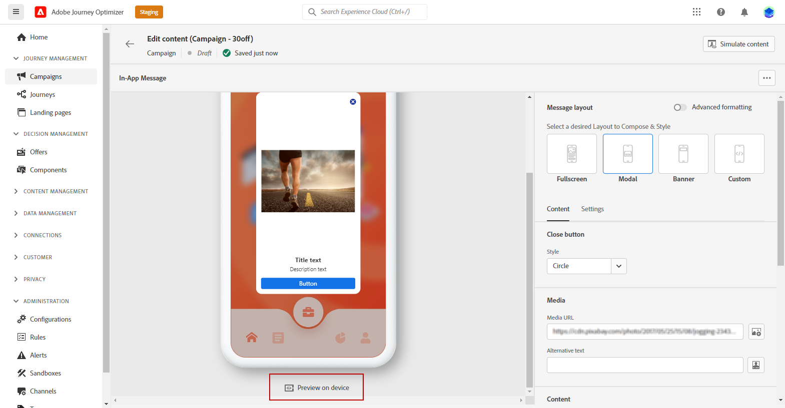

# 创建应用程序内消息 {#create-in-app}

>[!IMPORTANT]
>
>应用程序内功能当前仅作为测试版提供给选定用户。 要加入 Beta 版计划，请联系 Adobe 客户关怀团队。

## 创建营销活动和应用程序内消息{#create-in-app-in-a-campaign}

要创建应用程序内消息，请执行以下步骤：

1. 访问 **[!UICONTROL 促销活动]** 菜单，然后单击 **[!UICONTROL 创建营销活动]**.

1. 在 **[!UICONTROL 属性]** 部分，指定您希望何时执行营销活动。

1. 在 **[!UICONTROL 操作]** ，选择 **[!UICONTROL 应用程序内消息]** 和 **[!UICONTROL 应用程序界面]** 之前已为应用程序内消息配置。 然后，单击 **[!UICONTROL 创建]**.

   [了解有关应用程序内配置的更多信息](inapp-configuration.md).

   

1. 从 **[!UICONTROL 属性]** ，编辑营销活动的 **[!UICONTROL 标题]** 和 **[!UICONTROL 描述]**.

1. 要为登陆页面分配自定义或核心数据使用标签，请选择 **[!UICONTROL 管理访问权限]**. [了解详情](../administration/object-based-access.md)。

1. 单击 **[!UICONTROL 选择受众]** 按钮，以从可用的Adobe Experience Platform区段列表中定义要定位的受众。 [了解详情](../segment/about-segments.md)。

   

1. 在 **[!UICONTROL 身份命名空间]** 字段中，选择要用于识别选定区段中个人的命名空间。 [了解详情](../event/about-creating.md#select-the-namespace)。

1. 选择应用程序内消息处于活动状态时触发的频率：

   * **[!UICONTROL 每次显示]**:在 **[!UICONTROL 移动设备应用程序触发器]** 下拉列表。
   * **[!UICONTROL 显示一次]**:仅当在 **[!UICONTROL 移动设备应用程序触发器]** 下拉列表。
   * **[!UICONTROL 点进前显示]**:在 **[!UICONTROL 移动设备应用程序触发器]** 下拉列表，直到SDK通过“已单击”操作发送interact事件。

1. 从 **[!UICONTROL 移动设备应用程序触发器]** 下拉列表中，选择将触发消息的事件和标准：

   1. 从左下拉菜单中，选择触发消息所需的事件。
   1. 从右下拉菜单中，选择选定事件所需的验证。
   1. 单击 **[!UICONTROL 添加]** 按钮。 然后，重复上述步骤。
   1. 选择事件的链接方式，例如选择 **[!UICONTROL 和]** 如果您愿意 **both** 触发器为true，以便显示或选择消息 **[!UICONTROL 或]** 如果您希望在 **e** 触发器是真的。

   

1. 从 **[!UICONTROL 移动设备应用程序触发器]**
下拉菜单。

   通过选择触发器，您可以选择显示应用程序内消息的用户操作。

   

1. 营销活动设计为在特定日期或定期频率执行。 了解如何配置 **[!UICONTROL 计划]** 在 [此部分](../campaigns/create-campaign.md#schedule).

   

1. 您现在可以使用 **[!UICONTROL 编辑内容]** 按钮。

   

## 发送应用程序内消息{#in-app-send}

### 在设备上预览 {#preview-device}

您可以在特定设备中预览应用程序内通知。

1. 单击 **[!UICONTROL 在设备上预览]**.

   

1. 从 **[!UICONTROL 连接到设备]** 窗口，单击 **[!UICONTROL 开始]**.

1. 键入 **[!UICONTROL 基本URL]** ，单击 **[!UICONTROL 下一个]**.

   

1. 使用设备扫描二维码并输入显示的PIN码。

现在，您可以直接在设备上触发应用程序内消息，以便在实际设备上预览和查看消息。

### 查看并激活应用程序内通知{#in-app-review}

创建应用程序内消息并定义其内容并进行个性化后，您便可以查看并激活该消息。

为此，请执行以下步骤：

1. 使用 **[!UICONTROL 查看以激活]** 按钮以显示消息摘要。

   摘要允许您根据需要修改营销活动，并检查是否有参数不正确或缺失。

   

1. 检查营销活动配置是否正确，然后单击 **[!UICONTROL 激活]**.

您的营销活动现已激活。 营销活动中配置的应用程序内通知将立即发送，或在指定的日期发送。

发送后，您可以在营销活动报表中衡量应用程序内消息的影响。 有关报告的更多信息，请参考[此章节](../reports/campaign-global-report.md#inapp-report)。

**相关主题：**

* [设计应用程序内消息](design-in-app.md)
* [应用程序内报告](../reports/campaign-global-report.md#inapp-report)
* [应用程序内配置](inapp-configuration.md)

## 操作方法视频{#video}

以下视频演示如何在营销活动中创建、配置和发布应用程序内消息。

>[!VIDEO](https://video.tv.adobe.com/v/3410430?quality=12&learn=on)
