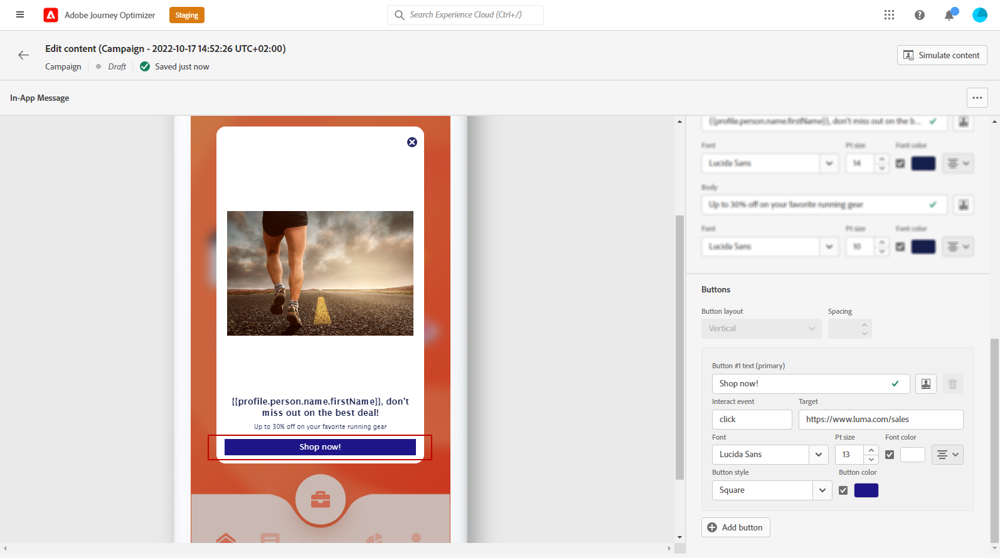
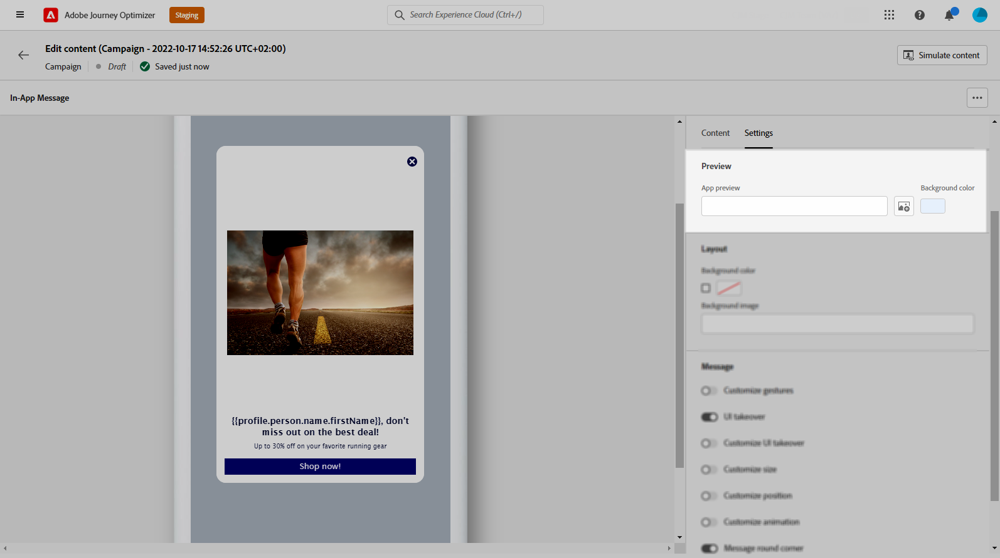

# 设计应用程序内内容 {#design-content}

>[!AVAILABILITY]
>
>应用程序内功能当前仅作为测试版提供给选定用户。 要加入 Beta 版计划，请联系 Adobe 客户关怀团队。

您可以编辑应用程序内内容以配置体验选项，包括消息布局和显示、文本和按钮选项。

要配置消息内容，请单击 **[!UICONTROL 编辑内容]** 按钮，然后使用屏幕右侧部分的选项来设计应用程序内消息内容。

的 **[!UICONTROL 高级格式]** 切换可激活其他选项以自定义体验。

创建应用程序内消息并定义其内容并进行个性化后，您便可以查看并激活该消息。 然后，将根据促销活动计划发送通知。 请参阅[此页面](create-in-app.md#in-app-send)以了解详情。

## 消息布局 {#message-layout}

从 **[!UICONTROL 消息布局]** ，请从四个不同的布局选项中选择一个，具体选项取决于您的消息传送需求。

* **[!UICONTROL 全屏]**:此类布局会覆盖受众设备的整个屏幕。

   此选项支持媒体（图像、视频）、文本和按钮组件。

* **[!UICONTROL 模态]**:此布局显示在大型警报样式窗口中，背景中仍可看到您的应用程序。

   此选项支持媒体（图像、视频）、文本和按钮组件。

* **[!UICONTROL 横幅]**:此类型的布局显示为本机操作系统警报消息。

   您只能添加 **[!UICONTROL 标题]** 和 **[!UICONTROL 正文]** 的URL。

* **[!UICONTROL 自定义]**:自定义消息模式允许您直接导入和编辑预配置的HTML消息之一。

   * 选择 **[!UICONTROL 撰写]** 输入或粘贴原始HTML代码。

      使用左窗格可利用Journey Optimizer个性化功能。 有关详细信息，请参阅[此部分](../personalization/personalize.md)。

   * 选择 **[!UICONTROL 导入]** 导入包含您的HTML内容的HTML或.zip文件。

## “内容”选项卡 {#content-tab}

从 **内容** 选项卡，您可以定义和个性化：通知的内容和 **关闭** 按钮。 您还可以向应用程序内通知添加媒体，并从此选项卡添加操作按钮。

### “关闭”按钮 {#close-button}

选择 **[!UICONTROL 样式]** 您的 **[!UICONTROL “关闭”按钮]**.

可用的样式包括：

* **[!UICONTROL 简单]**
* **[!UICONTROL 圆]**
* **[!UICONTROL 自定义图像]** 从媒体URL或您的资产。

+++更多具有高级格式的选项

如果 **[!UICONTROL 高级格式模式]** 已打开，您可以检查 **[!UICONTROL 颜色]** 选项来选择按钮的颜色和不透明度。

+++

### 媒体 {#add-media}

的 **[!UICONTROL 媒体]** 字段允许您向应用程序内消息中添加媒体，从而为最终用户创建引人入胜的体验。

键入您的媒体URL，或单击 **[!UICONTROL 选择资产]** 图标，可直接将存储在资产库中的资产添加到应用程序内消息。 [了解有关资产管理的更多信息](../email/assets-essentials.md).
您还可以添加 **[!UICONTROL 替换文本]** 屏幕读取应用程序。

+++更多具有高级格式的选项

如果 **[!UICONTROL 高级格式模式]** 已打开，您可以自定义 **[!UICONTROL 最大高度]** 和 **[!UICONTROL 最大宽度]** 你的媒体。

+++

### 标题和正文 {#title-body}

要撰写消息，请在 **[!UICONTROL 标题]** 和 **[!UICONTROL 正文]** 字段。

使用 **[!UICONTROL 个性化]** 图标以添加个性化。 在Adobe Journey Optimizer表达式编辑器中了解有关个性化的更多信息 [在此部分中](../personalization/personalize.md).

+++更多具有高级格式的选项

如果 **[!UICONTROL 高级格式模式]** 已打开，您可以 **[!UICONTROL 标题]** 和 **[!UICONTROL 正文]**:

* the **[!UICONTROL 字体]**
* the **[!UICONTROL Pt大小]**
* the **[!UICONTROL 字体颜色]**
* the **[!UICONTROL 对齐方式]**
+++

### 按钮 {#add-buttons}

为用户添加按钮以与应用程序内消息进行交互。

要个性化您的按钮，请执行以下操作：

1. 编辑按钮#1文本（主）字段。 您还可以使用 **[!UICONTROL 个性化]** 图标来定义内容和个性化数据。

1. 选择 **[!UICONTROL 交互事件]** 定义用户与按钮交互后按钮的操作。

1. 在 **[!UICONTROL Target]** 字段。

1. 要添加多个按钮，请单击 **[!UICONTROL “添加”按钮]**.

+++更多具有高级格式的选项

如果 **[!UICONTROL 高级格式模式]** 已打开，您可以 **[!UICONTROL 按钮]**:

* the **[!UICONTROL 字体]**
* the **[!UICONTROL Pt大小]**
* the **[!UICONTROL 字体颜色]**
* the **[!UICONTROL 对齐方式]**
* the **[!UICONTROL 按钮样式]**
* the **[!UICONTROL 半径]**
* the **[!UICONTROL 按钮颜色]**

+++

## “设置”选项卡 {#settings-tab}

从 **设置** 选项卡，您可以定义消息布局并预览应用程序内消息。 您还可以访问高级格式选项。

### 预览 {#preview-tab}

的 **[!UICONTROL 应用程序预览]** 用于在应用程序内消息后添加背景：

* 来自URL链接的媒体。

* 资产库中的资产。

* 背景颜色。

### 版式 {#layout-options}

的 **[!UICONTROL 背景图像]** 字段，可向应用程序内消息添加背景：

* 来自URL链接的媒体。

* 背景颜色。

### 消息 {#message-tab}

默认启用的UI接管选项允许您使应用程序内消息背景变暗，以强调对内容的关注。

+++更多具有高级格式的选项

如果 **[!UICONTROL 高级格式模式]** 启用后，您可以使用以下选项进一步个性化您的消息：

* **[!UICONTROL 自定义手势]**:允许您自定义用户轻扫交互的内容。 如果选择“取消”，则可以添加自定义交互事件和/或目标目标。

* **[!UICONTROL 自定义UI接管]**:用于选择要在背景中显示的颜色及其不透明度。

* **[!UICONTROL 自定义大小]**:允许您调整应用程序内通知的宽度和高度。

* **[!UICONTROL 自定义位置]**:允许您自定义应用程序内消息在用户屏幕上的位置。 您可以更改“垂直”和“水平”对齐方式。

* **[!UICONTROL 自定义动画]**:允许您自定义显示和取消动画，例如，如果您的应用程序内通知从用户设备的左侧或顶部显示。

* **[!UICONTROL 消息圆角]**:允许您通过更改 **[!UICONTROL 圆角半径]**.

+++

**相关主题：**

* [创建应用程序内消息](create-in-app.md)
* [应用程序内报告](../reports/campaign-global-report.md#inapp-report)
* [应用程序内配置](inapp-configuration.md)

## 操作方法视频{#video}

以下视频演示如何创作和测试应用程序内消息。

>[!VIDEO](https://video.tv.adobe.com/v/3410471?quality=12&learn=on)
