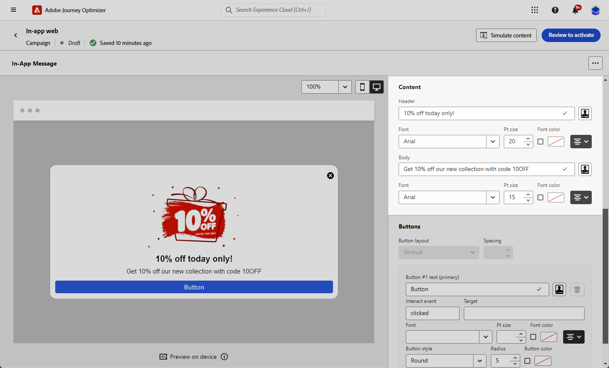

# 设计Web应用程序内内容 {#in-app-web-design}

>[!BEGINSHADEBOX]

**目录**

* [配置Web应用程序内渠道](configure-in-app-web.md)
* [创建您的Web应用程序内消息促销活动](create-in-app-web.md)
* 设计Web应用程序内内容

>[!ENDSHADEBOX]

要编辑应用程序内消息内容，请从营销活动的&#x200B;**[!UICONTROL 操作]**&#x200B;菜单中单击&#x200B;**[!UICONTROL 编辑内容]**&#x200B;按钮。

**[!UICONTROL 高级格式]**&#x200B;切换可激活其他选项以自定义体验。

创建应用程序内消息，并定义其内容并对其进行个性化后，即可查看和激活该消息。 然后，将根据营销活动计划发送通知。 在[此页面](send-in-app.md)上了解详情。

## 消息布局 {#message-layout}

从&#x200B;**[!UICONTROL 消息布局]**&#x200B;部分中，根据您的消息传送需求选择四个不同的布局选项之一。

* **[!UICONTROL 全屏]**：此类型的布局覆盖受众设备的整个屏幕。

  此选项支持媒体（图像、视频）、文本和按钮组件。

* **[!UICONTROL 模式]**：此布局显示在大型警报样式窗口中，背景中仍可看到您的应用程序。

  此选项支持媒体（图像、视频）、文本和按钮组件。

* **[!UICONTROL 横幅]**：此类型的布局显示为本机操作系统警报消息。

  您只能向消息添加&#x200B;**[!UICONTROL 标头]**&#x200B;和&#x200B;**[!UICONTROL 正文]**。

* **[!UICONTROL 自定义]**：自定义消息模式允许您直接导入和编辑预先配置的HTML消息之一。

   * 选择&#x200B;**[!UICONTROL 撰写]**&#x200B;以输入或粘贴原始HTML代码。

     使用左窗格以利用Journey Optimizer个性化功能。 有关详细信息，请参阅[此部分](../personalization/personalize.md)。

   * 选择&#x200B;**[!UICONTROL 导入]**&#x200B;以导入包含HTML内容的HTML或.zip文件。

## “内容”选项卡 {#content-tab}

从&#x200B;**Content**&#x200B;选项卡，您可以定义并个性化通知的内容和&#x200B;**关闭**&#x200B;按钮的样式。 您还可以向应用程序内通知添加媒体，并在此选项卡中添加操作按钮。

### “关闭”按钮 {#close-button}

选择&#x200B;**[!UICONTROL 关闭按钮]**&#x200B;的&#x200B;**[!UICONTROL 样式]**。

可用的样式包括：

* **[!UICONTROL 简单]**
* **[!UICONTROL 圆]**
* 来自媒体URL或您的Assets的&#x200B;**[!UICONTROL 自定义图像]**。

+++更多高级格式选项

如果&#x200B;**[!UICONTROL 高级格式模式]**&#x200B;已打开，则可以选中&#x200B;**[!UICONTROL 颜色]**&#x200B;选项来选择按钮的颜色和不透明度。

+++

### 媒体 {#add-media}

**[!UICONTROL Media]**&#x200B;字段允许您向应用程序内消息添加媒体，从而为最终用户创造引人入胜的体验。

键入您的媒体URL或单击&#x200B;**[!UICONTROL 选择Assets]**&#x200B;图标，直接将存储在Assets库中的资源添加到应用程序内消息中。 [了解有关资产管理的更多信息](../content-management/assets-essentials.md)。
您还可以为屏幕阅读应用程序添加**[!UICONTROL 替换文本]**。

+++更多高级格式选项

如果&#x200B;**[!UICONTROL 高级格式模式]**&#x200B;已打开，您可以自定义媒体的&#x200B;**[!UICONTROL 最大高度]**&#x200B;和&#x200B;**[!UICONTROL 最大宽度]**。

+++

### 内容 {#title-body}

若要撰写邮件，请在&#x200B;**[!UICONTROL 标头]**&#x200B;和&#x200B;**[!UICONTROL 正文]**&#x200B;字段中输入内容。

使用&#x200B;**[!UICONTROL Personalization]**&#x200B;图标添加个性化。 在本节](../personalization/personalize.md)中了解有关Adobe Journey Optimizer个性化编辑器[中个性化的更多信息。

+++更多高级格式选项

如果&#x200B;**[!UICONTROL 高级格式模式]**&#x200B;已打开，则可以选择&#x200B;**[!UICONTROL 标题]**&#x200B;和&#x200B;**[!UICONTROL 正文]**：

* **[!UICONTROL 字体]**
* **[!UICONTROL Pt大小]**
* **[!UICONTROL 字体颜色]**
* **[!UICONTROL 对齐方式]**
+++

### 按钮 {#add-buttons}

添加按钮以供用户与应用程序内消息进行交互。

要个性化您的按钮，请执行以下操作：

1. 编辑按钮#1文本（主）字段。 您还可以使用&#x200B;**[!UICONTROL Personalization]**&#x200B;图标来定义内容和个性化数据。

1. 选择您的&#x200B;**[!UICONTROL Interact事件]**，该事件定义用户与按钮交互后的按钮操作。

1. 在&#x200B;**[!UICONTROL 目标]**&#x200B;字段中输入您的Web URL或深层链接。

1. 要添加多个按钮，请单击&#x200B;**[!UICONTROL 添加按钮]**。

+++更多高级格式选项

如果&#x200B;**[!UICONTROL 高级格式模式]**&#x200B;已打开，则可以选择&#x200B;**[!UICONTROL 按钮]**：

* **[!UICONTROL 字体]**
* **[!UICONTROL Pt大小]**
* **[!UICONTROL 字体颜色]**
* **[!UICONTROL 对齐方式]**
* **[!UICONTROL 按钮样式]**
* **[!UICONTROL 半径]**
* **[!UICONTROL 按钮颜色]**

+++

## “设置”选项卡 {#settings-tab}

在&#x200B;**设置**&#x200B;选项卡中，您可以定义消息布局并预览应用程序内消息。 您还可以访问高级格式设置选项。

### 布局 {#layout-options}

**[!UICONTROL 背景图像]**&#x200B;字段允许您向应用程序内消息添加背景：

* URL链接中的媒体。

* 背景颜色。

### 消息 {#message-tab}

默认情况下，启用了UI接管选项，该选项允许您使应用程序内消息背后的背景变暗，以强调对内容的关注。

+++更多高级格式选项

如果&#x200B;**[!UICONTROL 高级格式化模式]**&#x200B;已打开，您可以使用以下选项进一步个性化您的消息：

* **[!UICONTROL 自定义UI接管]**：允许您选择要在后台显示的颜色及其不透明度。

* **[!UICONTROL 自定义大小]**：允许您调整应用内通知的宽度和高度。

* **[!UICONTROL 自定义位置]**：允许您自定义应用程序内消息在用户屏幕上的位置。 您可以更改垂直对齐和水平对齐。

* **[!UICONTROL 消息圆角]**：允许您通过更改&#x200B;**[!UICONTROL 圆角半径]**&#x200B;向应用程序内通知添加圆角。

+++

**相关主题：**

* [测试并发送应用程序内消息](send-in-app.md)
* [应用程序内报告](../reports/campaign-global-report-cja-inapp.md)
* [应用程序内配置](inapp-configuration.md)