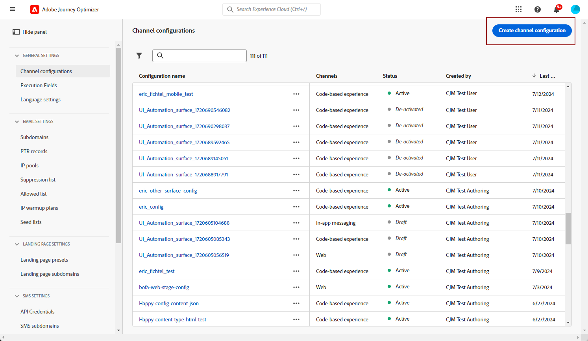

# 配置应用程序内渠道 {#inapp-configuration}

在发送应用程序内消息之前，您需要在中配置应用程序内渠道 [!DNL Adobe Experience Platform Data Collection].

1. 来自您的 [!DNL Adobe Experience Platform Data Collection] 帐户，访问 **[!UICONTROL 数据流]** 菜单并单击 **[!UICONTROL 新建数据流]**. 有关创建数据流的详细信息，请参阅 [此页面](https://experienceleague.adobe.com/docs/experience-platform/edge/datastreams/configure.html?lang=zh-Hans).

1. 选择 [!DNL Adobe Experience Platform] 服务。

   [!DNL Edge Segmentation] 和 [!DNL Adobe Journey Optimizer] 必须选中。

   

   >[!NOTE]
   >
   >要为应用程序内渠道启用内容实验，您需要确保 [数据集](../data/get-started-datasets.md) 已在您的应用程序内使用 [数据流](https://experienceleague.adobe.com/docs/experience-platform/datastreams/overview.html?lang=zh-Hans){target="_blank"} 您的报表配置中也会存在 — 否则，应用程序内数据将不会显示在内容试验报表中。 [了解如何添加数据集](../campaigns/reporting-configuration.md#add-datasets)
   >
   >数据集由 [!DNL Journey Optimizer] 并且不影响数据收集或数据摄取。

1. 然后，访问 **[!UICONTROL 应用程序表面]** 菜单并单击 **[!UICONTROL 创建应用程序表面]**.

   >[!NOTE]
   >
   > 您需要 **管理应用程序配置** 拥有访问 **[!UICONTROL 应用程序表面]** 菜单。 有关更多信息，请参阅 [此视频](#video).

   >[!NOTE]
   >
   > 您需要 **管理应用程序配置** 拥有访问 **[!UICONTROL 应用程序表面]** 菜单。 有关更多信息，请参阅 [此视频](#video).

   

1. 向添加名称 **[!UICONTROL 应用程序表面]**.

1. 从Apple iOS下拉列表中，键入您的 **iOS包ID**. 请参阅 [Apple文档](https://developer.apple.com/documentation/appstoreconnectapi/bundle_ids) 有关的详细信息 **捆绑ID**.

   

1. 从Android下拉列表中，键入 **Android包名称**. 请参阅 [Android文档](https://support.google.com/admob/answer/9972781?hl=en#:~:text=The%20package%20name%20of%20an,supported%20third%2Dparty%20Android%20stores) 有关的详细信息 **包名称**.

1. 单击 **[!UICONTROL 保存]** 当您完成 **[!UICONTROL 应用程序表面]**.

   

   您的 **[!UICONTROL 应用程序表面]** 现在，在创建具有应用程序内消息的新促销活动时将可用。 [了解详情](create-in-app.md)

1. 创建应用程序表面后，您现在需要创建移动资产。

   请参阅 [此页面](https://experienceleague.adobe.com/docs/experience-platform/tags/admin/companies-and-properties.html#for-mobile) 以了解详细过程。

   

1. 从新创建资产的“扩展”菜单中，安装以下扩展：

   * Adobe Experience Platform Edge Network
   * Adobe Journey Optimizer
   * AEP保证
   * 同意
   * 标识
   * 移动核心
   * 配置文件

   请参阅 [此页面](https://experienceleague.adobe.com/docs/experience-platform/tags/ui/extensions/overview.html#add-a-new-extension) 以了解详细过程。

   

应用程序内渠道现已配置。 您可以开始向用户发送应用程序内消息。

**相关主题：**

* [创建应用程序内消息](create-in-app.md)
* [创建营销活动](../campaigns/create-campaign.md)
* [设计应用程序内消息](design-in-app.md)
* [应用程序内报告](../reports/campaign-global-report.md#inapp-report)

## 操作说明视频{#video}

* 以下视频介绍了如何分配 **管理应用程序配置** 访问“应用程序表面”菜单的权限。

  +++观看视频

  >[!VIDEO](https://video.tv.adobe.com/v/3421607)

+++

