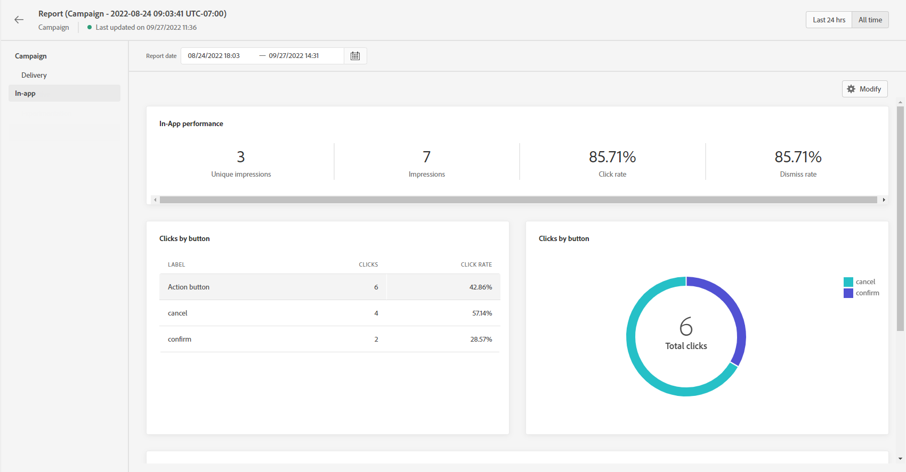

# 应用程序内报告 {#inapp-report}

应用程序内报表可在促销活动报表中找到。

将显示营销活动报表页面，其中包含以下选项卡：

* [Campaign](../reports/campaign-global-report.md#campaign-live)
* [电子邮件](../reports/campaign-global-report.md#email-live)
* [推送](../reports/campaign-global-report.md#push-live)
* [短信](../reports/campaign-global-report.md#sms-live)
* [应用程序内](#in-app-global)

营销活动 **[!UICONTROL 全局报告]** 会被分为不同的小组件，用于详细说明营销活动的成功和错误。 如果需要，可以调整每个小组件的大小并将其删除。 有关此内容的更多信息，请参阅此内容 [部分](../reports/global-report.md#modify-dashboard).

有关Adobe Journey Optimizer中可用的每个量度的详细列表，请参阅 [本页](../reports/global-report.md#list-of-components-global.md)

## 应用程序内选项卡 {#inapp-global}

从营销策划 **[!UICONTROL 全局报告]**, **[!UICONTROL 应用程序内]** 选项卡详细列出了与营销活动中发送的应用程序内投放相关的主要信息。

+++了解有关可用于应用程序内报表的不同量度和小组件的更多信息。

的 **[!UICONTROL 应用程序内性能]** KPI会详细描述与访客对应用程序内消息的参与度相关的主要信息，例如：

* **[!UICONTROL 独特展示次数]**:将应用程序内消息发送到的独特用户数。

* **[!UICONTROL 展示次数]**:发送给所有用户的应用程序内消息总数。

* **[!UICONTROL 点击率]**:与查看了消息的用户相比，与应用程序内消息中包含的按钮进行交互的用户百分比。

* **[!UICONTROL 取消率]**:收件人取消的应用程序内消息的百分比。

的 **[!UICONTROL 应用程序内摘要]** 图表显示相关时段内应用程序内展示次数的变化情况。

的 **[!UICONTROL 按按钮点击]** 图表和表格包含每个按钮的收件人行为可用数据：

* **[!UICONTROL 点击次数]**:与应用程序内消息中包含的按钮进行交互的收件人总数。

* **[!UICONTROL 点击率]**:与查看了消息的用户相比，与应用程序内消息中包含的按钮进行交互的用户百分比。
+++

**相关主题：**

* [创建应用程序内消息](../in-app/create-in-app.md)
* [设计应用程序内消息](../in-app/design-in-app.md)
* [应用程序内配置](../in-app/inapp-configuration.md)

>[!BEGINTABS]

>[!TAB 向历程添加推送]

1. 打开您的历程，然后从面板的“操作”部分拖放推送活动。

1. 提供有关消息的基本信息（标签、描述、类别），然后选择要使用的消息界面。

>[!TAB 向营销活动添加推送]

1. 创建新的计划营销活动或API触发的营销活动，选择 **[!UICONTROL 推送通知]** 作为您的操作，然后选择 **[!UICONTROL 应用程序界面]** 。

1. 单击&#x200B;**[!UICONTROL 创建]**。

1. 从 **[!UICONTROL 属性]** ，编辑营销活动的 **[!UICONTROL 标题]** 和 **[!UICONTROL 描述]**.

1. 单击 **[!UICONTROL 选择受众]** 按钮，以从可用的Adobe Experience Platform区段列表中定义要定位的受众。

1. 在 **[!UICONTROL 身份命名空间]** 字段中，选择要用于识别选定区段中个人的命名空间。

1. 营销活动设计为在特定日期或定期频率执行。 了解如何配置 **[!UICONTROL 计划]** 你的营销活动。

1. 从 **[!UICONTROL 操作触发器]** 菜单，选择 **[!UICONTROL 频率]** 在您的推送通知中：

   * 一次
   * 每日
   * 每周
   * 每月

>[!ENDTABS]

测试3:

1. 这是个测试

>[!BEGINTABS]

>[!TAB 向历程添加推送]

1. 打开您的历程，然后从面板的“操作”部分拖放推送活动。

1. 提供有关消息的基本信息（标签、描述、类别），然后选择要使用的消息界面。

>[!TAB 向营销活动添加推送]

1. 创建新的计划营销活动或API触发的营销活动，选择 **[!UICONTROL 推送通知]** 作为您的操作，然后选择 **[!UICONTROL 应用程序界面]** 。

1. 单击&#x200B;**[!UICONTROL 创建]**。

1. 从 **[!UICONTROL 属性]** ，编辑营销活动的 **[!UICONTROL 标题]** 和 **[!UICONTROL 描述]**.

1. 单击 **[!UICONTROL 选择受众]** 按钮，以从可用的Adobe Experience Platform区段列表中定义要定位的受众。

1. 在 **[!UICONTROL 身份命名空间]** 字段中，选择要用于识别选定区段中个人的命名空间。

1. 营销活动设计为在特定日期或定期频率执行。 了解如何配置 **[!UICONTROL 计划]** 你的营销活动。

1. 从 **[!UICONTROL 操作触发器]** 菜单，选择 **[!UICONTROL 频率]** 在您的推送通知中：

   * 一次
   * 每日
   * 每周
   * 每月

>[!ENDTABS]

1. 这是测试的一部分
