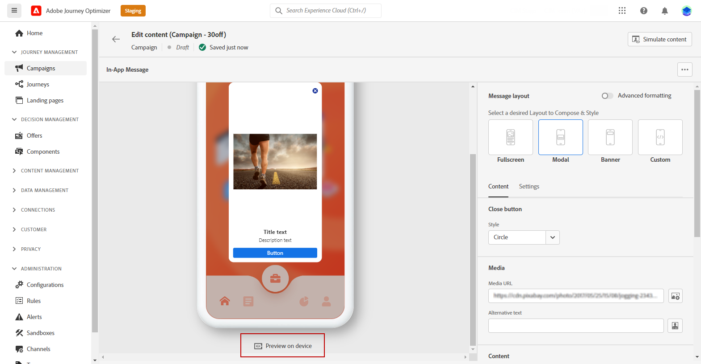
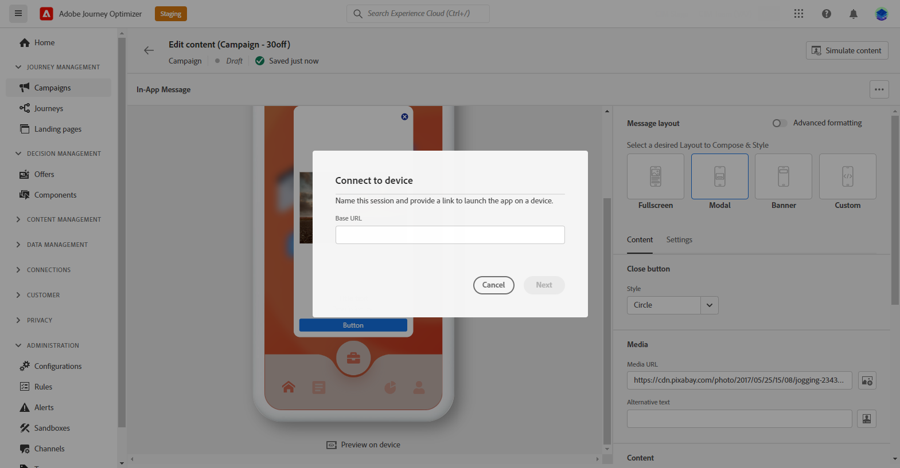
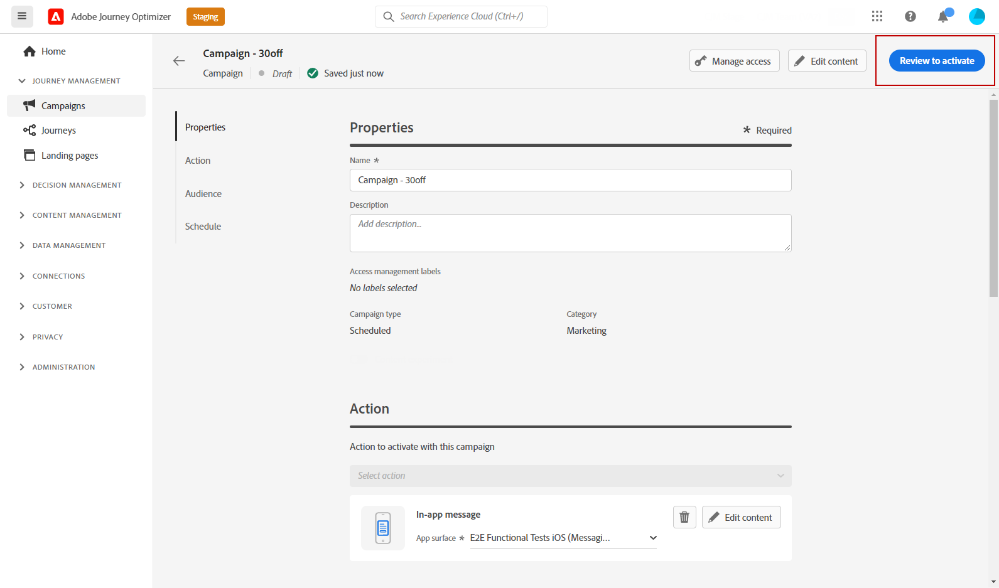

# 检查和发送应用程序内通知 {#create-in-app}

## 在设备上预览 {#preview-device}

如果您想在所有用户使用应用程序内通知之前查看一下该通知，则可以在特定设备上预览该通知。 利用此功能，您可以确保通知在选定设备上按预期外观和运行，从而为受众提供更好的用户体验。

为此，请执行以下步骤：

1. 单击&#x200B;**[!UICONTROL 在设备]**&#x200B;上预览。

   

1. 在&#x200B;**[!UICONTROL 连接到设备]**&#x200B;窗口中，单击&#x200B;**[!UICONTROL 启动]**。

1. 输入应用程序的&#x200B;**[!UICONTROL 基本URL]**，然后单击&#x200B;**[!UICONTROL 下一步]**。

   

1. 使用设备扫描二维码并输入显示的PIN码。

现在可以直接在设备上触发应用程序内消息，从而允许您在实际设备上预览和查看消息。

## 使用测试用户档案预览 {#simulate}

定义应用程序内消息后，您可以使用以下任一模拟方法预览该消息：

* 单击&#x200B;**[!UICONTROL 模拟内容]**&#x200B;以测试内容变体与样本输入数据或AI自动生成。 [了解如何模拟内容变体](../test-approve/simulate-sample-input.md)
* 单击&#x200B;**[!UICONTROL 模拟内容]**，然后从下拉列表中选择&#x200B;**[!UICONTROL 模拟内容（AEP配置文件）]**&#x200B;以使用测试配置文件进行预览，并添加测试配置文件以检查您的消息。

有关如何选择测试用户档案和预览内容的详细信息，请参阅[内容管理](../content-management/preview-test.md)部分。

## 查看并激活应用程序内通知{#in-app-review}

>[!IMPORTANT]
>
> 如果您的营销活动受批准政策的约束，则需要请求批准才能发送应用程序内通知。 [了解详情](../test-approve/gs-approval.md)

创建应用程序内消息、定义其内容并进行个性化后，您可以查看和激活该消息。

为此，请执行以下步骤：

1. 使用&#x200B;**[!UICONTROL 查看以激活]**&#x200B;按钮显示消息的摘要。

   利用该摘要，可根据需要修改营销策划，并检查参数是否不正确或缺失。

   

1. 检查营销活动是否正确配置，然后单击&#x200B;**[!UICONTROL 激活]**。

您的营销活动现已激活。 在营销活动中配置的应用程序内通知将立即发送，或者在指定日期发送。

发送后，您可以在促销活动或历程报表中衡量应用程序内消息的影响。 有关报告的更多信息，请参考[此章节](../reports/campaign-global-report-cja-inapp.md)。

**相关主题：**

* [创建应用程序内消息](create-in-app.md)
* [设计应用程序内消息](design-in-app.md)
* [应用程序内报告](../reports/campaign-global-report-cja-inapp.md)
* [应用程序内配置](inapp-configuration.md)
