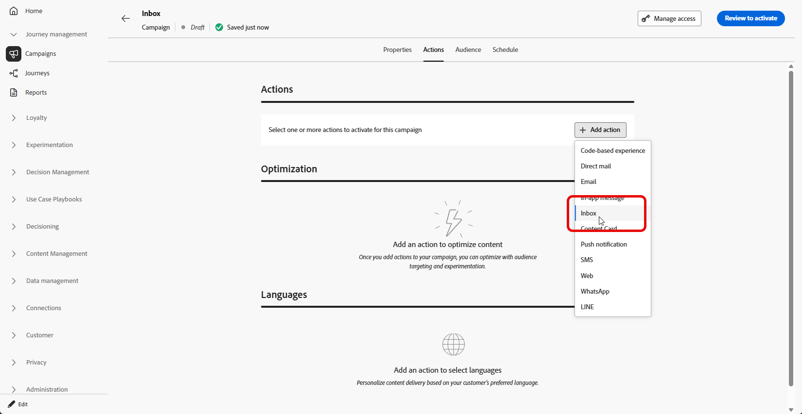

# 创建收件箱 {#inbox-create}

>[!BEGINSHADEBOX]

**在此页面上：**&#x200B;构建一个使用收件箱操作、定位受众以及计划或触发该操作的营销活动，以便您可以发送用户可在收件箱中重新访问的持久性消息。

>[!ENDSHADEBOX]

在创建收件箱之前，请先完成[收件箱配置](inbox-configuration.md)中的步骤。 渠道配置标识目标应用程序或网站、页面或规则以及呈现收件箱的位置。

要通过营销活动创建消息收件箱，请执行以下步骤：

1. 创建营销策划。 [了解详情](../campaigns/create-campaign.md)

1. 选择要执行的营销活动类型：

   * **[!UICONTROL 已计划 — 营销]**：立即或在指定日期执行营销活动。 计划的营销活动旨在发送&#x200B;**营销**&#x200B;消息。 它们从用户界面配置和执行。

   * **[!UICONTROL API触发 — 营销/事务性]**：使用API调用执行营销活动。 API触发的营销活动旨在发送&#x200B;**营销活动**&#x200B;或&#x200B;**事务性**&#x200B;消息，即在个人执行操作后发送的消息：密码重置、购物车购买等。[了解如何使用API触发营销活动](../campaigns/api-triggered-campaigns.md)

1. 在&#x200B;**[!UICONTROL 属性]**&#x200B;选项卡中，指定营销活动的名称和描述。

1. 从&#x200B;**[!UICONTROL 操作]**&#x200B;选项卡中，选择&#x200B;**[!UICONTROL 收件箱]**&#x200B;操作。

   

1. 选择或创建新的[收件箱配置](inbox-configuration.md)。

   

1. 访问“内容”选项卡以使用内容设计器设计消息。 [了解详情](inbox-design.md)

1. 在&#x200B;**[!UICONTROL 受众]**&#x200B;选项卡中，单击&#x200B;**[!UICONTROL 选择受众]**&#x200B;按钮以显示可用Adobe Experience Platform受众列表。 [了解有关受众](../audience/about-audiences.md)的更多信息

1. 在&#x200B;**[!UICONTROL 身份命名空间]**&#x200B;字段中，选择要使用的命名空间，以便识别所选区段中的个人。 [了解有关命名空间的更多信息](../event/about-creating.md#select-the-namespace)

1. 您可以将促销活动计划到特定日期，或设置为定期重复。 [了解详情](../campaigns/create-campaign.md#schedule)

1. 查看并激活您的营销活动以将消息发送到收件箱。

现在，您可以在创建[内容卡营销活动](../content-card/create-content-card.md)时选择此收件箱。
