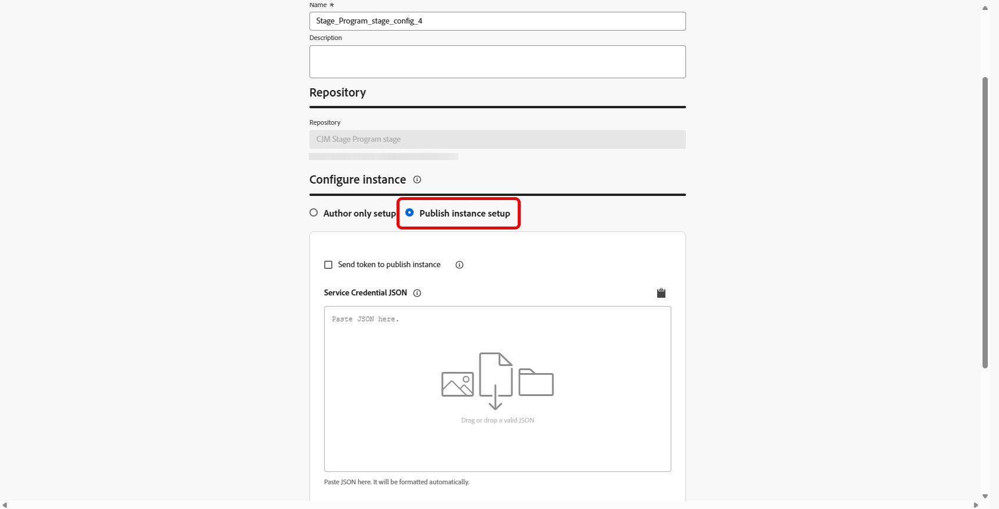
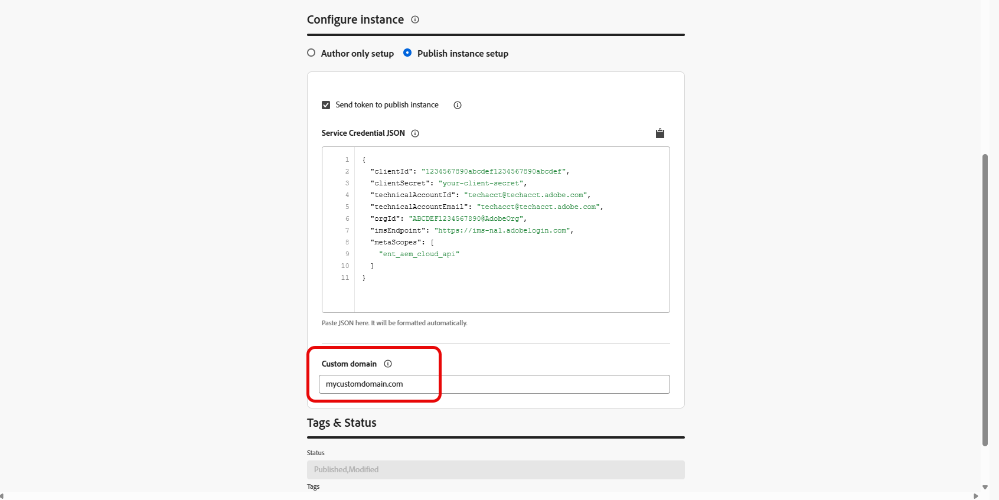
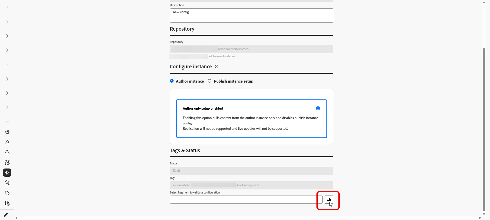

# 配置Adobe Experience Manager存储库访问权限 {#aem-admin-settings}

>[!BEGINSHADEBOX]

**在此页面上：**&#x200B;了解管理员如何将沙盒连接到Adobe Experience Manager存储库 — 设置仅创作或发布访问权限、自定义域和身份验证 — 以便营销人员能够在其历程和营销活动中使用AEM内容片段。

>[!ENDSHADEBOX]

Adobe Journey Optimizer与&#x200B;**[!DNL Adobe Experience Manager as a Cloud Service]**&#x200B;集成，因此您可以在历程和营销活动中使用&#x200B;**内容片段**。 默认情况下，**内容片段**&#x200B;是从Adobe Experience Manager发布存储库中读取的，管理员可以在&#x200B;**[!UICONTROL AEM集成]**&#x200B;菜单中切换到仅创作或调整发布访问权限。

➡️配置存储库后，请继续[使用Experience Manager内容片段](../integrations/aem-fragments.md)，在Journey Optimizer中创作和选择任务。

## 配置存储库 {#configure-ui}

>[!NOTE]
>
> **[!UICONTROL AEM集成]**&#x200B;保存每个沙盒&#x200B;**的存储库设置**。 每个沙盒都保留其自身的集成，因此它们不会跨沙盒应用。

Journey Optimizer为每个组织、沙盒和Adobe Experience Manager存储库存储一个集成。 如果保存同一组合的新集成，它将替换以前的设置，仅保留最新的配置。

要配置存储库，请执行以下操作：

1. 访问&#x200B;**[!UICONTROL 管理]** > **[!UICONTROL 渠道]** > **[!UICONTROL AEM集成]**。

1. 单击&#x200B;**[!UICONTROL 创建集成]**。

   

1. 如果您使用&#x200B;**[!DNL Adobe Experience Manager Managed Services]**，请在&#x200B;**[!UICONTROL 自定义AMS存储库ID]**&#x200B;字段中输入以`adobecqms.net`结尾的存储库主机名。

   

1. 选择要配置的存储库，然后单击&#x200B;**[!UICONTROL 下一步]**。

   此外，您可以单击&#x200B;**[!UICONTROL 查看]**&#x200B;以访问此存储库。

   >[!IMPORTANT]
   >
   >为同一组织、沙盒和存储库&#x200B;**保存新配置将替换**&#x200B;默认配置，即&#x200B;**发布**&#x200B;存储库。

   

1. 输入&#x200B;**[!UICONTROL 名称]**&#x200B;和&#x200B;**[!UICONTROL 描述]**。

1. 选择您的设置：

   +++ 仅创作设置

   当Journey Optimizer应仅从Adobe Experience Manager **创作**&#x200B;环境中读取内容片段时，选择&#x200B;**[!UICONTROL 仅创作设置]**。 不支持从作者复制到发布和实时发布更新。

   

   +++

   +++ 发布实例设置

   1. 选择&#x200B;**[!UICONTROL 发布实例设置]**&#x200B;以启用发布实例设置。

      

   1. （可选）启用&#x200B;**[!UICONTROL 将令牌发送到发布实例]**，以便将服务凭据包含在对发布实例的请求中。

   1. 粘贴有效的&#x200B;**[!UICONTROL 服务凭据JSON]**&#x200B;以进行身份验证。

   1. 如果您的组织无法访问默认的AEM发布主机(`publish-XX-XX.adobeaemcloud.com`)以获取内容，可以选择提供自定义域。

      

   +++

1. 完成实例设置后，选取内容片段以确认集成是否正常工作。

   

1. 在&#x200B;**内容审查程序**&#x200B;窗口中，选择要测试的片段，然后单击&#x200B;**[!UICONTROL 选择]**。

1. 单击&#x200B;**[!UICONTROL 保存]**。

1. 在选择了测试内容片段的情况下进行保存时，验证会自动运行。 如果验证失败，将显示错误列表，以便您修复配置。

   

1. 要编辑或禁用此存储库集成，请从&#x200B;**[!UICONTROL AEM集成]**&#x200B;菜单访问您之前创建的配置。

保存此配置后，Journey Optimizer会将该存储库的配置存储在当前沙盒中。 然后，在&#x200B;**内容审查程序**&#x200B;选择器中浏览并选择内容时，您可以使用该存储库及其设置。

