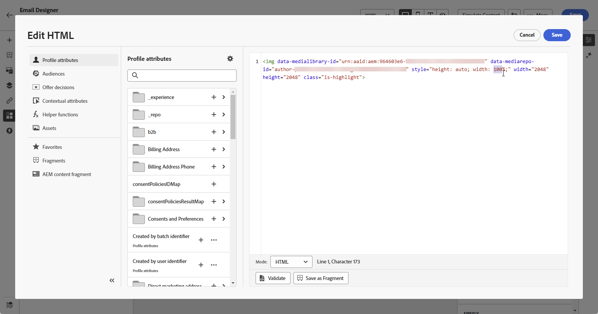
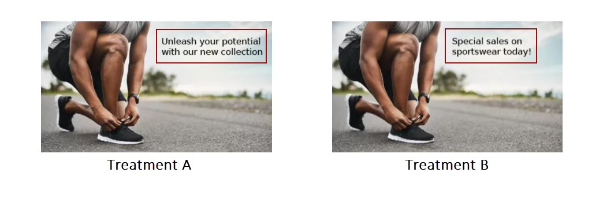
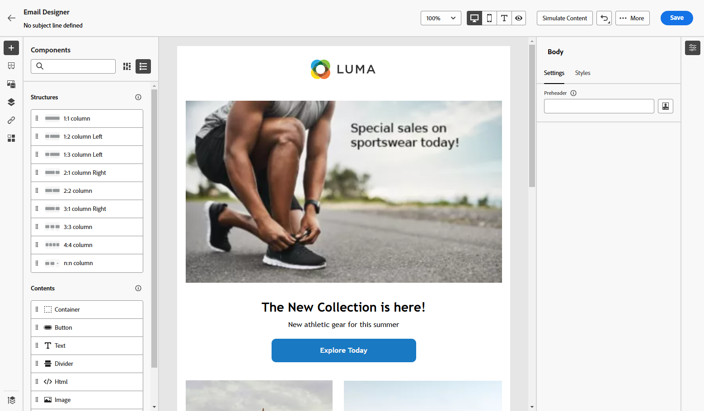
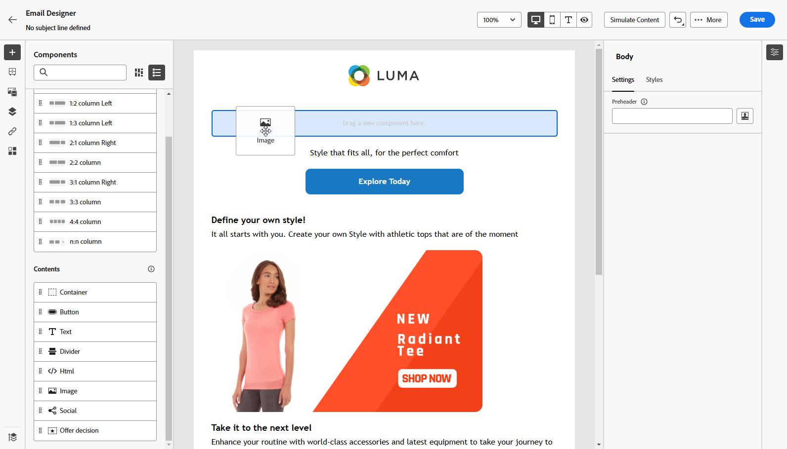

# 使用Dynamic Media {#aem-dynamic}

## dynamic media入门 {#gs-aem-dynamic}

资产选择器现在支持Dynamic Media，允许您在Journey Optimizer中无缝选择和使用批准的Dynamic Media演绎版。 对Adobe Experience Manager中的资源所做的更改会立即反映在Journey Optimizer内容中，从而确保始终使用最新版本，而无需手动更新。

请注意，此集成仅适用于使用Dynamic Media Manager as a Cloud Service的客户。

要进一步了解Adobe Experience Manager as a Cloud Service中的Dynamic Media，请参阅[Experience Manager文档](https://experienceleague.adobe.com/zh-hans/docs/experience-manager-cloud-service/content/assets/dynamicmedia/dynamic-media){target="_blank"}。

>[!AVAILABILITY]
>
>对于医疗保健客户，只有在许可Journey Optimizer Healthcare Shield和Adobe Experience Manager Extended Security for Healthcare附加产品时才启用集成。

## 添加和管理Dynamic Media {#dynamic-media}

通过将Adobe Experience Manager as a Cloud Service中的Dynamic Media直接插入您的Journey Optimizer内容，可针对任何屏幕或浏览器增强和优化您的内容。  然后，您可以调整大小、裁切、增强并根据需要进行其他调整。

>[!IMPORTANT]
>
>确保在Adobe Experience Manager as a Cloud Service中启用了带OpenAPI的Dynamic Media。 [了解详情](https://experienceleague.adobe.com/zh-hans/docs/experience-manager-cloud-service/content/assets/dynamicmedia/dynamic-media-open-apis/dynamic-media-open-apis-overview#enable-dynamic-media-open-apis){target="_blank"}。

Dynamic Media与Adobe Journey Optimizer的集成适用于Dynamic Media [Scene7模式](https://experienceleague.adobe.com/zh-hans/docs/experience-manager-65/content/assets/dynamic/config-dms7){target="_blank"}和具有OpenAPI[&#128279;](https://experienceleague.adobe.com/zh-hans/docs/experience-manager-cloud-service/content/assets/dynamicmedia/dynamic-media-open-apis/dynamic-media-open-apis-overview){target="_blank"}的。

<!--
>[!AVAILABILITY]
>
>Older versions of Outlook (including 2016) do not support rendering of content with Dynamic Media.  We are actively working on a permanent fix to enhance compatibility. In the meantime, apply the following guidelines:
>
>* For Dynamic Media Scene7 URLs: Append `?bfc=on` to the image URL. This enables automatic format negotiation, ensuring the most compatible image format is delivered based on the client's capabilities.
>
>* For Dynamic Media with Open API: Use the `.avif` format. This format includes built-in fallback mechanisms to deliver a compatible format when necessary.
>
-->

要在HTML内容中添加Adobe Experience Manager资源，请执行以下步骤：

1. 将&#x200B;**[!UICONTROL HTML组件]**&#x200B;拖放到您的内容中。

1. 选择&#x200B;**[!UICONTROL 显示源代码]**。

   

1. 在&#x200B;**[!UICONTROL 编辑HTML]**&#x200B;菜单中，导航到&#x200B;**[!UICONTROL Assets]**，然后单击&#x200B;**[!UICONTROL 打开资源选择器]**。

   或者，您可以复制并粘贴资产的URL。

   

1. 浏览您的AEM资源，然后选择要添加到内容中的资源。

1. 调整图像参数（例如，高度、宽度、旋转、翻转、亮度、色相等） 以匹配您的资产要求。

   有关可添加到URL的图像参数的完整列表，请参阅[Experience Manager文档](https://experienceleague.adobe.com/zh-hans/docs/dynamic-media-developer-resources/image-serving-api/image-serving-api/http-protocol-reference/command-reference/c-command-reference){target="_blank"}。

   

1. 单击&#x200B;**[!UICONTROL 保存]**。

您的内容现在包括Dynamic Media。 您在Experience Manager中所做的任何更新都将自动显示在Journey Optimizer中。

## 个性化设置文本叠加 {#text-overlay}

通过用您选择的新文本替换现有文本叠加，轻松自定义任何动态媒体，并允许无缝更新和个性化。

例如，使用试验功能，您可以通过为每种处理使用不同的文本替换现有文本覆盖来更新，确保在用户档案打开其消息时为每个用户档案自定义文本。

>[!AVAILABILITY]
>
>**文本覆盖个性化**&#x200B;在Dynamic Media [Scene7模式](https://experienceleague.adobe.com/zh-hans/docs/experience-manager-65/content/assets/dynamic/config-dms7){target="_blank"}中仅可用。 由于Healthcare客户无法访问Scene7模式，因此内容会使用图像的Journey Optimizer二进制副本进行渲染。 如有任何例外，请联系您的Adobe代表。

要个性化文本叠加，请执行以下步骤：

1. 将&#x200B;**[!UICONTROL HTML组件]**&#x200B;拖放到您的内容中。

1. 选择&#x200B;**[!UICONTROL 显示源代码]**。

1. 从&#x200B;**[!UICONTROL 编辑HTML]**&#x200B;菜单中，访问&#x200B;**[!UICONTROL Assets]**，然后&#x200B;**[!UICONTROL 打开资源选择器]**。

   您还只需复制并粘贴资产URL即可。

1. 浏览AEM资源并选择要添加到内容中的资源。

1. 将覆盖替换为所需文本。

   

1. 更新图像参数：

   * **层**：输入文本放置的基本元素。
   * **大小**：更新文本块的大小。
   * **TextAttr**：调整文本字体大小。
   * **位置**：设置文本在图像中的位置。

   >[!WARNING]
   >
   >更新动态媒体时需要使用Layer参数。

   

1. 单击&#x200B;**[!UICONTROL 保存]**。

您的内容现在包括更新的文本叠加。

## 添加和管理Dynamic media模板 {#dynamic-media-template}

在Journey Optimizer中轻松添加Dynamic Media模板，并随时更新媒体内容。 您现在可以将个性化字段合并到媒体中，从而允许您在Journey Optimizer中创建更多自定义且引人入胜的内容。

了解有关[Dynamic media模板](https://experienceleague.adobe.com/zh-hans/docs/dynamic-media-classic/using/template-basics/quick-start-template-basics){target="_blank"}的更多信息。

>[!AVAILABILITY]
>
>**Dynamic Media模板**&#x200B;在Dynamic Media [Scene7模式](https://experienceleague.adobe.com/zh-hans/docs/experience-manager-65/content/assets/dynamic/config-dms7)中仅可用。 由于医疗保健客户无法访问Scene7模式，因此将不呈现内容。 如有任何例外，请联系Experience Manager支持。

### 带有图像组件 {#image-component}

您可以使用图像组件将动态模板直接插入内容：

1. 打开您的营销活动或历程并访问您的内容。

1. 将&#x200B;**图像组件**&#x200B;拖放到布局中。

   有关图像组件的详细信息，请参阅[此页面](../email/content-components.md)。

   

1. 浏览AEM资源并选择要添加到内容中的Dynamic media模板。

   

1. 在&#x200B;**图像设置**&#x200B;中，导航以访问Dynamic Media模板的参数。

   可用字段取决于在Adobe Experience Manager中创建[模板](https://experienceleague.adobe.com/zh-hans/docs/dynamic-media-classic/using/template-basics/creating-template-parameters#creating_template_parameters){target="_blank"}期间添加的参数。

   

1. 填写不同的字段并使用个性化编辑器添加个性化内容。 您可以使用任何属性（如配置文件名称、城市或其他相关详细信息）来创建更自定义的体验。

   在[此页面](../personalization/personalize.md)上了解有关个性化的更多信息。

   

1. 条件内容可应用于Dynamic Media组件以生成内容的不同变体。 [了解详情](../personalization/dynamic-content.md)

1. 单击&#x200B;**[!UICONTROL 保存]**。

执行测试并验证内容后，即可向受众发送消息。

### 带有HTML组件 {#html-component}

您可以使用HTML组件将动态模板直接插入内容：

1. 打开您的营销活动或历程并访问您的内容。

1. 将&#x200B;**HTML组件**&#x200B;拖放到布局中。

   

1. 选择&#x200B;**[!UICONTROL 显示源代码]**。

   

1. 从&#x200B;**[!UICONTROL 编辑HTML]**&#x200B;菜单中，访问&#x200B;**[!UICONTROL Assets]**，然后&#x200B;**[!UICONTROL 打开资源选择器]**。

   您还只需复制并粘贴资产URL即可。

1. 根据需要调整图像文本参数以匹配您的资产要求。

   

1. 单击&#x200B;**[!UICONTROL 保存]**。

执行测试并验证内容后，即可向受众发送消息。

## 操作方法视频 {#video}

了解如何将 Adobe Experience Manager Dynamic Media 与 Adobe Journey Optimizer 集成，以实现实时内容更新和个性化。

本教程介绍如何直接在 AJO 中修改图像，使用 HTML 模式添加文本叠加，在 AEM 中创建用于超个性化的动态媒体模板，以及通过为不同受众细分定制内容来个性化营销活动。 通过此集成，营销人员可以高效创建引人入胜的个性化营销活动，而无需在应用程序之间切换。

>[!VIDEO](https://video.tv.adobe.com/v/3463792/?captions=chi_hans&learn=on&enablevpops=&autoplay=true)

