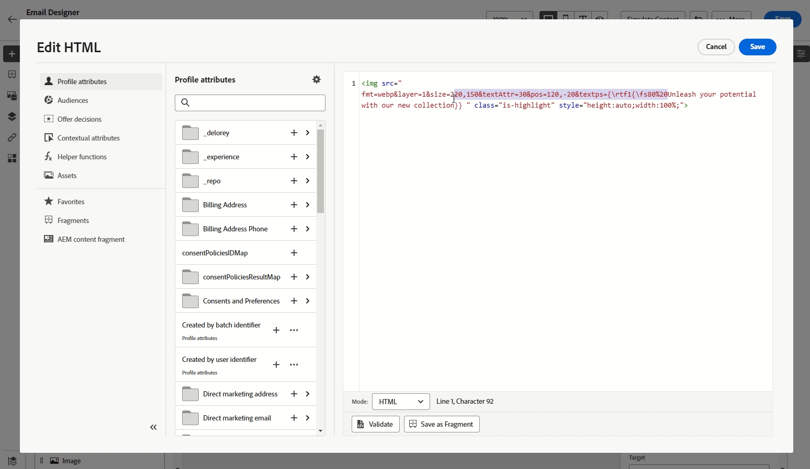

# 使用 Dynamic Media {#aem-dynamic}

>[!AVAILABILITY]
>
>此集成仅适用于使用Dynamic Media Manager as a Cloud Service的客户。

资产选择器现在支持Dynamic Media，允许您在Journey Optimizer中无缝选择和使用批准的Dynamic Media演绎版。 对Adobe Experience Manager中的资源所做的更改会立即反映在Journey Optimizer内容中，从而确保始终使用最新版本，而无需手动更新。

要了解有关Adobe Experience Manager as a Cloud Service中Dynamic Media的更多信息，请参阅[Experience Manager文档](https://experienceleague.adobe.com/en/docs/experience-manager-cloud-service/content/assets/dynamicmedia/dynamic-media)。

## 添加和管理Dynamic Media

通过将Adobe Experience Manager as a Cloud Service中的Dynamic Media直接插入您的Journey Optimizer内容，可针对任何屏幕或浏览器增强和优化您的内容。  然后，您可以调整大小、裁切、增强并根据需要进行其他调整。

1. 将&#x200B;**[!UICONTROL HTML组件]**&#x200B;拖放到您的内容中。

1. 选择&#x200B;**[!UICONTROL 显示源代码]**。

   

1. 在&#x200B;**[!UICONTROL 编辑HTML]**&#x200B;菜单中，导航到&#x200B;**[!UICONTROL Assets]**，然后单击&#x200B;**[!UICONTROL 打开资源选择器]**。

   或者，您可以复制并粘贴资产的URL。

   

1. 浏览您的AEM资源，然后选择要添加到内容中的资源。

1. 根据需要调整图像参数（例如，高度、宽度、旋转、翻转、亮度、色相等），以符合您的资产要求。

   有关可添加到URL的图像参数的完整列表，请参阅[Experience Manager文档](https://experienceleague.adobe.com/en/docs/dynamic-media-developer-resources/image-serving-api/image-serving-api/http-protocol-reference/command-reference/c-command-reference)。

   

1. 单击&#x200B;**[!UICONTROL 保存]**。

您的内容现在包括Dynamic Media。 您在Experience Manager中所做的任何更新都将自动显示在Journey Optimizer中。

## 个性化设置文本叠加

通过用您选择的新文本替换现有文本叠加，轻松自定义任何动态媒体，并允许无缝更新和个性化。

例如，使用试验功能，您可以通过为每种处理使用不同的文本替换现有文本叠加图，从而更新它们，确保在打开用户档案的消息时为每个用户档案自定义文本。

1. 将&#x200B;**[!UICONTROL HTML组件]**&#x200B;拖放到您的内容中。

1. 选择&#x200B;**[!UICONTROL 显示源代码]**。

1. 从&#x200B;**[!UICONTROL 编辑HTML]**&#x200B;菜单中，访问&#x200B;**[!UICONTROL Assets]**，然后&#x200B;**[!UICONTROL 打开资源选择器]**。

   您还只需复制并粘贴资产URL即可。

1. 浏览AEM资源并选择要添加到内容中的资源。

1. 将覆盖替换为所需文本。

   

1. 更新图像参数：

   * **层**：输入文本放置的基本元素。
   * **大小**：更新文本块的大小。
   * **TextAttr**：调整文本字体大小。
   * **位置**：设置文本在图像中的位置。

   >[!WARNING]
   >
   >更新动态媒体时需要使用Layer参数。

   

1. 单击&#x200B;**[!UICONTROL 保存]**。

您的内容现在包括更新的文本叠加。

<!--
## Personalization with Text Overlay

Easily customize any dynamic media by replacing the existing text overlay with new text of your choice, allowing for seamless updates and personalization.

In this example, our goal is to update the existing text overlay by replacing it with a new validity date and adding a personalization block, ensuring it is customized for each profile when they open their messages.

1. Drag and drop an **[!UICONTROL HTML component]** into your content.

1. Select **[!UICONTROL Show the source code]**.

1. From the **[!UICONTROL Edit HTML]** menu, access **[!UICONTROL Assets]** then **[!UICONTROL Open asset selector]**.

    You can also simply copy and paste your assets URL.

1. Browse through your AEM assets and select the one you want to add to your content.

1. Replace the overlay with the desired text.

    Here we change the validity date from 31st December 2024 to the 1st July 2025.

1. Add the required personalization fields to your image.

1. Click **[!UICONTROL Save]**.

Your content now includes your updated text overlay and personalization.

## Add Dynamic media conditional content

Enable conditional content in your dynamic media to better target your audience and deliver a more personalized experience.

1. Drag and drop an **[!UICONTROL HTML component]** into your content.

1. Select **[!UICONTROL Show the source code]**.

1. From the **[!UICONTROL Edit HTML]** menu, access **[!UICONTROL Assets]** then **[!UICONTROL Open asset selector]**.

    You can also simply copy and paste your assets URL.

1. Browse through your AEM assets and select the one you want to add to your content.

1. Once your dynamic media is inserted to your content, select **[!UICONTROL Enable conditional]** content from your HTML component toolbar to create your different user experiences. 

1. From the Variant - 1, click **[!UICONTROL Select condition]** to fine tune your audience.

1. Choose your condition or create a new one if needed and click **[!UICONTROL Select]**.

    [Learn more on conditions](../personalization/create-conditions.md)

1. Select your **[!UICONTROL Component]** and access the **[!UICONTROL Settings]** menu.

1. In the **[!UICONTROL Custom Attributes]** menu, populate the Dynamic Media text and personalization fields to customize the content for your audience.

-->
