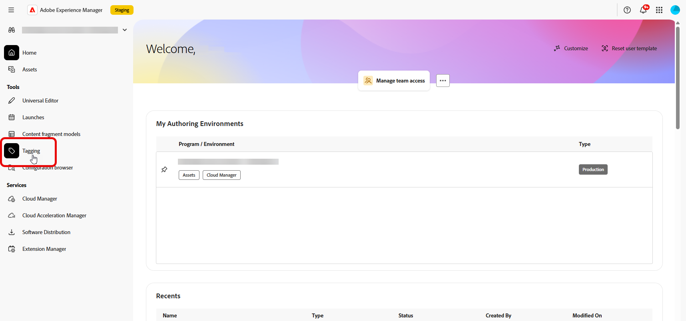

# Adobe Experience Manager 内容片段 {#aem-fragments}

通过将Adobe Experience Manager as a Cloud Service与Adobe Journey Optimizer集成，您现在可以将AEM内容片段无缝地合并到Journey Optimizer内容中。 这种简化的连接简化了访问和利用AEM内容的流程，从而能够创建个性化的动态营销活动和历程。

要了解有关AEM内容片段的更多信息，请参阅Experience Manager文档中的[使用内容片段](https://experienceleague.adobe.com/en/docs/experience-manager-cloud-service/content/sites/administering/content-fragments/content-fragments-with-journey-optimizer){target="_blank"}。

>[!AVAILABILITY]
>
>对于医疗保健客户，只有在许可Journey Optimizer Healthcare Shield和Adobe Experience Manager增强安全性附加产品后，才会启用集成。

## 限制 {#limitations}

* 建议限制有权发布内容片段的用户数量以减少意外错误的风险。

* 对于多语言内容，仅支持手动流程。

* 当前不支持变体。

* 已发布营销活动和历程的验证反映来自最新Experience Manager内容片段发布的数据。

## 在Experience Manager中创建并分配标记

在Journey Optimizer中使用内容片段之前，您需要创建专门用于Journey Optimizer的标记：

1. 访问您的&#x200B;**Experience Manager**&#x200B;环境。

1. 从&#x200B;**工具**&#x200B;菜单中选择&#x200B;**标记**。

   

1. 单击&#x200B;**创建标记**。

1. 确保ID遵循以下语法： `ajo-enabled:{AJO-OrgId}/{AJO-SandboxName}`。

1. 单击&#x200B;**创建**。

1. 按照[Experience Manager文档](https://experienceleague.adobe.com/en/docs/experience-manager-cloud-service/content/sites/administering/content-fragments/content-fragment-models){target="_blank"}中的详细说明定义您的内容片段模型，并分配新创建的Journey Optimizer标记。

您现在可以开始创建和配置内容片段，以供将来在Journey Optimizer中使用。 请参阅[Experience Manager文档](https://experienceleague.adobe.com/en/docs/experience-manager-cloud-service/content/sites/administering/content-fragments/managing){target="_blank"}以了解详情。

## 添加Experience Manager内容片段 {#aem-add}

创建并个性化您的AEM内容片段后，您现在可以将其导入您的历程优化器促销活动或历程。

1. 创建您的[促销活动](../campaigns/create-campaign.md)或[历程](../building-journeys/journey-gs.md)。

1. 要访问AEM内容片段，请单击任意文本字段中的，或通过HTML内容组件打开源代码。

   

1. 从左窗格中的&#x200B;**[!UICONTROL AEM内容片段]**&#x200B;菜单中，单击&#x200B;**[!UICONTROL 打开AEM CF选择器]**。

   

1. 从可用列表中选择一个&#x200B;**[!UICONTROL 内容片段]**&#x200B;以导入到您的Journey Optimizer内容中。

1. 单击&#x200B;**[!UICONTROL 显示筛选器]**&#x200B;以优化您的内容片段列表。

   默认情况下，内容片段过滤器预设为仅显示批准的内容。

   

1. 选择您的&#x200B;**[!UICONTROL 内容片段]**&#x200B;后，单击&#x200B;**[!UICONTROL 选择]**&#x200B;以将其打开。

   

1. 单击&#x200B;**[!UICONTROL 查看片段]**&#x200B;以显示您的片段信息。 请注意，打开&#x200B;**[!UICONTROL 片段信息]**&#x200B;菜单会将编辑器置于只读模式。

   从右侧菜单中选择&#x200B;**[!UICONTROL 预览]**&#x200B;可在Adobe Experience Manager中查看您的片段。

   

1. 单击访问片段的高级菜单：

   * **[!UICONTROL 交换片段]**
   * **[!UICONTROL 浏览引用]**
   * 在AEM中&#x200B;**[!UICONTROL 打开]**

   

1. 从&#x200B;**[!UICONTROL 片段]**&#x200B;中选择要添加到内容的所需字段。
   <!--
    Note that if you choose to copy the value, any future updates to the Content Fragment will not be reflected in your campaign or journey. However, using dynamic placeholders ensures real-time updates.-->

   

1. 要启用实时个性化，用户必须将&#x200B;**[!UICONTROL 内容片段]**&#x200B;中使用的所有占位符显式声明为片段帮助程序标记中的参数。 可以使用以下方法将这些占位符映射到配置文件属性、上下文属性、静态字符串或预定义变量：

   1. **配置文件或上下文属性映射**：将占位符分配给配置文件或上下文属性，例如name = profile.person.name.firstName。

   1. **静态字符串映射**：通过将其置于双引号中来分配固定字符串值，例如name = &quot;John&quot;。

   1. **变量映射**：引用之前在同一HTML中声明的变量，例如name = &#39;variableName&#39;。
在这种情况下，请确保在添加片段ID之前使用以下语法声明&#x200B;**_variableName_**：

      ```html
       
      ```

   在以下示例中，**_name_**&#x200B;占位符映射到片段中的&#x200B;**_profile.person.name.firstName_**&#x200B;属性。

   {zoomable="yes"}


1. 单击 **[!UICONTROL Save]**。您现在可以测试和检查您的邮件内容，如[此部分](../content-management/preview.md)中所详述。

执行测试并验证内容后，您可以[发送营销活动](../campaigns/review-activate-campaign.md)或[将您的历程](../building-journeys/publishing-the-journey.md)发布给受众。

Adobe Experience Manager允许您识别正在使用内容片段的Journey Optimizer营销活动或历程。 请参阅[Adobe Experience Manager文档](https://experienceleague.adobe.com/en/docs/experience-manager-cloud-service/content/sites/administering/content-fragments/extension-content-fragment-ajo-external-references)以了解详情。
