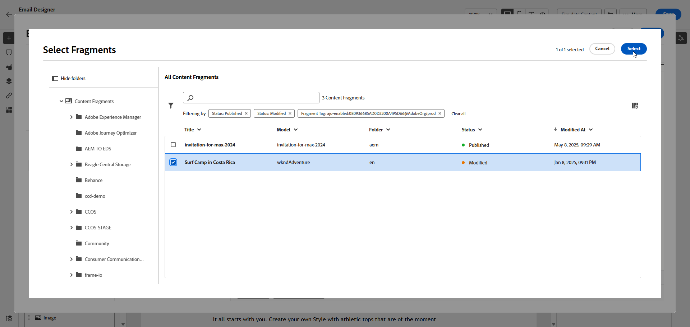
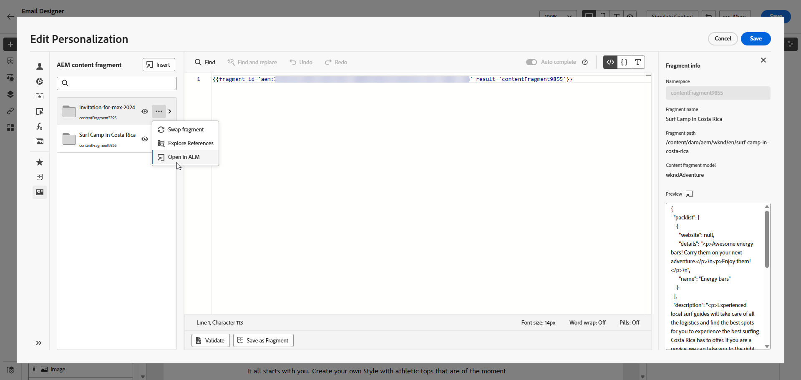

# 使用Adobe Experience Manager内容片段 {#aem-fragments}

Adobe Experience Manager与Journey Optimizer之间的集成将遵循以下数据流：

1. **[配置Dispatcher](https://experienceleague.adobe.com/en/docs/experience-manager-cloud-service/content/sites/administering/content-fragments/content-fragments-with-journey-optimizer#dispatcher-configuration){target="_blank"}**：要使Journey Optimizer能够通过内容片段管理API访问Adobe Experience Manager内容片段，您必须首先配置Dispatcher。 这是集成的先决条件。

1. **[创建并创作](https://experienceleague.adobe.com/en/docs/experience-manager-cloud-service/content/sites/administering/content-fragments/managing#creating-a-content-fragment)**：内容在Adobe Experience Manager中创建并配置为内容片段。

1. **[标记](https://experienceleague.adobe.com/en/docs/experience-manager-cloud-service/content/sites/administering/content-fragments/managing#manage-tags)**：内容片段必须使用特定于Journey Optimizer的标记(`ajo-enabled:{OrgId}/{SandboxName}`)进行标记。

1. **[发布](https://experienceleague.adobe.com/en/docs/experience-manager-cloud-service/content/sites/administering/content-fragments/managing#publishing-and-previewing-a-fragment)**：内容片段已在Adobe Experience Manager中发布，可用于Journey Optimizer。

1. **[访问](#aem-add)**： Journey Optimizer从Adobe Experience Manager发布实例实时获取并显示可用的内容片段。

1. **[集成](#aem-add)**：已选择内容片段并将其集成到营销活动或历程中。

在Adobe Experience Manager中发布内容片段时，将发送一个事件以更新Journey Optimizer端的内容。 如果更新成功，内容片段将在大约5分钟内可用于单一历程，并在下一个处理批次中可用于批量用例。 在Journey Optimizer中提供更新后，将在所有适用的营销活动和历程中使用最新发布的内容。

>[!AVAILABILITY]
>
>对于医疗保健客户，只有在许可Journey Optimizer Healthcare Shield和Adobe Experience Manager Extended Security for Healthcare附加产品时才启用集成。

## 在Experience Manager中创建并分配标记

>[!IMPORTANT]
>
>要使Journey Optimizer能够通过内容片段管理API访问Adobe Experience Manager内容片段，您必须先[配置Dispatcher](https://experienceleague.adobe.com/en/docs/experience-manager-cloud-service/content/sites/administering/content-fragments/content-fragments-with-journey-optimizer#dispatcher-configuration){target="_blank"}。

在Journey Optimizer中使用内容片段之前，您需要创建专门用于Journey Optimizer的标记：

1. 访问您的&#x200B;**Experience Manager**&#x200B;环境。

1. 从&#x200B;**工具**&#x200B;菜单中选择&#x200B;**标记**。

   

1. 单击&#x200B;**创建标记**。

1. 确保ID遵循以下语法： `ajo-enabled:{AJO-OrgId}/{AJO-SandboxName}`。

1. 单击&#x200B;**创建**。

1. 按照[Experience Manager文档](https://experienceleague.adobe.com/en/docs/experience-manager-cloud-service/content/sites/administering/content-fragments/content-fragment-models){target="_blank"}中的详细说明定义您的内容片段模型，并分配新创建的Journey Optimizer标记。

这种实时连接可确保您的内容始终保持最新，但也意味着对已发布片段的任何更改都将立即影响活动的营销活动和历程。

您现在可以开始创建和配置内容片段，以供将来在Journey Optimizer中使用。 请参阅[Experience Manager文档](https://experienceleague.adobe.com/en/docs/experience-manager-cloud-service/content/sites/administering/content-fragments/managing){target="_blank"}以了解详情。

## 添加Experience Manager内容片段 {#aem-add}

创建并个性化您的AEM内容片段后，您现在可以将其导入您的历程优化器促销活动或历程。

1. 创建您的[促销活动](../campaigns/create-campaign.md)或[历程](../building-journeys/journey-gs.md)。

1. 要访问AEM内容片段，请单击任意文本字段中的，或通过HTML内容组件打开源代码。

   

1. 从左窗格中的&#x200B;**[!UICONTROL AEM内容片段]**&#x200B;菜单中，单击&#x200B;**[!UICONTROL 打开AEM CF选择器]**。

   

1. 浏览列表并选择要导入到Journey Optimizer内容中的&#x200B;**[!UICONTROL 内容片段]**。

   >[!NOTE]
   >
   > 如果片段具有一个或多个&#x200B;**已发布**&#x200B;变体，则选择器中会显示&#x200B;**[!UICONTROL 变体]**&#x200B;下拉列表。 如果未选择&#x200B;**[!UICONTROL 变量]**，则自动使用&#x200B;**Main**&#x200B;变量。 在[使用内容片段变体](#aem-variations)中了解更多信息。

1. 单击&#x200B;**[!UICONTROL 显示筛选器]**&#x200B;以优化您的内容片段列表。

   默认情况下，内容片段过滤器预设为仅显示批准的内容。

   

1. 选择您的&#x200B;**[!UICONTROL 内容片段]**&#x200B;后，单击&#x200B;**[!UICONTROL 选择]**&#x200B;以添加它。

   

1. 单击&#x200B;**[!UICONTROL 查看片段]**&#x200B;以显示您的片段信息。 请注意，打开&#x200B;**[!UICONTROL 片段信息]**&#x200B;菜单会将编辑器置于只读模式。

   从右侧菜单中选择&#x200B;**[!UICONTROL 预览]**&#x200B;可在Adobe Experience Manager中查看您的片段。

   

1. 单击访问片段的高级菜单：

   * **[!UICONTROL 交换片段]**
   * **[!UICONTROL 浏览引用]**
   * 在AEM中&#x200B;**[!UICONTROL 打开]**

   

1. 从&#x200B;**[!UICONTROL 片段]**&#x200B;中选择要添加到内容的所需字段。

   <!--
    Note that if you choose to copy the value, any future updates to the Content Fragment will not be reflected in your campaign or journey. However, using dynamic placeholders ensures real-time updates.
    
    -->

   

1. 要显示存储在内容片段属性中的图像URL（例如片段模型的路径或URL字段），请将其插入您的HTML中，并添加``标记和片段属性作为源，例如：

   ```html
   
   ```

   >[!NOTE]
   >
   >不支持来自Adobe Experience Manager的相对图像URL，请使用&#x200B;**绝对** URL。

1. 选择&#x200B;**Picks： Off**&#x200B;以通过隐藏长属性路径来启用Picks体验以提高可读性。

   

1. 要在片段文本中使用在Adobe Experience Manager中创作的&#x200B;**个性化占位符**，请在Adobe Experience Manager的内容片段中定义它们，如下所示： `{{name}}`。

   在Journey Optimizer中，这些令牌是占位符。 在&#x200B;**Pills**&#x200B;体验开启的情况下，它们会与片段字段一起显示在右边栏的&#x200B;**[!UICONTROL AEM内容片段]**&#x200B;部分。

1. 要启用实时个性化，用户必须将&#x200B;**[!UICONTROL 内容片段]**&#x200B;中使用的所有占位符显式声明为片段帮助程序标记中的参数。 按如下方式将这些占位符映射到配置文件属性、上下文属性、静态字符串或预定义变量：

   1. **配置文件或上下文属性映射**：将占位符分配给配置文件或上下文属性，例如name = profile.person.name.firstName。

   1. **静态字符串映射**：通过将其置于双引号中来分配固定字符串值，例如name = &quot;John&quot;。

   1. **变量映射**：引用之前在同一HTML中声明的变量，例如name = &#39;variableName&#39;。
在这种情况下，请确保在添加片段ID之前使用以下语法声明&#x200B;**_variableName_**：

      ```html
       
      ```

   在下面的示例中，**_month_**&#x200B;占位符映射到片段中的&#x200B;**_profile.person.birthDate_**&#x200B;属性。

   {zoomable="yes"}

1. 单击&#x200B;**[!UICONTROL 保存]**。 您现在可以测试和检查您的邮件内容，如[此部分](../content-management/preview.md)中所详述。

   请注意，您选择的内容片段在此消息中保持活动状态。 在其他字段或内容块中打开Personalization编辑器时，您可以继续使用&#x200B;**[!UICONTROL AEM内容片段]**&#x200B;部分中的相同片段并添加更多字段，而无需重新打开&#x200B;**[!UICONTROL 打开AEM CF选择器]**。

执行测试并验证内容后，您可以[发送营销活动](../campaigns/review-activate-campaign.md)或[将您的历程](../building-journeys/publish-journey.md)发布给受众。

Adobe Experience Manager允许您识别正在使用内容片段的Journey Optimizer营销活动或历程。 请参阅[Adobe Experience Manager文档](https://experienceleague.adobe.com/en/docs/experience-manager-cloud-service/content/sites/administering/content-fragments/extension-content-fragment-ajo-external-references){target="_blank"}以了解详情。

## 使用内容片段变量 {#aem-variations}

在Adobe Experience Manager中，每个内容片段由以下部分组成：

* **Main**：片段的核心内容始终存在，不能删除，是所有变体的基础。
* **变体**：作者为特定渠道或方案创建的&#x200B;**Main**&#x200B;的一个或多个排列。 变体在片段中不是作为单独的资产，可以与&#x200B;**Main**&#x200B;进行比较和同步。

变体用例示例：

* 推送通知的简短版和电子邮件较长版。
* 区域音调调整，而不创建单独的片段。
* 特定于渠道的消息传递（例如，将Web与移动进行比较）。

➡️ [请参阅Adobe Experience Manager文档以了解详情](https://experienceleague.adobe.com/en/docs/experience-manager-65/content/assets/content-fragments/content-fragments-variations)

通过Journey Optimizer，您可以选择在插入片段时使用的变量，这样不同的促销活动或历程就可以依赖于Adobe Experience Manager中同一源内容的不同演绎版，而不会复制片段。

要选择变体，请执行以下操作：

1. 打开[营销活动](../campaigns/create-campaign.md)或[历程](../building-journeys/journey-gs.md)。

1. 单击任意文本字段中的，或从HTML内容组件打开HTML源。

1. 从&#x200B;**[!UICONTROL AEM内容片段]**，单击&#x200B;**[!UICONTROL 打开CF选择器]**。

   

1. 要在表视图中选择特定于区域设置的Adobe Experience Manager内容片段，请使用&#x200B;**[!UICONTROL 自定义表]**&#x200B;添加&#x200B;**[!UICONTROL 语言]**&#x200B;列。 区域设置值显示在表中，使您能够识别和选择适当的片段。

   

1. 选择您的&#x200B;**[!UICONTROL 内容片段]**。

1. 单击以打开&#x200B;**[!UICONTROL 详细信息]**&#x200B;菜单。 如果片段具有一个或多个已发布的变体，则片段详细信息旁边会显示&#x200B;**[!UICONTROL 变体]**&#x200B;下拉列表。

   

1. 从&#x200B;**[!UICONTROL 快速详细信息]**&#x200B;菜单中，单击&#x200B;**[!UICONTROL 浏览引用]**&#x200B;以在Adobe Experience Manager中打开相关选项，以便在变体详细信息、预览和验证可用时进行查看。

1. 选择您的变体，然后单击&#x200B;**[!UICONTROL 选择]**。

   >[!NOTE]
   >
   > 如果您未选择变体，或者在变体支持可用之前添加了片段，则Journey Optimizer在交付时自动使用&#x200B;**Main**&#x200B;变体。

插入带有变体的片段后，在Adobe Experience Manager中重新发布该片段将自动更新活动营销活动或历程中每&#x200B;**个引用的变体**。 预览和验证仍使用您选择的变体，以及该变体的最新发布内容。
