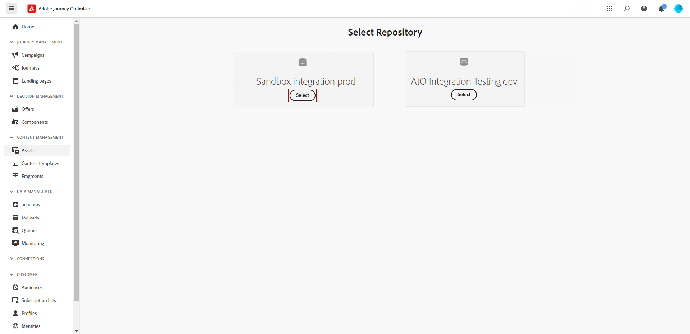
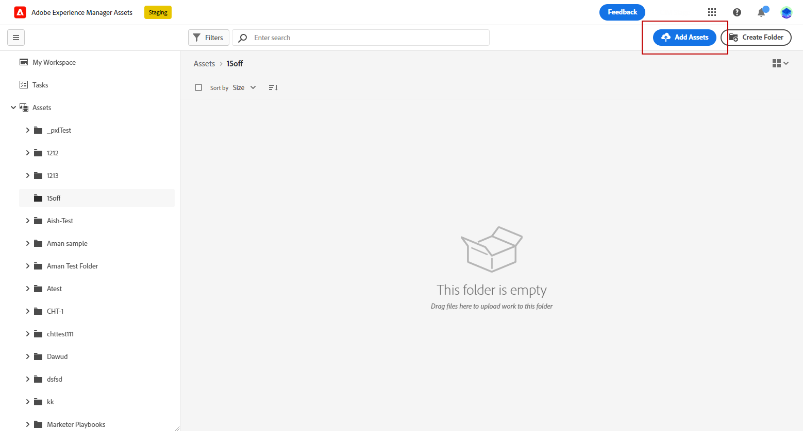

# 使用[!DNL Experience Manager Assets]创建和管理资源{#experience-manager-assets}

## 开始使用 [!DNL Experience Manager Assets] {#get-started-assets}

利用 **[!DNL Adobe Experience Manager Assets]** 整合营销和创意工作流。与&#x200B;**[!DNL Adobe Journey Optimizer]**&#x200B;本机集成，访问&#x200B;**[!DNL Assets Essentials]**&#x200B;或&#x200B;**[!DNL Assets as a Cloud Service]**&#x200B;以存储、管理、发现和分发数字资源。 提供了单一集中式资源存储库，您可以使用它来填充消息。

**[!DNL Adobe Experience Manager Assets]**&#x200B;提供两个协作和集中式资源工作区，可扩展您的创意系统并统一数字资源以进行体验交付：

* **[!DNL Assets as a Cloud Service]**： Adobe Experience Manager Assets as a Cloud Service为高效的数字资产管理和Dynamic Media操作提供了一个易于使用的云解决方案。 它将人工智能和机器学习等高级功能无缝地整合在一起。

  请参阅[Adobe Experience Manager as a Cloud Service文档](https://experienceleague.adobe.com/docs/experience-manager-cloud-service/content/assets/overview.html)以了解详情。

* **[!DNL Assets Essentials]**： Experience Manager Assets Essentials是用于统一资源管理和协作的Assets as a Cloud Service轻量级解决方案。 借助现代、简化的界面，创意和营销团队能够轻松存储、发现和分发数字资产。

  请参阅[Adobe Experience Manager Assets Essentials文档](https://experienceleague.adobe.com/docs/experience-manager-assets-essentials/help/introduction.html){target="_blank"}以了解详情。

根据您的合同，可以通过左侧菜单&#x200B;**[!UICONTROL Assets]**&#x200B;部分直接从&#x200B;**[!DNL Adobe Journey Optimizer]**&#x200B;访问&#x200B;**[!DNL Adobe Experience Manager Assets Essentials]**&#x200B;或&#x200B;**[!DNL Adobe Experience Manager Assets as a Cloud Service]**。 您还可以在[设计电子邮件内容](../email/get-started-email-design.md)时访问资源和文件夹。

## 先决条件{#assets-prerequisites}

>[!BEGINTABS]

>[!TAB Adobe Experience Manager Assets Essentials]

在使用[!DNL Adobe Experience Manager Assets Essentials]之前，必须将用户添加到&#x200B;**Assets Essentials使用者用户**&#x200B;或/和&#x200B;**Assets Essentials用户**&#x200B;产品配置文件。 有关详细信息，请参阅[Assets Essentials文档](https://experienceleague.adobe.com/docs/experience-manager-assets-essentials/help/get-started-admins/deploy-administer.html#add-user-groups){target="_blank"}。

>[!NOTE]
>对于在 2022 年 1 月 6 日之前购买的 Journey Optimizer 产品，您必须为组织部署 **[!DNL Adobe Experience Manager Assets Essentials]**。在[部署 Assets Essentials](https://experienceleague.adobe.com/docs/experience-manager-assets-essentials/help/deploy-administer.html?lang=zh-Hans){target="_blank"} 部分中了解详情。

>[!TAB Adobe Experience Manager Assets as a Cloud Service]

在使用&#x200B;**[!DNL Adobe Experience Manager Assets as a Cloud Service]**&#x200B;之前，您必须将用户添加到Assets云服务。 请参阅[Adobe Experience Manager Assets as a Cloud Service](https://experienceleague.adobe.com/docs/experience-manager-cloud-service/content/security/ims-support.html)以了解详情。

>[!ENDTABS]

## 上传和插入资源{#add-asset}

要将文件导入&#x200B;**[!DNL Assets Essentials]**&#x200B;或&#x200B;**[!DNL Assets as a Cloud Service]**，您首先需要浏览或创建文件将存储到的文件夹。 然后，您能够将它们插入到您的电子邮件内容中。

1. 从[!DNL Adobe Journey Optimizer]主页中，选择&#x200B;**[!UICONTROL 内容管理]**&#x200B;菜单下的&#x200B;**[!UICONTROL Assets]**&#x200B;选项卡以访问&#x200B;**[!DNL Assets Essentials]**&#x200B;或&#x200B;**[!DNL Assets as a Cloud Service]**。

   

1. 在Journey Optimizer中选择Assets的存储库。 如果您拥有此解决方案，则可以选择&#x200B;**[!DNL Assets Essentials]**&#x200B;或&#x200B;**[!DNL Assets as a Cloud Service]**&#x200B;存储库。

   

+++ 了解如何切换Assets存储库。

   要更改您的Assets存储库，请选择右上角的“帐户”图标，然后单击&#x200B;**[!UICONTROL 选择存储库]**。

   

+++

1. 双击中心部分或树视图中的文件夹以将其打开。

   您还可以单击&#x200B;**[!UICONTROL 创建文件夹]**&#x200B;以创建新文件夹。

   

1. 进入所选或创建的文件夹后，单击&#x200B;**[!UICONTROL 添加Assets]**&#x200B;以将新资源上传到您的文件夹。

   

1. 在&#x200B;**[!UICONTROL 上载文件]**&#x200B;中，单击&#x200B;**[!UICONTROL 浏览]**&#x200B;并选择是要&#x200B;**[!UICONTROL 浏览文件]**&#x200B;还是&#x200B;**[!UICONTROL 浏览文件夹]**。

1. 选择要上传的文件。 完成后，单击&#x200B;**[!UICONTROL 上传]**。 要了解有关如何管理资产的更多信息，请参阅此[页面](https://experienceleague.adobe.com/docs/experience-manager-assets-essentials/help/manage-organize.html)。

1. 要使用Adobe Photoshop Express进一步编辑您的资源，请双击这些资源。 然后从右侧菜单中选择&#x200B;**[!UICONTROL 编辑模式]**&#x200B;图标。 [了解详情](https://experienceleague.adobe.com/docs/experience-manager-assets-essentials/help/edit-images.html){target="_blank"}。

   

1. 从[!DNL Adobe Journey Optimizer]中，从电子邮件设计器的左窗格中选择&#x200B;**[!UICONTROL 资产选取器]**&#x200B;菜单。

   

1. 选择您之前创建的&#x200B;**[!UICONTROL Assets]**&#x200B;文件夹。 您还可以在搜索栏中搜索资源或文件夹。

1. 将您的资产拖放到电子邮件内容中。

   

1. 您可以进一步自定义您的资产，例如使用&#x200B;**[!UICONTROL 设置]**&#x200B;和&#x200B;**[!UICONTROL 样式]**&#x200B;选项卡添加外部链接或文本。 [了解有关组件设置的更多信息](../email/content-components.md)

   

   <!--
    After adding your asset to your email, use the **[!UICONTROL Find similar Stock photos]** option to locate Stock photos that match the content, color, and composition of your image. [Learn more about Adobe Stock](stock.md).

    Note that this option is available for licensed/unlicensed Stock images and images from your Assets folder. 

    
    -->

## [!DNL Adobe Experience Manager Assets] 常见问题解答 {#faq-assets}

+++ 我能否继续使用Journey Optimizer中的Assets Essentials捆绑存储库？

如果您是在&#x200B;**[!DNL Adobe Experience Manager Assets as a Cloud Service]**&#x200B;上配置的，并且用户拥有正确的权限，您就可以同时访问&#x200B;**[!DNL Adobe Experience Manager Assets Essentials]**&#x200B;和&#x200B;**[!DNL Adobe Experience Manager Assets as a Cloud Service]**&#x200B;存储库。 这些存储库是独立的，且不同步。 Journey Optimizer中的用户将能够查看这两个存储库，包括他们有权访问的其他环境，例如Stage、Dev等，并且应该能够使用存储库选择器在这些存储库之间进行无缝切换。

+++

+++ 如何管理资源？ Assets as a Cloud Service中的更改是否反映在Journey Optimizer中？

**[!DNL Adobe Experience Manager Assets as a Cloud Service]**&#x200B;与Journey Optimizer的集成与&#x200B;**[!DNL Adobe Experience Manager Assets Essentials]**&#x200B;类似。 对资源进行修改时，会生成二进制副本。 请注意，**[!DNL Assets as a Cloud Service]**&#x200B;中的更新不会自动传播到实时电子邮件营销活动。 必须在Email Designer中手动重新选择任何更改，以确保资源与正在进行的电子邮件营销活动之间的同步。

+++

+++ 在Journey Optimizer中创作电子邮件时能否使用Dynamic Media URL？

能，您可以在Journey Optimizer电子邮件创作中使用Dynamic Media URL。 只需粘贴URL，而无需从资产选择器中选择。

+++

+++ Journey Optimizer用户能否从Journey Optimizer界面更改Adobe Experience Manager Assets as a Cloud Service存储库？

只要Journey Optimizer用户是授权的&#x200B;**[!DNL Adobe Experience Manager Assets as a Cloud Service]**&#x200B;标准用户并且拥有存储库的“编辑”权限，该用户就可以对&#x200B;**[!DNL Adobe Experience Manager Assets as a Cloud Service]**&#x200B;存储库进行编辑。

+++
