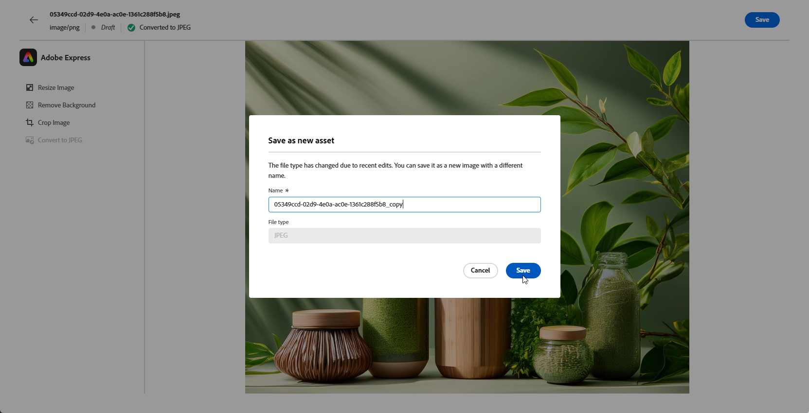

# 使用[!DNL Adobe Express]编辑资源{#express}

>[!CONTEXTUALHELP]
>id="ajo_express_menu"
>title="Adobe Express 集成"
>abstract="通过Adobe Express集成，开始个性化您的资源。 此功能允许您调整图像大小、删除背景、裁切可视化图表并将资源转换为JPEG或PNG。"

>[!AVAILABILITY]
>
>Adobe Journey Optimizer中的Adobe Express集成当前不适用于Healthcare Shield或Privacy and Security Shield。

Adobe Journey Optimizer中的Adobe Express集成允许您在创建内容时轻松访问Adobe Express强大的编辑工具。 通过这种集成，您可以调整图像大小、删除背景、裁剪可视化图表并将资源转换为JPEG或PNG，而无需在解决方案之间切换。

要了解有关Adobe Express的更多信息，请参阅[此文档](https://helpx.adobe.com/express/user-guide.html)。

要访问&#x200B;**[!DNL Adobe Express]**&#x200B;菜单，请从Email designer访问您的&#x200B;**图像设置**，然后单击&#x200B;**[!UICONTROL 在Adobe Express中编辑]**。

## 调整图像大小 {#resize}

1. 从Adobe Express菜单中，选择&#x200B;**[!UICONTROL 调整图像大小]**。

   

1. 选择最适合您资源比例的&#x200B;**[!UICONTROL 宽高比]**。

   

1. 使用滑块缩放和裁切资源，并拖动以平移和调整可见区域。

   

1. 单击&#x200B;**[!UICONTROL 重置]**&#x200B;以将资源恢复到其原始状态。

1. 在图像大小调整符合您的需求时，单击&#x200B;**[!UICONTROL 应用]**。 然后，**[!UICONTROL 保存]**&#x200B;您修改的资产。

1. 在&#x200B;**[!UICONTROL 上传图像]**&#x200B;窗口中，单击&#x200B;**[!UICONTROL 下一步]**，然后选择一个文件夹来存储您修改的资产。

   然后，单击&#x200B;**[!UICONTROL 导入]**。

您的图像现已准备就绪，可用于内容中。

## 删除背景 {#background}

1. 从Adobe Express菜单中，选择&#x200B;**[!UICONTROL 删除背景]**。

   

1. 您的资产将自动显示，而不显示其背景。

   单击&#x200B;**[!UICONTROL 应用]**&#x200B;以在您的内容中使用它。

   

1. 单击&#x200B;**[!UICONTROL 保存]**。

1. 在&#x200B;**[!UICONTROL 上传图像]**&#x200B;窗口中，单击&#x200B;**[!UICONTROL 下一步]**，然后选择一个文件夹来存储您修改的资产。

   然后，单击&#x200B;**[!UICONTROL 导入]**。

您的图像现已准备就绪，可用于内容中。

## 裁切图像 {#crop-image}

1. 从Adobe Express菜单中，选择&#x200B;**[!UICONTROL 裁切图像]**。

   

1. 拖动角手柄可根据需要调整和裁切图像。

   

1. 单击&#x200B;**[!UICONTROL 应用]**&#x200B;以在您的内容中使用它。 然后，**[!UICONTROL 保存]**&#x200B;您修改的资产。

1. 在&#x200B;**[!UICONTROL 上传图像]**&#x200B;窗口中，单击&#x200B;**[!UICONTROL 下一步]**，然后选择一个文件夹来存储您修改的资产。

   然后，单击&#x200B;**[!UICONTROL 导入]**。

您的图像现已准备就绪，可用于内容中。

## 转换为JPEG或PNG {#convert}

1. 从Adobe Express菜单中，选择&#x200B;**[!UICONTROL 转换为JPEG]**&#x200B;或&#x200B;**[!UICONTROL 转换为PNG]**（取决于图像原始格式）。

   

1. 单击&#x200B;**[!UICONTROL 应用]**&#x200B;开始转换。

   

1. 单击&#x200B;**[!UICONTROL 保存]**。

1. 更改格式后，您可以将其另存为具有不同名称的新图像。 更新&#x200B;**[!UICONTROL 名称]**&#x200B;并单击&#x200B;**[!UICONTROL 保存]**。

   

1. 在&#x200B;**[!UICONTROL 上传图像]**&#x200B;窗口中，单击&#x200B;**[!UICONTROL 下一步]**，然后选择一个文件夹来存储您修改的资产。

   然后，单击&#x200B;**[!UICONTROL 导入]**。

您的图像现已准备就绪，可用于内容中。
