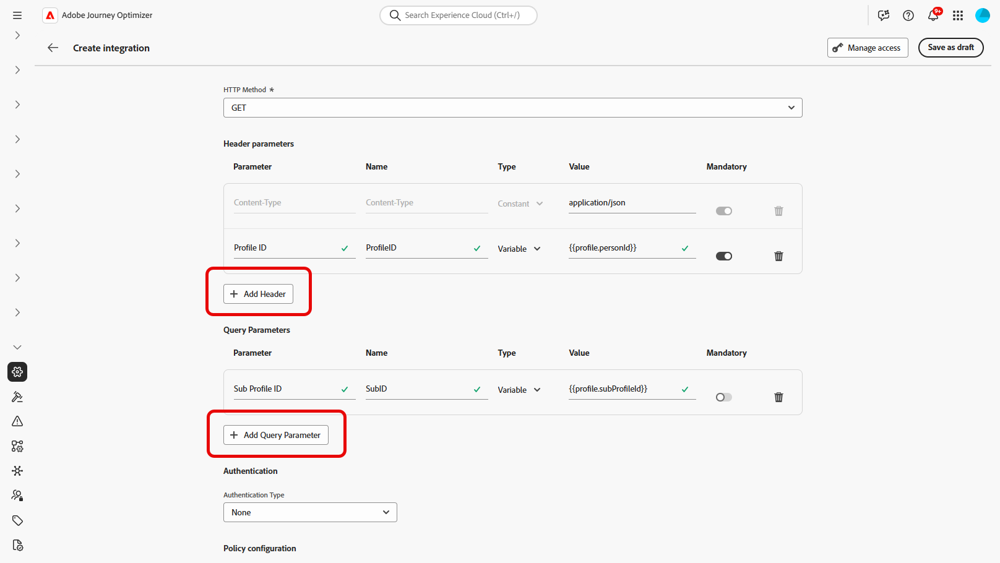

# 使用集成 {#external-sources}

## 概述

**集成**&#x200B;功能可将第三方数据源无缝集成到Adobe Journey Optimizer中。 此功能可简化将外部数据和内容源集成到营销活动中的流程，让您能够跨多个渠道提供高度个性化的动态消息传递。

您可以使用此功能访问外部数据，并从第三方工具中提取内容，例如：

* 来自忠诚度系统的&#x200B;**奖励积分**。
* 产品的&#x200B;**价格信息**。
* 来自推荐引擎的&#x200B;**产品推荐**。
* **物流更新**&#x200B;为交货状态。

## Beta 限制 {#limitations}

测试版具有以下限制：

* 仅支持出站渠道。

* API调用响应仅支持JSON格式。 HTML和原始二进制图像输出不可用。

* 仅支持针对特定内容的检索API，列表API不可用。

* 集成功能适用于历程和营销活动，但片段不支持该功能。

## 配置集成 {#configure}

作为管理员，您可以按照以下步骤设置外部集成：

1. 导航到左侧菜单中的&#x200B;**[!UICONTROL 配置]**&#x200B;部分，然后单击&#x200B;**[!UICONTROL 集成]**&#x200B;卡片中的&#x200B;**[!UICONTROL 管理]**。

   然后，单击&#x200B;**[!UICONTROL 创建集成]**&#x200B;以启动新配置。

   

1. 为您的集成提供&#x200B;**[!UICONTROL 名称]**&#x200B;和&#x200B;**[!UICONTROL 描述]**。

   >[!NOTE]
   >
   >这些字段不能包含空格。

1. 输入API终结点&#x200B;**[!UICONTROL URL]**，该终结点可能包含路径参数以及可使用标签和默认值定义的变量。

1. 使用&#x200B;**[!UICONTROL 名称]**&#x200B;和&#x200B;**[!UICONTROL 默认值]**&#x200B;配置&#x200B;**[!UICONTROL 路径模板]**。

   

1. 选择GET与POST之间的&#x200B;**[!UICONTROL HTTP方法]**。

1. 根据集成需要，单击&#x200B;**[!UICONTROL 添加标头]**&#x200B;和/或&#x200B;**[!UICONTROL 添加查询参数]**。 对于每个参数，提供以下详细信息：

   * **[!UICONTROL 参数]**：：内部用于引用该参数的唯一标识符。

   * **[!UICONTROL 名称]**： API所预期的参数的实际名称。

   * **[!UICONTROL 类型]**：为固定值选择&#x200B;**常量**，为动态输入选择&#x200B;**变量**。

   * **[!UICONTROL 值]**：直接输入常量的值，或选择变量映射。

   * **[!UICONTROL 必需]**：指定此参数是否为必需。

   

1. 选择&#x200B;**[!UICONTROL 身份验证类型]**：

   * **[!UICONTROL 无身份验证]**：适用于不需要任何凭据的开放API。

   * **[!UICONTROL API密钥]**：使用静态API密钥对请求进行身份验证。 输入您的&#x200B;**[!UICONTROL API密钥名称{1&#x200B;}、]** API密钥值{3&#x200B;}并指定您的&#x200B;**[!UICONTROL 位置]**。**&#x200B;**

   * **[!UICONTROL 基本身份验证]**：使用标准HTTP基本身份验证。 输入&#x200B;**[!UICONTROL 用户名]**&#x200B;和&#x200B;**[!UICONTROL 密码]**。

   * **[!UICONTROL OAuth 2.0]**：使用OAuth 2.0协议进行身份验证。 单击图标以配置或更新&#x200B;**[!UICONTROL 有效负载]**。

   

1. 为API请求设置&#x200B;**[!UICONTROL 策略配置]**，如&#x200B;**[!UICONTROL 超时]**&#x200B;段，并选择启用限制、缓存和/或重试。

1. 使用&#x200B;**[!UICONTROL 响应有效负载]**&#x200B;字段，您可以决定示例输出的哪些字段需要用于消息个性化。

   单击图标并粘贴示例JSON响应有效负载以自动检测数据类型。

1. 选择要为个性化显示的字段并指定其相应的数据类型。

   

1. 使用&#x200B;**[!UICONTROL 发送测试连接]**&#x200B;来验证集成。

   验证后，单击&#x200B;**[!UICONTROL 激活]**。

## 使用外部集成进行个性化 {#personalization}

作为营销人员，您可以使用配置的集成来个性化您的内容。 执行以下步骤：

1. 访问您的营销活动内容，然后单击文本或HTML **[!UICONTROL 组件]**&#x200B;中的&#x200B;**[!UICONTROL 添加个性化]**。

[了解有关组件的更多信息](../email/content-components.md)

   

1. 导航到&#x200B;**[!UICONTROL 集成]**&#x200B;部分，然后单击&#x200B;**[!UICONTROL 打开集成]**&#x200B;以查看所有活动的集成。

   

1. 选择集成并单击&#x200B;**[!UICONTROL 保存]**。

   

1. 启用&#x200B;**[!UICONTROL Pills]**&#x200B;模式以解锁高级集成菜单。

   

1. 要完成集成设置，请定义集成属性，这些属性先前在[配置](#configure)期间指定。

   可以使用静态值（保持常量）或配置文件属性（动态地从用户配置文件中提取信息）为这些属性分配值。

   

1. 定义集成属性后，您现在可以通过单击图标，将内容中的集成字段用于个性化消息传递。

   

1. 单击&#x200B;**[!UICONTROL 保存]**。

您的集成个性化现在已成功应用于您的内容，确保每位收件人都能根据您配置的属性获得量身定制的相关体验。

