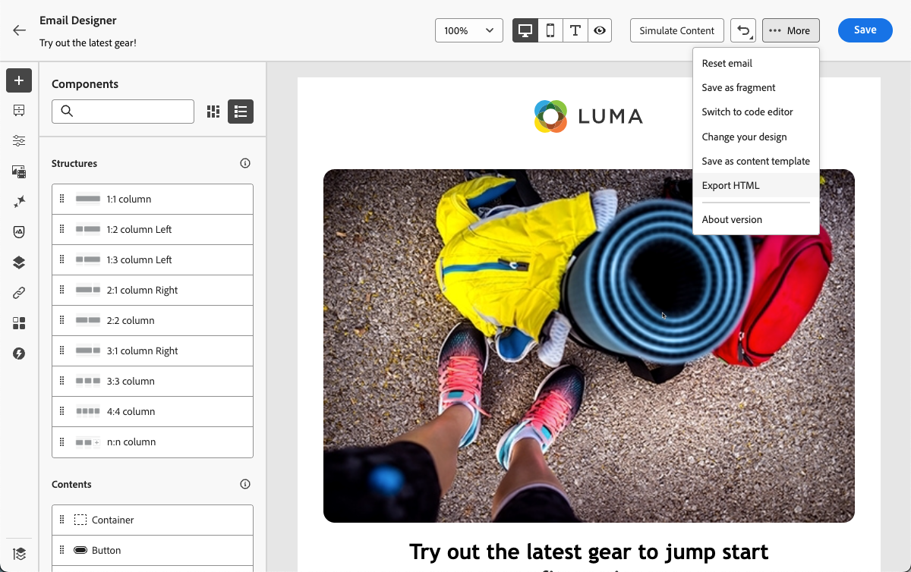
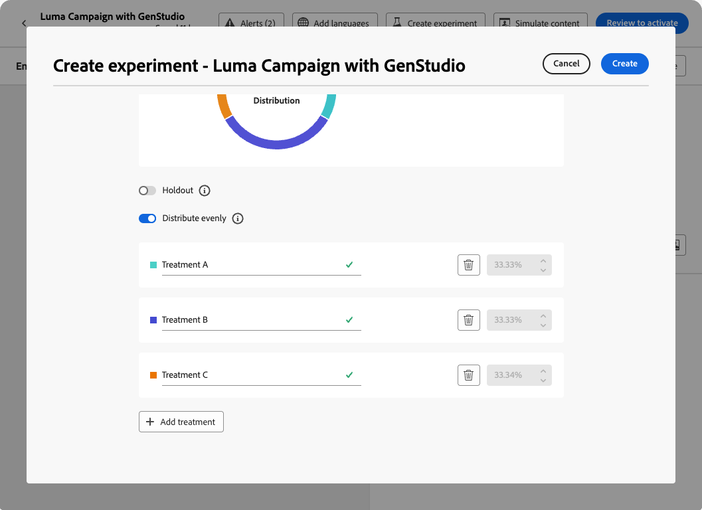

# 使用 GenStudio for Performance Marketing {#ajo-genstudio}

>[!CONTEXTUALHELP]
>id="ajo_genstudio_button"
>title="使用 GenStudio 构建的模板"
>abstract="得益于与 Adobe GenStudio for Performance Marketing 的无缝集成，您可以轻松导入使用 Adobe AI 技术优化的 GenStudio 模板。"

## GenStudio入门 {#gs-genstudio}

[Adobe GenStudio for Performance Marketing](https://experienceleague.adobe.com/zh-hans/docs/genstudio-for-performance-marketing/user-guide/home){target="_blank"}是一个创新型人工智能优先应用程序，它允许营销团队创建自己的广告和电子邮件，以推动符合您的品牌标准并遵守企业政策的有影响力的个性化营销活动。 通过利用Adobe AI技术，它提供了一套全面的工具，可简化内容创建和管理过程，以便创意人员可以专注于创新。

>[!AVAILABILITY]
>
>* [!DNL Adobe Journey Optimizer] 中的 GenStudio 集成当前不适用于 **Healthcare Shield** 或 **Privacy and Security Shield** 附加产品。
>
>* 此功能仅适用于电子邮件渠道。

为了提高营销效率并维护品牌一致性，您可以将&#x200B;[!DNL **GenStudio for Performance Marketing**]&#x200B;体验与&#x200B;[!DNL **Adobe Journey Optimizer**]&#x200B;无缝集成。 这使您能够利用[!DNL GenStudio]的AI功能内容创建以及[!DNL Journey Optimizer]的高级编排功能。

>[!INFO]
>
>若要继续，请查看此[概述](https://business.adobe.com/products/genstudio-for-performance-marketing.html#watch-overview){target="_blank"}和[!DNL Adobe GenStudio for Performance Marketing]的[演示](https://business.adobe.com/products/genstudio-for-performance-marketing.html#demo){target="_blank"}。

➡️ [通过观看视频了解此功能](#video)

<!--To access the GenStudio integration in [!DNL Adobe Journey Optimizer] feature, users need to be granted the **xxx** permission. [Learn more](../administration/permissions.md)

>[!IMPORTANT]
>
>* Before starting using this capability, read out related [Guardrails and Limitations](#generative-guardrails).-->

<!--Guardrails and limitations {#genstudio-guardrails}

General guidelines for using the GenStudio integration in [!DNL Adobe Journey Optimizer] for email generation are listed below:

See if guidelines/limitations such as the ones listed [here](gs-generative.md#generative-guardrails) for AI Assistant can apply.

The following limitations apply to GenStudio integration in [!DNL Adobe Journey Optimizer]:-->

## 在Journey Optimizer中使用GenStudio功能 {#use-genstudio}

通过[!DNL GenStudio for Performance Marketing]和[!DNL Journey Optimizer]集成，您可以让公司中的营销人员更好地协作以简化流程。

例如，使用[!DNL Journey Optimizer]开发和自动化电子邮件营销活动的技术营销人员可以与使用[!DNL GenStudio]创建内容的性能营销人员协作。

通过此集成，双方可以共同轻松地将[!DNL GenStudio]中的品牌上内容集成到[!DNL Journey Optimizer]中，从而提供针对特定客户细分并促进销售的引人入胜的电子邮件。

### 将HTML模板从Journey Optimizer导出到GenStudio {#export-from-ajo-to-genstudio}

首先，您可以将包含品牌准则的[!DNL Journey Optimizer] HTML模板导出到[!DNL GenStudio for Performance Marketing]。 请按照以下步骤操作。

1. 在[!DNL Journey Optimizer]中，访问历程或营销活动中电子邮件的内容。 [了解如何操作](../email/get-started-email-design.md#key-steps)

1. 在电子邮件Designer中，从&#x200B;**[!UICONTROL 更多]**&#x200B;按钮中选择&#x200B;**[!UICONTROL 导出HTML]**。

   {zoomable="yes"}

1. 将此HTML导出模板上载到[!DNL GenStudio for Performance Marketing]。<!--Make sure you detect the fields that the generative AI uses to insert content in order to create an actionable template.-->

   >[!NOTE]
   >
   >在[HTML用户指南](https://experienceleague.adobe.com/zh-hans/docs/genstudio-for-performance-marketing/user-guide/content/templates/use-templates#templates-from-ajo-and-marketo){target="_blank"}专用部分中了解如何将Adobe GenStudio for Performance Marketing模板上载到[!DNL GenStudio]。

1. 在GenStudio中，使用此模板创建多个具有AI提示的电子邮件变体并保存它们。

   >[!NOTE]
   >
   >了解如何在GenStudio专用的[部分](https://experienceleague.adobe.com/zh-hans/docs/genstudio-for-performance-marketing/user-guide/create/create-email-experience){target="_blank"}中创建电子邮件体验。

### 在Journey Optimizer中利用GenStudio体验 {#leverage-genstudio-experiences}

要利用您刚刚通过将变体导入到[!DNL Journey Optimizer]中而创建的[!DNL GenStudio]电子邮件变体，请执行以下步骤。

1. 在[!DNL Journey Optimizer]中，[向营销活动添加电子邮件](../email/create-email.md)。

1. 在营销活动配置屏幕中，浏览[编辑内容屏幕](../email/create-email.md#define-email-content)，然后单击&#x200B;**[!UICONTROL 编辑电子邮件正文]**&#x200B;以打开电子邮件Designer。 [了解如何操作](../email/get-started-email-design.md#key-steps)

1. 在电子邮件Designer主页上，选择&#x200B;**[!UICONTROL 导入HTML]**，然后单击&#x200B;**[!UICONTROL Adobe GenStudio for Performance Marketing]**&#x200B;按钮。

   {zoomable="yes"}

1. 浏览GenStudio体验以开始构建您的内容。 您可以根据多个标准筛选体验，例如产品、角色、品牌甚至颜色。

   <!--{zoomable="yes"}-->

1. 选择一个体验，然后单击&#x200B;**[!UICONTROL 使用]**。

   {zoomable="yes"}

1. 选择要导入GenStudio体验的文件夹。

   {zoomable="yes"}

1. 选定的内容显示在电子邮件Designer中。

   {zoomable="yes"}

   >[!NOTE]
   >
   >从 [!DNL Journey Optimizer] 模板[&#128279;](#export-from-ajo-to-genstudio)创建的GenStudio体验将直接导入电子邮件Designer。 未使用[!DNL Journey Optimizer]模板创建的GenStudio体验已导入到[兼容模式](../email/existing-content.md)中。

   使用[电子邮件内容编辑工具](../email/content-from-scratch.md)和[个性化字段](../personalization/personalize.md)根据需要编辑电子邮件。 保存您的内容。

1. 返回营销活动摘要页面，然后单击&#x200B;**[!UICONTROL 创建试验]**&#x200B;以使用试验。 [了解如何创建内容试验](../content-management/content-experiment.md)

   <!--{zoomable="yes"}-->

1. 创建多个处理并重复上述步骤以导入并快速利用您在[!DNL GenStudio]中创建的其他电子邮件体验变体。

   {zoomable="yes"}

1. 保存更改并[激活](../campaigns/review-activate-campaign.md)营销活动。

运行试验后，通过[试验性促销活动报告](../reports/campaign-global-report-cja-experimentation.md)跟踪您的促销活动处理执行情况。 然后，您可以解释实验结果。 [了解如何操作](../content-management/get-started-experiment.md#interpret-results)

## 操作说明视频 {#video}

了解如何将电子邮件模板从 Journey Optimizer 导出到 GenStudio for Performance Marketing，如何在 GenStudio 中使用模板创建符合品牌标准的电子邮件并将这些电子邮件无缝导入回 Journey Optimizer。

>[!VIDEO](https://video.tv.adobe.com/v/3456038/?quality=12)