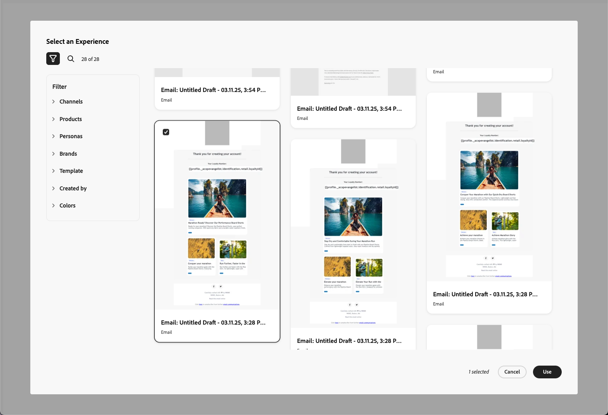

# 使用 GenStudio for Performance Marketing {#ajo-genstudio}

>[!CONTEXTUALHELP]
>id="ajo_genstudio_button"
>title="使用 GenStudio 构建的模板"
>abstract="得益于与 Adobe GenStudio for Performance Marketing 的无缝集成，您可以轻松导入使用 Adobe AI 技术优化的 GenStudio 模板。"

## GenStudio入门 {#gs-genstudio}

[Adobe GenStudio for Performance Marketing](https://experienceleague.adobe.com/zh-hans/docs/genstudio-for-performance-marketing/user-guide/home){target="_blank"}是一个创新型人工智能优先应用程序，它允许营销团队创建自己的广告和电子邮件，以推动符合您的品牌标准并遵守企业政策的有影响力的个性化营销活动。 通过利用Adobe AI技术，它提供了一套全面的工具，可简化内容创建和管理过程，以便创意人员可以专注于创新。

>[!AVAILABILITY]
>
>* [!DNL Adobe Journey Optimizer] 中的 GenStudio 集成当前不适用于 **Healthcare Shield** 或 **Privacy and Security Shield** 附加产品。
>
>* 此功能仅适用于电子邮件渠道。

为了提高营销效率并维护品牌一致性，您可以将&#x200B;[!DNL **GenStudio for Performance Marketing**]&#x200B;体验与&#x200B;[!DNL **Adobe Journey Optimizer**]&#x200B;无缝集成。 这使您能够利用[!DNL GenStudio]的AI支持的内容创建以及[!DNL Journey Optimizer]的高级编排功能。

>[!INFO]
>
>若要继续，请查看此[概述](https://business.adobe.com/products/genstudio-for-performance-marketing.html#watch-overview){target="_blank"}和[的](https://business.adobe.com/products/genstudio-for-performance-marketing.html#demo){target="_blank"}演示[!DNL Adobe GenStudio for Performance Marketing]。

➡️ [通过观看视频了解此功能](#video)

## 先决条件 {#genstudio-prerequisites}

要使用与[!DNL GenStudio for Performance Marketing]的[!DNL Journey Optimizer]集成，请确保满足以下要求：

* 您的组织必须具有有效的[!DNL GenStudio for Performance Marketing]许可证。

* [!DNL GenStudio for Performance Marketing]和[!DNL Adobe Journey Optimizer]必须属于同一个IMS组织。

* 用户必须在&#x200B;**中至少具有** Collaborator[!DNL GenStudio for Performance Marketing]角色或更高角色才能利用集成功能。 [进一步了解GenStudio中的用户角色](https://experienceleague.adobe.com/en/docs/genstudio-for-performance-marketing/user-guide/intro/user-roles){target="_blank"}

<!--To access the GenStudio integration in [!DNL Adobe Journey Optimizer] feature, users need to be granted the **xxx** permission. [Learn more](../administration/permissions.md)

>[!IMPORTANT]
>
>* Before starting using this capability, read out related [Guardrails and Limitations](#generative-guardrails).-->

<!--Guardrails and limitations {#genstudio-guardrails}

General guidelines for using the GenStudio integration in [!DNL Adobe Journey Optimizer] for email generation are listed below:

See if guidelines/limitations such as the ones listed [here](../content-management/gs-generative.md#generative-guardrails) for AI Assistant can apply.

The following limitations apply to GenStudio integration in [!DNL Adobe Journey Optimizer]:-->

## 利用Journey Optimizer中的GenStudio功能 {#use-genstudio}

通过[!DNL GenStudio for Performance Marketing]和[!DNL Journey Optimizer]集成，您可以让公司中的营销人员更好地协作以简化流程。

例如，使用[!DNL Journey Optimizer]开发和自动化电子邮件营销活动的技术营销人员可以与使用[!DNL GenStudio]创建内容的性能营销人员协作。

通过此集成，双方可以共同轻松地将[!DNL GenStudio]中的品牌上内容集成到[!DNL Journey Optimizer]中，从而提供针对特定客户细分并促进销售的引人入胜的电子邮件。

### 主要功能 {#genstudio-capabilities}

此集成为您的营销组织解锁了强大的功能：

* **AI支持的内容生成**：利用Adobe的创作AI，通过智能副本建议和设计元素高效地创建多个品牌内电子邮件变体。

* **无缝的工作流集成**：将Journey Optimizer电子邮件模板导出到GenStudio，创建具有AI提示的变体，并通过简化的过程将它们导入回Journey Optimizer。

* **集中式资源管理**：访问由Adobe Experience Manager Assets提供支持的GenStudio ContentHub，以在一个集中式位置整理、存储和检索所有数字资源。

* **内容实验**：将多个GenStudio电子邮件变体导入Journey Optimizer，并利用实验功能测试和识别表现最佳的内容。

* **性能驱动的分析**：通过AI支持的分析跟踪促销活动效果，以了解哪些创意元素可与受众引起共鸣并优化未来的促销活动。

### 常见使用案例 {#genstudio-use-cases}

[!DNL GenStudio for Performance Marketing]和之间的集成
Journey Optimizer&rbrack;支持各种营销方案：

* **产品发布促销活动**：快速生成产品公告的多个电子邮件变体，使用不同的受众区段测试这些变体，并在您的客户群中扩展入选版本。

* **假日和季节性促销活动**：使用GenStudio模板大规模生成时效性强的促销活动内容，确保在紧迫期限内保持品牌一致性。

* **大规模A/B测试**：在GenStudio中创建大量内容变体，并在Journey Optimizer中系统地测试这些变体以持续改进电子邮件性能。

* **多区段个性化**：在GenStudio中为不同的客户角色生成量身定制的内容，然后将每个变体部署到Journey Optimizer中的相应区段，以便获得最大的相关性。

## 使用GenStudio集成 {#how-to-use}

集成工作流程包含两个主要步骤：将模板从Journey Optimizer导出到GenStudio，以及将GenStudio体验导入回Journey Optimizer。

### 将HTML模板从Journey Optimizer导出到GenStudio {#export-from-ajo-to-genstudio}

首先，将包含您品牌准则的[!DNL Journey Optimizer] HTML模板导出到[!DNL GenStudio for Performance Marketing]。 请按照以下步骤操作。

1. 在[!DNL Journey Optimizer]中，访问历程或营销活动中电子邮件的内容。 [了解如何操作](../email/get-started-email-design.md#key-steps)

1. 在电子邮件Designer中，从&#x200B;**[!UICONTROL 更多]**&#x200B;按钮中选择&#x200B;**[!UICONTROL 导出HTML]**。

   {zoomable="yes"}

1. 将此HTML导出模板上载到[!DNL GenStudio for Performance Marketing]。<!--Make sure you detect the fields that the generative AI uses to insert content in order to create an actionable template.-->

   >[!NOTE]
   >
   >在[!DNL GenStudio]HTML用户指南[专用部分中了解如何将Adobe GenStudio for Performance Marketing模板上载到](https://experienceleague.adobe.com/en/docs/genstudio-for-performance-marketing/user-guide/content/templates/use-templates#templates-from-ajo-and-marketo){target="_blank"}。

1. 在GenStudio中，使用此模板创建多个具有AI提示的电子邮件变体并保存它们。

   >[!NOTE]
   >
   >了解如何在GenStudio专用的[部分](https://experienceleague.adobe.com/en/docs/genstudio-for-performance-marketing/user-guide/create/create-email-experience){target="_blank"}中创建电子邮件体验。

### 在Journey Optimizer中利用GenStudio体验 {#leverage-genstudio-experiences}

在GenStudio中创建电子邮件变体后，将其导入回[!DNL Journey Optimizer]以在营销活动中使用。 请按照以下步骤操作。

1. 在[!DNL Journey Optimizer]中，[向营销活动添加电子邮件](../email/create-email.md)。

1. 在营销活动配置屏幕中，浏览[编辑内容屏幕](../email/create-email.md#define-email-content)，然后单击&#x200B;**[!UICONTROL 编辑电子邮件正文]**&#x200B;以打开电子邮件Designer。 [了解如何操作](../email/get-started-email-design.md#key-steps)

1. 在电子邮件Designer主页上，选择&#x200B;**[!UICONTROL 导入HTML]**，然后单击&#x200B;**[!UICONTROL Adobe GenStudio for Performance Marketing]**&#x200B;按钮。

   {zoomable="yes"}

1. 浏览GenStudio体验以开始构建您的内容。 您可以根据多个标准筛选体验，例如产品、角色、品牌甚至颜色。

   <!--{zoomable="yes"}-->

1. 选择一个体验，然后单击&#x200B;**[!UICONTROL 使用]**。

   {zoomable="yes"}

1. 选择要导入GenStudio体验的文件夹。

   {zoomable="yes"}

1. 选定的内容显示在电子邮件Designer中。

   {zoomable="yes"}

   >[!NOTE]
   >
   >从[模板 [!DNL Journey Optimizer] 创建的GenStudio体验](#export-from-ajo-to-genstudio)将直接导入具有完整编辑功能的电子邮件Designer中。 未使用[!DNL Journey Optimizer]模板创建的GenStudio体验导入到[兼容模式](../email/existing-content.md)中，该模式的编辑功能可能会受到限制。

1. 根据需要使用[电子邮件内容编辑工具](../email/content-from-scratch.md)和[个性化字段](../personalization/personalize.md)编辑电子邮件。 保存您的内容。

1. 返回营销活动摘要页面，然后单击&#x200B;**[!UICONTROL 创建试验]**&#x200B;以使用试验。 [了解如何创建内容试验](../content-management/content-experiment.md)

   <!--{zoomable="yes"}-->

1. 创建多个处理并重复上述步骤以导入并快速利用您在[!DNL GenStudio]中创建的其他电子邮件体验变体。

   {zoomable="yes"}

1. 保存更改并[激活](../campaigns/review-activate-campaign.md)营销活动。

1. 运行试验后，通过[试验性促销活动报告](../reports/campaign-global-report-cja-experimentation.md)跟踪您的促销活动处理执行情况。 然后，您可以解释实验结果。 [了解如何操作](../content-management/get-started-experiment.md#interpret-results)

## 常见问题解答 {#genstudio-faq}

查找有关[!DNL GenStudio for Performance Marketing]与[!DNL Journey Optimizer]集成的常见问题解答。

+++我能否将GenStudio集成用于电子邮件以外的渠道？

当前，[!DNL GenStudio for Performance Marketing]集成仅适用于电子邮件渠道。 未来版本中可能会添加对其他渠道的支持。
+++

+++GenStudio集成是否适用于所有Journey Optimizer客户？

集成当前不适用于使用&#x200B;**Healthcare Shield**&#x200B;或&#x200B;**Privacy and Security Shield**&#x200B;附加产品的组织。
+++

+++在将GenStudio内容导入到Journey Optimizer中后，是否可以对其进行编辑？

是，将GenStudio体验导入[!DNL Journey Optimizer]后，您可以使用电子邮件Designer的[内容编辑工具](../email/content-from-scratch.md)并添加[个性化字段](../personalization/personalize.md)以进一步自定义您的电子邮件内容。
+++

+++在没有GenStudio模板的情况下创建的Journey Optimizer体验会发生什么情况？

从[!DNL Journey Optimizer]模板创建的GenStudio体验直接导入到Email Designer。 未使用[!DNL Journey Optimizer]模板创建的GenStudio体验已导入到[兼容模式](../email/existing-content.md)中。
+++

+++能否在Journey Optimizer中测试多个GenStudio电子邮件变体？

可以，您可以通过导入不同的GenStudio电子邮件变体来创建多个内容处理，并使用Journey Optimizer的[内容试验](../content-management/content-experiment.md)功能来测试哪个变体对受众的表现最佳。
+++

+++GenStudio如何确保品牌一致性？

GenStudio使用AI支持的品牌检查，确保所有生成的内容都符合您的品牌标准和准则。 当您上传包含您的品牌元素的模板时，GenStudio会将这些标准应用于在该平台中创建的所有内容变体。
+++

+++我能否与其他团队成员就GenStudio体验进行协作？

是的，GenStudio专为协作而设计。 具有适当权限的多个团队成员可以一起创建和优化电子邮件体验，然后再将其导入[!DNL Journey Optimizer]。
+++

## 操作说明视频 {#video}

了解如何将电子邮件模板从 Journey Optimizer 导出到 GenStudio for Performance Marketing，如何在 GenStudio 中使用模板创建符合品牌标准的电子邮件并将这些电子邮件无缝导入回 Journey Optimizer。

>[!VIDEO](https://video.tv.adobe.com/v/3456038/?quality=12)