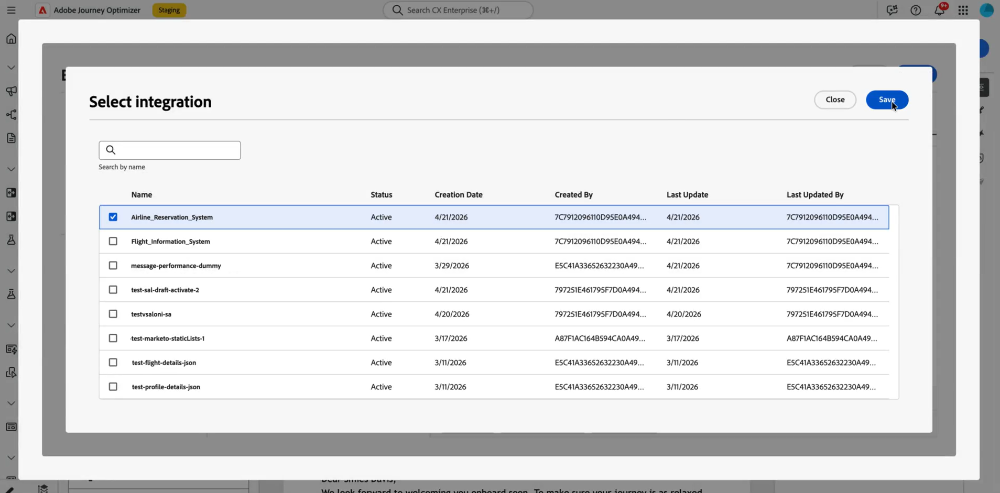

# 使用外部集成进行个性化 {#integrations-personalization}

>[!BEGINSHADEBOX]

**在此页面上：**&#x200B;了解营销人员如何应用配置的集成来个性化电子邮件、短信和推送内容，并将一个API调用链接到另一个上，以实现更丰富的动态消息传递。

>[!ENDSHADEBOX]

在内容中使用外部集成之前，请确认管理员已&#x200B;**配置和激活**&#x200B;每个集成（端点、身份验证、策略、响应有效负载和激活），如[使用集成](integrations.md)中所述。

您最多可以为消息中的每个&#x200B;**[!UICONTROL 片段]**&#x200B;添加&#x200B;**3**&#x200B;个集成，最多添加&#x200B;**5**&#x200B;个集成。 仅来自片段的集成不计入&#x200B;**5**。

## 将集成个性化应用于您的内容 {#apply-integration-personalization}

作为营销人员，您可以使用配置的集成来个性化您的内容。 执行以下步骤：

1. 访问您的营销活动内容，然后单击文本或HTML **[!UICONTROL 组件]**&#x200B;中的&#x200B;**[!UICONTROL 添加个性化]**。

   [了解有关组件的更多信息](../email/content-components.md)

   

1. 导航到&#x200B;**[!UICONTROL 集成]**&#x200B;部分，然后单击&#x200B;**[!UICONTROL 打开集成]**&#x200B;以查看所有活动的集成。

   请注意，**Journey Optimizer片段**&#x200B;可与集成一起使用，但仅支持出站渠道。 片段发布后，将禁用添加和保存新集成，以避免对现有历程和营销活动造成影响。

   

1. 选择集成并单击&#x200B;**[!UICONTROL 保存]**。

   

1. 启用&#x200B;**[!UICONTROL Pills]**&#x200B;模式以解锁高级集成菜单。

   

1. 当您创作集成个性化时，集成帮助程序包含一个&#x200B;**`required`**&#x200B;字段，该字段定义失败或缺少数据与默认内容的交互方式：

   * **`required=true`** （默认）：该消息的渲染停止。 发送被排除在&#x200B;**`ExternalDataLookupExclusion`**&#x200B;之外，该排除记录在&#x200B;**消息反馈数据集**&#x200B;中。
   * **`required=false`**：结果变量设置为&#x200B;**`null`**，并继续渲染。 在模板中使用默认文本、回退或条件逻辑，以便在集成不返回数据时，配置文件不会接收空内容。

     

1. 要完成集成设置，请定义集成属性，这些属性先前在[配置](integrations.md#configure)期间指定。

   可以使用静态值（保持常量）或配置文件属性（动态地从用户配置文件中提取信息）为这些属性分配值。

   

1. 定义集成属性后，您现在可以通过单击图标，将内容中的集成字段用于个性化消息传递。

   

   >[!NOTE]
   >
   >模板中的令牌必须仅使用管理员在集成配置中公开的字段。 例如，`{{weatherResponse.temperature}}`在`temperature`公开时有效；如果`humidity`未公开，则`{{weatherResponse.humidity}}`在编辑器中被拒绝。

1. 单击&#x200B;**[!UICONTROL 保存]**。

您的集成个性化现在已成功应用于您的内容，确保每位收件人都能根据您配置的属性获得量身定制的相关体验。


## 将一个API调用映射到另一个调用 {#map-integration-chain}

您可以链接集成，以便一个调用的结果馈送下一个调用，例如路径区段、标题或查询参数。 这些调用在同一消息中按顺序运行，这支持更丰富的个性化，而无需自定义代码。

在开始之前，请确保：

* 管理员已配置并激活您所需的每个集成。 请参阅[配置集成](integrations.md)。
* 变量路径占位符、标头和查询参数是在集成配置中设置的，带有面向营销人员的标签。
* 管理员在每个集成的&#x200B;**[!UICONTROL 响应有效负载]**&#x200B;中显示了所需的响应字段，以便在创作时显示。

以下示例使用从用户档案的预订中返回航班号的预订集成，然后使用该号码作为实时状态（延迟、目的地）的航班信息集成。 将第二个集成的输入映射到第一个调用的响应。

1. 打开您的消息或片段，然后打开个性化编辑器。

   

1. 在&#x200B;**[!UICONTROL 集成]**&#x200B;中，单击&#x200B;**[!UICONTROL 打开集成]**。

   

1. 添加其响应将馈送下次调用的集成，例如，包含航班标识符的预订或预订数据。

   

1. （可选）如果要将命名变量绑定到保留响应，请打开&#x200B;**[!UICONTROL 帮助程序函数]**&#x200B;菜单并添加一个帮助程序，例如`Let`函数。

   >[!NOTE]
   >
   > 仅管理员定义的&#x200B;**[!UICONTROL 响应有效负载]**&#x200B;中公开的字段可用。 您无法引用配置中未公开的属性。

1. 如果使用辅助变量，请将该变量映射到预订集成返回以供下游使用的字段，例如，乘客或预订有效负荷中的航班号。

   

1. 从&#x200B;**[!UICONTROL 打开集成]**&#x200B;菜单中，添加第二个集成，例如航班状态。

   

1. 在第二个集成中，打开&#x200B;**[!UICONTROL 集成属性]**。 对于必须重复使用来自第一次调用的数据的每个输入（如路径变量、标题或查询参数），请从第一次集成响应中选择映射源。

   在&#x200B;**[!UICONTROL Pills]**&#x200B;体验中，您可以将第一次调用输出直接映射到第二次调用输入，而无需使用`Let`语句。 如果您使用`Let`，则可以通过该变量进行映射。

   

1. 使用控件将第二次集成的令牌插入到您的内容中，例如从航班信息响应插入目标。

   

1. 保存您的内容。

在&#x200B;**[!UICONTROL 模拟]**&#x200B;或发送上，Journey Optimizer按顺序运行集成：第一次调用使用您配置的配置文件上下文，其结果构建第二个请求。 给定的集成是在模拟时运行还是在发送时运行，取决于您的设置和渠道。


## 在模板中使用Adobe Target数据 {#use-adobe-target-in-templates}

本节介绍如何在Adobe Journey Optimizer中使用&#x200B;**集成**&#x200B;在发送时从&#x200B;**[!DNL Adobe Target]**&#x200B;获取个性化数据，并在消息模板中使用这些数据。 它假定已将Target投放API配置为集成。

有关配置步骤，请参阅[使用集成](integrations.md)和[Adobe Target推荐](vendor-integration.md#adobe-target-recommendations)示例。

Target投放API返回`prefetch.mboxes`数组。 每个mbox都包含一个`options`对象，该对象具有`content`和`type`字段。 `type`值确定如何在模板中使用`content`。 打开与您的mbox响应匹配的选项卡，然后按照相应步骤在消息中使用该数据。

>[!BEGINTABS]

>[!TAB JSON内容]

当`type`为`json`时，`content`字段为&#x200B;**JSON字符串**。 在访问嵌套字段之前对其进行解析。 以下示例显示了JSON mbox的典型投放API响应。

```json
{
  "status": 200,
  "prefetch": {
    "mboxes": [
      {
        "index": 0,
        "name": "SummerOffer",
        "options": {
          "content": "{\"recommendations\":[{\"productId\":\"p101\",\"name\":\"Noise Smartwatch\",\"price\":2999},{\"productId\":\"p205\",\"name\":\"Boat Earbuds\",\"price\":1499}],\"strategy\":\"collaborative-filtering\"}",
          "type": "json"
        }
      }
    ]
  }
}
```

按顺序使用三个帮助程序来获取、提取和分析Target响应。

1. **提取Target响应。** 调用您配置的Target与`externalDataLookup`的集成。 将`integrationName`设置为该集成的&#x200B;**[!UICONTROL Name]**（替换示例占位符`target_recommendations`）。 使用`result`参数命名包含完整投放API有效负载的模板变量，例如`targetResponse`。

   您还可以直接从个性化编辑器左侧导航栏的&#x200B;**[!UICONTROL 集成]**&#x200B;菜单中选择集成。 请参阅[将集成个性化应用于您的内容](#apply-integration-personalization)。

   ```handlebars
   {{externalDataLookup integrationName="target_recommendations" result="targetResponse"}}
   ```

1. **使用valueAtPath提取特定mbox。** `valueAtPath`通过其基于0的索引从数组中提取元素，并将其分配给模板变量。 使用`idx`参数指定要访问的元素。

   ```handlebars
   {{valueAtPath targetResponse.prefetch.mboxes idx=0 result="summerOffer"}}
   ```

   | 参数 | 描述 |
   | --- | --- |
   | `path` | 数组的路径（位置，无关键字） |
   | `idx` | 用于阵列访问的基于0的索引（可选） |
   | `result` | 用于存储提取值的变量名称 |

   >[!NOTE]
   >
   > 如果`idx`超出范围，渲染将引发异常。 当索引可能无效时，使用``保护无效索引。 PQL表达式不能用作路径。 **自2025.9.0版起可用。**

1. **使用parseJson解析JSON字符串。** mbox `options.content`字段是原始JSON字符串。 `parseJson`将其转换为结构化对象，然后可以在模板中直接访问其字段。

   ```handlebars
   {{parseJson jsonStr=summerOffer.options.content result="summerOfferContent"}}
   ```

   | 参数 | 描述 |
   | --- | --- |
   | `jsonStr` | 包含有效JSON的字符串字段的路径 |
   | `result` | 用于存储已解析对象的变量名称 |

   >[!NOTE]
   >
   > 如果JSON字符串无效或引用为空，则`result`设置为`null` — 不会引发渲染错误。 使用实际Target响应进行测试，以确认内容是有效的JSON。 **可用起始日期：2026.6.0**

1. **访问数据。** 解析后，使用点表示法访问`summerOfferContent`中的字段。 要呈现推荐列表，请执行以下操作：

   ```handlebars
   {{externalDataLookup integrationName="target_recommendations" result="targetResponse"}}
   {{valueAtPath targetResponse.prefetch.mboxes idx=0 result="summerOffer"}}
   {{parseJson jsonStr=summerOffer.options.content result="summerOfferContent"}}
   
   Strategy: {{summerOfferContent.strategy}}
   {{#each summerOfferContent.recommendations as |rec|}}
     {{rec.name}} — {{rec.price}}
   {{/each}}
   ```

>[!TAB HTML内容]

当`type`为`html`时，`content`字段是准备渲染的HTML字符串。 您不需要对其进行解析。 以下示例显示了HTML mbox的典型投放API响应。

```json
{
  "status": 200,
  "prefetch": {
    "mboxes": [
      {
        "index": 0,
        "name": "SummerOffer",
        "options": {
          "content": "<div class=\"offer\"><h2>Summer Sale</h2><p>50% off Smartwatch</p></div>",
          "type": "html"
        }
      }
    ]
  }
}
```

获取并提取mbox，然后直接渲染`content`。 跳过`parseJson`。

```handlebars
{{externalDataLookup integrationName="target_recommendations" result="targetResponse"}}
{{valueAtPath targetResponse.prefetch.mboxes idx=0 result="summerOffer"}}
{{{summerOffer.options.content}}}
```

>[!NOTE]
>
> 使用&#x200B;**三大括号** `{{{...}}}`按原样呈现HTML内容。 双大括号`{{...}}`将转义HTML实体并渲染原始标记字符串而不是HTML。

>[!ENDTABS]

## 操作方法视频 {#video}

此视频展示了&#x200B;**集成**&#x200B;如何将Adobe Journey Optimizer连接到外部API，以便您可以将实时数据和内容提取到&#x200B;**出站**&#x200B;渠道、电子邮件、短信和推送，以进行更相关的个性化。

>[!VIDEO](https://video.tv.adobe.com/v/3484118/?learn=on)
