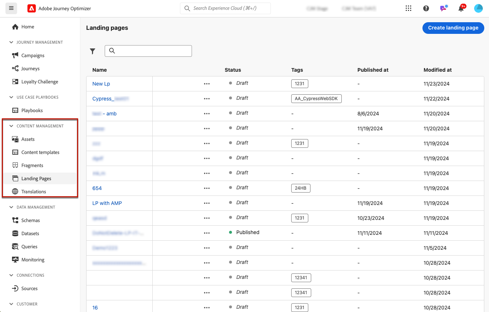
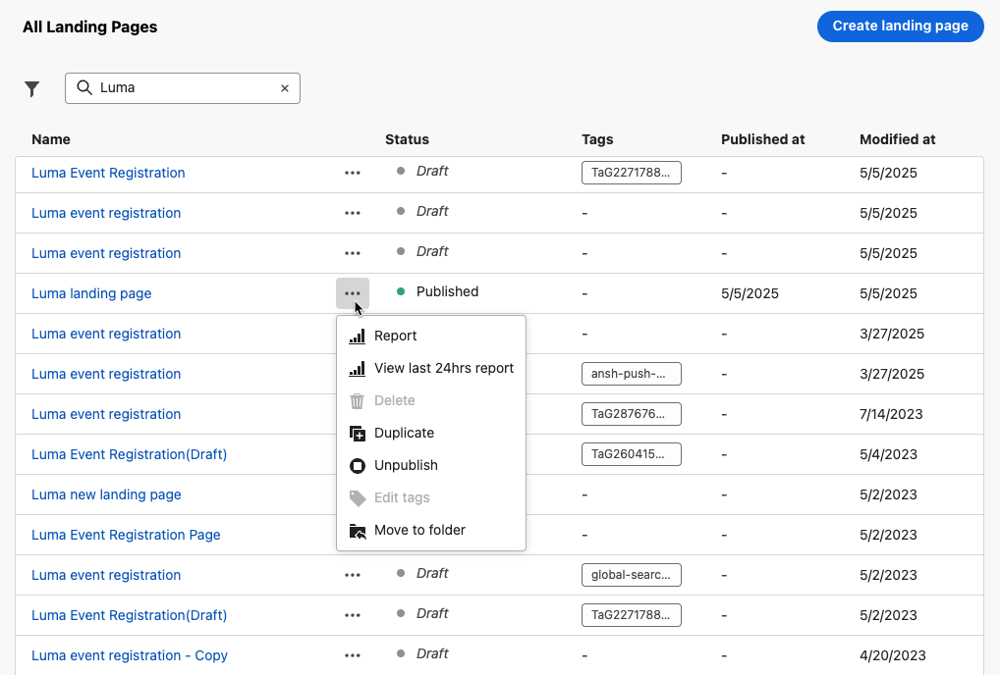
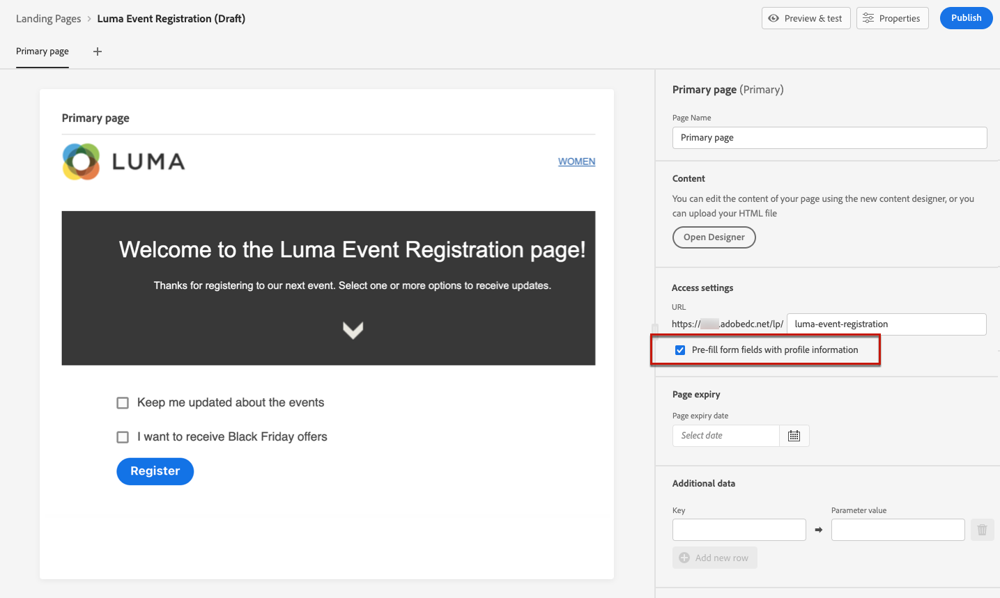

# 创建和发布登陆页面 {#create-lp}

## 访问登陆页面 {#access-landing-pages}

要访问登陆页面列表，请选择 **[!UICONTROL Journey Management]** > **[!UICONTROL Landing pages]** 菜单中。

的 **[!UICONTROL Landing Pages]** 列表会显示所有已创建的项目。 您可以根据用户的状态或修改日期进行筛选。

在此列表中，您可以访问 [登陆页面实时报表](../reports/lp-report-live.md) 或 [登陆页面全局报表](../reports/lp-report-global.md) ，以查看已发布的项目。

您还可以删除、复制和取消发布登陆页面。

>[!CAUTION]
>
>如果取消发布在未发布消息中引用的登陆页面，则在再次发布登陆页面之前，无法发布该消息。 如果消息已发布，则指向登陆页面的链接将被损坏，并显示错误页面。

单击登陆页面旁边的三个圆点，以选择所需的操作。

>[!NOTE]
>
>您无法删除已发布的登陆页面。 要删除它，必须先取消发布它。

## 创建登陆页面 {#create-landing-page}

创建登陆页面的步骤如下所示。

1. 在登陆页面列表中，单击 **[!UICONTROL Create landing page]**.

   

1. 添加标题。 您可以根据需要添加描述。

   

1. 选择预设。 了解如何在 [此部分](../configuration/lp-presets.md#lp-create-preset).

   

1. 单击 **[!UICONTROL Create]**。

1. 将显示主页面及其属性。 了解如何配置主页面设置 [此处](#configure-primary-page).

   

1. 单击+图标以添加子页面。 了解如何配置子页面设置 [此处](#configure-subpages).

   

配置和设计 [主页](#configure-primary-page)和 [子页面](#configure-subpages) 如果有，您可以 [测试](#test-landing-page) 和 [发布](#publish-landing-page) 登陆页面。

## 配置主页面 {#configure-primary-page}

主页面是用户在单击登陆页面的链接后立即向其显示的页面，例如来自电子邮件或网站的页面。

要定义主页面设置，请执行以下步骤。

1. 您可以更改页面名称，即 **[!UICONTROL Primary page]** 默认情况下。

1. 使用内容设计器编辑页面内容。 了解如何定义登陆页面内容 [此处](design-lp.md).

   

1. 定义登陆页面URL。 URL的第一部分要求您之前在 [预设](../configuration/lp-presets.md#lp-create-preset) 已选择。 [了解详情](../configuration/lp-subdomains.md)

   >[!CAUTION]
   >
   >登陆页面URL必须是唯一的。

   

   >[!NOTE]
   >
   >即使发布了URL，您也无法通过将此URL复制粘贴到Web浏览器来访问登陆页面。 您而是可以使用预览函数(如 [此部分](#test-landing-page).

1. 如果希望登陆页面预载已可用的表单数据，请选择 **[!UICONTROL Pre-fill form fields with profile information]**.

   

   启用此选项后，如果用户档案已选择启用/禁用或已添加到订阅列表，则在显示登陆页面时，将反映其选择。

   例如，如果某个用户档案选择接收有关未来事件的通信，则在下次向该用户档案显示登陆页面时，将已选中相应的复选框。

   

1. 您可以为页面定义到期日期。 在这种情况下，您必须在页面到期时选择一项操作：

   * **[!UICONTROL Redirect URL]**:输入用户将在页面过期时被重定向到的页面的URL。
   * **[!UICONTROL Custom page]**: [配置子页面](#configure-subpages) ，然后从显示的下拉列表中选择它。
   * **[!UICONTROL Browser error]**:键入将显示的错误文本，而不是页面。

   

   <!--1. In the **[!UICONTROL Additional data]** section, define a **[!UICONTROL Key]** and the corresponding **[!UICONTROL Parameter value]**. // you can define how the data entered in the landing page is managed once it has been submitted by a user??-->

1. 如果您在 [设计主页面](design-lp.md)，则它们会显示在 **[!UICONTROL Subscription list]** 中。

   

1. 从登陆页面，您可以直接 [创建旅程](../building-journeys/journey-gs.md#jo-build) 用户在提交表单时将向用户发送确认消息。 了解如何在此结束时构建此类历程 [用例](lp-use-cases.md#subscription-to-a-service).

   

   单击 **[!UICONTROL Create journey]** 被重定向到 **[!UICONTROL Journey Management]** > **[!UICONTROL Journeys]** 列表。

## 配置子页面 {#configure-subpages}

最多可以添加2个子页面。 例如，您可以创建一个“感谢”页面，在用户提交表单后，该页面将显示；您可以定义一个错误页面，在登陆页面出现问题时，将调用该错误页面。

要定义子页面设置，请执行以下步骤。

1. 您可以更改页面名称，即 **[!UICONTROL Subpage 1]** 默认情况下。

1. 使用内容设计器编辑页面内容。 了解如何定义登陆页面内容 [此处](design-lp.md).

1. 定义登陆页面URL。 URL的第一部分要求您先前设置登陆页面子域。 [了解详情](../configuration/lp-subdomains.md)

   >[!CAUTION]
   >
   >登陆页面URL必须是唯一的。

## 测试登陆页面 {#test-landing-page}

定义登陆页面设置和内容后，即可使用测试用户档案进行预览。 如果插入 [个性化内容](../personalization/personalize.md)，您将能够利用测试用户档案数据检查此内容在登陆页面中的显示方式。

>[!CAUTION]
>
>您必须具有测试用户档案才能预览消息和发送校样。 了解如何 [创建测试用户档案](../segment/creating-test-profiles.md).

1. 在登陆页面界面中，单击 **[!UICONTROL Preview & test]** 按钮以访问测试用户档案选择。

   

   >[!NOTE]
   >
   >的 **[!UICONTROL Preview]** 按钮。

1. 从 **[!UICONTROL Preview & test]** ，选择一个或多个测试用户档案。

   

   选择测试用户档案的步骤与测试消息时相同。 详见 [此部分](../design/preview.md#select-test-profiles).

1. 选择 **[!UICONTROL Preview]** 选项卡，单击 **[!UICONTROL Open preview]** 来测试登陆页面。

   

1. 登陆页面的预览将在新选项卡中打开。 个性化元素会被替换为选定的测试用户档案数据。

   

1. 选择其他测试用户档案以预览登陆页面每个变体的呈现。

## 检查警报 {#check-alerts}

创建登陆页面时，当您在发布之前必须执行重要操作时，会发出警告。

警报显示在屏幕的右上方，如下所示：

>[!NOTE]
>
>如果看不到此按钮，则未检测到任何警报。

可以发生两种类型的警报：

* **警告** 请参阅建议和最佳实践。 <!--For example, a message will display if -->

* **错误** 阻止您发布登陆页面，但前提是这些页面未得到解决。 例如，如果主页面URL缺失，您将收到一则警告。

<!--All possible warnings and errors are detailed [below](#alerts-and-warnings).-->

>[!CAUTION]
>
> 您必须解决所有 **错误** 发布前警报。

<!--The settings and elements checked by the system are listed below. You will also find information on how to adapt your configuration to resolve the corresponding issues.

**Warnings**:

* 

**Errors**:

* 

>[!CAUTION]
>
> To be able to publish your message, you must resolve all **error** alerts.
-->

## 发布登陆页面 {#publish-landing-page}

登陆页面准备就绪后，您可以发布该页面以将其用于消息。

>[!CAUTION]
>
>在发布之前，请检查并解析警报。 [了解详情](#check-alerts)

发布登陆页面后，该页面会添加到登陆页面列表，其中包含 **[!UICONTROL Published]** 状态。

它现已上线，可在 [!DNL Journey Optimizer] [消息](../messages/get-started-content.md) 将通过 [历程](../building-journeys/journey.md).

>[!NOTE]
>
>您可以通过特定报表监控登陆页面的影响。 [了解详情](../reports/lp-report-live.md)

