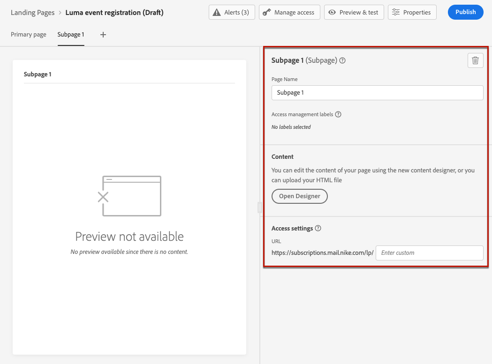

# 创建和发布登陆页面 {#create-lp}

>[!CAUTION]
>
>若要能够测试和发布登陆页面，您必须具有&#x200B;**[!UICONTROL Publish Messages]**&#x200B;权限。

要将您的客户定向到他们单击特定链接时要显示的已定义网页，请在[!DNL Journey Optimizer]中创建登陆页面，配置主页面和任何子页面，测试并发布它。

>[!CAUTION]
>
>您不能仅通过将[创建页面](#create-landing-page)时定义的URL复制粘贴到Web浏览器中来访问登陆页面，即使该URL已发布也是如此。 相反，您可以使用预览函数对其进行测试，如[此部分](#test-landing-page)中所述。

## 访问登陆页面 {#access-landing-pages}

要访问登陆页面列表，请从左侧菜单中选择&#x200B;**[!UICONTROL 历程管理]** > **[!UICONTROL 登陆页面]**。

**[!UICONTROL 登陆页面]**&#x200B;列表显示所有创建的项目。 您可以根据它们的状态或修改日期筛选它们。

从该列表中，您可以访问已发布项目的[登陆页面实时报告](../reports/lp-report-live.md)或[登陆页面报告](../reports/lp-report-global-cja.md)。

您还可以删除、复制和取消发布登陆页面。

>[!CAUTION]
>
>如果取消发布消息中引用的登陆页面，则将断开指向登陆页面的链接，并显示错误页面。

单击登陆页面旁边的三个圆点，以选择所需的操作。

>[!NOTE]
>
>您无法删除[已发布](#publish-landing-page)登陆页面。 要删除它，必须先取消发布它。

## 创建登陆页面 {#create-landing-page}

>[!CONTEXTUALHELP]
>id="ajo_lp_create"
>title="定义和配置您的登陆页面"
>abstract="要创建登陆页面，您需要选择一个预设，然后配置主页面和子页面，最后在发布之前测试您的页面。"
>additional-url="https://experienceleague.adobe.com/docs/journey-optimizer/using/landing-pages/lp-configuration/lp-presets.html#lp-create-preset" text="创建登陆页面预设"
>additional-url="https://experienceleague.adobe.com/docs/journey-optimizer/using/landing-pages/create-lp.html#publish-landing-page" text="发布登陆页面"

>[!CONTEXTUALHELP]
>id="ajo_lp_access_management_labels"
>title="向您的登陆页面分配标签"
>abstract="为了保护敏感的数字资产，您可以使用标签来定义授权，用于管理对登陆页面的数据访问。"
>additional-url="https://experienceleague.adobe.com/docs/journey-optimizer/using/access-control/object-based-access.html#" text="对象级访问控制"

创建登陆页面的主要步骤如下：

1. 从登陆页面列表中，单击&#x200B;**[!UICONTROL 创建登陆页面]**。

   

1. 添加标题。 您可以根据需要添加描述。

   

1. 要将自定义或核心数据使用标签分配给登陆页面，请选择&#x200B;**[!UICONTROL 管理访问权限]**。 [了解有关对象级访问控制(OLAC)的更多信息](../administration/object-based-access.md)

1. 从&#x200B;**[!UICONTROL 标记]**&#x200B;字段中选择或创建Adobe Experience Platform标记以对您的登陆页面进行分类，从而改进搜索。 [了解详情](../start/search-filter-categorize.md#tags)

1. 选择预设。 在[本节](../landing-pages/lp-presets.md#lp-create-preset)中了解如何创建登陆页面预设。

   

1. 单击&#x200B;**[!UICONTROL 创建]**。

1. 此时将显示主页面及其属性。 在[此处](#configure-primary-page)了解如何配置主页面设置。

   

1. 单击+图标可添加子页面。 了解如何在[此处](#configure-subpages)配置子页面设置。

   

配置和设计[主页面](#configure-primary-page)和[子页面](#configure-subpages)（如果有）后，您可以[测试](#test-landing-page)和[发布](#publish-landing-page)您的登陆页面。

>[!CAUTION]
>
>即使已发布，您也无法仅通过复制粘贴已定义的URL到Web浏览器中来访问登陆页面。 相反，您可以使用预览函数对其进行测试，如[此部分](#test-landing-page)中所述。

## 配置主页面 {#configure-primary-page}

>[!CONTEXTUALHELP]
>id="ajo_lp_primary_page"
>title="定义主页面设置"
>abstract="当用户比如从电子邮件或网站单击您的登陆页面的链接后，将立即向用户显示主页面。"
>additional-url="https://experienceleague.adobe.com/docs/journey-optimizer/using/landing-pages/landing-pages-design/design-lp.html#" text="设计登陆页面内容"

>[!CONTEXTUALHELP]
>id="ajo_lp_access_settings"
>title="定义登陆页面 URL"
>abstract="在此部分中，定义一个唯一的登陆页面 URL。URL 的第一部分需要您以前设置的登陆页面子域，这应该包括在您选择的预设中。"
>additional-url="https://experienceleague.adobe.com/zh-hans/docs/journey-optimizer/using/landing-pages/lp-configuration/lp-subdomains" text="配置登陆页面子域"
>additional-url="https://experienceleague.adobe.com/docs/journey-optimizer/using/landing-pages/lp-configuration/lp-presets.html#lp-create-preset" text="创建登陆页面预设"

主页面是在用户单击指向登陆页面的链接后立即向用户显示的页面，例如通过电子邮件或网站。

要定义主页面设置，请执行以下步骤。

1. 您可以更改页面名称，默认情况下为&#x200B;**[!UICONTROL 主页面]**。

1. 使用内容设计器编辑页面的内容。 在[此处](design-lp.md)了解如何定义登陆页面内容。

   

1. 定义登陆页面URL。 URL的第一个部分要求您以前将登陆页面子域设置为您选择的[预设](../landing-pages/lp-presets.md#lp-create-preset)的一部分。 [了解详情](../landing-pages/lp-subdomains.md)

   >[!CAUTION]
   >
   >登陆页面URL必须是唯一的。
   >
   >您仅需将此URL复制粘贴到Web浏览器中（即使已发布），就无法访问登陆页面。 相反，您可以使用预览函数对其进行测试，如[此部分](#test-landing-page)中所述。

   

1. 如果希望登陆页面预载已可用的表单数据，请选择&#x200B;**[!UICONTROL 预填包含配置文件信息的表单字段]**。

   

   启用此选项后，如果配置文件已选择加入/退出或已经添加到订阅列表，则显示登陆页面时会反映配置文件的选择。

   例如，如果某个用户档案已选择接收有关未来事件的通信，则下次向该用户档案显示登陆页面时，将会选中相应的复选框。

   

1. 您可以为页面定义到期日期。 在这种情况下，您必须在页面到期时选择操作：

   * **[!UICONTROL 重定向URL]**：输入页面过期时用户将被重定向到的页面的URL。
   * **[!UICONTROL 自定义页面]**： [配置子页面](#configure-subpages)并从显示的下拉列表中选择它。
   * **[!UICONTROL 浏览器错误]**：键入将显示的错误文本而不是页面。

   

1. 在&#x200B;**[!UICONTROL 其他数据]**&#x200B;部分中，定义一个或多个键及其相应的参数值。 您将能够使用[个性化编辑器](../personalization/personalization-build-expressions.md)在主页面和子页面的内容中利用这些密钥。 有关详细信息，请参阅[此部分](lp-content.md#use-form-component#use-additional-data)。

   

1. 如果您在[设计主页面](design-lp.md)时选择了一个或多个订阅列表，则它们将显示在&#x200B;**[!UICONTROL 订阅列表]**&#x200B;部分中。

   

1. 从登陆页面，您可以直接[创建历程](../building-journeys/journey-gs.md#jo-build)，该历程将在用户提交表单时向用户发送确认消息。 了解如何在此[用例](lp-use-cases.md#subscription-to-a-service)的结尾构建此类历程。

   

   单击&#x200B;**[!UICONTROL 创建历程]**&#x200B;以重定向到&#x200B;**[!UICONTROL 历程管理]** > **[!UICONTROL 历程]**&#x200B;列表。

## 配置子页面 {#configure-subpages}

>[!CONTEXTUALHELP]
>id="ajo_lp_subpage"
>title="定义子页面设置"
>abstract="您最多可以添加 2 个子页。例如，您可以创建一个“谢谢”页面，该页面在用户提交表单后显示，您还可以定义一个错误页面，在登陆页面出现问题时调用该页面。"
>additional-url="https://experienceleague.adobe.com/zh-hans/docs/journey-optimizer/using/landing-pages/landing-pages-design/design-lp" text="设计登陆页面内容"

>[!CONTEXTUALHELP]
>id="ajo_lp_access_settings-subpage"
>title="定义登陆页面 URL"
>abstract="在此部分中，定义一个唯一的登陆页面 URL。URL 的第一部分需要您以前设置的登陆页面子域，这应该包括在您选择的预设中。"
>additional-url="https://experienceleague.adobe.com/docs/journey-optimizer/using/landing-pages/lp-configuration/lp-subdomains.html#" text="配置登陆页面子域"
>additional-url="https://experienceleague.adobe.com/docs/journey-optimizer/using/landing-pages/lp-configuration/lp-presets.html#lp-create-preset" text="创建登陆页面预设"

您最多可以添加 2 个子页。例如，您可以创建一个“谢谢”页面，该页面在用户提交表单后显示，您还可以定义一个错误页面，在登陆页面出现问题时调用该页面。

要定义子页面设置，请执行以下步骤。

1. 您可以更改页面名称，默认名称为&#x200B;**[!UICONTROL 子页面1]**。

1. 使用内容设计器编辑页面的内容。 在[此处](design-lp.md)了解如何定义登陆页面内容。

   >[!NOTE]
   >
   >您可以从同一登陆页面的任何子页面插入指向主页面的链接。 例如，要重定向发生错误并想要再次订阅的用户，您可以从确认子页面添加一个链接至订阅主页面。 了解如何在[此节](../email/message-tracking.md#insert-links)中插入链接。

1. 定义登陆页面URL。 URL的第一部分要求您之前设置登陆页面子域。 [了解详情](../landing-pages/lp-subdomains.md)

   >[!CAUTION]
   >
   >登陆页面URL必须是唯一的。
   >
   >即使已发布，您也无法仅通过复制此URL并将其粘贴到Web浏览器中来访问子页面。 相反，您可以使用预览函数对其进行测试，如[此部分](#test-landing-page)中所述。

## 测试登陆页面 {#test-landing-page}

>[!CONTEXTUALHELP]
>id="ac_preview_lp_profiles"
>title="预览和测试登陆页面"
>abstract="定义了登陆页面设置和内容之后，您可使用测试轮廓对其进行预览。"
>additional-url="https://experienceleague.adobe.com/docs/journey-optimizer/using/audiences-profiles-identities/profiles/creating-test-profiles.html#" text="选择测试用户档案"

定义登陆页面设置和内容后，您可以使用测试配置文件进行预览。 如果您插入[个性化内容](../personalization/personalize.md)，则可以使用测试配置文件数据检查此内容在登陆页面中的显示方式。

>[!CAUTION]
>
>若要能够测试登陆页面，您必须具有&#x200B;**[!UICONTROL Publish Messages]**&#x200B;权限。
>
>您必须具有可用的测试用户档案，才能预览消息并发送校样。 了解如何[创建测试配置文件](../audience/creating-test-profiles.md)。

1. 在登陆页面界面中，单击&#x200B;**[!UICONTROL 模拟内容]**&#x200B;按钮以访问测试配置文件选择。

   

   >[!NOTE]
   >
   >也可以从内容设计器访问&#x200B;**[!UICONTROL 模拟内容]**&#x200B;按钮。

1. 从&#x200B;**[!UICONTROL 模拟]**&#x200B;屏幕中，选择一个或多个测试配置文件。

   

   选择测试用户档案的步骤与测试消息时的步骤相同。 有关详情，请参阅[内容管理](../content-management/test-profiles.md)一节。

1. 选择&#x200B;**[!UICONTROL 打开预览]**&#x200B;以测试您的登陆页面。

   

1. 登陆页面的预览将在新选项卡中打开。 个性化的元素将由选定的测试配置文件数据替换。

   <!---->

1. 选择其他测试用户档案以预览登陆页面每个变体的渲染。

## 检查警报 {#check-alerts}

在创建登陆页面时，如果必须在发布之前执行重要操作，则会收到警报。

警报显示在屏幕的右上方，如下所示：

>[!NOTE]
>
>如果未看到此按钮，则表示未检测到警报。

可能会发生两种类型的警报：

* **警告**&#x200B;参考推荐和最佳实践。<!--For example, a message will display if -->

* **错误**&#x200B;阻止您发布登陆页面，只要这些错误未解决。 例如，如果缺少主页面URL，您将收到警告。

<!--All possible warnings and errors are detailed [below](#alerts-and-warnings).-->

>[!CAUTION]
>
> 发布之前必须解决所有&#x200B;**错误**&#x200B;警报。

<!--The settings and elements checked by the system are listed below. You will also find information on how to adapt your configuration to resolve the corresponding issues.

**Warnings**:

* 

**Errors**:

* 

>[!CAUTION]
>
> To be able to publish your message, you must resolve all **error** alerts.
-->

## 发布登陆页面 {#publish-landing-page}

>[!CAUTION]
>
>要发布登陆页面，您必须具有&#x200B;**[!UICONTROL Publish Messages]**&#x200B;权限。

准备登陆页面后，即可发布该页面，以供在消息中使用。

>[!CAUTION]
>
>发布之前，请检查并解决警报。 [了解详情](#check-alerts)

发布登陆页面后，该页面将以&#x200B;**[!UICONTROL 已发布]**&#x200B;状态添加到登陆页面列表。

该消息现在已上线并准备好用于将通过[历程](../building-journeys/journey.md)发送的[!DNL Journey Optimizer]消息中。

>[!NOTE]
>
>您不能仅通过将[创建页面](#create-landing-page)时定义的URL复制粘贴到Web浏览器中来访问登陆页面，即使该URL已发布也是如此。 相反，您可以使用预览函数对其进行测试，如[此部分](#test-landing-page)中所述。

您可以通过特定报告监控登陆页面影响。 [了解详情](../reports/lp-report-live.md)
