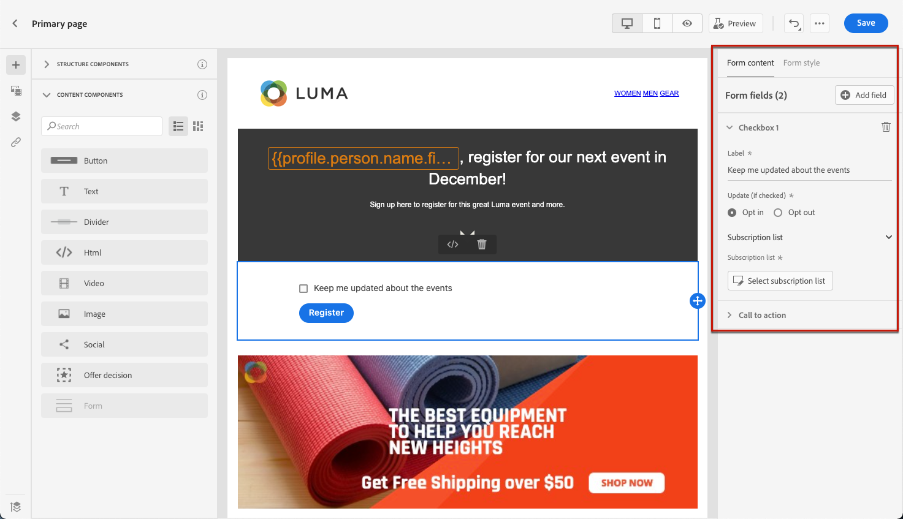
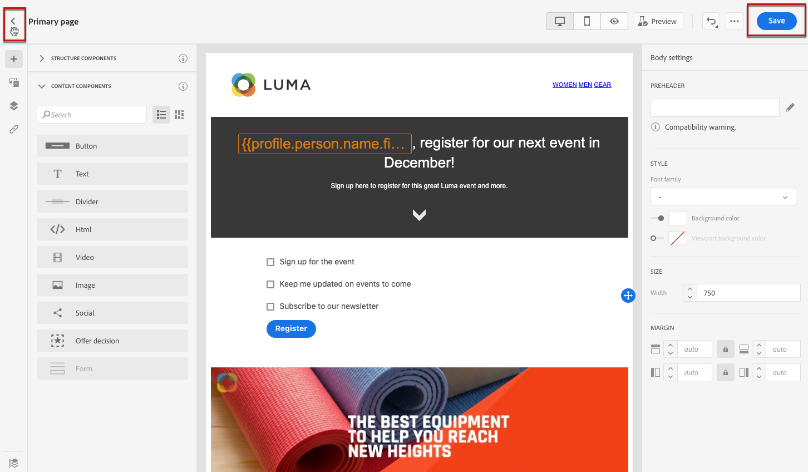

# 设计登陆页面内容 {#design-lp-content}

从登陆开始创建内容 [主页](create-lp.md#configure-primary-page) 或 [子页面](create-lp.md#configure-subpages)，将鼠标悬停在主页面内容上并单击 **[!UICONTROL Open Designer]**，或单击右侧面板中的相应按钮。

从此处，您可以：

* **从头开始设计登陆页面** 通过内容设计器的界面并利用 [Adobe Experience Manager Assets Essentials](../assets-essentials.md). 了解如何设计内容或使用内置模板 [在此部分中](../create-email-content.md).

* **代码或粘贴原始HTML** 直接导入内容设计器。 了解如何编码您自己的内容 [在此部分中](../existing-content.md#import-raw-html-code).

* **导入现有HTML内容** 文件或.zip文件夹中。 了解如何导入内容 [在此部分中](../existing-content.md#import-html-content-from-file).

>[!NOTE]
>
>登陆页面内容设计器与电子邮件设计器大体相似。 了解有关使用 [!DNL Journey Optimizer] [此处](../design-emails.md).

要定义登陆页面的特定内容，请执行以下步骤。

1. 拖放特定于登陆页面的 **[!UICONTROL Form]** 组件从左侧面板移入主工作区。

   

   >[!NOTE]
   >
   >的 **[!UICONTROL Form]** 组件在同一页面上只能使用一次。

1. 选择模式。的 **[!UICONTROL Form content]** 选项卡，用于编辑表单的不同字段。

   

1. 从 **[!UICONTROL Checkbox 1]** 部分，则可以编辑与此复选框对应的标签。

1. 定义此复选框是否用于选择用户启用或禁用：他们是否同意接收通信或要求不再联系？

   

1. 选择要在以下三个选项之间更新的内容：

   

   * **[!UICONTROL Subscription list]**:如果用户档案选中此复选框，则必须选择要更新的订阅列表。 在 [此部分](subscription-list.md).

      

   * **[!UICONTROL Channel (email)]**:选择加入或选择退出适用于整个渠道。 例如，如果选择退出的用户档案具有两个电子邮件地址，则这两个地址将从您的所有通信中排除。

   * **[!UICONTROL Email entity]**:选择加入或选择退出仅适用于用于访问登陆页面的电子邮件地址。 例如，如果某个用户档案有两个电子邮件地址，则只有用于选择加入的用户档案才会收到来自您品牌的通信。

1. 单击 **[!UICONTROL Add field]** > **[!UICONTROL Checkbox]** 添加其他复选框。 重复上述步骤以定义其属性。

   

1. 单击 **[!UICONTROL Call to action]** 以展开相应的部分。 它允许您在 **[!UICONTROL Form]** 组件。

   

1. 定义单击按钮后将发生的情况：

   * **[!UICONTROL Redirect URL]**:输入用户将被重定向到的页面的URL。
   * **[!UICONTROL Confirmation text]**:键入将显示的确认文本。
   * **[!UICONTROL Link to a subpage]**:配置 [子页面](create-lp.md#configure-subpages) ，然后从显示的下拉列表中选择它。

   

1. 定义在发生错误时单击按钮后将发生的情况：

   * **[!UICONTROL Redirect URL]**:输入用户将被重定向到的页面的URL。
   * **[!UICONTROL Error text]**:键入将显示的错误文本。 您可以通过选中相应的复选框来预览错误文本。

      

   * **[!UICONTROL Link to a subpage]**:配置 [子页面](create-lp.md#configure-subpages) ，然后从显示的下拉列表中选择它。

1. 如果要在提交表单时进行其他更新，请选择 **[!UICONTROL Opt in]** 或 **[!UICONTROL Opt out]**，并定义要更新订阅列表、渠道还是仅使用的电子邮件地址。

   

1. 保存您的内容，然后单击页面名称旁边的箭头以返回到 [登陆页面属性](create-lp.md#configure-primary-page).

   

<!--Will the name Email Designer be kept if you can also design LP with the same tool? > To modify in Messages section > content designer or Designer-->

