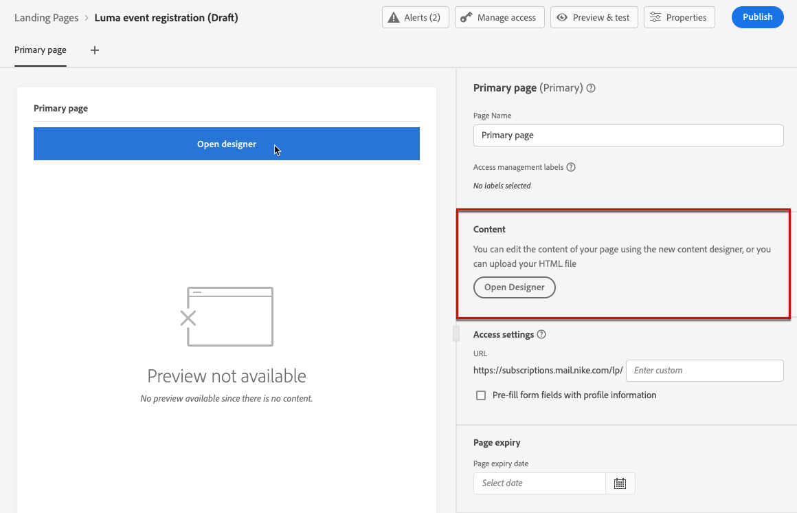

# 设计登陆页面内容 {#design-lp}

开始为登陆创建内容 [主页](create-lp.md#configure-primary-page) 或 [子页面](create-lp.md#configure-subpages)，将鼠标悬停在页面内容上并单击 **[!UICONTROL Open Designer]**. 您还可以单击右侧面板中的相应按钮。

从此处，您可以：

* **从头开始设计登陆页面** 通过内容设计器的界面，并利用 [Adobe Experience Manager Assets Essentials](../design/assets-essentials.md). 了解如何设计内容 <!--or use built-in templates--> [在此部分中](../design/create-email-content.md).

* **代码或粘贴原始HTML** 直接导入内容设计器。 了解如何编码您自己的内容 [在此部分中](../design/code-content.md).

* **导入现有HTML内容** 文件或.zip文件夹中。 了解如何导入内容 [在此部分中](../design/existing-content.md).

* **使用保存的登陆页面模板** 创建于 [!DNL Journey Optimizer]. [了解详情](lp-templates.md)

>[!NOTE]
>
>登陆页面内容设计器与电子邮件设计器大体相似。 了解详情 [设计内容 [!DNL Journey Optimizer]](../design/design-emails.md).
