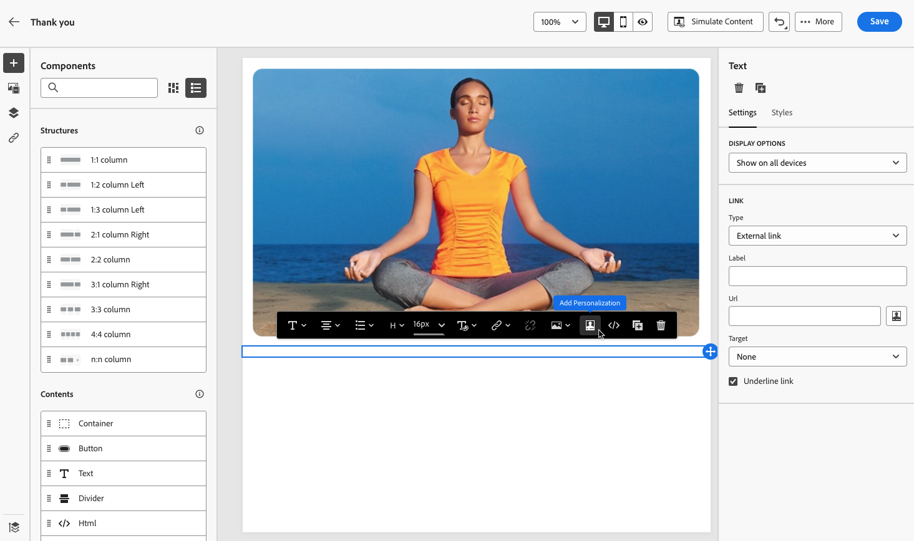

# 定义登陆页面特定的内容 {#lp-content}

要定义允许用户从登陆页面选择和提交其选择的特定内容，请使用 **[!UICONTROL 表单]** 组件。 为此，请执行以下步骤。

>[!NOTE]
>
>您还可以创建点进登陆页面，但不 **[!UICONTROL 表单]** 组件。 在这种情况下，将向用户显示登陆页面，但用户无需提交任何表单。 如果您只想显示登陆页面而无需收件人执行任何操作（如选择启用或选择禁用），或者希望提供不需要用户输入的信息，则此功能非常有用。

## 使用表单组件 {#use-form-component}

1. 拖放特定于登陆页面的 **[!UICONTROL 表单]** 组件从左侧面板移入主工作区。

   

   >[!NOTE]
   >
   >的 **[!UICONTROL 表单]** 组件在同一页面上只能使用一次。

1. 选择模式。的 **[!UICONTROL 表单内容]** 选项卡，以编辑表单的不同字段。

   

   >[!NOTE]
   >
   >切换到 **[!UICONTROL 表单样式]** 选项卡，以编辑表单组件内容的样式。 [了解详情](#define-lp-styles)

1. 从 **[!UICONTROL 复选框1]** 部分，则可以编辑与此复选框对应的标签。

1. 定义此复选框是否用于选择用户启用或禁用：他们是否同意接收通信或要求不再联系？

   

   从以下三个选项中进行选择：

   * **[!UICONTROL 选中后选择加入]**:用户需要选中要同意（选择加入）的框。
   * **[!UICONTROL 如果选中，则选择禁用]**:用户需要选中相应复选框以删除其同意（选择退出）。
   * **[!UICONTROL 选中时选择启用，未选中时选择禁用]**:此选项允许您为选择启用/选择禁用插入一个复选框。 用户需要选中复选框来表示同意（选择启用），取消选中该复选框以取消同意（选择禁用）。

1. 选择要在以下三个选项之间更新的内容：

   

   * **[!UICONTROL 订阅列表]**:如果用户档案选中此复选框，则必须选择要更新的订阅列表。 了解详情 [订阅列表](subscription-list.md).

      

   * **[!UICONTROL 渠道（电子邮件）]**:选择加入或选择退出适用于整个渠道。 例如，如果选择退出的用户档案具有两个电子邮件地址，则这两个地址将从您的所有通信中排除。

   * **[!UICONTROL 电子邮件标识]**:选择加入或选择退出仅适用于用于访问登陆页面的电子邮件地址。 例如，如果某个用户档案有两个电子邮件地址，则只有用于选择加入的用户档案才会收到来自您品牌的通信。

1. 单击 **[!UICONTROL 添加字段]** > **[!UICONTROL 复选框]** 添加其他复选框。 重复上述步骤以定义其属性。

   

1. 添加所有所需的复选框后，单击 **[!UICONTROL 行动动员]** 以展开相应的部分。 它允许您在 **[!UICONTROL 表单]** 组件。

   

1. 定义单击按钮后将发生的情况：

   * **[!UICONTROL 重定向URL]**:输入用户将被重定向到的页面的URL。
   * **[!UICONTROL 确认文本]**:键入将显示的确认文本。
   * **[!UICONTROL 链接到子页面]**:配置 [子页面](create-lp.md#configure-subpages) ，然后从显示的下拉列表中选择它。

   

1. 定义在发生错误时单击按钮后将发生的情况：

   * **[!UICONTROL 重定向URL]**:输入用户将被重定向到的页面的URL。
   * **[!UICONTROL 错误文本]**:键入将显示的错误文本。 您可以在定义 [表单样式](#define-lp-styles).

   * **[!UICONTROL 链接到子页面]**:配置 [子页面](create-lp.md#configure-subpages) ，然后从显示的下拉列表中选择它。

   

1. 如果要在提交表单时进行其他更新，请选择 **[!UICONTROL 选择启用]** 或 **[!UICONTROL 选择禁用]**，并定义要更新订阅列表、渠道还是仅使用的电子邮件地址。

   

1. 保存您的内容，然后单击页面名称旁边的箭头以返回到 [登陆页面属性](create-lp.md#configure-primary-page).

   

## 定义登陆页面表单样式 {#lp-form-styles}

1. 要修改表单组件内容的样式，请随时切换到 **[!UICONTROL 表单样式]** 选项卡。

   

1. 展开 **[!UICONTROL 复选框]** 部分定义复选框和相应文本的外观。 例如，您可以调整字体系列或大小，以及复选框边框颜色。

   

1. 展开 **[!UICONTROL 按钮]** 部分修改组件表单中按钮的外观。 例如，您可以添加边框、在悬停鼠标时编辑标签颜色或调整按钮的对齐方式。

   

   您可以使用 **[!UICONTROL 预览]** 按钮。 了解有关测试登陆页面的更多信息 [此处](create-lp.md#test-landing-page).

   

1. 展开 **[!UICONTROL 表单布局]** 部分来编辑布局设置，如背景颜色、内边距或边距。

   

1. 展开 **[!UICONTROL 表单错误]** 部分，以调整在出现问题时显示的错误消息的显示。 勾选相应的选项以预览表单上的错误文本。

   

## 使用主页面上下文 {#use-primary-page-context}

您可以使用来自同一登陆页面内其他页面的上下文数据。

例如，如果您链接复选框<!-- or the submission of the page--> 至 [订阅列表](subscription-list.md) 在主登录页面上，您可以在“谢谢”子页面上使用该订阅列表。

假设您将主页面上的两个复选框链接到两个不同的订阅列表。 如果用户订阅了其中一个复选框，则您希望在提交表单时显示特定消息，具体取决于用户选中的复选框。

要实现此目的，请执行以下步骤：

1. 在主页上，将每个复选框链接到相关订阅列表。 [了解详情](#use-form-component)。

   

1. 在子页面上，将鼠标的指针放置到要插入文本的位置，然后选择 **[!UICONTROL 添加个性化]** 中。

   

1. 在 **[!UICONTROL 编辑个性化]** 窗口，选择 **[!UICONTROL 上下文属性]** > **[!UICONTROL 登陆页面]** > **[!UICONTROL 主页面上下文]** > **[!UICONTROL 订阅]**.

1. 将列出您在主页面上选择的所有订阅列表。 使用+图标选择相关项目。

   

1. 使用表达式编辑器帮助程序函数添加相关条件。 [了解详情](../personalization/functions/functions.md)

   

   >[!CAUTION]
   >
   >如果表达式中包含连字符等特殊字符，则必须对包含连字符的文本进行转义。

1. 保存更改。

现在，当用户选中其中一个复选框时，与选定复选框对应的消息将在提交表单时显示出来。

>[!NOTE]
>
>如果用户选中两个复选框，则将显示两个文本。

<!--
## Use landing page additional data {#use-additional-data}

When [configuring the primary page](create-lp.md#configure-primary-page), you can create additional data to enable storing information when the landing page is being submitted.

>[!NOTE]
>
>This data may not be visible to users who visit the page.

If you defined one or more keys with their corresponding values when [configuring the primary page](create-lp.md#configure-primary-page), you can leverage these keys in the content of your primary page and subpages using the [Expression editor](../personalization/personalization-build-expressions.md).

///When you reuse the same text on a page, this enables you to dynamically change that text if needed, without going through each occurrence.

For example, if you define the company name as a key, you can quickly update it everywhere (on all the pages of a given landing page) by changing it only once in the [primary page settings](create-lp.md#configure-primary-page).///

To leverage these keys in a landing page, follow the steps below:

1. When configuring the primary page, define a key and its corresponding value in the **[!UICONTROL Additional data]** section. [Learn more](create-lp.md#configure-primary-page)

    

1. When editing your primary page with the designer, place the pointer of your mouse where you want to insert your key and select **[!UICONTROL Add personalization]** from the contextual toolbar.

    

1. In the **[!UICONTROL Edit Personalization]** window, select **[!UICONTROL Contextual attributes]** > **[!UICONTROL Landing Pages]** > **[!UICONTROL Additional Context]**.

    

1. All the keys that you created when configuring the primary page are listed. Select the key of your choice using the + icon.

    

1. Save your changes and repeat the steps above as many times as needed.

    

    You can see that the personalization item corresponding to your key is now displayed everywhere you inserted it.
-->